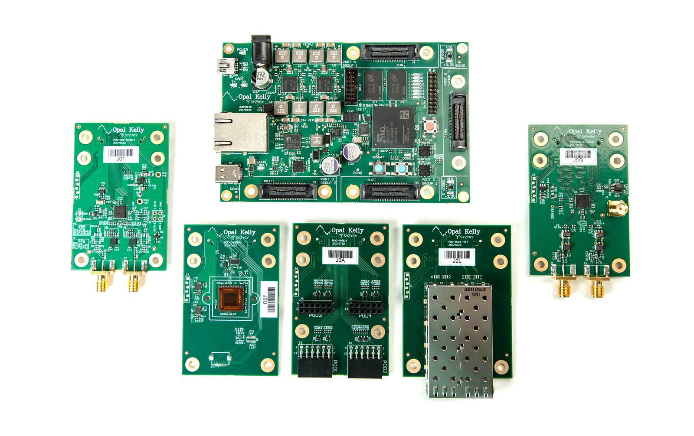

# 2025-01

## 2025-01-02

[Python FTDI for SPI](https://www.alexallmont.com/spi-refresher/)

``` py
from pyftdi.ftdi import Ftdi
Ftdi.show_devices()
from pyftdi.spi import SpiController

spi.configure('ftdi://ftdi:2232h:1:7b/1')
slave = spi.get_port(cs=1, freq=10E6, mode=2)
write_buf = b'\x01\x02\x03'
read_buf = slave.exchange(write_buf, duplex=True)
```

## 2025-01-03

### LVDS Clock Distribution

Analog Device [AN-1177](https://www.analog.com/en/resources/app-notes/an-1177.html)

{: style="height:300px"}

## 2025-01-13

### Evolutionary Neural Coding Lab


Github [EvolutionaryNeuralCodingLab](https://github.com/EvolutionaryNeuralCodingLab)

Site [EvolutionaryNeuralCodingLab](https://www.evolutionaryneuralcodinglab.sites.tau.ac.il/)

### Paper Reading 2025-01-13

ReptiLearn: An automated home cage system for behavioral experiments in reptiles without human intervention [Paper Link](https://journals.plos.org/plosbiology/article?id=10.1371/journal.pbio.3002411)

## 2025-01-16

### A 2 GHz oscilloscope for everyone

[https://www.crowdsupply.com/andy-haas/haasoscope-pro](https://www.crowdsupply.com/andy-haas/haasoscope-pro)

[https://github.com/drandyhaas/HaasoscopePro](https://github.com/drandyhaas/HaasoscopePro)

### SYZYGY Interface

SYZYGY Interface [syzygyfpga.io](https://syzygyfpga.io/)



### Paper Reading 2025-01-16

Open_Ephys_electroencephalography_Open_Ephys_EEG_A_modular_low-cost_open-source_solution_to_human_neural_recording [Paper Link](https://www.researchgate.net/publication/314305186_Open_Ephys_electroencephalography_Open_Ephys_EEG_A_modular_low-cost_open-source_solution_to_human_neural_recording)

Wearable_EEG_electronics_for_a_Brain-AI_Closed-Loop_System_to_enhance_autonomous_machine_decision-making [Paper Link](https://www.researchgate.net/publication/360954933_Wearable_EEG_electronics_for_a_Brain-AI_Closed-Loop_System_to_enhance_autonomous_machine_decision-making)

### PyFTDI for Intan

[FT2232_SPI_Intan](subtitles/FT2232_SPI_Intan.md)

## 2025-01-20

### Paper Reading 2025-01-20

[Intan ADC Missing Code and Missing Decison Level](papers/Barth_2024_J._Neural_Eng._21_044001.pdf)

[Fix SARADC Issues](papers/2012_JETTA_SARADC.pdf)

Scalogram


Missing Decision Level


Missing Code
