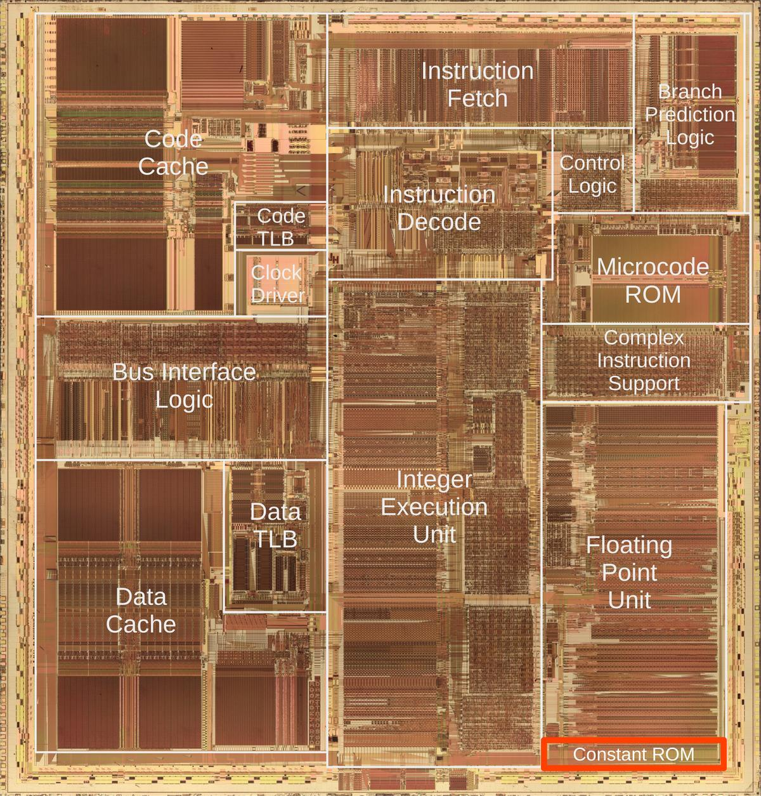
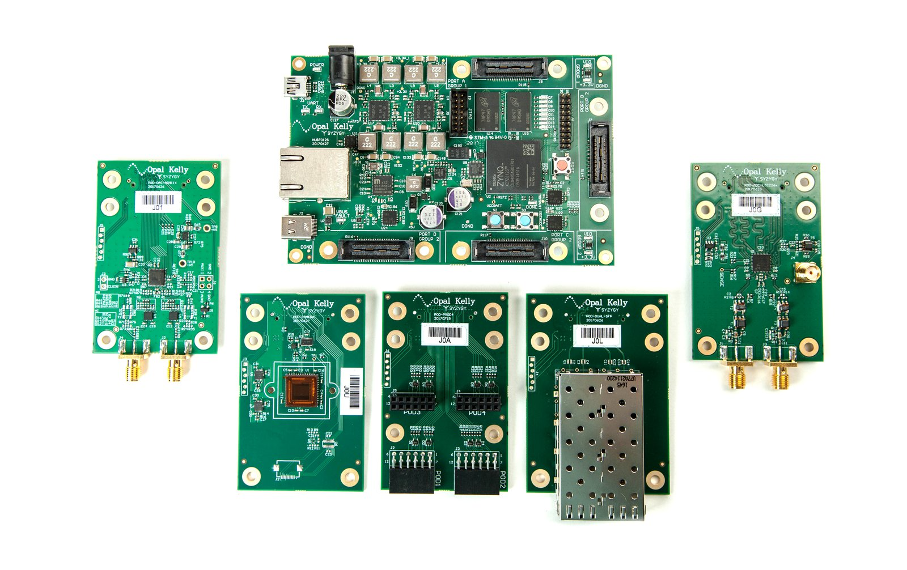
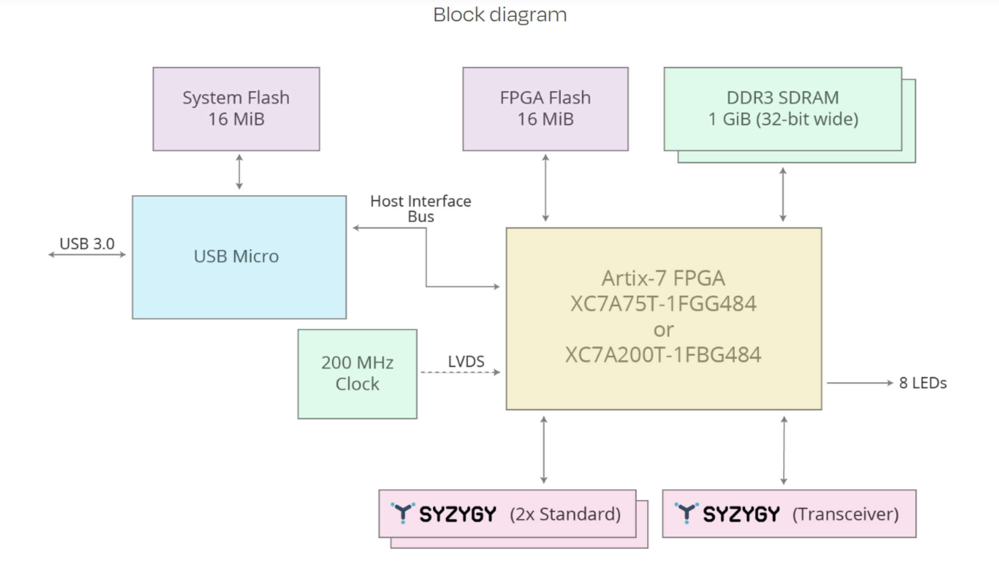
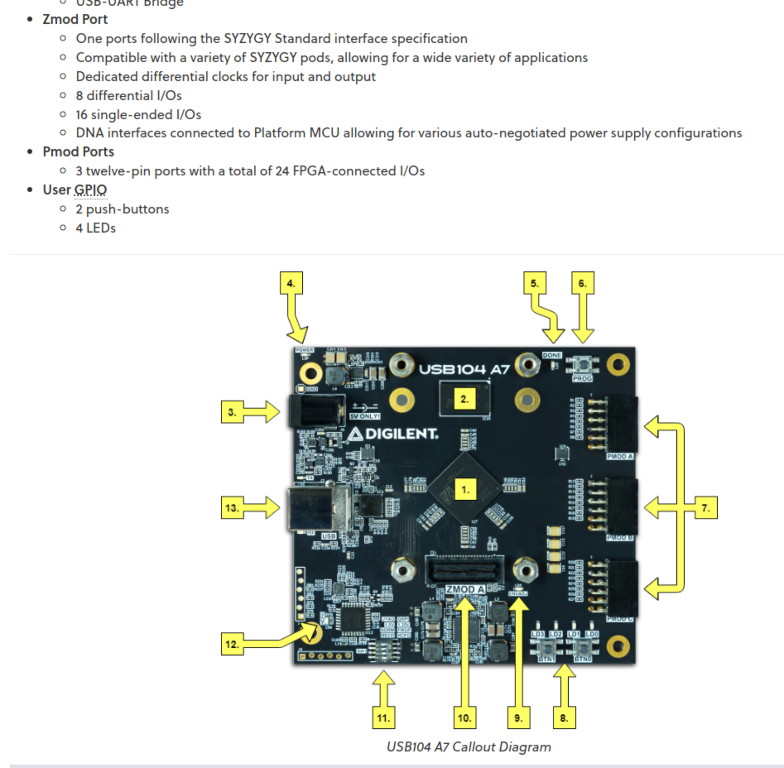
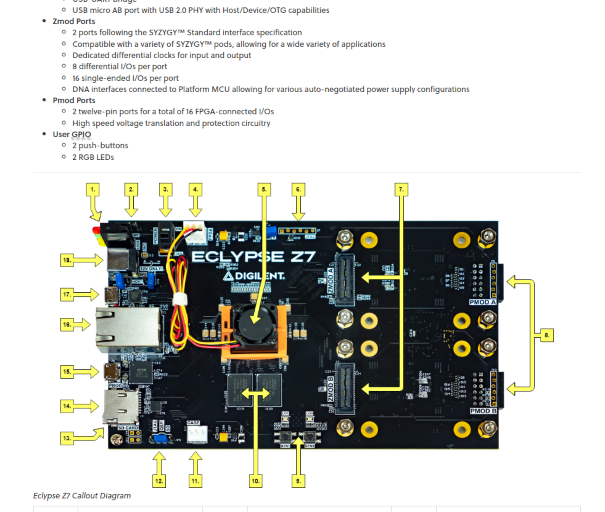
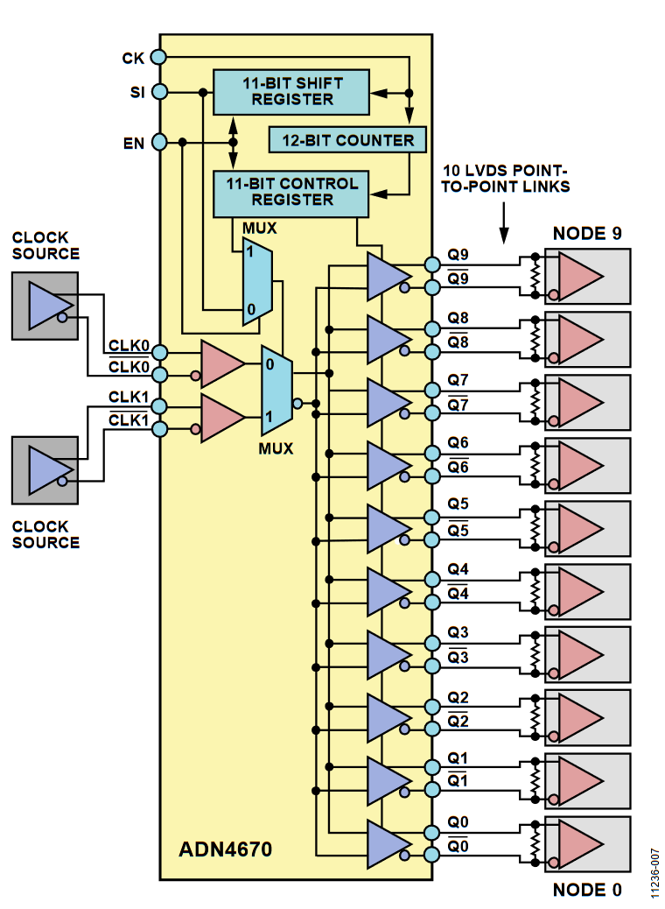

# 2025-01

## 2025-01-24

### openbehavior


[openbehavior url](https://edspace.american.edu/openbehavior/)

[The Future is Open Source Tools Paper pdf](../papers/2025/The%20Future%20Is%20Open%20Open-Source%20Tools%20for%20Behavioral%20Neuroscience%20Research.pdf)

### DDR3 Memory


### PCIE Ref Clock Inpout to FPGA 


[Xilixn URL](https://adaptivesupport.amd.com/s/article/18329?language=en_US)

## 2025-01-22

### Pentium CPU
{: style="height:600px"}

[Pentium, reverse-engineered](https://www.righto.com/2025/01/pentium-reverse-engineering-bicmos.html)

### Wavelet

[Wavelet_101](../subtitles/wavelet_101.md)

## 2025-01-21

[晶片技術大突破！Cerebras 如何實現比一般晶片多 100 倍的缺陷容忍度？ | T客邦](https://www.techbang.com/posts/120907-a-big-breakthrough-in-chip-technology-how-does-cerebras)


### DMA : Streaming DMA and Coherent DMA


### Verse.ai

[Verse.ai](https://www.verses.ai/research-blog/achieving-human-level-atari-gameplay-with-bayesian-object-priors-and-active-inference)


### MKV File Format

[MKV File Format](https://cloudinary.com/guides/video-formats/mkv-format-what-is-mkv-how-it-works-and-how-it-compares-to-mp4)

### Pi Camera High Frame Rate

[Pi Camera High Frame Rate](https://forums.raspberrypi.com/viewtopic.php?t=212518)

[How To Record Video At 660 FPS On A $6 Raspberry Pi Camera - Part 1](https://www.youtube.com/watch?v=m7gUZpjF-1s)

[How To Record Video At 660 FPS On A $6 Raspberry Pi Camera - Part 2](https://www.youtube.com/watch?v=m3Bs-yhWZ3M)

## 2025-01-20

### Intan ADC Missing Code and Missing Decison Level

[Intan ADC Missing Code and Missing Decison Level](../papers/2025/Barth_2024_J._Neural_Eng._21_044001.pdf)

[Fix SARADC Issues](../papers/2025/2012_JETTA_SARADC.pdf)

Missing Decision Level


Missing Code


Before Software Calibration


After Software Calibration


### Scalogram

[What is Scalogram](https://zh.wikipedia.org/zh-tw/%E9%80%A3%E7%BA%8C%E5%B0%8F%E6%B3%A2%E8%BD%89%E6%8F%9B)

[spkit.github.io wavelet analysis](https://spkit.github.io/auto_examples/wavelet_analysis/plot_sp_scalogram_cwt_example.html)


## 2025-01-16

### A 2 GHz oscilloscope for everyone

[https://www.crowdsupply.com/andy-haas/haasoscope-pro](https://www.crowdsupply.com/andy-haas/haasoscope-pro)

[https://github.com/drandyhaas/HaasoscopePro](https://github.com/drandyhaas/HaasoscopePro)

### SYZYGY Interface

SYZYGY Interface [syzygyfpga.io](https://syzygyfpga.io/)









### Paper Reading 2025-01-16

Open_Ephys_electroencephalography_Open_Ephys_EEG_A_modular_low-cost_open-source_solution_to_human_neural_recording [Paper Link](https://www.researchgate.net/publication/314305186_Open_Ephys_electroencephalography_Open_Ephys_EEG_A_modular_low-cost_open-source_solution_to_human_neural_recording)

Wearable_EEG_electronics_for_a_Brain-AI_Closed-Loop_System_to_enhance_autonomous_machine_decision-making [Paper Link](https://www.researchgate.net/publication/360954933_Wearable_EEG_electronics_for_a_Brain-AI_Closed-Loop_System_to_enhance_autonomous_machine_decision-making)

### PyFTDI for Intan

[FT2232_SPI_Intan](../subtitles/FT2232_SPI_Intan.md)

## 2025-01-13

### Evolutionary Neural Coding Lab


Github [EvolutionaryNeuralCodingLab](https://github.com/EvolutionaryNeuralCodingLab)

Site [EvolutionaryNeuralCodingLab](https://www.evolutionaryneuralcodinglab.sites.tau.ac.il/)

### Paper Reading 2025-01-13

ReptiLearn: An automated home cage system for behavioral experiments in reptiles without human intervention [Paper Link](https://journals.plos.org/plosbiology/article?id=10.1371/journal.pbio.3002411)

## 2025-01-03

### LVDS Clock Distribution

Analog Device [AN-1177](https://www.analog.com/en/resources/app-notes/an-1177.html)

{: style="height:300px"}

## 2025-01-02

### Python FTDI for SPI

[Python FTDI for SPI](https://www.alexallmont.com/spi-refresher/)

``` py
from pyftdi.ftdi import Ftdi
Ftdi.show_devices()
from pyftdi.spi import SpiController

spi.configure('ftdi://ftdi:2232h:1:7b/1')
slave = spi.get_port(cs=1, freq=10E6, mode=2)
write_buf = b'\x01\x02\x03'
read_buf = slave.exchange(write_buf, duplex=True)
```
