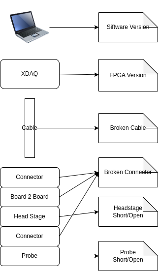
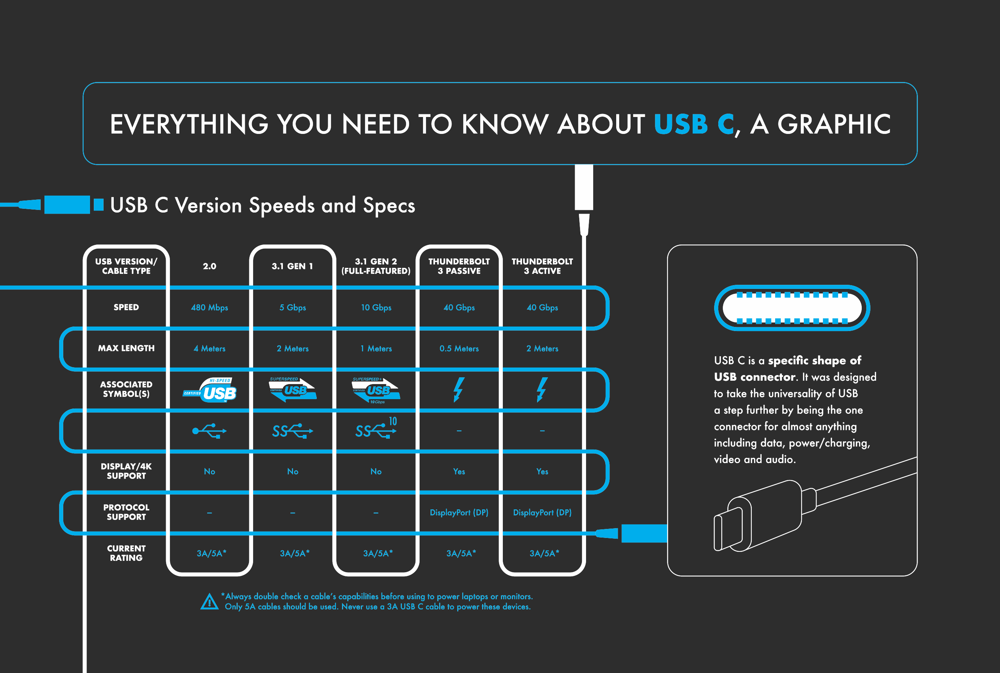

# 2025-02

## 2025-02-10

[ Liberux Linux Phone](https://liberux.net/)

### NNStreammer

[ NNStreammer](https://nnstreamer.ai/)

## 2025-02-08

### UScope Linux Debugger

[{: style="height:450px"}  
 UScope: A New Linux Debugger And Not A GDB Shell, Apparently](https://hackaday.com/2025/02/07/uscope-a-new-linux-debugger-and-not-a-gdb-shell-apparently/)

## 2025-02-07

### FPGA SDCard and XDMA

[FPGA as SD Card](https://github.com/WangXuan95/FPGA-SDfake)

[XDMA](https://github.com/WangXuan95/Xilinx-FPGA-PCIe-XDMA-Tutorial)

### Wireless Headstage

[Wireless Headstage](../subtitles/wireless_hs.md)

## 2025-02-06

### Syntalos

[Syntalos Github](https://github.com/syntalos/syntalos)

[Syntalos: a software for precise
synchronization of simultaneous multi-
modal data acquisition and closed-loop
interventions](../papers/2025/s41467-025-56081-9.pdf)

[Supplementary Information](../papers/2025/41467_2025_56081_MOESM1_ESM.pdf)

### YOWASP and Amaranth

[Unofficial WebAssembly-based packages for Yosys, nextpnr, and more](https://yowasp.org/)

### OpenMV 2025-02-06

[OMV is the core lib](https://github.com/openmv/openmv/tree/master/src/omv)

<!---
### XDAQ Connect Pipe

--->

### Brain in the Loop

"cerebral organoids,” small artificial brain tissues, created using iPS cells

[Brain Processing Unit ](https://www.creativeapplications.net/robotics/brain-processing-unit-artificial-brain-tissue-apis/)

### Low bit LLM on Edge

[Low bit LLM on Edge](https://www.microsoft.com/en-us/research/blog/advances-to-low-bit-quantization-enable-llms-on-edge-devices/)

### Why Animal Sleep

[Why Animal Sleep](https://hackaday.com/2025/02/05/investigating-why-animals-sleep-from-memory-sorting-to-waste-disposal/)

## 2025-02-05

### OpenMV 2025-02-05

[OpenMV RT](https://openmv.io/products/openmv-cam-rt)

1. The RT1062 ARM Cortex M7 processor running at 600 MHz 
with 32MBs SDRAM + 1MB of SRAM and 16 MB of program/storage flash. 
All I/O pins output 3.3V and are 3.3V tolerant. 
The processor has the following I/O interfaces:
2. A high speed USB-C (480Mbs) interface to your computer. 
Your OpenMV Cam will appear as a Virtual COM Port 
and a USB Flash Drive when plugged in.
1.5A current limited. With EMI Filtering and TVS protection.
3. A μSD Card socket capable of 25MB/s reads/writes 
which allows your OpenMV Cam to take pictures and 
easily pull machine vision assets off of the μSD card.
With EMI Filtering and TVS protection.
4. A SPI bus that can run up to 60Mb/s 
allowing you to easily stream image data off the system to 
either the LCD Shield or another microcontroller.

### Google Rust Course

[Google Comprehensive Rust Course](https://google.github.io/comprehensive-rust/)

### TSMC Revenu

## 2025-02-04

### System B 2025

[SystemB.md](../subtitles/SystemB.md)

### Reasons not to refactor

[Reasons not to refactor URL](https://thoughtbot.com/blog/reasons-not-to-refactor)

### The Philosophy of Architecture

[The Philosophy of Architecture - Barry O'Reilly - NDC Oslo 2024](https://www.youtube.com/watch?v=H8ZOp8ayluU&t=12s)

### Type-C

### PICO PIO 02-04

[A Practical Look at PIO on the Raspberry Pi Pico URL](https://blues.com/blog/raspberry-pi-pico-pio/)

[Introduction to the PIO (Programmable Input Output) of the RP2040](https://tutoduino.fr/en/pio-rp2040-en/)

### Chip Alliance

[Chip Alliance](https://www.chipsalliance.org/)

    Chisel HDL
    F4FPGA

### John Maynard Keynes

[Masters Of Money | Part 1 | John Maynard Keynes](https://www.youtube.com/watch?v=CkHooEp3vRE)

## 2025-02-03

### PICO PIO 02-03

[Raspberry Pi Pico PIO Video](https://www.youtube.com/playlist?list=PLiRALtgGsxmZs_LXGkh09Zr2NUmk_mtEI)

[programmable-io-programming @ circuitcellar URL](https://circuitcellar.com/research-design-hub/basics-of-design/programmable-io-programming/)

### Xilinx 7 Series Family Compare

[Xilinx 7 Series Family URL](https://www.vctelec.com/Showblogs_3878.html)

[7-series-product-selection-guide PDF](../papers/2025/7-series-product-selection-guide.pdf)

### Sipeed FPGA Console use Gowin

[sipeed console URL](https://www.hackster.io/news/sipeed-takes-on-the-mighty-mister-with-its-tang-console-fpga-development-board-112a417b3ec6)

