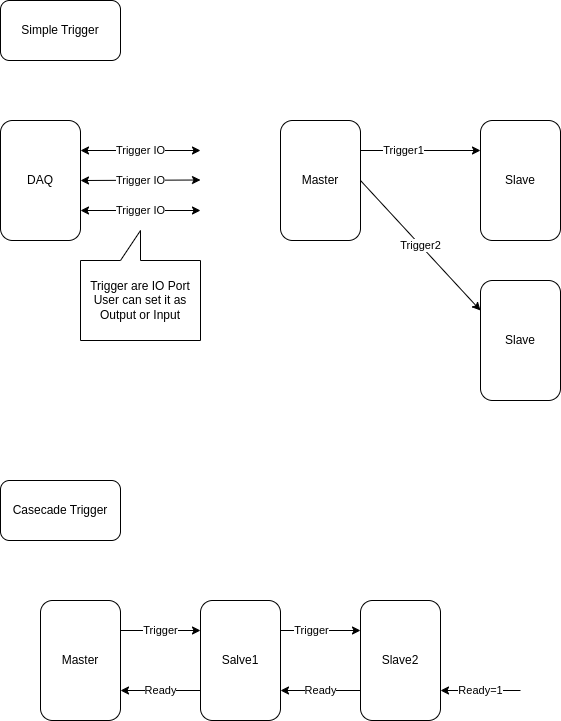
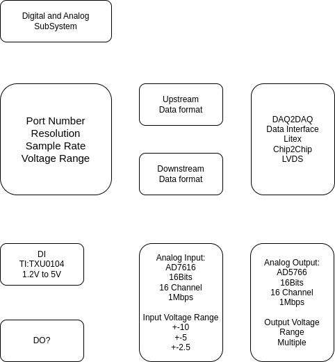
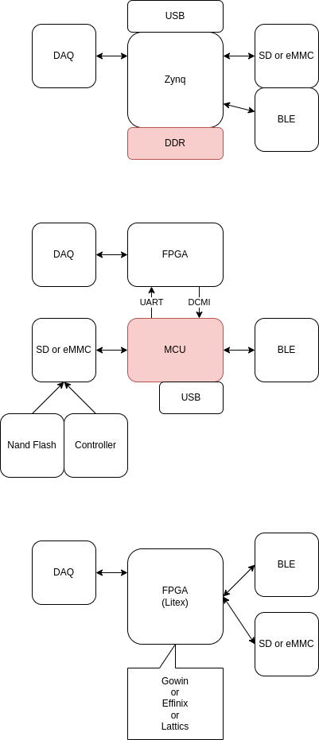
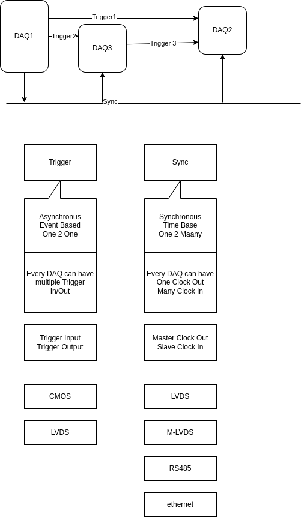
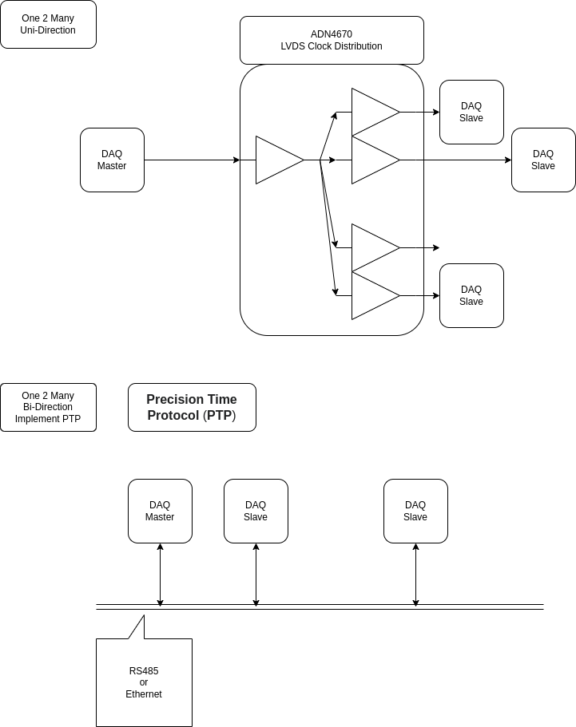

# 2025-02

## 2025-02-04

### DIO

Trigger.dio

Digital_Analog Subsystem

### System B 2025

[SystemB.md](../subtitles/SystemB.md)

### Reasons not to refactor

[Reasons not to refactor URL](https://thoughtbot.com/blog/reasons-not-to-refactor)

### The Philosophy of Architecture

[The Philosophy of Architecture - Barry O'Reilly - NDC Oslo 2024](https://www.youtube.com/watch?v=H8ZOp8ayluU&t=12s)

## 2025-02-03

### PICO PIO

[Raspberry Pi Pico PIO Video](https://www.youtube.com/playlist?list=PLiRALtgGsxmZs_LXGkh09Zr2NUmk_mtEI)

[programmable-io-programming @ circuitcellar URL](https://circuitcellar.com/research-design-hub/basics-of-design/programmable-io-programming/)

### Xilinx 7 Series Family Compare

[Xilinx 7 Series Family URL](https://www.vctelec.com/Showblogs_3878.html)

[7-series-product-selection-guide PDF](../papers/2025/7-series-product-selection-guide.pdf)

### Test DIO for Diagram

Wireless.dio

DAQ2DAQ.dio

SyncDistribution.dio

### Sipeed FPGA Console use Gowin

[sipeed console URL](https://www.hackster.io/news/sipeed-takes-on-the-mighty-mister-with-its-tang-console-fpga-development-board-112a417b3ec6)

