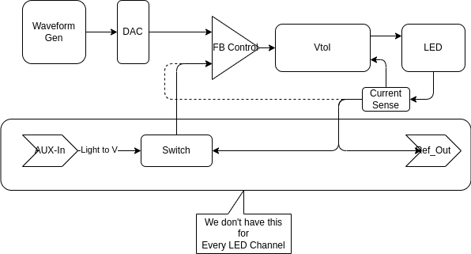
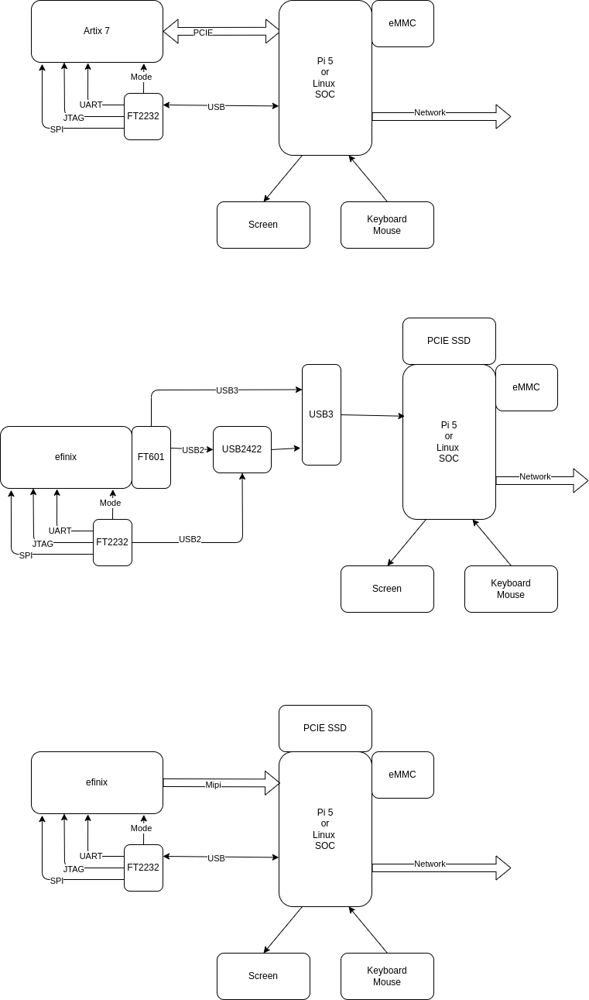
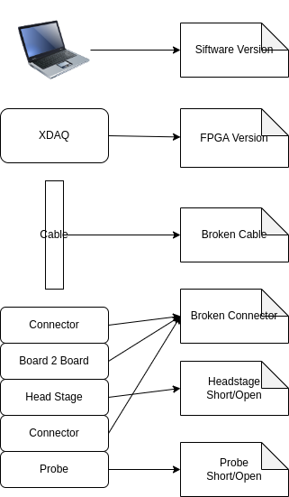
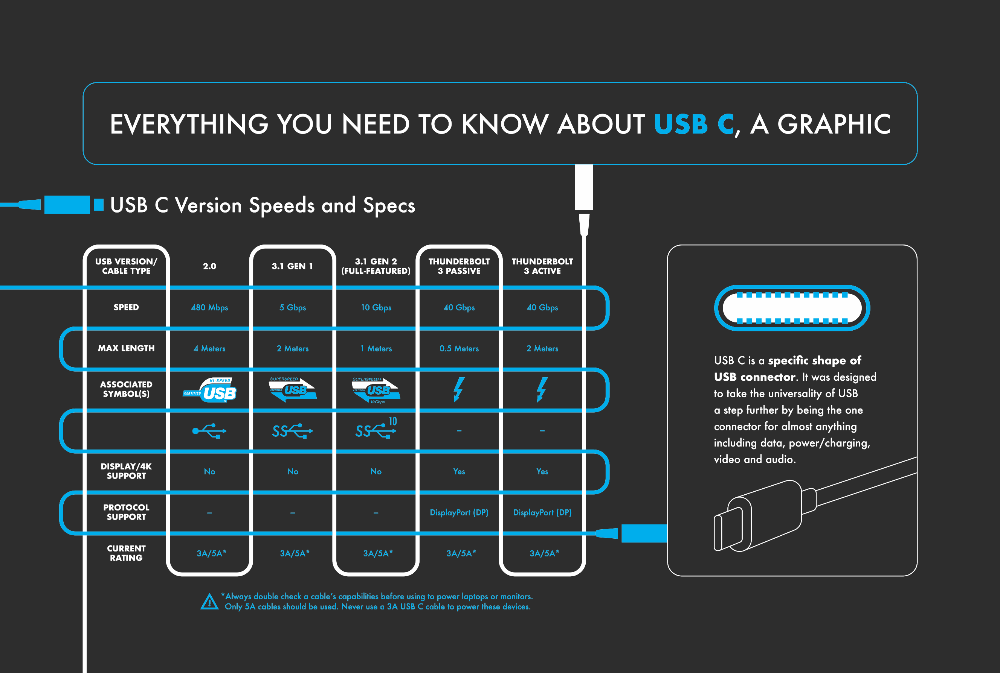

# 2025-02

## 2025-02-27

Never use a lousy schematic editor again! SKiDL is a simple module that lets you describe electronic circuits using Python. The resulting Python program outputs a netlist that a PCB layout tool uses to create a finished circuit board.

[skidl python CDL](https://devbisme.github.io/skidl/)

### Docker Alternative

[Podman](https://podman.io/)

## 2025-02-26

### LLM-Aided FPGA Design for Signal Processing Applications

This project demonstrates a novel approach to FPGA design by leveraging Large Language Models (LLMs) to streamline the development process from algorithmic conception to hardware implementation, applied to a pulse detector similar to the example in the HDL Coder Self-Guided Tutorial by MathWorks. The design concepts and implementation details are visually illustrated in the PNG images within this repository.

[pulseDetector github](https://github.com/rockyco/pulseDetector)

## 2025-02-25

### Veryl better SystemVerilog

[https://veryl-lang.org/](https://veryl-lang.org/)

### RISC-V and 16 Boards

[RISC-V and 16 Boards](https://www.elektormagazine.com/articles/the-risc-v-architecture-16-boards-mcus)

### 瑞昱RTS5490 USB4 for Thunderbolt 5 Thunderbolt 4

瑞昱RTS5490 USB4高效率整合方案，以高度整合的SoC設計為特色，整合了包含32bit高效能處理器、USB4路由器、USB 2.0/3.2集線器、DisplayPort控制器、PCIe Switch與USB3.2 Host controller等多項核心器件，可完美支援USB4.0、USB 3.2、USB-C、USB PD、PCIe與DisplayPort等協議，同時向下相容至現有的Thunderbolt 3裝置以及USB 3.2和USB 2.0傳輸設備，亦可兼容於市場上Thunderbolt 5與Thunderbolt 4裝置

[realtek-rts5490-controller-downstream-port-analysis](https://dancharblog.wordpress.com/2023/06/05/realtek-rts5490-controller-downstream-port-analysis/)

## 2025-02-24

### LED Feedback Control



### Stacked Module


[BetTimeLogic](https://www.nettimelogic.com/)


### LED Controller from OpenEphys

[Cyclops_MANUAL.pdf](../papers/2025/Cyclops_MANUAL.pdf)

[Cyclops Schematics](../papers/2025/cyclops_schematic.pdf)

[cyclops Github](https://github.com/jonnew/cyclops)

[Teensy 3.2 Document URL](https://www.pjrc.com/store/teensy32.html)

## 2025-02-20

### LitePCIE Windows Driver

[LitePCIE Windows Driver Github](https://github.com/NateMeyer/litepcie_driver_win)

[ThunderScope Github](https://github.com/EEVengers/ThunderScope)

## 2025-02-19

### Vaaman The reconfigurable edge computer

SOC >==MIPI DSI==> FPGA >==MIPI CSI==> SOC

[Vaaman The reconfigurable edge computer Github](https://github.com/vicharak-in/rah-bit)

[vicharak-devicetree-overlays Github](https://github.com/vicharak-in/vicharak-devicetree-overlays/tree/master)

[Vaaman CrowdSupply](https://www.crowdsupply.com/vicharak/vaaman)

---

Main idea behind Vaaman is to pick the faster processor than all other SOC series FPGAs (Mostly 4 Core Arm Cortex A53) while Vaaman is (6 Core, Cortex A72 and Cortex A54, goes up to 2.0 GHz) are offering and somewhat good FPGA which offers hardened blocks for communication interface + a very good price that we can offer to consumers. Thousands of applications do not need high-end FPGAs, but they need extraordinary normal hardware which can use both CPUs and FPGAs functionalities. We've designed Vaaman in a way that it does not compromise any functionality the other SBCs offer. It has everything: PCIe, SD Card, WiFi+BLE, Ethernet, USB, and a 40-PIN Raspberry Pi header. You can fit any Raspberry Pi hats directly into Vaaman, easily. So Vaaman will offer everything that the current SBC ecosystem is offering as it is + It has the benefit of the FPGA world natively.

Communication link is something that we worked on extensively, as our main goal was not to compromise any interface for CPU and FPGA sides where it has to communicate with the outside world. PCIe is extremely important from the CPU side for many embedded applications, so we wanted to keep it aside, along with other interfaces like MIPI CSI, DSI, USB 3.0 and 2.0, and GPIOs. So what did we do? We chose the hardest route to get it up. Efinix has a hard block of MIPI CSI, and Rockchip's RK3399 also had a hard block of camera and display interfaces. It was hard work—we had to tweak the Linux kernel and write wrapper drivers that drop display packets and use raw data packets natively. And that's it. We are naming this link as RAH Link. (https://github.com/vicharak-in/rah-bit).

Our another goal was to make it very simple to be accessed by both software and hardware front-end. We've written API-level drivers in C/C++ and Python, which make it very easy to communicate with it. Write APP_ID, data packets, and length—that's it. On the FPGA side, FIFOs! Write everything in FIFOs, and you can read it from there. Whether you want to convert it to APB, AHB, AXI, or simple mechanisms, it's completely up to you!

---

### The Transmitter: Neuroscience News and Perspectives

[The Transmitter: Neuroscience News and Perspectives](https://www.thetransmitter.org/)

### Startup Positron Takes On Nvidia With FPGAs

[Startup Positron Takes On Nvidia With FPGAs](https://www.eetimes.com/startup-positron-takes-on-nvidia-with-fpgas/)

### Mapping connections in a neuronal network

[Mapping connections in a neuronal network](https://seas.harvard.edu/news/2025/02/mapping-connections-neuronal-network#)

[Nanoelectrodes record thousands of connected mammalian neurons from inside](https://seas.harvard.edu/news/2019/09/close-and-personal-neuronal-networks)

## 2025-02-18

### THE PARALLEL FUTURE OF COMPUTATION Bend HVM

{: style="height:500px"}

[HigherOrderCo](https://higherorderco.com/)

[Interaction Combinator PDF](../papers/2025/Interaction%20Combinators.pdf)

[HVM2 Paper](../papers/2025/HVM2.pdf)

### AD5940 Study

[AD5940 Study](../subtitles/AD5940.md)

### CHKLOVSKII LAB

[Neural Circuits and Algorithms](https://neural-circuits-and-algorithms.github.io/)

[The Neuron as Direct Data-Driven Controller PDF](../papers/2025/The%20Neuron%20as%20a%20Direct%20Data-Driven%20Controller.pdf)

### FT2232 Ports

    FT2232
    2 Port
    UART/SPI/JTAG/FIFO/I2C/GPIO pick 2

    FT4232 Pick 4

## 2025-02-17

### New Memory Architectures for SoCs and Multi-Die Systems

[New Memory Architectures for SoCs and Multi-Die Systems](https://www.eejournal.com/article/new-memory-architectures-for-socs-and-multi-die-systems/)

### miniDAQ PCIE or USB3



PCIE => USB3 => Mipi

### V Language


[vlang.io](https://vlang.io/)

#### Memory Safety

    Bounds checking
    No undefined values
    No variable shadowing
    Immutable variables by default
    Immutable structs by default
    Option/Result and mandatory error checks
    Sum types
    Generics
    Immutable function args by default, mutable args have to be marked on call
    No null (allowed in unsafe code)
    No undefined behavior new!
    No global variables (can be enabled for low level apps like kernels via a flag)

## 2025-02-14

### Micropython pyBoard DAC use DMA

```py
import math
from array import array
from pyb import DAC

# create a buffer containing a sine-wave, using half-word samples
buf = array('H', 2048 + int(2047 * math.sin(2 * math.pi * i / 128)) for i in range(128))

# output the sine-wave at 400Hz
dac = DAC(1, bits=12)
dac.write_timed(buf, 400 * len(buf), mode=DAC.CIRCULAR)
```

### Micropython json

```py
import ujson
parsed = ujson.loads("""{"name":"John"}""")
print(parsed)
```

### Any-Maze

[ any-maze](https://www.any-maze.com/)

### FPGA and USB3


[USB3.0 FPGA Host Communication PDF](../papers/2025/USB3.0-FPGAHostCommunication.pdf)

100MHz * 32Bits = 400MByte/s ~~ 360MByte/s

### FT602 for UVC

[FT602](https://www.ftdichip.cn/Products/ICs/FT602.html)

    FT602是SuperSpeed USB（USB 3.1 Gen 1）到FIFO接口的USB视频类（UVC）桥接芯片，支持来自高分辨率摄像机设备的视频内容流。可以获得显着提高的视频质量，并且以60帧速率运行。

    通过标准的支持UVC的硬件和常用的媒体播放器平台（如VLC Player）查看捕获的图像数据时，可以使改进的性能受益匪浅。这样可以确保更大的便利性 - 以最少的投资来升级现有的系统，或从零开始设计和部署新的系统。 不需要定制驱动程序，从而允许简单的即插即用实现。

    FT602系列补充了FTDI芯片现有的 FT60x 系列 结合FT600和FT601 芯片，为开发工程师提供业界最全面的USB 3.0产品组合。 这些设备能够提供USB 3.0 超高速(5Gbps)和USB 2.0高速（480Mbps）接口。 它们各自包含用于数据流的32位并行FIFO接口和用于控制路径配置的UART接口。 采用76引脚QFN封装，工作温度范围为-40°C至85°C。

### Embedded scripting language and engine for Rust

[Rhai:Embedded scripting language and engine for Rust](https://rhai.rs/)

### Generates Makefiles for FPGA EDA

[Generates Makefiles for FPGA EDA](https://github.com/cambridgehackers/fpgamake)

---

## 2025-02-13

### How to Evaluate FPGA

| Property | Value    |
|:---------|:---------|
| CLB      |          |
| BRAM     |          |
| DDR      |          |
| PCIE     |          |
| IO Speed |          |
| SDRAM    |          |
| Flash    |          |
| Voltage  |          |

---

## 2025-02-12

### Git for Hardware Projects

[Git for Hardware Projects](https://medium.com/@tiago.gala/git-for-hardware-projects-a-case-for-revision-control-9dcf0005bf42)

### How to draw schematics

[How to draw schematics](https://medium.com/@tiago.gala/the-art-of-drawing-good-schematics-be3e7e59eb40)

#### Here are the rules I use when creating the block diagram

    Start with big functional blocks
    Link blocks with lines or arrows (arrows should represent data or power conversion flow)
    Add labels to connecting lines for protocol names/voltage domains
    Break down the big functional blocks into smaller blocks representing smaller circuits (a voltage regulator, load-switch, CAN transceiver, etc.)
    Add labels with maximum expected power for each block

#### Here’s a set of rules I use when designing schematics

    Use the default grid and never deviate from it. This will make aligning symbols easier and avoid weird shapes on connecting wires.
    Positive power symbols always point up, ground always points down
    Never join two components by placing the attachment points on top of each other — always use a connection wire to join the components (if by chance something is off-grid, this will allow you to catch it)
    Ensure labels connected to an IC are aligned vertically
    Label text should be placed on top of a wire (avoid hanging labels)
    Try to align power symbols horizontally
    If you create or import symbols, make sure the symbol style is consistent with the rest library
    Avoid crossing wires in weird places
    Make sure every circuit is displayed in the way it is usually displayed in text-book examples (unless that hurts readability):
    Voltage dividers: resistors should be vertically aligned
    Transistors should be designed emitter facing down
    Ensure proper spacing between components in a way that text labels are readable and don’t overlap with neighboring components
    Where possible, ensure your components and circuit blocks are aligned
    Keep your wires at least 2 grid spacing long — keep this rule from pin to pin and from pin to wire crossings (break this rule only if this hurts readability)
    Avoid 4-wire junctions as these can easily lead to errors and don’t improve readability
    Be consistent — make sure you always write things the same way. Are all your labels upper-case? How do you write capacitor values? 100nF, 100N, 0.1u? — choose a style and stick to it.

### Chrome App Mode

    chromeでアプリモード
    chromeでつぎのようにすると単独のアプリモードで起動できる。
    $ /opt/google/chrome/chrome -app=http://keep.google.com/
    $ chrome -app=http://hoge.com/
    これはこれで良いのかも…

### System D 2025

[System D 2025](../subtitles/SystemD_2025.md)

---

## 2025-02-11

### System C 2025

[System C 2025](../subtitles/SystemC_2025.md)

### Efinix FPGA with HyperRAM and SPI Flash

| FPGA        |  HyperRAM     |  CLB          | Board           |
|-------------|:-------------:|:-------------:|:---------------:|
| Ti60F100    |  256Mb        |  62016        | Titanium Ti60 F225 Development Kit |

[Efinix: Ti60F100](https://www.efinixinc.com/promo/ti/titanium-ti60f100-ready-for-vision.php)

[Efinix Titanium Product](https://www.efinixinc.com/products-titanium.html)


### GoWin FPGA with SDRAM or Flash

| FPGA        |  SDRAM        |  CLB          | Board           |
|-------------|:-------------:|:-------------:|:---------------:|
| GW5AR       |  64Mb         |  23040        |                 |
| GW1NR       |  64Mb~128Mb   |  8,640        | Tang Nano 9K/4K |
| GW2AR       |  64Mb~128Mb   |  20736        | Tang Nano 20K   |

---

## 2025-02-10

[ Liberux Linux Phone](https://liberux.net/)

[Xilinx FPGA Compare](../subtitles/Artix7vsKintex.md)

### NNStreammer

[ NNStreammer](https://nnstreamer.ai/)

---

## 2025-02-08

### UScope Linux Debugger

[{: style="height:450px"}  
 UScope: A New Linux Debugger And Not A GDB Shell, Apparently](https://hackaday.com/2025/02/07/uscope-a-new-linux-debugger-and-not-a-gdb-shell-apparently/)

---

## 2025-02-07

### FPGA SDCard and XDMA

[FPGA as SD Card](https://github.com/WangXuan95/FPGA-SDfake)

[XDMA](https://github.com/WangXuan95/Xilinx-FPGA-PCIe-XDMA-Tutorial)

### Wireless Headstage

[Wireless Headstage](../subtitles/wireless_hs.md)

---

## 2025-02-06

### Syntalos


[Syntalos Github](https://github.com/syntalos/syntalos)

[Syntalos: a software for precise
synchronization of simultaneous multi-
modal data acquisition and closed-loop
interventions](../papers/2025/s41467-025-56081-9.pdf)

[Supplementary Information](../papers/2025/41467_2025_56081_MOESM1_ESM.pdf)


### YOWASP and Amaranth


[Unofficial WebAssembly-based packages for Yosys, nextpnr, and more](https://yowasp.org/)

---

### OpenMV 2025-02-06

[OMV is the core lib](https://github.com/openmv/openmv/tree/master/src/omv)

<!---
### XDAQ Connect Pipe



--->

### Brain in the Loop

"cerebral organoids,” small artificial brain tissues, created using iPS cells

[Brain Processing Unit ](https://www.creativeapplications.net/robotics/brain-processing-unit-artificial-brain-tissue-apis/)

### Low bit LLM on Edge

[Low bit LLM on Edge](https://www.microsoft.com/en-us/research/blog/advances-to-low-bit-quantization-enable-llms-on-edge-devices/)

### Why Animal Sleep

[Why Animal Sleep](https://hackaday.com/2025/02/05/investigating-why-animals-sleep-from-memory-sorting-to-waste-disposal/)

---

## 2025-02-05

### OpenMV 2025-02-05

[OpenMV RT](https://openmv.io/products/openmv-cam-rt)

1. The RT1062 ARM Cortex M7 processor running at 600 MHz 
with 32MBs SDRAM + 1MB of SRAM and 16 MB of program/storage flash. 
All I/O pins output 3.3V and are 3.3V tolerant. 
The processor has the following I/O interfaces:
2. A high speed USB-C (480Mbs) interface to your computer. 
Your OpenMV Cam will appear as a Virtual COM Port 
and a USB Flash Drive when plugged in.
1.5A current limited. With EMI Filtering and TVS protection.
3. A μSD Card socket capable of 25MB/s reads/writes 
which allows your OpenMV Cam to take pictures and 
easily pull machine vision assets off of the μSD card.
With EMI Filtering and TVS protection.
4. A SPI bus that can run up to 60Mb/s 
allowing you to easily stream image data off the system to 
either the LCD Shield or another microcontroller.

### Google Rust Course

[Google Comprehensive Rust Course](https://google.github.io/comprehensive-rust/)

### TSMC Revenu


---

## 2025-02-04

### System B 2025

[SystemB_2025.md](../subtitles/SystemB_2025.md)

### Reasons not to refactor

[Reasons not to refactor URL](https://thoughtbot.com/blog/reasons-not-to-refactor)

### The Philosophy of Architecture

[The Philosophy of Architecture - Barry O'Reilly - NDC Oslo 2024](https://www.youtube.com/watch?v=H8ZOp8ayluU&t=12s)


### Type-C



### PICO PIO 02-04

[A Practical Look at PIO on the Raspberry Pi Pico URL](https://blues.com/blog/raspberry-pi-pico-pio/)

[Introduction to the PIO (Programmable Input Output) of the RP2040](https://tutoduino.fr/en/pio-rp2040-en/)

### Chip Alliance


[Chip Alliance](https://www.chipsalliance.org/)

    Chisel HDL
    F4FPGA

### John Maynard Keynes

[Masters Of Money | Part 1 | John Maynard Keynes](https://www.youtube.com/watch?v=CkHooEp3vRE)

---

## 2025-02-03

### PICO PIO 02-03

[Raspberry Pi Pico PIO Video](https://www.youtube.com/playlist?list=PLiRALtgGsxmZs_LXGkh09Zr2NUmk_mtEI)

[programmable-io-programming @ circuitcellar URL](https://circuitcellar.com/research-design-hub/basics-of-design/programmable-io-programming/)

### Xilinx 7 Series Family Compare

[Xilinx 7 Series Family URL](https://www.vctelec.com/Showblogs_3878.html)

[7-series-product-selection-guide PDF](../papers/2025/7-series-product-selection-guide.pdf)

### Sipeed FPGA Console use Gowin

[sipeed console URL](https://www.hackster.io/news/sipeed-takes-on-the-mighty-mister-with-its-tang-console-fpga-development-board-112a417b3ec6)


