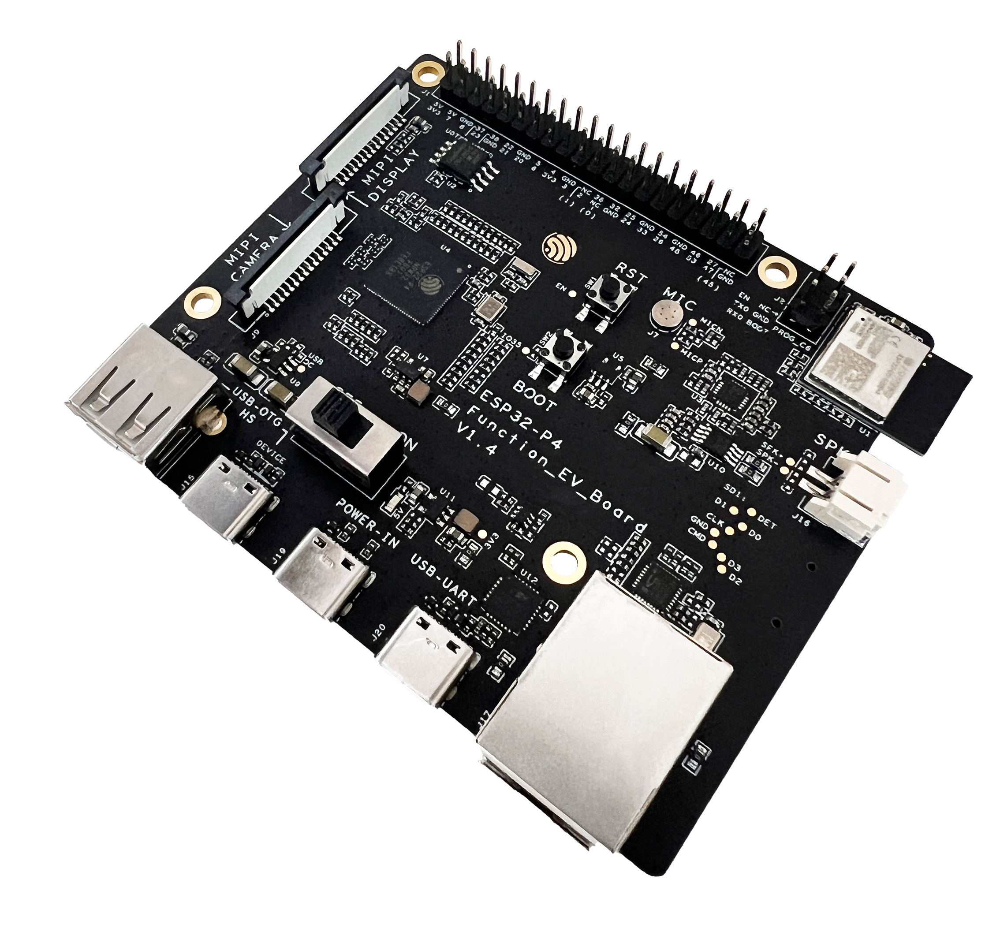
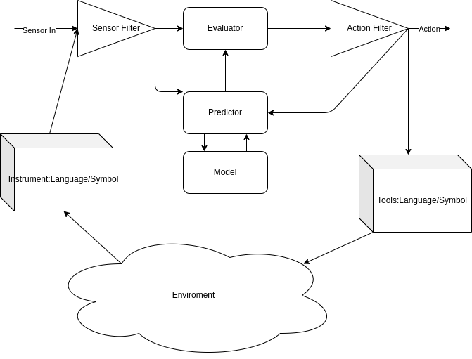
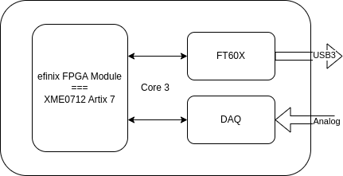

# 2025-03

## 2025-03-25

### Embedded Rust Video

[therustybits](https://www.youtube.com/@therustybits/videos)

[Rust Tokyo Meetup about Embedded Rust](https://www.youtube.com/watch?v=x7LQevYn7d0)

[Embedded Rust Fearless](https://www.youtube.com/watch?v=zkKvy65Fi64)

[Embedded Rust](https://www.youtube.com/playlist?list=PLP_X41VhYn5X6Wwjnm0bRwI3n2pdaszxU)

[rust-examples-microbit-2024](https://github.com/l-0-l/rust-examples-microbit-2024)

[how-to-program-a-raspberry-pi-pico](https://www.alexdwilson.dev/learning-in-public/how-to-program-a-raspberry-pi-pico)

### Three Electrode System

{: style="height:300px"}

{: style="height:300px"}

{: style="height:300px"}

{: style="height:450px"}

---

## 2025-03-24

### Oxidation lost of e , Reduction gain of e

    氧化劑得電子，會「消耗」自己的氧化能力 將還原劑氧化，本身被還原 得電子 Cathod
    還原劑失電子，會「消耗」自己的還原能力 將氧化劑還原，本身被氧化 失電子 Anode

    An Ox : Oxidation occur at Anode
    Red Cat : Reduction occur at Cathode

### Brain Basic

{: style="height:300px"}

[Brain Basic](https://www.ninds.nih.gov/health-information/public-education/brain-basics/brain-basics-know-your-brain)

---

### FMC Interface for DAQ

{: style="height:300px"}

---

### ESP32-P4-Function-EV-Board

{: style="height:300px"}

[ESP32-P4-Function-EV-Board](https://docs.espressif.com/projects/esp-dev-kits/en/latest/esp32p4/esp32-p4-function-ev-board/user_guide.html)

---

## 2025-03-21

## AD5940 生物電阻抗分析監測疾病的臨床狀態和診斷

[生物電阻抗分析監測疾病的臨床狀態和診斷](https://www.macnica.com/apac/anstek/zh_tw/products-support/technical-articles/bioelectrical-impedance-analysis-to-monitor-clinical-status-and-diagnosis-of-disease/)

{: style="height:300px"}

{: style="height:300px"}

---

## 2025-03-20

### Brain as Predictor and Evaluator

### Introducing the OpenMV AE3 and N6 Cameras

[onboard AI acceleration for computer vision applications](https://www.hackster.io/news/introducing-the-openmv-ae3-and-n6-cameras-e9ce2ee4ab1e#webview=1)

---

## 2025-03-19

### PICO Develop use VSCode

[PICO VSCode Github](https://github.com/raspberrypi/pico-vscode)

[Get started with Raspberry Pi Pico-series and VS Code](https://www.raspberrypi.com/news/get-started-with-raspberry-pi-pico-series-and-vs-code/)

### FPGA Bitstream Explained

[http://lastweek.io/fpga/bitstream/](http://lastweek.io/fpga/bitstream/)

[prjxray](https://github.com/f4pga/prjxray?tab=readme-ov-file)

### fpgas-security-through-obscurity

[fpgas-security-through-obscurity](https://www.nccgroup.com/us/research-blog/fpgas-security-through-obscurity/)

---

## 2025-03-18

### FTD2XXX Driver C Programming in Linux

Use Share Library

Use Static Link

### Make a efinix fpga module === Artix 7's module XME0712

We can use XME0712 module to test the base board.

### AI Control High Tension Scenario

In high tension scenario, people are affect by prior.

We can leverage AI.

For example in police work:

Video and Audio and Police Body/Brain status are feed to AI for analysis

All interaction are control by AI

AI told police what to say.

Prevent high tension escalation.

### Codelite install

"Direct download the version you want from Download URL"

---

## 2025-03-17

### What’s the difference between electric and fiber-optic slip rings?

[difference between electric and fiber-optic](https://www.motioncontroltips.com/whats-the-difference-between-electric-and-fiber-optic-slip-rings/)

### 10-cent WCH CH570/CH572 RISC-V MCU features 2.4GHz wireless, Bluetooth LE 5.0, USB 2.0

{: style="height:600px"}

---

## 2025-03-14

### MAX 9271 PowerDown Mode

### IMU BNO055 Replacement ICM-42670-P Driver

[ICM-42670-P Driver](https://github.com/tdk-invn-oss/motion.arduino.ICM42670P)

---

## 2025-03-11

### 12分鐘帶你快速了解會計恆等式、借貸法則、複式簿記、分錄、T字帳

[12分鐘帶你快速了解會計恆等式、借貸法則、複式簿記、分錄、T字帳](https://vocus.cc/article/63131faffd897800019a1fae)

### MEA

[MEA](https://www.axionbiosystems.com/technology/neural-mea)

[imec CMOS MEA](https://www.imec-int.com/en/expertise/health-technologies/micro-electrode-arrays)

---

## 2025-03-10

### Core3576

Luckfox Core3576 Module, Rockchip RK3576 Octa-Core 2.2GHz Processor, Features A big.LITTLE Architecture, 6 TOPS Computing Power NPU, Options For RAM And eMMC

[Core3576](https://www.luckfox.com/EN-Core3576)

---

### PSRAM

Pseudostatic RAM (PSRAM or PSDRAM) is dynamic RAM with built-in refresh and address-control circuitry to make it behave similarly to static RAM (SRAM). It combines the high density of DRAM with the ease of use of true SRAM. PSRAM is used in the Apple iPhone and other embedded systems such as XFlar Platform.[71]

---

Some DRAM components have a self-refresh mode. While this involves much of the same logic that is needed for pseudo-static operation, this mode is often equivalent to a standby mode. It is provided primarily to allow a system to suspend operation of its DRAM controller to save power without losing data stored in DRAM, rather than to allow operation without a separate DRAM controller as is in the case of mentioned PSRAMs.

---

An embedded variant of PSRAM was sold by MoSys under the name 1T-SRAM. It is a set of small DRAM banks with an SRAM cache in front to make it behave much like a true SRAM. It is used in Nintendo GameCube and Wii video game consoles.

Cypress Semiconductor's HyperRAM[72] is a type of PSRAM supporting a JEDEC-compliant 8-pin HyperBus[73] or Octal xSPI interface.

### USB HUB控制器芯片 CH334/5 4 Port Hub

[USB HUB控制器芯片 CH334/5](https://www.wch.cn/products/CH334.html)

CH334和CH335是符合USB2.0协议规范的4端口USB HUB控制器芯片，上行端口支持USB2.0高速和全速，下行端口支持USB2.0高速480Mbps、全速12Mbps和低速1.5Mbps。不但支持低成本的STT模式（单个TT分时调度4个下行端口），还支持高性能的MTT模式（4个TT各对应1个端口，并发处理）。工业级设计，外围精简，可应用于计算机和工控机主板、外设、嵌入式系统等。

---

## 2025-03-07

### 俄烏戰爭11年:芬蘭總統只用8分鐘,就把問題本質徹底講清楚了

[俄烏戰爭11年:芬蘭總統只用8分鐘,就把問題本質徹底講清楚了](https://www.youtube.com/watch?v=ZV_BXdS2V-U)

### 活體人類細胞運行

[活體人類細胞運行](https://technews.tw/2025/03/06/worlds-first-synthetic-biological-intelligence-runs-on-living-human-cells/)

Cortical Labs創辦人兼CEO Chong Hon-Weng博士表示：「我們提供『濕體即服務』（wetware-as-a-service，WaaS），客戶直接購買CL-1生物計算機，或雲端遠端使用技術。」平台今年下半上市，單價約35,000美元。

### $30 MPLAB PICkit Basic Debugger

[$30 MPLAB PICkit Basic Debugger](https://www.hackster.io/news/microchip-targets-students-and-hobbyists-with-its-new-30-mplab-pickit-basic-debugger-03030065f9f6)

---

## 2025-03-05

### VLang for Node Developers

[VLang for Node Developers](https://github.com/Thigidu/vlang-for-nodejs-developers)

### Nodejs Interactive Diagram Library

[React Flow](https://reactflow.dev)

[Rete.js](https://rete.js.org)

[Baklava.js](https://github.com/newcat/baklavajs)

[Flume](https://flume.dev)

[CodeWire](https://github.com/ayushk7/CodeWire)

[Wire](https://github.com/emilwidlund/wire)

[Svelvet](https://www.svelvet.io)

[Litegraph.js](https://github.com/jagenjo/litegraph.js)

[GoJS](https://gojs.net/latest/)

### Hollow Shaft Motor

[Hollow Shaft Motor](https://motor.mtl.co.jp/english/copy_Hollow_motor.html)

---

## 2025-03-03

### FT4233HPQ FT4232+PD

FT4233HPQ
This Hi-Speed USB device with Type-C/PD 3.0 controller IC fully supports the latest USB Type-C and Power Delivery (PD) standards enabling support for power negotiation with the ability to sink or source current to a USB host device.

This has one Dual-role PD port (PD port 1) which also carries the USB data communication. This can switch between the roles of sinking power from the host to power the peripheral, and sourcing power to charge the host computer.
A second included PD port (PD port 2) is a power sink and can be used to connect an external power source/charger. This can provide power to the peripheral board as well as charging the host via PD port 1.

This is a USB 2.0 Hi-Speed (480Mb/s) to UART IC. It has the capability of being configured in a variety of industry standard serial or parallel interfaces.
This fast quad channel bridge chip features 4 UARTs. Two of these have an option to independently configure an MPSSE engine allowing to operate as two UART/Bit-Bang ports plus two MPSSE engines used to emulate JTAG, SPI, I2C, Bit-bang or other synchronous serial modes.

[ft4233hp data sheet](https://ftdichip.com/products/ft4233hp/)

### A DIY PCR Cycling Unit

[A DIY PCR Cycling Unit](https://circuitcellar.com/research-design-hub/projects/a-diy-pcr-cycling-unit/)

### OpenMV Launches a Prophesee GenX320 "Event Camera" Module

[OpenMV Launches a Prophesee GenX320 "Event Camera" Module](https://www.hackster.io/news/openmv-launches-a-prophesee-genx320-event-camera-module-and-flir-boson-thermal-sensor-adapter-711d1b5540d3?mc_cid=7ffe8393c3&mc_eid=7a9a81990b)
