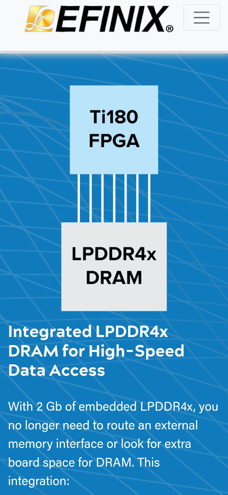

# 2025-04

## 2025-04-29

### Probe Electrode and Probe Bath 2 Node

### TIA and Auto-Balance Bridge

### Multi-channel_impedance_analyzer use AD5933

[Multi-channel_impedance_analyzer](../papers/2025/Multi-channel_impedance_analyzer_for_automated_tes.pdf)

### Measuring Impedance and Capacitance with an Oscilloscope and Function Generator

No FFT Needed

[Measuring Impedance and Capacitance with an Oscilloscope and Function Generator](../papers/2025/48W-29165-0%20Using%20an%20oscillocope%20and%20function%20generator%20to%20measure%20capacitor%204-24-2013%20DP.pdf)

## 2025-04-25

### LLMs Coming For A DNA Sequence Near You

[LLMs Coming For A DNA Sequence Near You](https://hackaday.com/2025/04/24/llms-coming-for-a-dna-sequence-near-you/)

## 2025-04-24

### Modern_monetary_theory

[Modern_monetary_theory](https://en.wikipedia.org/wiki/Modern_monetary_theory)

Central banks manage liquidity by buying and selling government bonds on the open market. When excess reserves are in the banking system, the central bank sells bonds, removing reserves from the banking system, because private individuals pay for the bonds. When insufficient reserves are in the system, the central bank buys government bonds from the private sector, adding reserves to the banking system.

---

MMT economists also say quantitative easing (QE) is unlikely to have the effects that its advocates hope for.[72] Under MMT, QE – the purchasing of government debt by central banks – is simply an asset swap, exchanging interest-bearing dollars for non-interest-bearing dollars. The net result of this procedure is not to inject new investment into the real economy, but instead to drive up asset prices, shifting money from government bonds into other assets such as equities, which enhances economic inequality. The Bank of England's analysis of QE confirms that it has disproportionately benefited the wealthiest.[73]

MMT economists say that inflation can be better controlled (than by setting interest rates) with new or increased taxes to remove extra money from the economy.[5] These tax increases would be on everyone, not just billionaires, since the majority of spending is by average Americans.[5]

---

[Unpacking "The Deficit Myth" by Stephanie Kelton | Modern Monetary Theory (MMT)](https://www.youtube.com/watch?v=kWcvVf7r88s)

[What is MMT?](https://www.youtube.com/watch?v=1_vNAY2Nrm0)

### The Hong-Ou-Mandel Effect

[The Hong-Ou-Mandel Effect](https://fiveable.me/quantum-optics/unit-3/hong-ou-mandel-effect/study-guide/F5lnUrTGlcxyA9uR)

[Anton_Zeilinger](https://en.wikipedia.org/wiki/Anton_Zeilinger)

## 2025-04-23

### Spice ngspice

[NGSpice Tutorial KiCad](https://ngspice.sourceforge.io/tutorials.html#videos)

[KiCad Spice Lib](https://github.com/kicad-spice-library)

### Wiki App

[Bookstack](https://www.bookstackapp.com/)

[Gitbook](https://www.gitbook.com/)

## 2025-04-21

### STM32 FFT and DDS

[STM32 LCR Meter](https://adilmalikn.wordpress.com/2019/07/07/low-cost-high-accuracy-stm32-fft-lcr-meter/)

[STM32F4_SignalGeneration_FFT](https://github.com/HanzoutiMehdi/STM32F4_SignalGeneration_FFT)

## 2025-04-18

### Chisel Arbiter

[Chisel Arbiter Video](https://www.youtube.com/watch?v=8J0BJ1DEsRE&list=PLfrN7RIcMe6gxHh5EwK0hktA5qWQQuSRQ&index=11)

### Orange-Pi-RV2

[Orange-Pi-RV2](http://www.orangepi.org/html/hardWare/computerAndMicrocontrollers/details/Orange-Pi-RV2.html)

### Adafruit_AHRS from 9 Axis Data

[Adafruit_AHRS](https://github.com/adafruit/Adafruit_AHRS)

## 2025-04-16

### Not able to read absolute orientation (tilt) using DMP

[Not able to read absolute orientation (tilt) using DMP](https://github.com/sparkfun/SparkFun_ICM-20948_ArduinoLibrary/issues/59)

### Chisel Decouple and Queue

### Chisel Flow

## 2025-04-15

### MUI Board

[MUI Board](https://muilab.com/en/products_and_services/muiboard/)

### STM32 & ICM-20948 IMU sensor

[STM32 & ICM-20948 IMU sensor Video](https://www.youtube.com/playlist?list=PLmXXQ1iFwiyL9iLkXptKc9M8RdL-zZ4yL)

### Conversion_between_quaternions_and_Euler_angles

[Conversion_between_quaternions_and_Euler_angles](https://en.wikipedia.org/wiki/Conversion_between_quaternions_and_Euler_angles)

## 2025-04-14

[SparkFun ICM-20948 Arduino Library](https://github.com/sparkfun/SparkFun_ICM-20948_ArduinoLibrary)   <----

	Need to change the memcpy_P to memcpy
	add #include <string.h>

    double q1 = ((double)data.Quat6.Data.Q1) / 1073741824.0; // Convert to double. Divide by 2^30
    double q2 = ((double)data.Quat6.Data.Q2) / 1073741824.0; // Convert to double. Divide by 2^30
    double q3 = ((double)data.Quat6.Data.Q3) / 1073741824.0; // Convert to double. Divide by 2^30

	double q0 = sqrt(1.0 - ((q1 * q1) + (q2 * q2) + (q3 * q3)));

    double qw = q0; // See issue #145 - thank you @Gord1
    double qx = q2;
    double qy = q1;
    double qz = -q3;

    // roll (x-axis rotation)
    double t0 = +2.0 * (qw * qx + qy * qz);
    double t1 = +1.0 - 2.0 * (qx * qx + qy * qy);
    double roll = atan2(t0, t1) * 180.0 / PI;

    // pitch (y-axis rotation)
    double t2 = +2.0 * (qw * qy - qx * qz);
    t2 = t2 > 1.0 ? 1.0 : t2;
    t2 = t2 < -1.0 ? -1.0 : t2;
    double pitch = asin(t2) * 180.0 / PI;

    // yaw (z-axis rotation)
    double t3 = +2.0 * (qw * qz + qx * qy);
    double t4 = +1.0 - 2.0 * (qy * qy + qz * qz);
    double yaw = atan2(t3, t4) * 180.0 / PI;

## 2025-04-11

### Calibrate Magnatic Sensor

[ICM_20948-AHRS](https://github.com/jremington/ICM_20948-AHRS)

[magnetometer-calibration](https://teslabs.com/articles/magnetometer-calibration/)

[improved-magnetometer-calibration](https://sailboatinstruments.blogspot.com/2011/08/improved-magnetometer-calibration.html)

[calibrating-any-compass-or-accelerometer-for-arduino](https://thecavepearlproject.org/2015/05/22/calibrating-any-compass-or-accelerometer-for-arduino/)

### Matlab about Sensor Fusion

[Matlab about Sensor Fusion](https://www.youtube.com/playlist?list=PLn8PRpmsu08ryYoBpEKzoMOveSTyS-h4a)

### Matlab about Kalman Filter

[Matlab about Kalman Filter](https://www.youtube.com/playlist?list=PLn8PRpmsu08pzi6EMiYnR-076Mh-q3tWr)

## 2025-04-10

### Efinix FPGA embedded with 2Gb DDR

{: style="height:450px"}

## 2025-04-09

### ICM_20948 Calibration

[ICM_20948](https://github.com/jremington/ICM_20948-AHRS)

[magnetometer-calibration](https://teslabs.com/articles/magnetometer-calibration/)

### How LLM Think ?

[Tracing the thoughts of a large language model](https://www.anthropic.com/research/tracing-thoughts-language-model)

[On the Biology of a Large Language Model](https://transformer-circuits.pub/2025/attribution-graphs/biology.html)

## 2025-04-08

### FrontPanel 6.0 Public Beta

With FrontPanel 6 we’re introducing the ability to develop FrontPanel-powered Electron apps.

[FrontPanel 6.0 Public Beta](https://opalkelly.com/frontpanel-6-0-public-beta/)

### Enginursday: Open Ephys 2014 @ Sparkfun

[Enginursday: Open Ephys](https://news.sparkfun.com/1541)

---

## 2025-04-07

### Chisel 2025

[CSE 228A - Agile Hardware Design, Spring 2025, UC Santa Cruz](https://www.youtube.com/playlist?list=PLfrN7RIcMe6gxHh5EwK0hktA5qWQQuSRQ)

[Agile Hardware Design Course Lectures](https://github.com/agile-hw/lectures)

### Transputer Emulator

[Transputer](https://github.com/nanochess/transputer?tab=readme-ov-file)

### Bambu: A Free Framework for the High-Level Synthesis HLS of Complex Applications

Bambu: A Free Framework for the High-Level Synthesis (HLS) of Complex Applications
Bambu is a free framework aimed at assisting the designer during the high-level synthesis of complex applications, supporting most of the C constructs (e.g., function calls and sharing of the modules, pointer arithmetic and dynamic resolution of memory accesses, accesses to array and structs, parameter passing either by reference or copy, …). Bambu is developed for Linux systems, it is written in C++11, and it can be freely 
downloaded under GPL license.

[Bambu HLS](https://panda.deib.polimi.it/?page_id=31)

---

### Adafruit MAX17048 LiPoly / LiIon Fuel Gauge and Battery Monitor

[Adafruit MAX17048](https://www.adafruit.com/product/5580)

---

### LTC4150 Coulomb Counter Hookup Guide

[LTC4150 Coulomb Counter Hookup Guide](https://learn.sparkfun.com/tutorials/ltc4150-coulomb-counter-hookup-guide/all)

---

### Battery Gas Gauge LTC2959

---

### NJW4119 Raspberry Pi Battery

---

### Performant Rust Webserver on a Low-Cost FPGA use Arty A7

[Performant Rust Webserver on a Low-Cost FPGA](https://www.linkedin.com/pulse/performant-rust-webserver-low-cost-fpga-nettimelogic-gmbh-yxshf/)

---

## 2025-04-02

### RAH Protocol User Guide (efinix FPGA Mipi to Linux SBC)

The RAH (Real-time Application Handler) protocol is designed to facilitate the transfer of data between a CPU and an FPGA, developed by Vicharak. It enables the CPU to run various applications that send data to the FPGA. The RAH Services encapsulate the data into distinguishable data-frames identified by an app_id and deliver these frames to the FPGA. On the FPGA side, the RAH design decodes the data and writes it to the corresponding APP_WR_FIFO. Similarly, during the read cycle, the FPGA writes data into APP_RD_FIFO, which is then encapsulated and delivered back to the CPU where it gets decoded.

[rah-bit](https://github.com/vicharak-in/rah-bit)

[Docs of Vicharak FPGA](https://docs.vicharak.in/)

### Generate your own RPI Image

rpi-image-gen is a tool used to create custom software images for Raspberry Pi devices. rpi-image-gen runs best on a Raspberry Pi Host running up-to-date 64-bit Raspberry Pi OS.

[rpi-image-gen](https://github.com/raspberrypi/rpi-image-gen)

## 2025-04-01

### 9 Axis get better Yaw Estimation

### UVC Isochronical Data Size USB USB2 USB3

	1024x  3 x 8000 USB2
 	1024x 48 x 8000 USB3 Gen1
	1024x 96 x 8000 USB3 Gen2

[Understanding why USB Isochronous Bandwidth Errors Occur](https://www.thegoodpenguin.co.uk/blog/understanding-why-usb-isochronous-bandwidth-errors-occur/)

[USB bandwidth allocation](https://learn.microsoft.com/en-us/windows-hardware/drivers/usbcon/usb-bandwidth-allocation)

### Gryro Offset is also not stable

Same measure different time.

### Yaw Drift

[MPU-6050-Fusion](https://github.com/jremington/MPU-6050-Fusion/blob/main/MPU6050_gyro_only.ino) 

Without Gyro Calibration 3degree/Second

With Gryo Calibration 0.3degree/Second

