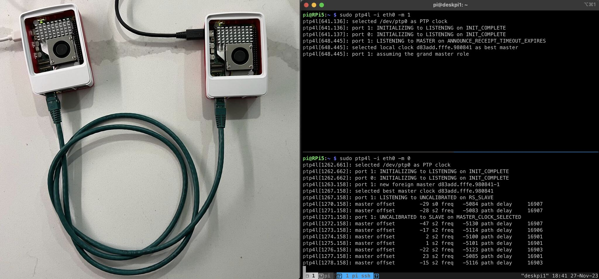

# 2025-05

## 2025-05-19

### syntalos

[syntalos timestamp sync](https://syntalos.org/)

### Calibrate RTC

[calibrating-an-mcus-rtc-using-gps](https://circuitcellar.com/research-design-hub/calibrating-an-mcus-rtc-using-gps/)

[DS3231-Aging-GPS](https://github.com/gbhug5a/DS3231-Aging-GPS)

[Embedded RTC](https://wiki.csie.ncku.edu.tw/embedded/RTC?revision=73fa5c34d18c2f9529766eb91bf9b833c0d13d92)

## 2025-05-16

### Whitequart (Amaranth author) Lab Blog 2024-2014

[Lab of Whitequart](https://lab.whitequark.org/)

### ICEBreak Examples

[icebreaker-migen-examples](https://github.com/icebreaker-fpga/icebreaker-migen-examples/tree/master)

## 2025-05-15

### An NVIDIA Jetson Nano/NX alternative powered by SpacemiT K1 octa-core RISC-V SoC

[SpacemiT K1 octa-core RISC-V SoC](https://www.cnx-software.com/2025/05/13/jupiter-nx-som-an-nvidia-jetson-nano-nx-alternative-powered-by-spacemit-k1-octa-core-risc-v-soc/#webview=1)

[Jupiter-NX](https://milkv.io/jupiter-nx)

## 2025-05-14

### Pi 5 PTP

## 2025-05-13

### Cocotb

[learncocotb1560](https://www.youtube.com/@learncocotb1560/featured)

[Introduction to Cocotb](https://www.youtube.com/playlist?list=PLkQ78bJ3qNHQGZeeLrmD6TIZAxeplHQyj)

[Python for RTL Verification](https://sites.google.com/view/python-4-rtl-verif/home)

### ADC/DAC and Digital IO

[AD7616 ADC](https://www.analog.com/en/products/ad7616.html)

[AD5766 DAC](https://www.analog.com/en/products/ad5766.html)

[TXU0104 Digital In/Out](https://www.ti.com/product/TXU0104?keyMatch=TXU0104&tisearch=universal_search&usecase=GPN-ALT)

### PI5 PTP PPS

[Pi CM4 PTP](https://www.jeffgeerling.com/blog/2022/ptp-and-ieee-1588-hardware-timestamping-on-raspberry-pi-cm4)

[PTP Server use Pi](https://austinsnerdythings.com/2025/02/18/nanosecond-accurate-ptp-server-grandmaster-and-client-tutorial-for-raspberry-pi/)

[TimeStick with Pi 4](https://www.linkedin.com/posts/ahmadexp_ptp-with-pps-output-on-the-raspberry-pi-4-activity-7182065386106880000-b2iY/?utm_source=share&utm_medium=member_android&rcm=ACoAABwWoEkB7YUrJegV8L5VMiiW_tb4Q1EvlLo)

[Raspberry Pi 5 Ethernet PTP Timestamping - How should it work?](https://forums.raspberrypi.com/viewtopic.php?t=358275)

[Pi5 TimerServer use GPS Github](https://github.com/parlaynu/pi5-timeserver-gps-pps)

[Pi PPS GPS](https://austinsnerdythings.com/2021/04/19/microsecond-accurate-ntp-with-a-raspberry-pi-and-pps-gps/)

[PPS Client Github](https://github.com/rascol/PPS-Client)

[Use RTC PPS for Sync](https://unix.stackexchange.com/questions/739166/using-rtc-pps-for-syncing-computer-by-ntp)

## 2025-05-12

### OE Breakout board LVDS 8b10b

### Harp Timing

### Cool FPGA Github for USB,HDMI,JPEG

[WangXuan95](https://github.com/WangXuan95)

PhD graduated from USTC // FPGA // Verilog // Data Compression // LLM newbie // Hope to bring better open source projects

## 2025-05-09

### MicropHarp

[MicropHarp Github](https://github.com/SainsburyWellcomeCentre/microharp)

### HDMI TMDS

[openfpga_hdmi](https://yodalee.me/2021/09/openfpga_hdmi/)

[hdmi-display-output](https://mjseemjdo.com/2021/04/02/tutorial-6-hdmi-display-output/)

[PICO DVI](https://github.com/Wren6991/PicoDVI)

### FPGA Evaluation

    1.Size Speed
    2.IP 
    3.Tool
    4.P&R Performance
    5.TCL Support ?
    6.Evalutation Board
    7.efuse Support ?

## 2025-05-08

### TMDS

[TMDS Encoder](https://github.com/ranjan-yadav/TMDS-encoder-8b-10b)

### onechipbook-12-a-fpga-development-platform

[onechipbook-12-a-fpga-development-platform](https://www.tindie.com/products/cycle/onechipbook-12-a-fpga-development-platform/)

## 2025-05-07

### PyXL is a custom chip that runs Python directly in hardware

[https://www.runpyxl.com/](https://www.runpyxl.com/)

PyXL is a custom chip that runs Python directly in hardware.
no VM, no JIT, no C. Just fast, native Python execution.

## 2025-05-06

### 使用 uv 管理 Python 環境

[使用 uv 管理 Python 環境](https://docs.astral.sh/uv/)

### ATtiny Configurable Custom Logic

[Getting Started With ATtiny Configurable Custom Logic](https://hackaday.com/2025/05/03/getting-started-with-attiny-configurable-custom-logic-ccl/)

[megaTinyCore](https://github.com/SpenceKonde/megaTinyCore)

### FPGA Game Bub

[FPGA Game Bub](https://eli.lipsitz.net/posts/introducing-gamebub/)

## 2025-05-05

### Serdes Encoder/Decode Basic

[Serdes Basic](https://github.com/ishfaqahmed29/SerDes)

### MLVDS

[ADI MLVDS](https://www.youtube.com/watch?v=keGk5Xq4RIs)

### DPLL 74LS297

[DPLL 74LS297](../papers/2025/74LS297_DPLL.pdf)

## 2025-05-02

### DPLL Github

[https://github.com/jsloan256/dpll](https://github.com/jsloan256/dpll)

[https://github.com/KayChou/DPLL](https://github.com/KayChou/DPLL)

### Gödel, Escher, Bach: A Mental Space Odyssey 2007 MIT Open Courseware

[Gödel, Escher, Bach: A Mental Space Odyssey](https://ocw.tau.edu.ng/high-school/humanities-and-social-sciences/godel-escher-bach/video-lectures/)

[Notes by Ray Toal](https://cs.lmu.edu/~ray/notes/geb/)

[geb-part-1](https://blog.p-petrov.com/2021-03-16/geb-part-1)

[geb-part-2](https://blog.p-petrov.com/2021-04-03/geb-part-2.html)