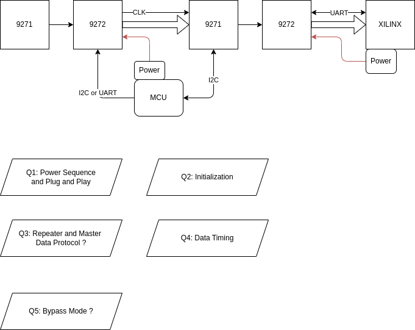
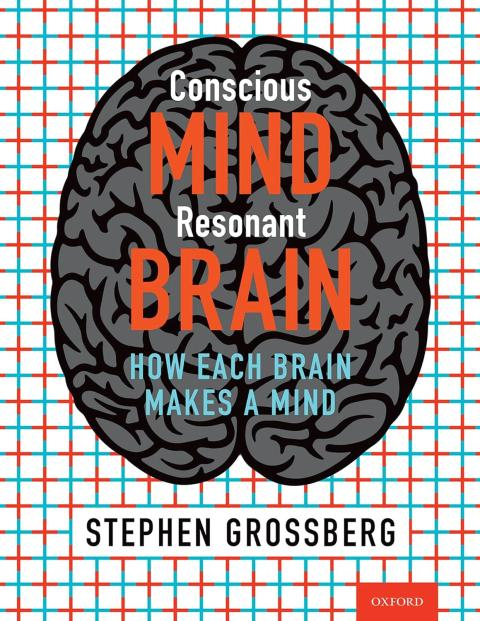
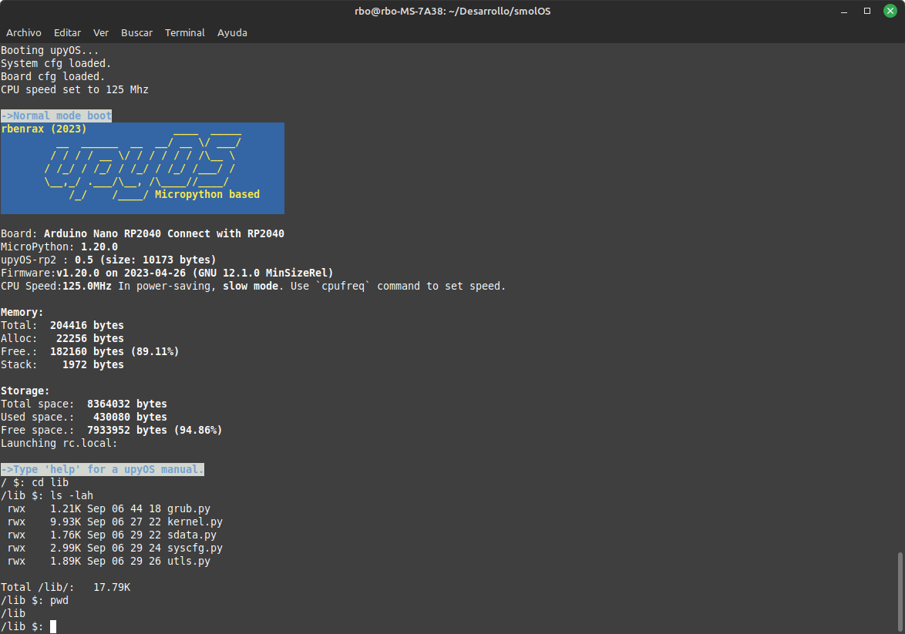
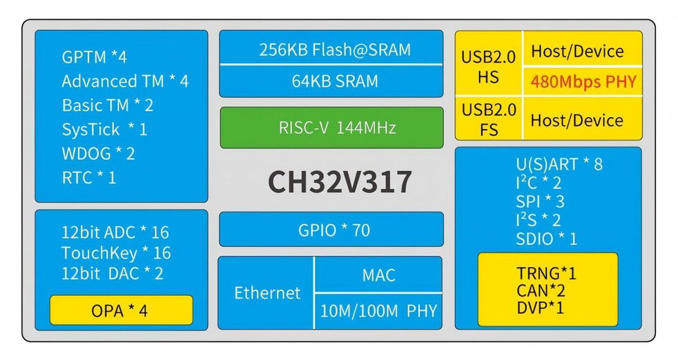

# 2025-10

## 2025-10-20

### GMSL Repeater

## 2025-10-17

### upyOS

[upyOS github](https://github.com/rbenrax/upyOS)

    upyOS is a modular flash Operating System for microcontrollers based on MicroPython. It provides the user with a POSIX-like environment. The original idea is by Krzysztof Krystian Jankowski and has been adapted by me.

### Sketching Algorithem (Similar to VSA)

[Sketching Algorithms](https://www.sketchingbigdata.org/)

## 2025-10-16

### UNO-Q Inter Process Communication

[UNO-Q](https://docs.arduino.cc/hardware/uno-q/#features)

### Conscious Mind, Resonant Brain: How Each Brain Makes a Mind Grossbergian Neuroscience

[Grossbergian Neuroscience YT](https://www.youtube.com/playlist?list=PLTEtXsHFKZTsxmKyVn69ZmLBxghBH1tNR)

### An Introduction to Tsetlin Machines

[An Introduction to Tsetlin Machines](https://tsetlinmachine.org/)

[Tsetlin Machines Wiki](https://en.wikipedia.org/wiki/Tsetlin_machine)

### Getting Started with Rust on NXP LPC55S69-EVK

[Getting Started with Rust on NXP LPC55S69-EVK](https://mcuoneclipse.com/2025/10/15/getting-started-with-rust-on-nxp-lpc55s69-evk/)

### Embassy : Rust for embedded system use Async

[Embassy](https://github.com/embassy-rs/embassy)

    Embassy is the next-generation framework for embedded applications. Write safe, correct, and energy-efficient embedded code faster, using the Rust programming language, its async facilities, and the Embassy libraries.

## 2025-10-15

### How non-neuronal brain cells communicate to coordinate rewiring of the brain

[How non-neuronal brain cells communicate to coordinate rewiring of the brain](https://medicalxpress.com/news/2025-10-neuronal-brain-cells-communicate-rewiring.html)

### upyOS is a modular flash Operating System for microcontrollers based on MicroPython

[upyOS](https://github.com/rbenrax/upyOS)

## 2025-10-14

### Neuromorphic-Computing-Guide

[Neuromorphic-Computing-Guide](https://github.com/mikeroyal/Neuromorphic-Computing-Guide)

### Is just synaptic weight change ? And how much change will be ? I mean max to min

### activitypub

[activitypub](https://activitypub.rocks/)

## 2025-10-13

### omarchy linux distribution

[omarchy](https://omarchy.org/)

### 缺「鋰」當心失智

    5類天然飲食中的鋰
    ●全穀物與根莖類：小麥、燕麥、米、馬鈴薯、地瓜。

    ●豆類：扁豆、各式豆類、鷹嘴豆。

    ​●蔬果類：高麗菜、甘藍、萵苣、蘿蔓生菜、芥菜、番茄。

    ​●堅果與種子：原味堅果、芝麻。

    ​●飲用水：日常飲用水、某些地區的礦泉水。

### XSCHEM : schematic capture and netlisting EDA tool

[XSCHEM](https://xschem.sourceforge.io/stefan/index.html)

- hierarchical schematic drawings, no limits on size
- any object in the schematic can have any sort of properties (generics in VHDL, parameters in Spice or Verilog)
- new Spice/Verilog primitives can be created, and the netlist format can be defined by the user
- tcl extension language allows the creation of scripts; any user command in the drawing window has an associated tcl comand
- VHDL / Verilog / Spice netlist, ready for simulation
- Behavioral VHDL / Verilog code can be embedded as one of the properties of the schematic block,

### Building an Open Source ASIC

[Analog Course](https://zerotoasiccourse.com/analog_course_content/)

[Zero to ASIC Course](https://zerotoasiccourse.com/#want-to-learn-how-to-design-digital-chips)

### CH32V317 board offers 10/100Mbps Ethernet, dual USB 2.0 Type-C, DVP interface

[CH32V317](https://www.cnx-software.com/2025/10/07/sub-7-ch32v317-board-offers-10-100mbps-ethernet-dual-usb-2-0-type-c-dvp-interface/)

### Minigrid

[Minigrid](https://github.com/Farama-Foundation/Minigrid)

    The Minigrid library contains a collection of discrete grid-world environments to conduct research on Reinforcement Learning. The environments follow the Gymnasium standard API and they are designed to be lightweight, fast, and easily customizable.

### Rare Earth issue to Semiconductor

    Chipmaking equipment, such as that produced by ASML and Applied Materials, is particularly dependent on rare earth elements used in high-precision lasers, magnets, and other critical components. ASML is reportedly preparing for significant disruption given the need to obtain export licenses for products containing these materials.

## 2025-10-08

### Efinix Ti60F100S3F2 with HyperRAM 256MBits

## 2025-10-07

### EMG detection time under 200ms

## 2025-10-03

### StimCircuit

---

### It is all about representation

[via Yang LeCunnat 45:35](https://www.youtube.com/watch?v=AfqWt1rk7TE)

## 2025-10-02

### Circuits - Computation - Models

[Circuits - Computation - Models](https://www.bi.mpg.de/borst)

## 2025-10-01

### Could a Neuroscientist Understand a Microprocessor

[Could a Neuroscientist Understand a Microprocessor](../papers/2025/Could%20a%20Neuroscientist%20Understand%20a%20Microprocessor.pdf)