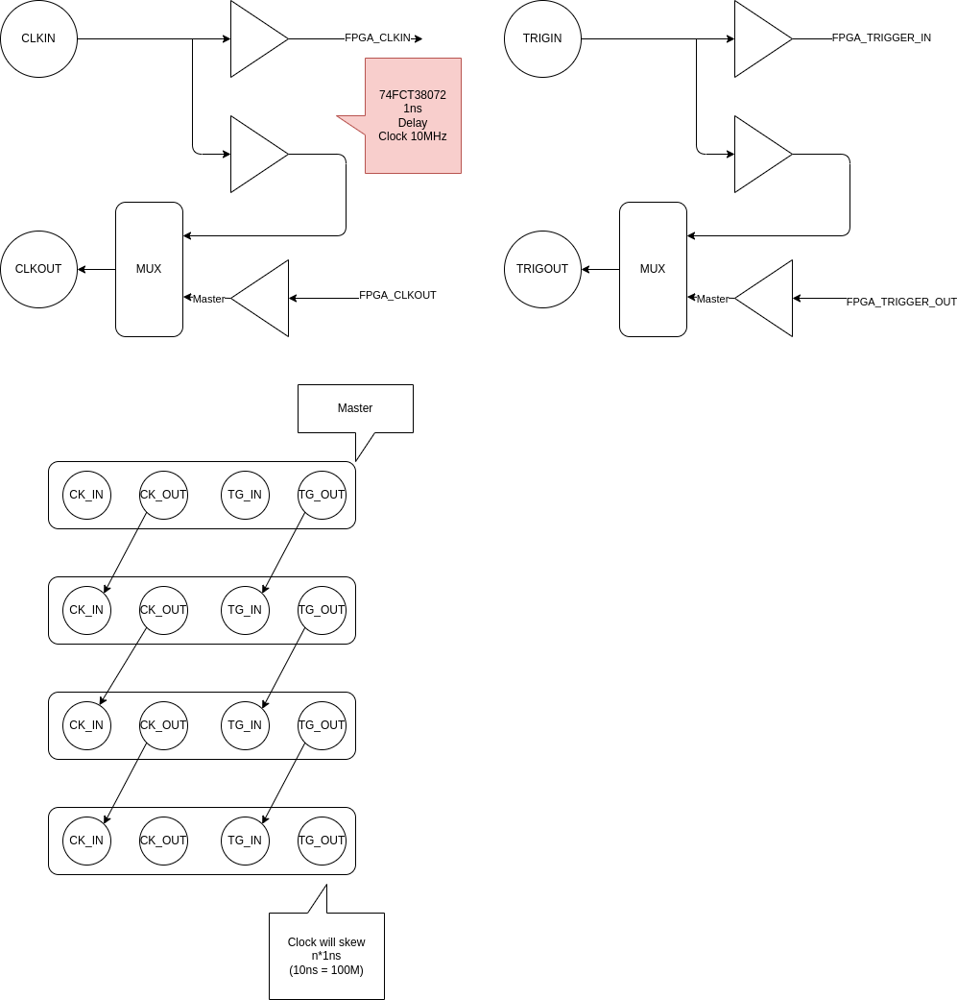
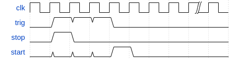
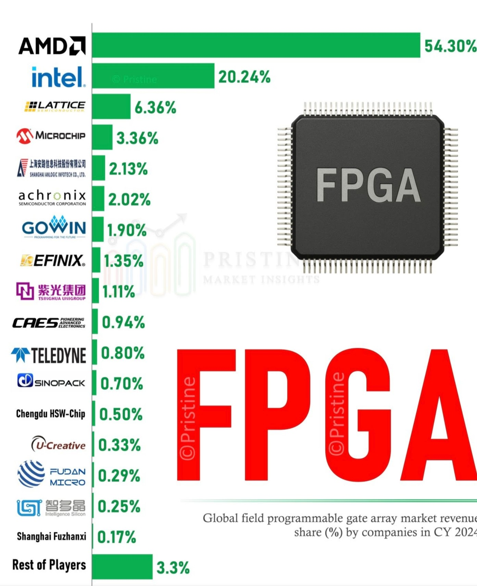
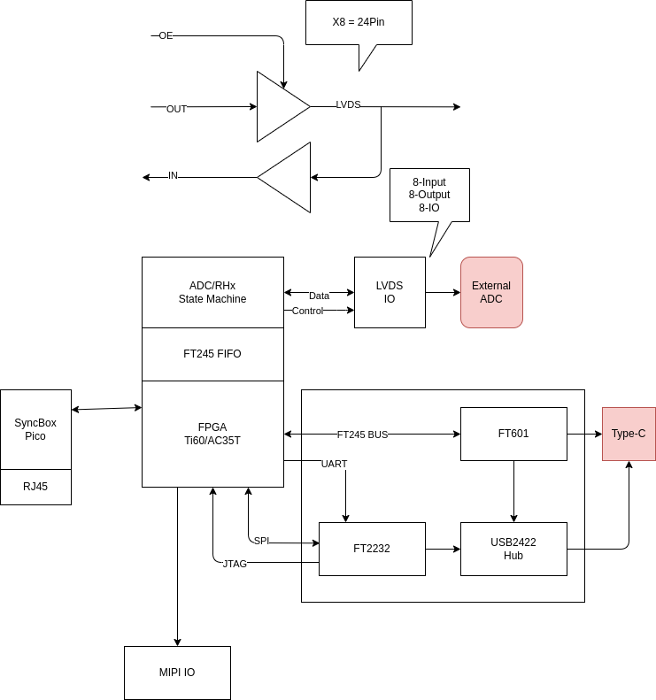

# 2025-11

## 2025-11-17

### PICO Programming Tutorial

[Digital Systems Design Using Microcontrollers - V. Hunter Adams](https://ece4760.github.io/)

### RP2040 + FPGA RISC-V AXIS Communication

[YouTube from FPGA Zealot](https://www.youtube.com/watch?v=a7hFD_DbAdk&t=2441s)

### 時之輪 真龍轉生 上

2025-121

---

### Open Source ASIC Design Tool

OpenLane is an automated RTL to GDSII flow based on several components including OpenROAD, Yosys, Magic, Netgen, CVC, SPEF-Extractor, KLayout and a number of custom scripts for design exploration and optimization. The flow performs all ASIC implementation steps from RTL all the way down to GDSII.

[OpenLane](https://github.com/The-OpenROAD-Project/OpenLane)

OpenLane is an ASIC infrastructure library based on several components including OpenROAD, Yosys, Magic, Netgen, CVC, KLayout and a number of custom scripts for design exploration and optimization.

A reference flow, "Classic", performs all ASIC implementation steps from RTL all the way down to GDSII.

[OpenLane2](https://github.com/efabless/openlane2)

### Comparison

| Compare     | Parallel        | Daisy Chain       |
|:------------|:----------------|:------------------|
| System      | Master/Slave    | Master==Slave     |
| Complex     | Need MCU        | Driver and Mux    |
| Size        | Large           | Small             |
| Usage       | Slave Set ID    | Set Master/Slave  |  
| Usage       | Press Key       | Master Daq control|
| PC Control  | Extra App       | Integrated        |
| Hardware    | 90% Ready       | 0% In 2 Week      |
| FPGA        | 0%              | 0%                |
| Test        | Extra Master    | All in FPGA       |
| Integration | Extra work      | Easy for all daq  |

## 2025-11-14

### OOpen Data In Neuroscience ODIN

[https://odin.mit.edu/](https://odin.mit.edu/)

### Clock and Trigger

### Clock and Trigger Distribution

---

### OpenEphys - Sync

### RedPitaya - Sync

---

## 2025-11-13

### NeuroPixel Road Map

---

### Make your own Chip

### Dr. Iain McGilchrist

A pioneering exploration of the differences between the brain’s right and left hemispheres and their effects on society, history, and culture—"one of the few contemporary works deserving classic status” (Nicholas Shakespeare, The Times, London)

[The Matter With Things: Our Brains, Our Delusions and the Unmaking of the World ](https://www.amazon.com/-/zh_TW/Iain-McGilchrist-ebook/dp/B09KY5B3QL/ref=sr_1_1?dib=eyJ2IjoiMSJ9.h6mQ2m0ro3z-Kw_cvKTyA89Ow01dLCVIsuu_KKoRplZJJLbIuOeGycpElertZZcuV99aPJ8Ygik1EJX4Av8KhsAd-YeswoCMxRWY3tRdW_4.T2cBcrR2TvxVWbuJFyyg4FlGv-OxCJaDxQTpVFdhmfI&dib_tag=se&qid=1763023199&refinements=p_27%3AIain+McGilchrist&s=digital-text&sr=1-1)

[The Master and His Emissary: The Divided Brain and the Making of the Western World](https://www.amazon.com/-/zh_TW/Iain-McGilchrist-ebook/dp/B07NS35S76/ref=sr_1_2?dib=eyJ2IjoiMSJ9.h6mQ2m0ro3z-Kw_cvKTyA89Ow01dLCVIsuu_KKoRplZJJLbIuOeGycpElertZZcuV99aPJ8Ygik1EJX4Av8KhsAd-YeswoCMxRWY3tRdW_4.T2cBcrR2TvxVWbuJFyyg4FlGv-OxCJaDxQTpVFdhmfI&dib_tag=se&qid=1763023199&refinements=p_27%3AIain+McGilchrist&s=digital-text&sr=1-2)

---

### Introduction to State Space Models (SSM)

[Introduction to State Space Models (SSM)](https://huggingface.co/blog/lbourdois/get-on-the-ssm-train)

### Dynamics HLS (Lana Josipović)

[https://dynamatic.epfl.ch/](https://dynamatic.epfl.ch/)

[https://dynamo.ethz.ch/research/](https://dynamo.ethz.ch/research/)

---

### 時之輪 大狩獵 下

2025-120

---
## 2025-11-12

### Digital Minimalism

2025-119

---

### max9272 major problem

A major problem with the MAX9272 is potential signal distortion due to the non-linear characteristics of the amplifier's output impedance and the parasitic base-to-collector capacitance, which are dependent on bias current and other device parameters. This can lead to nonlinear loading of the output and distort the output signal. While the MAX9272 is designed to minimize these effects, its performance can still be impacted by these non-linearities, particularly in applications sensitive to signal integrity. 
Non-linear output impedance: The output impedance of the amplifier is not perfectly constant, which causes nonlinear loading and distorts the output signal.
Parasitic capacitance: The parasitic base-to-collector capacitance in the device also has nonlinear characteristics that contribute to signal distortion.
Impact: These non-linear effects can cause the output signal to be distorted, which is a significant issue for high-speed data transmission applications where signal integrity is critical.

[An Introduction to Preemphasis and Equalization in Maxim GMSL SerDes Devices](https://www.analog.com/en/resources/technical-articles/an-introduction-to-preemphasis-and-equalization-in-maxim-gmsl-serdes-devices.html)

### 民主社會的寬容  容不下 不寬容

---

### 劫貧濟富 劫富濟貧

---

### Denis Noble's Principles of Systems Biology

Principles of Systems Biology

Denis Noble at a meeting on Systems Biology at Chicheley Hall, August 2013
Noble has proposed Ten Principles of Systems Biology

- Biological functionality is multi-level
- Transmission of information is not one way
- DNA is not the sole transmitter of inheritance
- The theory of biological relativity: there is no privileged level of causality
- Gene ontology will fail without higher-level insight
- There is no genetic program
- There are no programs at any other level
- There are no programs in the brain
- The self is not an object
- There are many more to be discovered; a genuine 'theory of biology' does not yet exist

---

## 2025-11-11

### World FPGA Market Share

### Reading List from Transmitter

[The Transmitter’s reading list 2025](https://www.thetransmitter.org/reviews/the-transmitters-reading-list-six-upcoming-neuroscience-books-plus-notable-titles-in-2025/)

## 2025-11-10

### DeGoogle

[DeGoogle](https://en.wikipedia.org/wiki/DeGoogle)

### MiniDAQ

## 2025-11-07

### fasting-calendar-2025

[fasting-calendar-2025](https://www.orthodoxarkansas.com/fasting-calendar-2025/)

### Ethernet RJ45 Transformer

The correct answer is because the ethernet specification requires it.

Although you didn't ask, others may wonder why this method of connection was chosen for that type of ethernet. Keep in mind that this applies only to the point-to-point ethernet varieties, like 10base-T and 100base-T, not to the original ethernet or to ThinLan ethernet.

The problem is that ethernet can support fairly long runs such that equipment on different ends can be powered from distant branches of the power distribution network within a building or even different buildings. This means there can be significant ground offset between ethernet nodes. This is a problem with ground-referenced communication schemes, like RS-232.

There are several ways of dealing with ground offsets in communications lines, with the two most common being opto-isolation and transformer coupling. Transformer coupling was the right choice for ethernet given the tradeoffs between the methods and what ethernet was trying to accomplish. Even the earliest version of ethernet that used transformer coupling runs at 10 Mbit/s. This means, at the very least, the overall channel has to support 10 MHz digital signals, although in practice with the encoding scheme used it actually needs twice that. Even a 10 MHz square wave has levels lasting only 50 ns. That is very fast for opto-couplers. There are light transmission means that go much much faster than that, but they are not cheap or simple at each end like the ethernet pulse transformers are.

One disadvantage of transformer coupling is that DC is lost. That's actually not that hard to deal with. You make sure all information is carried by modulation fast enough to make it thru the transformers. If you look at the ethernet signalling, you will see how this was considered.

There are nice advantages to transformers too, like very good common mode rejection. A transformer only "sees" the voltage across its windings, not the common voltage both ends of the winding are driven to simultaneously. You get a differential front end without a deliberate circuit, just basic physics.

Once transformer coupling was decided on, it was easy to specify a high isolation voltage without creating much of a burden. Making a transformer that insulates the primary and secondary by a few 100 V pretty much happens unless you try not to. Making it good to 1000 V isn't much harder or much more expensive. Given that, ethernet can be used to communicate between two nodes actively driven to significantly different voltages, not just to deal with a few volts of ground offset. For example, it is perfectly fine and within the standard to have one node riding on a power line phase with the other referenced to the neutral.

[Ethernet RJ45 Transformer](https://electronics.stackexchange.com/questions/27756/why-are-ethernet-rj45-sockets-magnetically-coupled)

---

### LVDS over Ethernet

## 2025-11-06

### Jekyllrb

[Transform your plain text into static websites and blogs](https://jekyllrb.com/)

### FSF announces Librephone project

[FSF announces Librephone project](https://www.fsf.org/news/librephone-project)

[librephone Project website](https://librephone.fsf.org/)

[lineageos](https://lineageos.org/)

### Sarah Paine Lectures

[Sarah Paine Lectures on YT](https://www.youtube.com/playlist?list=PLd7-bHaQwnthnOed1a85mF7L-Ki3kdiqp)

    American historian who was the William S. Sims University Professor of History and Grand Strategy at the U.S. Naval War College in Newport, Rhode Island.

### Power Management for FPGAs

[Power Management for FPGAs](https://www.analog.com/en/resources/analog-dialogue/articles/power-management-for-fpgas.html)

---

TI's Solution

---

### I am more afraid of our own mistakes than of our enemies' designs. Pericles

---

### Intel vs Efinix

| FPGA        | Power        | EEPROM       |
|:------------|:-------------|:-------------|
| Intel Max10 | 3.3V         | Embedded     |
| efinix T20  | 1.2V Core   3.3V IO  | Embedded     |
| efinix Ti60 | 0.95V Core   1.8V AUX   3.3V IO  | Embedded RAM and EEPROM   |

### EMG ADC

[High-resolution portable bluetooth module for ECG and EMG acquisition](../papers/2025/EMG1-s2.0-S2001037025001394-main.pdf)

[A Multi-Channel Electromyography,Electrocardiography and Inertial Wireless Sensor Module Using Bluetooth Low-Energy](../papers/2025/EMGelectronics-09-00934-v4.pdf)

---

## 2025-11-05

### It is all just message, but how about memory?

---

### I Applied the Unix Philosophy to My WHOLE LIFE

[Video](https://www.youtube.com/watch?v=h0s2sUu5zW0)

---

### solid-state memristor

[Leon Ong Chua](https://en.wikipedia.org/wiki/Leon_O._Chua)

---

### Until AI ask questions , I am not worried

As I know, expert ask questons more than give answers
AI don't do that.

---

### EZ-USB™ FX5 USB 5 Gbps peripheral controlle (USB3)

[EZ-USB™ FX5 USB 5 Gbps peripheral controlle](https://www.infineon.com/products/universal-serial-bus/usb-3-2-peripheral-controllers/ez-usb-fx5-usb-5-gbps-peripheral-controller)

---

## 2025-11-04

### It is memory that drive the change

---

### Can I use an amplifier as an attenuator?

[Amplifier, attenuator or both?](https://www.analog.com/en/resources/analog-dialogue/raqs/raq-issue-56.html)

I mentioned that some precautions must be considered when using amplifiers as attenuators. The first is when very large values of feedback resistance are used. This has several implications: more system noise, larger offset voltages and stability. Large feedback resistors, along with the amplifier's input and stray capacitance, can introduce a pole in the amplifiers feedback response, this causes additional phase shift, which reduces the amplifiers phase margin and can lead to instability.

---

### High Speed Slip Ring

[High Speed Slip Ring](https://www.grandslipring.com/slip-ring-data-speeds/)