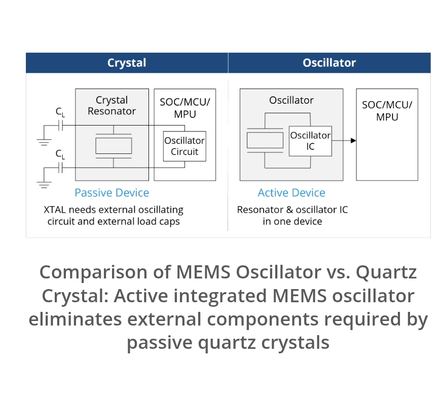
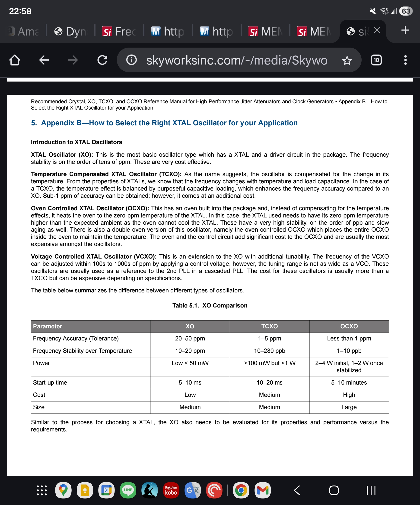

# 2025-11

## 2025-11-28

### Do you check your car or house every hour to prevent disaster ? If not, why your investment ?

### Chain of Computation is not Network. Cell know that billion years ago.

### Nested Cognition


[Forms of life, forms of mind DR. MICHAEL LEVIN- Copied from thoughtforms.life](https://thoughtforms.life/symposium-on-the-platonic-space/)

---

### What evals do in AI

What evals do
Measure performance: Evals systematically check how well an AI model performs its intended tasks, ensuring it delivers accurate and reliable results.
Identify issues: They are used to surface potential problems such as bias, safety concerns, and unexpected behavior, including "hallucinations" or incorrect information.
Ensure reliability: By testing for consistency, evals help ensure the AI provides dependable results, even though its outputs are probabilistic.
Align with business goals: Evals confirm that the AI system is not only technically sound but also aligned with an organization's specific business objectives and ethical standards. 

---

### 時之輪5 天空之火 下


2025-130

---

### 時之輪5 天空之火 中


2025-129

---

### 時之輪5 天空之火 上


2025-128

---

## 2025-11-27

### Neuroscience for machine learners

[Neuroscience for machine learners](https://neuro4ml.github.io/)

### only way out is forward

### MEMS with Low ppm SiT5356 or SiT5357


[mems-tcxo-sub-ppm-stability](https://www.sitime.com/support/resource-library/technology-papers/mems-tcxo-sub-ppm-stability)

### Crystal vs Oscillator



### XO TCXO OCXO VCXO



---

## 2025-11-26

### PICO as USB Host


[Pico to Pico through USB](https://www.youtube.com/watch?v=LO_Z90jQUKw)

---

### PICO Memory Emulation

#### Pico as SPI RAM

[SPI RAM EMU](https://github.com/MichaelBell/spi-ram-emu)

#### Pico as ROM

[One ROM](https://github.com/piersfinlayson/one-rom)

---

### Use what we see or on the surface to describe the internal is wrong.

### Makeup things is not Hallucination. It is Imagination. Brain live in Imagination.

---

### PCIE CAMERA


---

## 2025-11-25

### Miding My Mitochondria


2025-127

---

### The Past is never dead, It is not even past 


---

### Logic, Creativity, and the Limits of AI: How Humans Think in Ways Machines Never Will

[Logic, Creativity, and the Limits of AI: How Humans Think in Ways Machines Never Will](https://www.youtube.com/watch?v=Ox9raAMfKTE)

In this episode, Angus Fletcher explains why the human brain doesn’t work like a computer and why our deepest strengths come not from logic or data processing but from imagination, emotion, and the ability to invent new futures. Drawing on neuroscience, Shakespeare, evolutionary biology, and his work with U.S. Army Special Operations, Fletcher shows how storytelling is the brain’s oldest “technology,” why intelligence is rooted in action rather than analysis, and what most people get wrong about creativity and common sense.

Angus Fletcher is a professor of story science at Ohio State’s Project Narrative, the world’s leading academic think tank dedicated to understanding how stories work. He earned his PhD from Yale, conducted postdoctoral research at Stanford, and in 2023 received the U.S. Army’s Commendation Medal for his groundbreaking work with Army Special Operations on primal intelligence. He has also written screenplays for major Hollywood studios and networks. His new book is Primal Intelligence: You Are Smarter Than You Know.

---

## 2025-11-24

### Token-Oriented Object Notation (TOON)

[Token-Oriented Object Notation (TOON)](https://github.com/toon-format/toon)

Token-Oriented Object Notation is a compact, human-readable encoding of the JSON data model that minimizes tokens and makes structure easy for models to follow. It's intended for LLM input as a drop-in, lossless representation of your existing JSON.

```json
{
  "context": {
    "task": "Our favorite hikes together",
    "location": "Boulder",
    "season": "spring_2025"
  },
  "friends": ["ana", "luis", "sam"],
  "hikes": [
    {
      "id": 1,
      "name": "Blue Lake Trail",
      "distanceKm": 7.5,
      "elevationGain": 320,
      "companion": "ana",
      "wasSunny": true
    },
    {
      "id": 2,
      "name": "Ridge Overlook",
      "distanceKm": 9.2,
      "elevationGain": 540,
      "companion": "luis",
      "wasSunny": false
    },
    {
      "id": 3,
      "name": "Wildflower Loop",
      "distanceKm": 5.1,
      "elevationGain": 180,
      "companion": "sam",
      "wasSunny": true
    }
  ]
}
```

```json

context:
  task: Our favorite hikes together
  location: Boulder
  season: spring_2025
friends[3]: ana,luis,sam
hikes[3]{id,name,distanceKm,elevationGain,companion,wasSunny}:
  1,Blue Lake Trail,7.5,320,ana,true
  2,Ridge Overlook,9.2,540,luis,false
  3,Wildflower Loop,5.1,180,sam,true

```

pip install python-toon

---

### 蔡氏電路

蔡氏電路（英語：Chua's circuit），一種簡單的非線性電子電路設計，它可以表現出標準的混沌理論行為。在1983年，由蔡少棠教授發表，當時他正在日本早稻田大學擔任訪問學者[1]。這個電路的製作容易程度使它成為了一個無處不在的現實世界的混沌系統的例子，導致一些人聲明它是一個「混沌系統的典範」。[2]

[蔡氏電路](https://zh.wikipedia.org/zh-tw/%E8%94%A1%E6%B0%8F%E9%9B%BB%E8%B7%AF)


---

### 時之輪 闇影漸起 下


2025-126

---

### 時之輪 闇影漸起 中


2025-125

---

### 時之輪 闇影漸起 上


2025-124

---

### Checklist for Schematics v2025-08-20

Andrew Greenberg - http://github.com/andrewgreenberg

[Actually Useful Schematics in KiCad - Andrew Greenberg Video](https://www.youtube.com/watch?v=X0hd_v8qRiY)

#### Visual Design Best Practices

- Power supplies use supply symbols (not wires) with useful names
- Positive supplies point up, ground and negative supplies point down. Always.
- All important nets are descriptively named
- Net “stubs” (nets visually connected to only one pin) use an “off-sheet” type of label with the correct In/Out/  Bidirectional flag shape and cross reference info (sheet / location)
- Functional blocks are clearly labeled (plenty of whitespace around it, or maybe even a box)
- Functional blocks have text that describes what they do and their requirements (e.g., Vbatt to 3.3 V @ 1 A switching power supply”)
- There's a frame around the schematic
- It's clear where your power is coming from and what the power requirements are (V/I)
- Data flow (inputs, outputs, requirements) are clear and labeled
- All connectors have text that describes what they go to
- Avoid crossing net wires as much as is reasonably possible
- Groups of nets above about ≥ 4 nets collected into buses

#### Schematic Symbols

- All symbols are schematic symbols, not packages (inputs on left, outputs on right, power on top and bottom)
- Pins have correct electrical rule check (ERC) direction (inputs, outputs, passives, etc)
- Components with symbolic shapes use those shapes (e.g, opamps are triangles)

#### Part values

- Capacitors have the appropriate voltage (usually ≥ 2x working voltage, also see this)
- Special case capacitors marked with power and tolerance
- Power dissipation checked on all resistors
- Special case resistors marked with power and tolerance
- Layout features that are circuit elements (e.g., copper inductor) are labeled in the schematic

#### Circuit Gotchas

- MOSFETs oriented correctly WRT the body diode (!), with note if intentionally forward conducting
- Check IC part numbers reflect the correct package type
- Small, low ESR (e.g., ceramic) bypass capacitors on all IC supplies (check datasheet for values)
- Check voltage inputs and outputs match across power domains (e.g., 5V to 3.3V)
- Check that powered-off  domains are not phantom powered by their inputs from other circuits (including test circuits, like UARTs)
- Check for UART TX/RX swaps (TX to RX, RX to TX)
- Check for pull-up/down resistors on open collector/drain outputs (e.g.,  I2C lines)
- Check for required pull-up/down resistors to set nets in a default state at power up

#### Design for Test

- Place test points on critical signals (consider through hole test points for bed-of-nails testers)
- Add debugging hardware (e.g., LEDs, UART connectors, jumpers, scope probe points, etc)

#### Design for Fail

- Group components in separable modularly powered blocks and use zero ohm resistors or cuttable jumpers to disconnect (especially for switching power supplies!)
- Unused pins go to usable test points. Consider adding some random  pull-up and pull-down resistors connected to a test point on the board, too
- UART (serial port) TX/RX are always mixed up, consider cuttable jumpers here
- Consider over-voltage/ polarity input protection if user can screw this up

#### Electrical Rule checks

- No unapproved errors OR warnings in the ERC
- All important excluded errors/warnings have a comment on why they’re approved

#### BOM Fixes

- Add “MFR” (Manufacturer) and “MPN” (Manufacturer’s Part Number) to all components as attributes
- Bonus points for adding a datasheet link and description to part attributes 

#### “Almost Done” checks

- Your schematic is peer reviewed by at least one person not involved in the design.
- Check that your specialized parts are in stock at a distributor
- Re-run ERC and double check your approved errors, looking for accidentally approved errors
- Update your schematic version and/or date 

Please comment on this checklist using Google Doc Comments!!


[rules-and-guidelines-for-drawing-good-schematics](https://electronics.stackexchange.com/questions/28251/rules-and-guidelines-for-drawing-good-schematics)

---

## 2025-11-21

### GMSL3 UART Bypass Mode


One bypass both bypass.

---

### LVDS Mux and Distribution


### Protothread

[Protothread Paper](../papers/2025/dunkels06protothreads.pdf)

[ProtoThread](https://people.ece.cornell.edu/land/courses/ece4760/RP2040/C_SDK_protothreads/index_Protothreads.html)

---

### Duff's device

[Duff's device](https://en.wikipedia.org/wiki/Duff%27s_device)

---

## 2025-11-20

### XMOS xcore.ai – Getting Started!

[XMOS xcore.ai – Getting Started!](https://community.element14.com/technologies/embedded/b/blog/posts/xmos-xcore-ai-getting-started)

---

## 2025-11-19

### Slow Productivity


2025-123

---

### 時之輪 真龍轉生 下


2025-122

終於知道為何Amazon WOT 會被砍了 因為真的是亂搞

---

### Manchaster Code


[Line Coding](https://en.wikipedia.org/wiki/Line_code)

---

## 2025-11-18

### Building a Real-Time USB2 Oscilloscope with FPGA and C++ (FT2232H)

[Building a Real-Time USB2 Oscilloscope with FPGA and C++ (FT2232H)](https://www.youtube.com/watch?v=ncycQz0_130)

[usb2-fpga-ft2232h](https://github.com/fromconcepttocircuit/usb2-fpga-ft2232h)

---

### PICO PIO

[Playing with the Pico Part 4 - Getting Acquainted with PIO](https://gregchadwick.co.uk/blog/playing-with-the-pico-pt4/)

---

## 2025-11-17

<!---
### Comparison

| Compare     | Parallel        | Daisy Chain       |
|:------------|:----------------|:------------------|
| System      | Master/Slave    | Master==Slave     |
| Distance    | 0-10M           | < 1M              |
| Clock       | 10M             | 100M              |
| Function    | Robust          | Hardware/Chain    |
| Complexity  | USB,MCU,LVDS,LED| Driver and Mux    |
| Size        | Large           | Small             |
| Setting     | Set Slave ID    | Set Master/Slave  |
| Usage       | Key Press       | Master DAQ control|
| PC Control  | Extra UART App  | Integrated        |
| Hardware    | 90% Ready       | 0% (In 2 Week Max)|
| FPGA        | 0%              | 0%                |
| Test        | Extra Master    | All in FPGA(Loop Back) |
| Integration | Extra work      | Easy for all DAQ  |
| Cost        | High            | Low               |

====Human=======
Parallel Mode:
RJ45 as Clock and Control Distribution media.
LVDS Clock is distributed parallel through RJ45 to Slave Device.
LVDS UART will send control and receive status from Slave Device.
Slave Clock Signal is for FPGA TimeStamp Counter Clock
Slave Control Signal is for FPGA Reset/Stop/Start TimeStamp Counter  
Slave Status Signal is from FPGA (TimeStamp is Zero) and (TimeStamp is Counting).
================
====Human=======
Daisy Chain Mode:
Master DAQ will provide Clock output and Trigger Output.
Slave DAQ will accept the Clock and Trigger, and Daisy Chain to next Slave DAQ.
Clock can be used for any purpose depends on software.
From as system clock , or sample clock or Timestamp clock.
Tigger can be used for Trigger start convertion , or anything denpend on software.
=================

--->

### How to achieve perfect synchronization in data acquisition

[How to achieve perfect synchronization in data acquisition](https://www.dewetron.com/news/synchronization/)

### NI-TClk Technology for Timing and Synchronization of Modular Instruments

[NI-TClk Technology for Timing and Synchronization of Modular Instruments](https://www.ni.com/en/shop/pxi/national-instruments-ni-tclk-technology-for-timing-and-synchroni.html?srsltid=AfmBOooabcTG-4LThUhtkmriofizZFilB19Mw40xYmeT-Vr_Q9WE-QSC)

### PICO Programming Tutorial

[Digital Systems Design Using Microcontrollers - V. Hunter Adams](https://ece4760.github.io/)

### RP2040 + FPGA RISC-V AXIS Communication

[YouTube from FPGA Zealot](https://www.youtube.com/watch?v=a7hFD_DbAdk&t=2441s)

### 時之輪 真龍轉生 上


2025-121

---

### Open Source ASIC Design Tool

OpenLane is an automated RTL to GDSII flow based on several components including OpenROAD, Yosys, Magic, Netgen, CVC, SPEF-Extractor, KLayout and a number of custom scripts for design exploration and optimization. The flow performs all ASIC implementation steps from RTL all the way down to GDSII.

[OpenLane](https://github.com/The-OpenROAD-Project/OpenLane)

OpenLane is an ASIC infrastructure library based on several components including OpenROAD, Yosys, Magic, Netgen, CVC, KLayout and a number of custom scripts for design exploration and optimization.

A reference flow, "Classic", performs all ASIC implementation steps from RTL all the way down to GDSII.

[OpenLane2](https://github.com/efabless/openlane2)

---

## 2025-11-14

### OOpen Data In Neuroscience ODIN


[https://odin.mit.edu/](https://odin.mit.edu/)

### Clock and Trigger


### Clock and Trigger Distribution


---

### OpenEphys - Sync


### RedPitaya - Sync


---

## 2025-11-13

### NeuroPixel Road Map


---

### Make your own Chip


### Dr. Iain McGilchrist

A pioneering exploration of the differences between the brain’s right and left hemispheres and their effects on society, history, and culture—"one of the few contemporary works deserving classic status” (Nicholas Shakespeare, The Times, London)

[The Matter With Things: Our Brains, Our Delusions and the Unmaking of the World ](https://www.amazon.com/-/zh_TW/Iain-McGilchrist-ebook/dp/B09KY5B3QL/ref=sr_1_1?dib=eyJ2IjoiMSJ9.h6mQ2m0ro3z-Kw_cvKTyA89Ow01dLCVIsuu_KKoRplZJJLbIuOeGycpElertZZcuV99aPJ8Ygik1EJX4Av8KhsAd-YeswoCMxRWY3tRdW_4.T2cBcrR2TvxVWbuJFyyg4FlGv-OxCJaDxQTpVFdhmfI&dib_tag=se&qid=1763023199&refinements=p_27%3AIain+McGilchrist&s=digital-text&sr=1-1)

[The Master and His Emissary: The Divided Brain and the Making of the Western World](https://www.amazon.com/-/zh_TW/Iain-McGilchrist-ebook/dp/B07NS35S76/ref=sr_1_2?dib=eyJ2IjoiMSJ9.h6mQ2m0ro3z-Kw_cvKTyA89Ow01dLCVIsuu_KKoRplZJJLbIuOeGycpElertZZcuV99aPJ8Ygik1EJX4Av8KhsAd-YeswoCMxRWY3tRdW_4.T2cBcrR2TvxVWbuJFyyg4FlGv-OxCJaDxQTpVFdhmfI&dib_tag=se&qid=1763023199&refinements=p_27%3AIain+McGilchrist&s=digital-text&sr=1-2)

---

### Introduction to State Space Models (SSM)

[Introduction to State Space Models (SSM)](https://huggingface.co/blog/lbourdois/get-on-the-ssm-train)

### Dynamics HLS (Lana Josipović)


[https://dynamatic.epfl.ch/](https://dynamatic.epfl.ch/)

[https://dynamo.ethz.ch/research/](https://dynamo.ethz.ch/research/)

---

### 時之輪 大狩獵 下


2025-120

---

## 2025-11-12

### Digital Minimalism


2025-119

---

### max9272 major problem

A major problem with the MAX9272 is potential signal distortion due to the non-linear characteristics of the amplifier's output impedance and the parasitic base-to-collector capacitance, which are dependent on bias current and other device parameters. This can lead to nonlinear loading of the output and distort the output signal. While the MAX9272 is designed to minimize these effects, its performance can still be impacted by these non-linearities, particularly in applications sensitive to signal integrity. 
Non-linear output impedance: The output impedance of the amplifier is not perfectly constant, which causes nonlinear loading and distorts the output signal.
Parasitic capacitance: The parasitic base-to-collector capacitance in the device also has nonlinear characteristics that contribute to signal distortion.
Impact: These non-linear effects can cause the output signal to be distorted, which is a significant issue for high-speed data transmission applications where signal integrity is critical.

[An Introduction to Preemphasis and Equalization in Maxim GMSL SerDes Devices](https://www.analog.com/en/resources/technical-articles/an-introduction-to-preemphasis-and-equalization-in-maxim-gmsl-serdes-devices.html)

### 民主社會的寬容  容不下 不寬容

---

### 劫貧濟富 劫富濟貧

---

### Denis Noble's Principles of Systems Biology

Principles of Systems Biology

Denis Noble at a meeting on Systems Biology at Chicheley Hall, August 2013
Noble has proposed Ten Principles of Systems Biology

- Biological functionality is multi-level
- Transmission of information is not one way
- DNA is not the sole transmitter of inheritance
- The theory of biological relativity: there is no privileged level of causality
- Gene ontology will fail without higher-level insight
- There is no genetic program
- There are no programs at any other level
- There are no programs in the brain
- The self is not an object
- There are many more to be discovered; a genuine 'theory of biology' does not yet exist

---

## 2025-11-11

### World FPGA Market Share


### Reading List from Transmitter

[The Transmitter’s reading list 2025](https://www.thetransmitter.org/reviews/the-transmitters-reading-list-six-upcoming-neuroscience-books-plus-notable-titles-in-2025/)


---

## 2025-11-10

### DeGoogle

[DeGoogle](https://en.wikipedia.org/wiki/DeGoogle)

<!---
### MiniDAQ


--->

---

## 2025-11-07

### fasting-calendar-2025

[fasting-calendar-2025](https://www.orthodoxarkansas.com/fasting-calendar-2025/)


### Ethernet RJ45 Transformer

The correct answer is because the ethernet specification requires it.

Although you didn't ask, others may wonder why this method of connection was chosen for that type of ethernet. Keep in mind that this applies only to the point-to-point ethernet varieties, like 10base-T and 100base-T, not to the original ethernet or to ThinLan ethernet.

The problem is that ethernet can support fairly long runs such that equipment on different ends can be powered from distant branches of the power distribution network within a building or even different buildings. This means there can be significant ground offset between ethernet nodes. This is a problem with ground-referenced communication schemes, like RS-232.

There are several ways of dealing with ground offsets in communications lines, with the two most common being opto-isolation and transformer coupling. Transformer coupling was the right choice for ethernet given the tradeoffs between the methods and what ethernet was trying to accomplish. Even the earliest version of ethernet that used transformer coupling runs at 10 Mbit/s. This means, at the very least, the overall channel has to support 10 MHz digital signals, although in practice with the encoding scheme used it actually needs twice that. Even a 10 MHz square wave has levels lasting only 50 ns. That is very fast for opto-couplers. There are light transmission means that go much much faster than that, but they are not cheap or simple at each end like the ethernet pulse transformers are.

One disadvantage of transformer coupling is that DC is lost. That's actually not that hard to deal with. You make sure all information is carried by modulation fast enough to make it thru the transformers. If you look at the ethernet signalling, you will see how this was considered.

There are nice advantages to transformers too, like very good common mode rejection. A transformer only "sees" the voltage across its windings, not the common voltage both ends of the winding are driven to simultaneously. You get a differential front end without a deliberate circuit, just basic physics.

Once transformer coupling was decided on, it was easy to specify a high isolation voltage without creating much of a burden. Making a transformer that insulates the primary and secondary by a few 100 V pretty much happens unless you try not to. Making it good to 1000 V isn't much harder or much more expensive. Given that, ethernet can be used to communicate between two nodes actively driven to significantly different voltages, not just to deal with a few volts of ground offset. For example, it is perfectly fine and within the standard to have one node riding on a power line phase with the other referenced to the neutral.

[Ethernet RJ45 Transformer](https://electronics.stackexchange.com/questions/27756/why-are-ethernet-rj45-sockets-magnetically-coupled)

---

### LVDS over Ethernet


---

## 2025-11-06

### Jekyllrb

[Transform your plain text into static websites and blogs](https://jekyllrb.com/)

### FSF announces Librephone project

[FSF announces Librephone project](https://www.fsf.org/news/librephone-project)


[librephone Project website](https://librephone.fsf.org/)

[lineageos](https://lineageos.org/)

### Sarah Paine Lectures

[Sarah Paine Lectures on YT](https://www.youtube.com/playlist?list=PLd7-bHaQwnthnOed1a85mF7L-Ki3kdiqp)

    American historian who was the William S. Sims University Professor of History and Grand Strategy at the U.S. Naval War College in Newport, Rhode Island.

### Power Management for FPGAs

[Power Management for FPGAs](https://www.analog.com/en/resources/analog-dialogue/articles/power-management-for-fpgas.html)


---

TI's Solution


---

### I am more afraid of our own mistakes than of our enemies' designs. Pericles

---

### Intel vs Efinix

| FPGA        | Power        | EEPROM       |
|:------------|:-------------|:-------------|
| Intel Max10 | 3.3V         | Embedded     |
| efinix T20  | 1.2V Core <br> 3.3V IO  | Embedded     |
| efinix Ti60 | 0.95V Core <br> 1.8V AUX <br> 3.3V IO  | Embedded RAM and EEPROM   |

### EMG ADC


[High-resolution portable bluetooth module for ECG and EMG acquisition](../papers/2025/EMG1-s2.0-S2001037025001394-main.pdf)

[A Multi-Channel Electromyography,Electrocardiography and Inertial Wireless Sensor Module Using Bluetooth Low-Energy](../papers/2025/EMGelectronics-09-00934-v4.pdf)

---

## 2025-11-05

### It is all just message, but how about memory?

---

### I Applied the Unix Philosophy to My WHOLE LIFE

[Video](https://www.youtube.com/watch?v=h0s2sUu5zW0)

---

### solid-state memristor

[Leon Ong Chua](https://en.wikipedia.org/wiki/Leon_O._Chua)

---

### Until AI ask questions , I am not worried

As I know, expert ask questons more than give answers
AI don't do that.

---

### EZ-USB™ FX5 USB 5 Gbps peripheral controlle (USB3)


[EZ-USB™ FX5 USB 5 Gbps peripheral controlle](https://www.infineon.com/products/universal-serial-bus/usb-3-2-peripheral-controllers/ez-usb-fx5-usb-5-gbps-peripheral-controller)

---

## 2025-11-04

### It is memory that drive the change

---

### Can I use an amplifier as an attenuator?

[Amplifier, attenuator or both?](https://www.analog.com/en/resources/analog-dialogue/raqs/raq-issue-56.html)

I mentioned that some precautions must be considered when using amplifiers as attenuators. The first is when very large values of feedback resistance are used. This has several implications: more system noise, larger offset voltages and stability. Large feedback resistors, along with the amplifier's input and stray capacitance, can introduce a pole in the amplifiers feedback response, this causes additional phase shift, which reduces the amplifiers phase margin and can lead to instability.

---

### High Speed Slip Ring


[High Speed Slip Ring](https://www.grandslipring.com/slip-ring-data-speeds/)