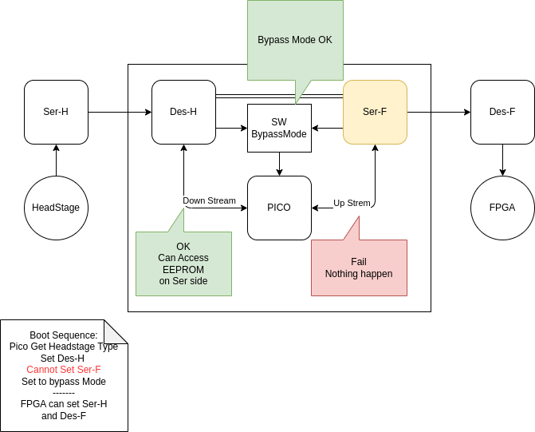
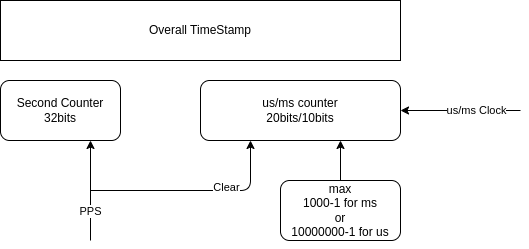

# 2025-12

## 2025-12-03

### Good EVB Design

### 時之輪6 混沌之王 下

2025-133

---

### 時之輪6 混沌之王 中

2025-132

---

### 時之輪6 混沌之王 上

2025-131

---

### Repeater 

[GMSL2 Repeater](https://ms-technology.vn/case-study/gmsl2-repeater-en/)

## 2025-12-02

### Proto-Thread Examples

### AD623 as 1000x single power instrument Amp

---

## 2025-12-01

### Fix15

### PPS Counter

### CopyParty : File Server for All

[CopyParty Github](https://github.com/9001/copyparty)

---

### Copy-Paste Circuits for KiCad

[https://www.circuitsnips.com/](https://www.circuitsnips.com/)
