# 2025-12

## 2025-12-26

### QDMA

[Multi-Channel PCIe QDMA Subsystem](https://www.cnblogs.com/zhang-fpgachipip/p/15487770.html)

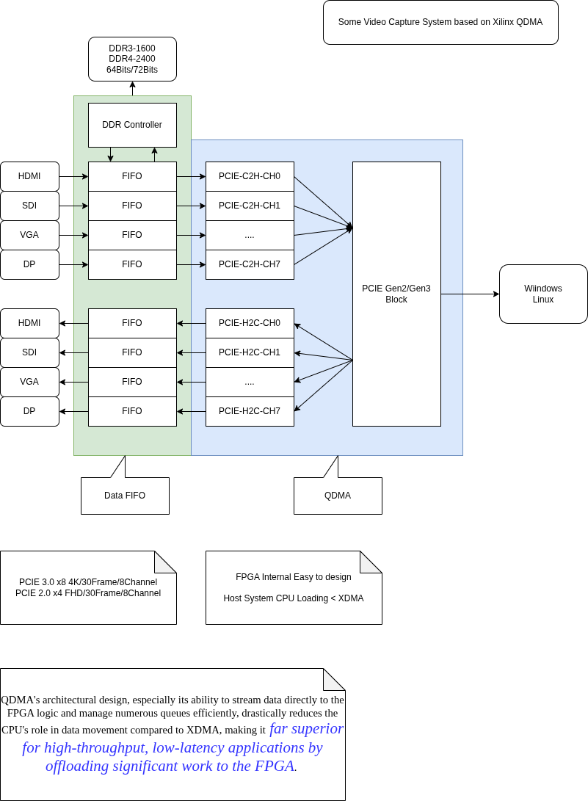

[Understanding the basics of AMD Queue-based Direct Memory Access (QDMA) Subsystem for PCI Express](https://www.youtube.com/watch?v=PD-_na0OUm0)

[QDMA PG302](https://docs.amd.com/r/en-US/pg302-qdma)

---

### Lattice Semi MachXO4 FPGA family

[Lattice Semi MachXO4 FPGA family](https://www.cnx-software.com/2025/12/24/lattice-semi-machxo4-fpga-family-offers-up-to-9400-luts-448-kb-user-flash-improved-hot-socketing/)

    FPGA Fabric
    896 to 9400 LUTs
    1,100 to 11,300 logic cells
    Up to 150 MHz operation
    -------------------------------------
    Memory
    Embedded RAM – 64 kb to 432 kb
    Distributed RAM – 10 kb to 73 kb
    Storage – 64 to 448 kb User Flash Memory (UFM)
    -------------------------------------
    I/O and peripherals
    Up to 382 I/O pins
    1x Phased Lock Loop (PLL)
    Hardened functions: SPI, 2x I2C, timer/counter, and oscillator
    Supports 3.3V – 1.0V I/O standards

### 時之輪14 光明回憶 下

    最後兩本讀的比較詳細 一本約7-8小時
    其他的 一本約4-5小時
    因此共約 150小時
    感覺跟玩第一輪 薩爾達曠野之息 差不多
    剛剛開始時 完全不知道這是個什麽世界
    等到最後 沈浸在裡面了 已經要結束了
    不過 總是可以再讀一次 這次就能夠慢慢讀了

---

### 時之輪14 光明回憶 上

---

### 時之輪13 闇夜之塔 下

---

### 時之輪13 闇夜之塔 上

---

## 2025-12-24

### Decibel Calculator

[Decibel Calculator](https://www.noisemeters.com/apps/db-calculator/?srsltid=AfmBOoo37HgJpjjIyPE5mgYMyRJHt-k4YPWSeTnhKF9uZsHnvmeaGXDN)

### Scope use FT2232H + FPGA

[Scope use FT2232H + FPGA](https://github.com/fromconcepttocircuit/usb2-fpga-ft2232h)

### PICO with TinyGo

[tinygo_picocalc](https://github.com/mattwach/tinygo_picocalc)

[rpngo_picocala](https://github.com/mattwach/rpngo)

[tinygo_pico_pio](https://github.com/tinygo-org/pio)

[tinygo_pico yt](https://www.youtube.com/playlist?list=PLITRMvsGGkUQwE4r_5RhggH0R6Vmkh4UC)

---

## 2025-12-23

### Voltage Drop Calculator

[Voltage Drop Calculator](https://www.calculator.net/voltage-drop-calculator.html)

---

## 2025-12-22

### 人尋求解釋 人ㄧ生有很多問題

We have million dollar question. Not million dollar answer.

### Xilinx DMA Driver

[Xilinx DMA Driver](https://github.com/Xilinx/dma_ip_drivers)

---

### 時之輪12 末日風暴 下

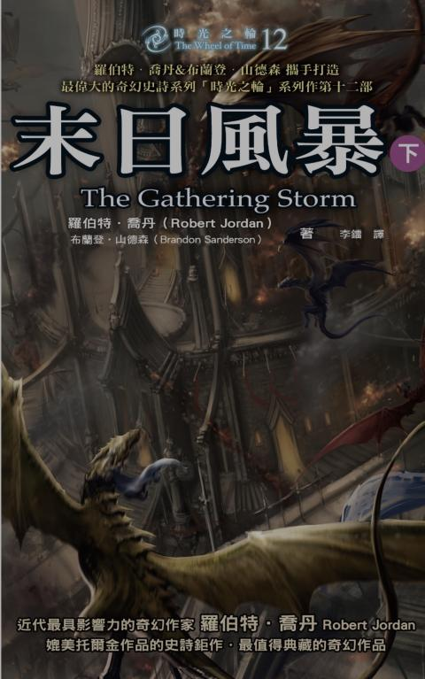

---

### 時之輪12 末日風暴 上

---

### 時之輪11 迷夢之刃 下

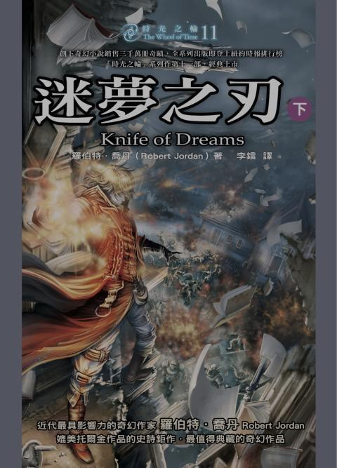

---

### 時之輪11 迷夢之刃 上

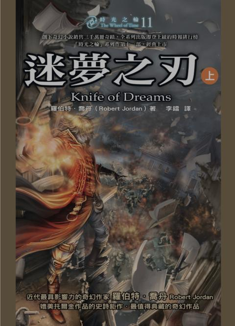

---

## 2025-12-18

### RJ45 has No Ground without Transformer Coupling

### Manchester Encode Decode

[Manchester Encode Decode](https://github.com/MarkDing/Manchester-BMC)

[Manchester PICO](https://github.com/raspberrypi/pico-examples/blob/master/pio/manchester_encoding/manchester_encoding.c)

### 聖誕節麵包販賣

    國賓 史多倫
    老爺 潘那朵尼
    新光三越 國王派

### markdown editor

[zettlr](https://www.zettlr.com/)

### mdBook

mdBook is a command line tool to create books with Markdown. It is ideal for creating product or API documentation, tutorials, course materials or anything that requires a clean, easily navigable and customizable presentation.

[mdBook doc](https://rust-lang.github.io/mdBook/)

[awesome-mdbook](https://github.com/softprops/awesome-mdbook)

### Verilog Tutorial

[Verilog Tutorial](https://www.asic-world.com/verilog/index.html)

[Verilog Source Code](https://yamin.cis.k.hosei.ac.jp/)

---

## 2025-12-17

### Rats Play Doom

[Rats Play Doom](https://ratsplaydoom.com/)

### Mistakes People Make When Designing Prototype PCBs

3. Designing for Production:
• Design the first PCB expecting it to fail, focusing on functionality testing.
• Size and shape considerations can come later; prioritize testing various features.

4. No Test Points:
• Lack of test points hinders debugging and fixing mistakes.
• Test pads for common functionalities reduce the risk of blocking progress.

5. No Power or Diagnostic LEDs:
• Diagnostic lights for voltage levels and operations save time in identifying simple mistakes.

6. Overcrowding Components:
• Avoid packing components tightly during prototyping; leave space for adjustments.
• Keep passives relatively large for easier removal during testing.

7. Underutilizing Silk Screen:
• Clearly label components on the silk screen for easy assembly and orientation.
• Ensure markings are readable on the smallest boards.

8. Not Using Isolation Jumpers:
• Incorporate zero-ohm resistors or cutable jumpers for easy isolation during testing.
• Facilitates methodical bring-ups and simplifies troubleshooting.

9. Not Breaking Out Unused GPIOs:
• Break out additional GPIOs for testing and fixing mistakes without ordering a new PCB.
• Adds flexibility for rewiring components or integrating external modules.

10. UART Mixups:
• Ensure correct pairing of transmit and receive pins in UART components.
• Use jumpers or specific designs to easily correct mistakes.

11. Locking Into I2C Addresses:
• Provide options to change I2C addresses using resistors for flexibility.
• Prevents the need for a new PCB revision due to address conflicts.

12. Separate Power PCB:
• Consider splitting the design into multiple boards, especially separating power.
• Enables testing power solutions independently without scrapping the entire PCB.

13. Choosing Labeled Surface Mount Resistors:
• Opt for labeled surface mount resistors for easier visual inspection and testing.

14. Verify Footprints:
• Check dimensions on the data sheet against PCB footprints in your design software.
• Prevents ordering the wrong footprint for components.

15. Check Parts Availability:
• Consider part availability before designing the circuit.
• Speculatively order critical parts before PCB production to mitigate shortages.

### Bender

[Bender](https://github.com/pulp-platform/bender)

Bender is a dependency management tool for hardware design projects. It provides a way to define dependencies among IPs, execute unit tests, and verify that the source files are valid input for various simulation and synthesis tools.

### CV32E40P is a 4-stage in-order 32-bit RISC-V processor core

[CV32E40P is a 4-stage in-order 32-bit RISC-V processor core](https://docs.openhwgroup.org/projects/cv32e40p-user-manual/en/latest/intro.html)

### Open Bus Interface (OBI) protocol

[Open Bus Interface (OBI) protocol](https://medium.com/@aiclab.official/open-bus-interface-obi-protocol-2ece699442c4)

[OBI Tutorial](https://github.com/aiclab-official/obi-tutorial)

### Tutorial on Hyperdimensional Computing

[Tutorial on Hyperdimensional Computing](https://michielstock.github.io/posts/2022/2022-10-04-HDVtutorial/)

[Hyperdimensional computing: A fast, robust, and interpretable paradigm for biological data](../papers/2025/journal.pcbi.1012426.pdf)

### Single Wire Network PJON/PJDL

[PJON](https://github.com/gioblu/PJON)

PJON (Padded Jittering Operative Network) is an experimental, multi-master, software-defined network protocol that can be easily cross-compiled for many microcontrollers and real-time operating systems such as ATtiny, ATmega, SAMD, ESP8266, ESP32, STM32, Teensy, Raspberry Pi, Zephyr, Linux, Windows x86, Apple, and Android. PJON operates over a wide range of media, data links, and existing protocols like PJDL, PJDLR, PJDLS, Serial, RS485, USB, ASK/FSK, LoRa, UDP, TCP, MQTT, and ESPNOW. For more information, visit the documentation, the specification, or the wiki.

[PJON_HW Verilog](https://github.com/piussieber/PJON_HW)

This is a hardware implementation of the PJDL data link. PJDL is a single-wire data link protocol and belongs to the PJON network protocol. This hardware module was writen as part of my bachelors project at ETH.

### Python KiCad Scripting

[kicad skip: S-expression kicad file python parser](https://github.com/psychogenic/kicad-skip)

---

## 2025-12-16

### HDMI Specification

### FPGA Developer Jeff Johnson

[FPGA Developer Jeff Johnson](https://www.fpgadeveloper.com/)

### Corundum FPGA-based NIC

[Corundum](https://github.com/corundum/corundum)

Corundum is an open-source, high-performance FPGA-based NIC and platform for in-network compute. Features include a high performance datapath, 10G/25G/100G Ethernet, PCI express gen 3, a custom, high performance, tightly-integrated PCIe DMA engine, many (1000+) transmit, receive, completion, and event queues, scatter/gather DMA, MSI, multiple interfaces, multiple ports per interface, per-port transmit scheduling including high precision TDMA, flow hashing, RSS, checksum offloading, and native IEEE 1588 PTP timestamping. A Linux driver is included that integrates with the Linux networking stack. Development and debugging is facilitated by an extensive simulation framework that covers the entire system from a simulation model of the driver and PCI express interface on one side to the Ethernet interfaces on the other side.

### An Overview of a 10Gb Ethernet Switch

[An Overview of a 10Gb Ethernet Switch](https://zipcpu.com/blog/2023/11/25/eth10g.html)

### 10G Ethernet Mac to Phy Interface

### Verilog Signal Naming Guide

|Type of Signal     |Suffix	Prefix (optional)  |  Example           |
|-------------------|:------------------------:|-------------------:|
|Clock signals      | clk or _ck               | sys_clk, clk       |
|Reset signals      | _rst or _reset           | cpu_reset, rst     |
|Active-low signals | _n or _x                 | reset_n, enable_x  |
|Enable signals     | _en                      | write_en           |
|Input ports        | _i or _in i_ or in_      | data_in, i_valid   |
|Output ports       | _o or _out o_ or out_    | data_out, o_ready  |
|Registered signals | _reg o _r                | count_reg, state_r |
|Next state signals | n_                       | n_state            | 

### Rotation Encoder

### WCH-Link , Single Wire Debug

---

## 2025-12-15

### 時之輪10 光影歧路 下

2025-139

---

### 時之輪10 光影歧路 上

2025-138

---

### 時之輪9 寒冬之心 下

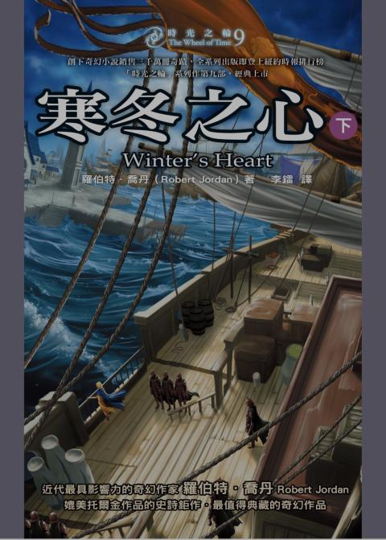

2025-139

---

### 時之輪9 寒冬之心 上

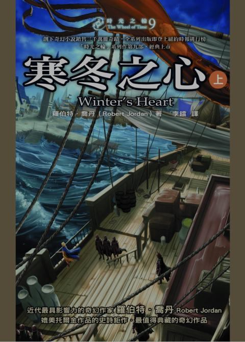

2025-138

---

### FT2232 Serial Tools Tigard

### Keyboard Scan I2C Chip TCA8418

---

## 2025-12-12

## AI Tech

ANN
Spike NN
HDC/VSA
Symbolic-NN

## HDC VSA Notes

[Hyperdimensional Computing with Applications. March 20th, 2023. 20:00GMT](https://www.youtube.com/watch?v=a_1jJUhE8nE)

[Bridging neural and symbolic representation for simultaneous localization and mapping. June 20, 2022.](https://www.youtube.com/watch?v=dvQpVQKzLRc)

## Intan -> PICO -> USB

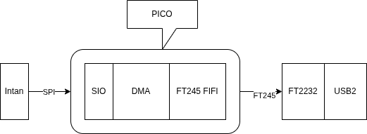

## FT245 Pin (FTDI Synchronous 245 Tutorial)

    output reg  [7:0] data,           // [7:0] = pins 1,2,3,4,9,10,11,12
    input  wire rx_empty,             // pin 13
    input  wire tx_full,              // pin 14
    output reg  read_n,               // pin 19
    output reg  write_n,              // pin 20
    output reg  send_immediately_n,   // pin 21
    input  wire clock_60mhz,          // pin 27
    output reg  output_enable_n,      // pin 28

[FTDI Synchronous 245 Tutorial](http://www.farrellf.com/projects/software/2020-04-18_FTDI_Sync_245_FIFO_Tutorial__D2XX_with_Visual_Studio_2019/)

## Pico to become a JTAG cable

This code allows the Pico to become a JTAG cable. It uses the PIO unit to produce and capture the JTAG signals.

[PICO-DIRTYJTAG](https://github.com/phdussud/pico-dirtyJtag)

## PICO(USB1) PIO to FT2232 to PC (USB2)

[pi pico <-> ft232h](https://github.com/sidd-kishan/IndiraSetu)

---

## 2025-12-11

### PythoC

[PythoC](https://github.com/1flei/PythoC)

PythoC is a Python DSL compiler that compiles statically-typed Python to LLVM IR, providing C-equivalent runtime capabilities with Python syntax and compile-time metaprogramming.

### Raspberry Pi Pico frequency divider with External Sync

[Raspberry Pi Pico frequency divider](https://github.com/dorsic/PicoDIV)

### iCE40 UltraPlus FPGA examples on the Breakout Board

[ICE40 UP50K](https://github.com/damdoy/ice40_ultraplus_examples)

### Tiny Linux Core for X86

[TinyCore](http://tinycorelinux.net/downloads.html)

---

## 2025-12-10

### Using RP2040 PIO to drive a poorly-designed display

[Using RP2040 PIO to drive a poorly-designed display](https://dmitry.gr/?r=06.%20Thoughts&proj=09.ComplexPioMachines)

### 時之輪8 匕之道 下

2025-137

---

### 時之輪8 匕之道 上

2025-136

---

### 時之輪7 劍之王冠 下

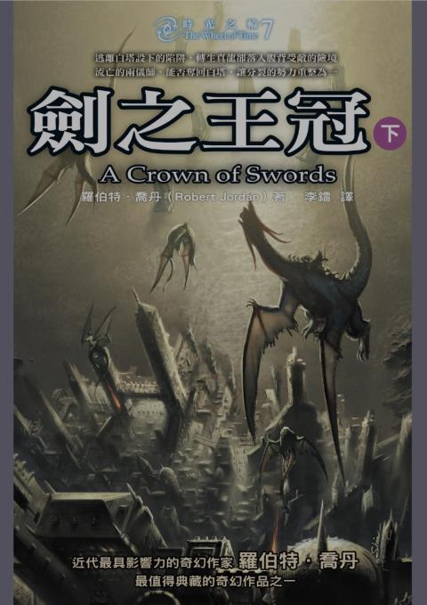

2025-135

---

### 時之輪7 劍之王冠 上

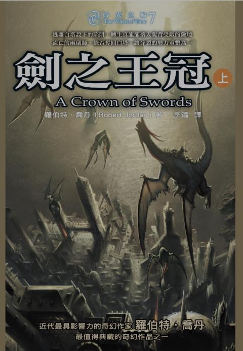

2025-134

---

## 2025-12-09

### Use DPLL to Lock Digital Oscillator to 1PPS Signal

[Use DPLL to Lock Digital Oscillator to 1PPS Signal](https://www.fpgarelated.com/showarticle/991.php)

Ahsan:

The nature of the DPLL produces the nearest match to the configured operating frequency, while simultaneously locking to an external high precision signal such as the 1PPS signal output from an embedded GPS receiver. As you approach the Nyquist frequency of your oscillator (25MHz in your case), the NCO will produce the desired frequency (10MHz in your case) with greater variations in the duty cycle.

In this application, the oscillator (50MHz in your case) is not being adjusted in any way. Its frequency relative to the external reference is being measured, but its actual frequency / phase is not being physically changed. Therefore, the circuit will always produce an output with some period errors. On average, the period and frequency of the "programmed" output frequency of the circuit will be the desired value and in phase relative to the external reference signal, i.e., 1PPS from GPS.

The purpose of the circuit was measure the frequency of the oscillator, relative to the external input, by adjusting the frequency control word of the NCO / DDS. In this manner, if the external input signal is lost, the DPLL circuit can maintain time with a drift characteristic that is much improved from the basic drift characteristic of the reference oscillator. In this way, low cost standard crystal oscillators with frequency accuracies of +/-50ppm to +/-150ppm could be used to maintain time for several minutes / hours to GPS-like accuracy without a GPS 1PPS input.

If you require a 10MHz time stamp frequency with less period jitter, I would suggest that you need to increase the frequency of your base oscillator, i.e., increase the frequency of your 50MHz oscillator. The issue you will have, especially if you implement the DPLL in an FPGA as I did, is that the higher operating frequency of your reference oscillator will require greater performance from the NCO / DDS component.

There's always a trade off between simplicity and accuracy. If you absolutely need accuracy, then there's no escaping the need to form a true PLL using a temperature-stabilized, voltage-controlled,  adjustable crystal oscillator. Unfortunately, in the application for which I developed the 1PPS DPLL described in this article, that complexity was not an option since the design was already complete before the requirement to coast through a GPS signal fade was levied on the design.

### CH32V003 Test

[CH32V003](https://community.element14.com/technologies/embedded/b/blog/posts/low-cost-microcontrollers-using-a-ch32v003-risc-v-device)

### Sinify 中國化

### MIL-STD-1553 Manchaster Code Bus

[MIL-STD-1553](https://en.wikipedia.org/wiki/MIL-STD-1553)

---

## 2025-12-08

### Nanomsg ZeroMQ's Succesor

nanomsg is a socket library that provides several common communication patterns. It aims to make the networking layer fast, scalable, and easy to use. Implemented in C, it works on a wide range of operating systems with no further dependencies.

[nanomsg](https://nanomsg.org/)

### NP Commutator

[Motor Assisted Commutator to Harness Electronics in Tethered Experiments](https://pmc.ncbi.nlm.nih.gov/articles/PMC12052304/)

The cable, PXI base-station card, and software are identical to that used for NP 1.0 (67), but described briefly here for completeness. The cable has two twisted strands (each with 0.41 mm diameter), is 5 m long, weighs 5 g, and terminates in a USB-C connector.
(from NP paper)

As advancements in electrophysiology and optical technologies support a higher number of recording channels and more intricate miniaturized optical components, there is an increasing demand for motor-assisted commutators to effectively manage the thicker coaxial and specialized wire cables required for enhanced data transfer (Sattler and Wehr, 2021; van Daal et al., 2021). For example, the coaxial tether used between the Miniscope (v4) and the Miniscope DAQ (v3.3) has an outer diameter of either 0.38 mm (equivalent to ∼27 AWG) or 1.14 mm (equivalent to ∼17 AWG). The Neuropixels (1.0/2.0) interface cable consists of two 26 AWG wires twisted together, resulting in an effective diameter close to 0.578 mm, which approximates a 23 AWG wire. The tether used in this paper is composed of five 30 AWG wires braided into a single cord, resulting in an effective diameter of ∼0.548 mm, also equivalent to 23 AWG. The effective thickness of the tether used in this study is comparable with that of the Neuropixels interface cable, while being slightly thicker than the Miniscope's smaller coaxial tether. The second tether, the optical fiber compatible with optogenetics experiments, has a diameter of 0.105 mm or ∼38 AWG. Behavioral experiments in the open field arena and home cage which used both tethers wrapped around one another had a larger effective thickness. MACHETE's active mechanism, namely, the brushless motor and motor driver, is potentially equipped to handle thicker coaxial and specialized wire cables, reducing the mechanical strain during freely moving experiments.

### Cypress USB3.2 20G FX20

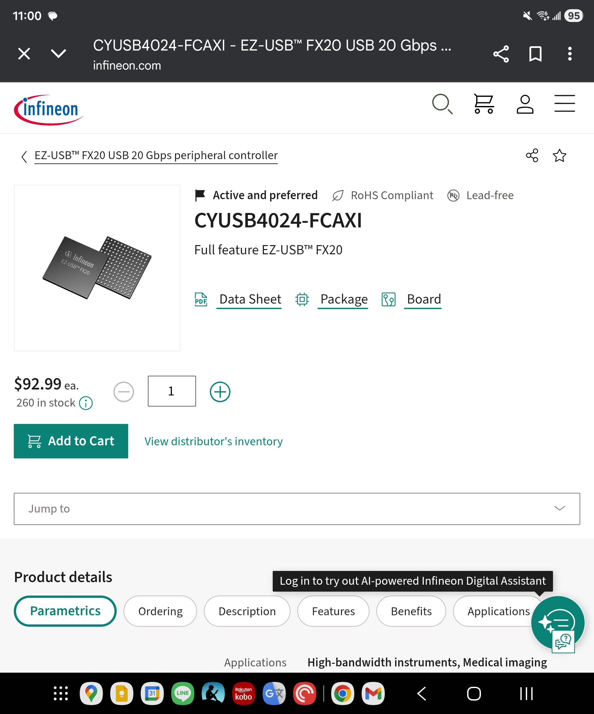

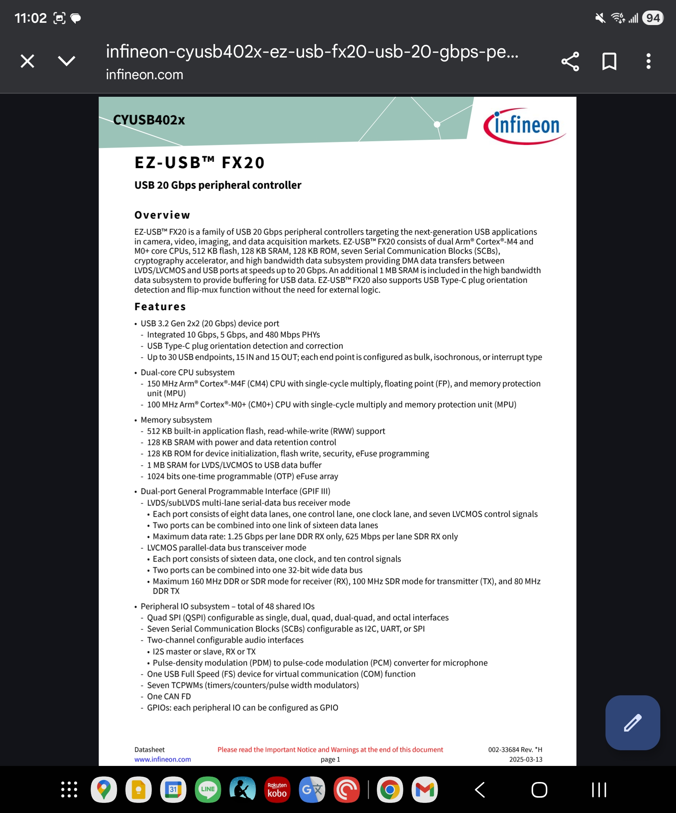

### USB 2.0 Hub Chip

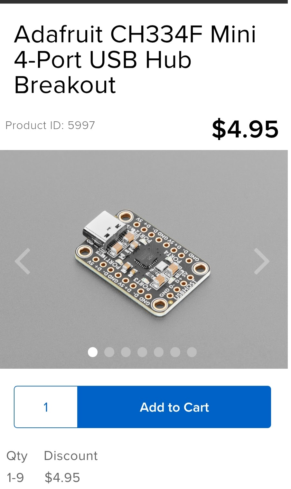

---

## 2025-12-05

### PoC Extender

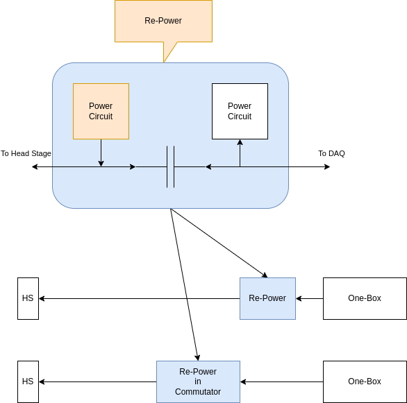

### ReDriver

[ReDriver and Retiming](https://www.diodes.com/tw/products/connectivity-and-timing/redrivers-repeaters#)

### PoE Extender

[Poe Extander](https://www.omnitron-systems.com/blog/what-is-a-poe-extender)

---

## 2025-12-04

### Software Sync Paper TICSync

[TICSync: Knowing When Things Happened](../papers/2025/harrison2011.pdf)

### Time Card

[Time-Card](https://github.com/Time-Appliances-Project/Time-Card)

### ESP32 Wifi FTM as PTP

[ESP32 S3: sub-microsecond time sync and disciplined timers](https://www.reddit.com/r/embedded/comments/1pbp0az/esp32_s3_submicrosecond_time_sync_and_disciplined/)

---

### 五玉牒

五個碟子 三藍兩綠 三個人頭上個一個 猜自己頭上的碟子

---

## 2025-12-03

### Good EVB Design

All IO are expanded with Jumper.

### 時之輪6 混沌之王 下

2025-133

---

### 時之輪6 混沌之王 中

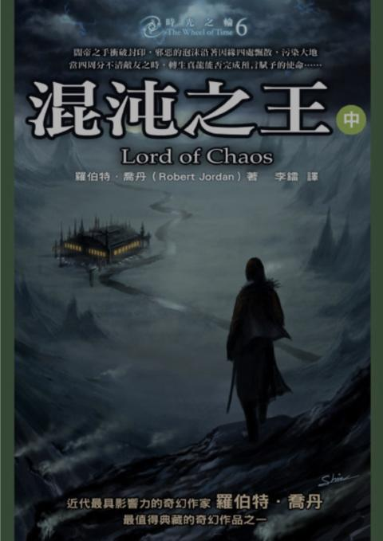

2025-132

---

### 時之輪6 混沌之王 上

2025-131

---

### Repeater 

[GMSL2 Repeater](https://ms-technology.vn/case-study/gmsl2-repeater-en/)

## 2025-12-02

### Proto-Thread Examples

[Protothread on Pico](https://people.ece.cornell.edu/land/courses/ece4760/RP2040/C_SDK_protothreads/index_Protothreads.html)

### AD623 as 1000x single power instrument Amp

---

## 2025-12-01

### Fix15

### PPS Counter

### CopyParty : File Server for All

[CopyParty Github](https://github.com/9001/copyparty)

---

### Copy-Paste Circuits for KiCad

[https://www.circuitsnips.com/](https://www.circuitsnips.com/)
