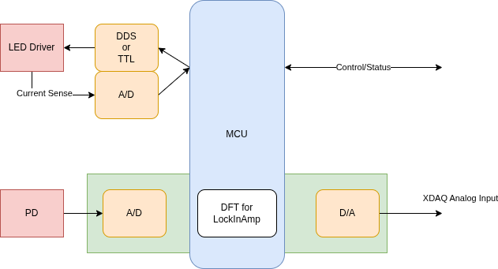
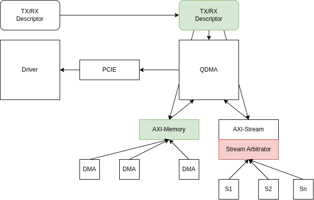
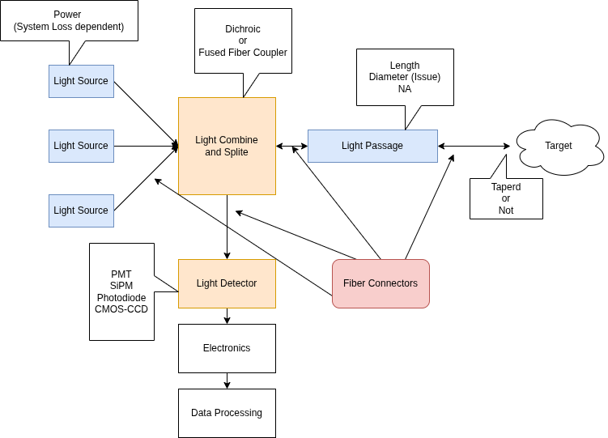
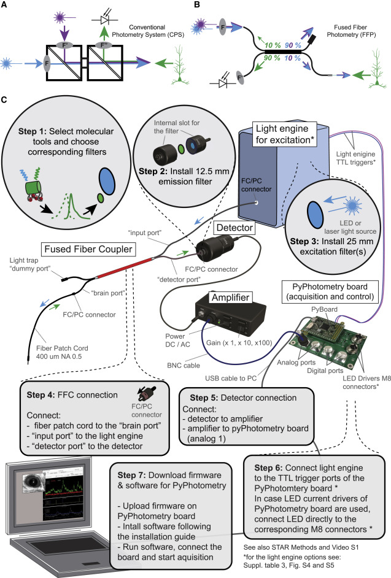
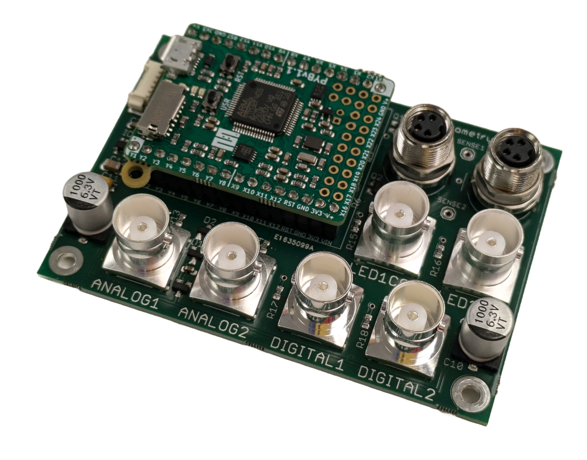

# 2026-01

## 2026-01-28 🌐 🎬 💾 📚 📑

### Petalinux Demo

🎬[Xilinx Zynq & PetaLinux Project Demo](https://www.youtube.com/watch?v=U2QBNz2XzYs)

🎬[PetaLinux SPI Device Control LCD Panel](https://www.youtube.com/watch?v=yMJrtXS_5iU)

🎬[Creating Multi-Boot Bitstream In Xilinx FPGA](https://www.youtube.com/watch?v=nacLtYDEbRk)

🎬[Xilinx HLS Project Demo - SHA256 Calculation](https://www.youtube.com/watch?v=pir2bskQwBA)

---

### HLS Tutorial

🎬[HLS Tutorial Video](https://www.youtube.com/watch?v=dCBUIcTM3l0)

💾[HLS Tutorial Code](https://github.com/ATaylorCEngFIET/Vitis_Hero)

---

### Low Latency C++

- cache line aware
- data pre allocation
- self allocation

- lock free queue
- no irq
- no time tick irq
- fix core

- dma io smart nic
- memory map to io (file)

---

## 2026-01-27 🌐 🎬 💾 📚 📑

### Time to Digital Converter 

🌐[TI TDC7200](https://www.mouser.tw/new/texas-instruments/ti-tdc7200-tdc/)

---

### DFX over PCIE Bad news for Kintex-UltraScale+ U3 U5 Chip

- XDMA support DFX over PCIE
- QDAM do not

---

- U11 以上 QDMA Support DFX

---

### Hello FPGA Smart Zynq

🌐[Smart Zynq SP](http://www.hellofpga.com/index.php/2023/04/27/smart-zynq-sp/)

📚[Smart Zynq How To (Local)](../subtitles/smartzynq.md)

---

### FPGA Developer

🌐[FPGA Developer](https://fpgadeveloper.com)

---

### Ukrain is different from Taiwan in Geo and Wether

🎬[Taiwan Is a NIGHTMARE for Drones - My Experience](https://www.youtube.com/watch?v=6sMWyFb_UrI)

---

## 2026-01-26 🌐 🎬 💾 📚 📑

### Low Latency C++ for HFT 

🌐[low-latency-cpp-for-hft](https://stacygaudreau.com/blog/cpp/low-latency-cpp-for-hft-part1/)

---

### Key Approaches for "Interrupt-Free" Linux Behavior:

Key Approaches for "Interrupt-Free" Linux Behavior:

CPU Isolation (isolcpus & IRQ Affinity): Using kernel boot parameters, you can isolate specific CPU cores (isolcpus=) and configure IRQ affinity to force external hardware interrupts to be handled by non-isolated cores.

NOHZ_FULL (Tickless Mode): Enabling nohz_full in the kernel allows a core to stop the periodic timer tick when only one runnable task is present, reducing—but not eliminating—timer interruptions.
Asymmetric Multiprocessing (AMP): Running Linux on one core (e.g., CPU0) and a bare-metal application on another (e.g., CPU1). In this setup, CPU1 can run completely without interrupts, while CPU0 handles OS tasks.

Polling (Userspace): Instead of relying on interrupts for peripheral input (e.g., GPIO), specialized user-space applications can poll registers continuously to achieve faster, deterministic, though CPU-intensive, response

Gogole: embedded linux cpu without interrupt

Google: CPU Isolation (isolcpus & IRQ Affinity)

🌐[A full task-isolation mode for the kernel](https://lwn.net/Articles/816298/)

---

### Perfecting PetaLinux Workshop

💾[Perfecting PetaLinux Workshop](https://github.com/ATaylorCEngFIET/perfecting_petalinux)

🎬[Perfecting PetaLinux Workshop](https://www.youtube.com/watch?v=Tloz2tJsJow)

📚[PetaLinux Tools Documentation: Reference Guide (UG1144)](https://docs.amd.com/r/en-US/ug1144-petalinux-tools-reference-guide)

---

### L_Sort

💾[L_Sort for NeuroPixel](https://github.com/LucasHanCEF/l_sort)

📑[L-Sort_On-Chip_Spike_Sorting_With_Efficient_Median-of-Median_Detection_and_Localization-Based_Clustering](../papers/2026/L-Sort_On-Chip_Spike_Sorting_With_Efficient_Median-of-Median_Detection_and_Localization-Based_Clustering.pdf)

---

### Vivado Vitis Petalinux 2024 on Ubuntu 2024

🌐[Vivado Vitis Petalinux 2024.2](https://www.hackster.io/whitney-knitter/vivado-vitis-petalinux-2024-2-install-on-ubuntu-59f3c3)

🌐[Hardware acceleration in FPGA with Vivado and Vitis](https://www.hackster.io/juan-abelaira/hardware-acceleration-in-fpga-with-vivado-and-vitis-1d0043)

🌐[Vivado 2024 on Ubuntu 2024](https://dspdev.io/en/posts/vivado-2024-ubuntu/)

---

### EDA Tools from Europ

Many prominent open source EDA projects such as Coriolis, Edalize, FuseSoC, GHDL, Klayout, Litex, NextPNR, Renode and Yosys are created and developed primarily by Europeans

---

### ossia score

🌐[ossia score](https://ossia.io/)

A free, open-source, cross-platform intermedia sequencer for precise and flexible scripting of interactive scenarios.
Control and score any OSC-compliant software or hardware: Max/MSP, PureData, openFrameworks, Processing…

---

## 2026-01-23 🌐 🎬 💾 📚 📑

### Zynq PetaLinux and Vitis

🌐[Zynq PetaLinux 2024-1](https://www.hackster.io/whitney-knitter/fixed-platform-design-on-zynq-7000-in-petalinux-2024-1-ae3f6d)

🌐[Fixed Platform Design on Zynq-7000 in Vitis 2024.1](https://www.hackster.io/whitney-knitter/fixed-platform-design-on-zynq-7000-in-vitis-2024-1-5ac3a1)

---

### Synaptic Self

2026-005

---

### Performance Evaluation of FPGA, GPU, and CPU in FIR Filter Implementation for Semiconductor-Based Systems

📑[Performance Evaluation of FPGA, GPU, and CPU in FIR Filter Implementation for Semiconductor-Based Systems](../papers/2026/Performance%20Evaluation%20of%20FPGA,%20GPU,%20and%20CPU%20in%20FIR%20Filter%20Implementation%20for%20Semiconductor-Based%20Systems.pdf)

Compare device are around 2014.

---

### GPU-Accelerated Audio DSP with PyTorch 

💾[TorchFX](https://github.com/matteospanio/torchfx)

TorchFX is a modern Python library for high-performance digital signal processing in audio, leveraging PyTorch and GPU acceleration. Built for researchers, engineers, and developers who need fast, flexible, and differentiable audio processing.

---

💾[AptivGPUAudio](https://github.com/GPUAudioTeam/AptivGPUAudio)

Aptiv GPU Audio is a project implementing three model examples of audio processing VST3 plugins using GPU platform.

---

### Emotion is encode with our memory

### Sarah Paine: Greenland, NATO and the Risk of Nuclear War [INTERVIEW]

🎬[Sarah Paine: Greenland, NATO and the Risk of Nuclear War [INTERVIEW]](https://www.youtube.com/watch?v=yErY3J2hgKs)

### I like her. She is wise.

---

## 2026-01-22 🌐 🎬 💾 📚 📑

### STM32G4 has over 4 channel DAC

---

### PWM to DC

---

## 2026-01-21 🌐 🎬 💾 📚 📑

### AD9833 PCB

💾[AD9833-Library-Arduino](https://github.com/Billwilliams1952/AD9833-Library-Arduino)

---

### 川普為何需要格林藍

- 打擊 Build a World Wide Cover Missle Launch Base

- 防禦 Build a Radar to watch the Missle from China and Russia

但是無論美洲國如何做 都無法改變 第三次世界大戰的全面毀滅性 中心可能是美洲
因為無論是什麽碗糕穹 都是無效的

---

## Make America Go Away

---

## 2026-01-20 🌐 🎬 💾 📚 📑

### Analog to Analog

### QDMA Concept

### ADC Sampling and FFT on Raspberry Pi Pico

🌐[FFT on Pico](https://www.hackster.io/AlexWulff/adc-sampling-and-fft-on-raspberry-pi-pico-f883dd)

💾[awulff-pico-playground](https://github.com/AlexFWulff/awulff-pico-playground)

---

### MCU APP Lab (Another Maker)

🌐💾[MCU APP Lab](https://mcuapplab.blogspot.com/)

---

### Hope is not a Strategy

---

### 美國實業家與圖書收藏家A·愛德華·牛頓曾於1921年這樣寫道[10]

「不論是否飽覽內容，單單是獲得書籍一事，就能使人狂喜，以至於買的書超過了自己的閱讀量——這無異於靈魂的無限延伸……即使沒讀過內容，我們對書籍還是會珍而重之，因為其存在本身就已散發出令人舒適的氣息，並保證我們隨時都能一探內文。」

---

### PCB Return Path

---

### DFX Hardware Interface

MCAP is for PCIE

---

### pyPhotometry on Doric Mini Cube

---

### MicroPython - Build firmware with LVGL and ulab

🎬[MicroPython - Build firmware with LVGL and ulab](https://www.youtube.com/watch?v=l59s6Pyy3fg)

---

## 2026-01-19 🌐 🎬 💾 📚 📑

### pMAT (Photometry Modular Analysis Tool)

💾[pMAT (Photometry Modular Analysis Tool)](https://github.com/djamesbarker/pMAT)

---

### pyPhotometry: Open source Python based hardware and software for fiber photometry data acquisition

📚[pyPhotometry](../papers/2026/pyPhotometry%20Open%20source%20Python%20based%20hardware%20and%20software%20for%20fiber%20photometry%20data%20acquisition.pdf)

📚[Fiber Photometry use pyPhotometry](../papers/2026/A%20flexible%20and%20versatile%20system%20for%20multi-color%20fiber%20photometry%20and%20optogenetic%20manipulation.pdf)

🌐[Doric Mini Cube](https://neuro.doriclenses.com/collections/fluorescence-mini-cubes/products/fmc4-gcamp?productoption%5BPort%20Configuration%5D=Built-in%20LED%20and%20DETECTOR&productoption%5BIsosbestic%20excitation%20wavelength%20(nm)%5D=405)

💾[pyPhotometry](https://github.com/pyPhotometry)

---

### TDT Fiber Photometry System

🌐[Fiber Photometry System](https://www.tdt.com/system/fiber-photometry-system/)

---

### EMCCD

🌐[EMCCD](https://hamamatsu.magnet.fsu.edu/articles/emccds.html)

---

### The Little Book of Stoicism

2026-004

---

### M5Stack Tab5 Demo

💾[M5Stack Tab5 Demo](https://github.com/m5stack/M5Tab5-UserDemo)

---

### Nokia

---

## 2026-01-16 🌐 🎬 💾 📚 📑

### Zynq SP from Hello FPGA

🌐[Smart Zynq SP](http://www.hellofpga.com/index.php/2023/04/27/smart-zynq-sp/)

---

### AMD Learning Center

🌐[AMD Learning Center](https://learning.amd.com/#center-panel:main-ui-training)

---

### BCI from Science Corp

🎬[The Age of Neural Engineering (ft. Science Corp.)](https://www.youtube.com/watch?v=zIJi6dXN6Zc)

🌐[science.xyz](https://science.xyz/)

🌐[science.xyz documents](https://science.xyz/docs)

---

### FT602 Examples

🌐[米联客(MSXBO)USB3.0 UVC摄像头基于FT602Q芯片方案](https://www.uisrc.com/portal.php?mod=view&aid=109&mobile=no)

---

### Learning-about-FPGA-DESIGN

🌐[Learning-about-FPGA-DESIGN](https://github.com/jogeshsingh/Learning-about-FPGA-DESIGN-)

---

### Xilinx DFX Tutorial and Resource

🌐 🎬[Xilinx DFX Tutorial](https://docs.amd.com/v/u/en-US/dh0017-vivado-partial-reconfiguration-hub?tab=dynamic-function-exchange-resources)

🎬[Partial Reconfiguration in Vivado on 7 Series](https://www.youtube.com/watch?v=mj4RMAmWiaw)

## 2026-01-15 🌐 🎬 💾 📚 📑

### QDMA

Linux QDMA Driver is a kernel mode driver and DPDK PMD is a User Space driver

Remote Direct Memory Access (RDMA) comes into play. RDMA allows direct data transfers between two computers’ memories without involving the CPU, operating system, or most network stack components.

 "These queues can be individually configured by interface type, and they function in many different modes", is this the major difference between using queues rather then using channels. As channel can only support 1 PF and can be interfaced with only one among these axi4-mm or axi4-stream and has no modes like in QDMA (internal or bypass mode).

### Xilinx DFX Tutorial

🌐 🎬[DFX Tutorial](https://www.amd.com/zh-tw/products/adaptive-socs-and-fpgas/technologies/dynamic-function-exchange.html)

### How to Fix USB Blaster

[How to Fix USB Blaster](https://www.downtowndougbrown.com/2024/06/fixing-a-knockoff-altera-usb-blaster-that-never-worked/)

---

## 2026-01-14 🌐 🎬 💾 📚 📑

### Low Latency Spike Detection

📚[Low Latency Spike Detection](../papers/2026/SNEO.pdf)

### FPGA DFX

📚[Dynamic Function eXchange Licensing (UG909)](https://docs.amd.com/r/en-US/ug909-vivado-partial-reconfiguration/Dynamic-Function-eXchange-Licensing)

🎬[Dynamic Function Exchange (DFX) (Partial Reconfiguration) with Zynq](https://www.youtube.com/playlist?list=PL9GWVTghqmkJKUHYGx-59WihvVO-d0y-f)

🎬[AMD Xilinx DFX（Dynamic Function eXchange）テクノロジーの適用事例」【OKI公式】](https://www.youtube.com/watch?v=RqtP4Xr61C8)

Usless.

🎬[Dynamic partial reconfiguration vivado tutorial 教程](https://www.youtube.com/watch?v=C08TnDytqnk)

Long but have all the steps.

🎬[FPGA102 - FPGA computing systems: Partial Dynamic Reconfiguration](https://www.youtube.com/playlist?list=PLmKUwJ0KJQnX68WlPOeMzIgpegBDK0gX_)

### FPGA Tandem

📚[UltraScale+ Devices Integrated Block for PCI Express Product Guide (PG213)](https://docs.amd.com/r/en-US/pg213-pcie4-ultrascale-plus/Tandem-PROM/PCIe-Resource-Restrictions)

### Fiber Photometry Data Pre Processing

### Tapered Fiber

### My Understanding of Fiber Photometry

---

### Fundamentals of Fiber Photometry: From Theory to Troubleshooting

🎬[Fundamentals of Fiber Photometry: From Theory to Troubleshooting](https://www.youtube.com/watch?v=3nKoT8jJjrw&t=1106s)

---

In this session, you’ll learn:

- The scientific basis and core principles of fiber photometry

- What fiber photometry can—and can’t—reliably measure

- How to select the right biosensors for your experimental goals

- Key design considerations, including controls and signal interpretation

- Common pitfalls and troubleshooting tips

Key Relationships:

- Length vs. Loss: More length means more scattering and absorption within the fiber, leading to exponentially reduced light intensity (e.g., a 0.2 dB/m fiber loses 0.2 dB per meter).

- Loss vs. Signal: Higher light loss means fewer photons reach the detector, resulting in a weaker fluorescence signal and potentially poor signal-to-noise ratio (ΔF/F).

- Fiber Type (NA/Diameter): Higher Numerical Aperture (NA) or larger core diameters (like 200µm) collect more light and have larger sampling volumes but can also introduce more background noise compared to smaller fibers (like 50µm). 

---

## 2026-01-13 🌐 🎬 💾 📚 📑

### BIO Software define IO (from Xous)

💾[Baochip 1x](https://github.com/baochip/baochip-1x)

---

### Fused Fiber Photometry

🌐[Fused Fiber Photometry](https://www.umm.uni-heidelberg.de/mctn/news/2023/fused-fiber-photometry/)

---

### pyPhotometry

💾[pyPhotometry](https://github.com/pyPhotometry)

Open source, Python based, fiber photometry data acquisition.

---

### PMT vs SiPM

---

### Wireless Fiber Photometry

🌐[Wireless Fiber Photometry](https://www.amuzainc.com/wireless-fiber-photometry/)

---

### Creative Thinking Field Guide

2026-003

---

## 2026-01-12 🌐 🎬 💾 📚 📑

### History is a Process

### SiPM

🌐[SiPM vs PMT](https://voices.uchicago.edu/ucflow/2021/11/22/sipm-vs-pmt-a-photon-finish/)

📚[Silicon Photomultiplier-based Low-light in vivo Fiber Photometry](../papers/2026/Silicon%20Photomultiplier-based%20Low-light%20in%20vivo%20Fiber%20Photometry.pdf)

📚[SiPM-based Fiber Photometry and EIS for Cortisol Detection](../papers/2026/SiPM-based%20Fiber%20Photometry%20and%20EIS%20for%20Cortisol%20Detection.pdf)

### Lock-in amplifiers

🌐[Lock-in amplifiers](https://www.zhinst.com/others/en/resources/principles-of-lock-in-detection)

🌐[AD630-1](https://physicsopenlab.org/2019/08/20/lock-in-amplifier/)

🌐[AD630-2](https://www.instructables.com/Lock-in-Amplifier/)

🌐[PSoC5LP](https://circuitcellar.com/research-design-hub/projects/a-lock-in-amplifier/)

🌐[Homodyne detection](https://en.wikipedia.org/wiki/Homodyne_detection)

---

### AD75019 16x16 Crosspoint Switch Array

- 256 Switches in a 16 x 16 Array
- Wide Signal Range: to Supply Rails of 24 V or ±12 V
- Low On-Resistance: 200 Ω Typ
- TTL/CMOS/Microprocessor-Compatible Control Lines
- Serial Input Simplifies Interface

🌐[AD75019](https://www.analog.com/en/products/ad75019.html)

---

### Japanese scientists just built human brain circuits in the lab

🌐[Japanese scientists just built human brain circuits in the lab](https://www.sciencedaily.com/releases/2026/01/260106224630.htm)

---

## 2026-01-09 🌐 🎬 💾 📚 📑

### RHD2216-recording-system

💾[RHD2216-recording-system](https://github.com/SeerLikeJazz/RHD2216-recording-system)

---

### WiFi Headstage

🌐[David Alexandre Roussel](https://biomicrosystems.ca/team/david-alexandre-roussel)

💾[WiFiHeadstage](https://github.com/davidaroussel/WiFiHeadstage)

WiFi Headstage
Currently working on the development of a WiFi headstage designed to study neural activity in awake monkey subjects. This innovative device is intended to replace the existing wired systems with a low-power, permanently installed headstage that captures single-neuron spike activity and provides closed-loop stimulation. The project aims to develop a comprehensive IoT system, integrating everything from the headstage that collects data to the server that stores it for advanced AI analysis. Future enhancements include adding EMG signal acquisition, which will further broaden the scope of research possibilities and applications. Ultimately, this project seeks to revolutionize the field of neural research by providing a more efficient, versatile, and less invasive means of data collection and analysis. Additionally, collaborating with CERVO on projects like the Smart Vivarium, which automates the study of behaviors in groups of mice, enhances the data processing for faster analysis and efficient storage in a database.

---

### Xous Operating System

🌐[Xous Operating System](https://xous.dev/)

---

### OV6948 World smallest CCD

---

### LAN866X 10BASE-T1S Endpoints for Smarter Remote Connectivity

---

## 2026-01-08 🌐 🎬 💾 📚 📑

### Amazon CTO Say in 5 Years (2030) RSA/DES will fail. Because of Quantum Computing

Well, I don't think so.

---

### 忽然知道 台灣有事 日本有事的意思了 原來台灣已經託管給日本了 美洲國要退出全球戰略了

---

## 2026-01-07 🌐 🎬 💾 📚 📑

### OSS CAD Suite

💾[OSS CAD Suite](https://github.com/YosysHQ/oss-cad-suite-build)

💾[Release Download](https://github.com/YosysHQ/oss-cad-suite-build/releases/)

OSS CAD Suite is a binary software distribution for a number of open source software used in digital logic design. You will find tools for RTL synthesis, formal hardware verification, place & route, FPGA programming, and testing with support for HDLs like Verilog, Migen, and Amaranth.

---

### God grant me the serenity to accept the thing

God grant me the serenity to accept the things I cannot change,
courage to change the things I can,
and wisdom to know the difference.

Reinhold Neibuhr

### Kluge The Haphazard Construction of the Human Mind

2026-002

---

### Power Control Chips from AD2

#### Digilent Analog Discovery 2 Schematics

🌐[Digilent Analog Discovery 2 Schematics](https://digilent.com/reference/test-and-measurement/analog-discovery-2/hardware-design-guide?srsltid=AfmBOopvdmBdjPj54B-BKPZd-laQ4OiJSQnNHrf0MrcLWDgZMCemvK6Q)

#### ADM1270

The ADM1270 is a current-limiting controller that provides inrush current limiting and overcurrent protection for modular or battery-powered systems. When circuit boards are inserted into a live backplane, discharged supply bypass capacitors draw large transient currents from the backplane power bus as they charge. These transient currents can cause permanent damage to connector pins, as well as dips on the backplane supply that can reset other boards in the system.

The ADM1270 is designed to control the inrush current, when powering on the system, via an external P-channel field effect transistor (FET).

To protect the system from a reverse polarity input supply, there is a provision made to control an additional external P-channel FET. This feature prevents reverse current flow in case of a reverse polarity connection, which can damage the load or the ADM1270. The ADM1270 is available in a 3 mm × 3 mm, 16-lead LFCSP and a 16-lead QSOP.

---

#### ADP197

Logic Controlled High-Side Power Switch 5V, 3A

---

#### ADM1177

The ADM1177 is an integrated hot swap controller that offers digital current and voltage monitoring via an on-chip, 12-bit analog-to-digital converter (ADC), communicated through an I2C interface.

An internal current sense amplifier senses voltage across the sense resistor in the power path via the VCC pin and the SENSE pin.

The ADM1177 limits the current through this resistor by control-ling the gate voltage of an external N-channel FET in the power path, via the GATE pin. The sense voltage (and, therefore, the inrush current) is kept below a preset maximum.

---

#### ADCMP671 voltage monitor

The ADCMP671 voltage monitor consists of two low power, high accuracy comparators and reference circuits. It operates on a supply voltage from 1.7 V to 5.5 V and draws only 8.55 μA maximum, making it suitable for low power system monitoring and portable applications. The part is designed to monitor and report supply undervoltage and overvoltage fault.

---

### The past is never dead, It's not even pass

---

### Can Language Models Replace Compilers?

🌐[Can Language Models Replace Compilers?](https://www.oreilly.com/radar/can-language-models-replace-compilers/)

---

## 2026-01-06 🌐 🎬 💾 📚 📑

### OpenNIC (QDMA)

💾[OpenNIC](https://github.com/Xilinx/open-nic)

💾[OpenNIC Shell is the Verilog Part](https://github.com/Xilinx/open-nic-shell)

A Good QDMA design Reference for now.

---

### QDMA

🌐[QDMA vs XDMA](https://blog.csdn.net/qq_28455081/article/details/142870963)

---

## 2026-01-05 🌐 🎬 💾 📚 📑

### Camera for Monochrome >=60fps Global Shulter

#### OV9281 1/4inch

💾[OV9281 on Pi4](https://github.com/raspberrypi/rpicam-apps/issues/470)

#### MT9V032 1/3inch (Obsolete)

#### MT9V022/24/34

#### Python480 1/3.5inch

---

### Memory

Your memory is a monster; you forget-it doesn't. It simply files things away. It keeps things for you, or hides things from you-and summons them to your recall with a will of its own. You think you have a memory; but it has you!

-JOHN IRVING

---

## 2026-01-02 🌐 🎬 💾 📚 📑

### QDMA

📚[EXTENSION AND IMPROVEMENT OF A PCIE-BASED FPGA ENVIRONMENT FOR TESTINGHPC ARCHITECTURES](../papers/2026/EXTENSION%20AND%20IMPROVEMENT%20OF%20A%20PCIE-BASED%20FPGA%20ENVIRONMENT%20FOR%20TESTINGHPC%20ARCHITECTURES.pdf)

QDMA is designed to move data between devices and memory by using a queue-based
approach, an idea derived from the RDMA concept queue set. The main mechanism to
perform transfers is through descriptors provided by the host OS. The data can be moved
in the H2C direction (write) and the C2H direction (read).

---

### QDMA

📚[In-Network Memory Access: Bridging SmartNIC and Host Memory](https://arxiv.org/html/2507.04001)

4.1.2QDMA
Queue based Direct Memory Access subsystem (QDMA) is a PCIe-based DMA engine that is optimized for high-bandwidth and high packet count data transfers. As discussed earlier, the mechanism of XDMA uses the descriptors (instructions) provided by the host operating system to transfer data in either direction to and from the device. The QDMA uses queues, derived from queue set concepts of RDMA[55]. The DMA descriptors used for transfers are loaded with the queues, which are assigned as resources to PCIe Physical Functions (PFs) and Virtual Functions (VFs) by the IP. The subsystem is used with an AMD-provided reference driver. It supports both AXI4 and AXI4-Lite interfaces.

The QDMA IP maps external memory into register-mapped space, allowing the FPGA to access memory as if it were a register array, using Base Address Registers (BARS). These BARS are a set of registers in the IP that hold addresses of memory regions that the QDMA IP needs to access. The QDMA IP uses the AXI memory-mapped interface AXI-MM to map the external memory or any instantiated memory, into a register-mapped space. The QDMA drivers on the host pick recognize these BARS from the design when it is correctly configured, allowing us to do DMA transactions over PCIe to access AXI-MM peripherals from the host system.

QDMA differs from XDMA primarily in its queue based architecture, which is designed to support higher packet counts and manage complex data flows more efficiently. While XDMA uses a traditional descriptor based approach to manage data transfers, QDMA implements a queue based system that allows dynamic handling of multiple data streams. This queue based system is derived from RDMA principles and enables QDMA to manage data transfers through dedicated queues, which can be assigned to both PFs and VFs. While XDMA’s simpler, descriptor based model is typically used for straightforward data transfers using Physical channels. In both IPs, the use of AXI4 and AXI4-Lite interfaces allows for compatibility with AXI peripherals.

---

### Learning is

    Copy, Mimic
    From Mistake
    From no where

### PCIE to 2.5G-Ethernet

    PCIE to USB3 to 2.5G Ethernet
    PCIE <-> VL805 <-> RTL8156

---

## 2026-01-01

### Happy New Year

