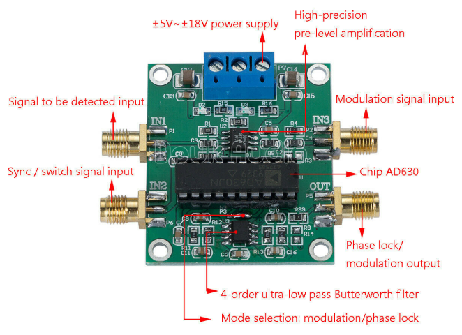
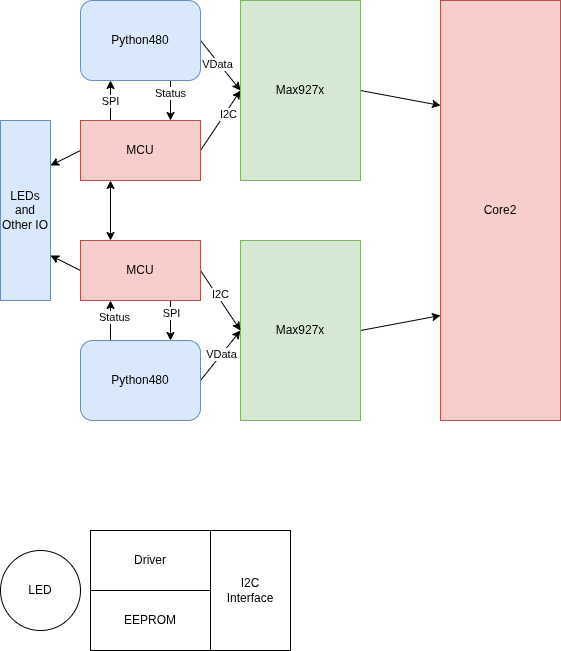
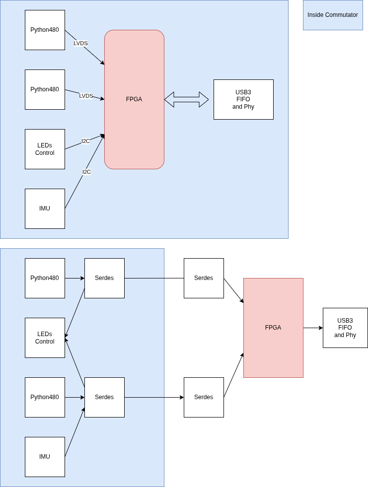
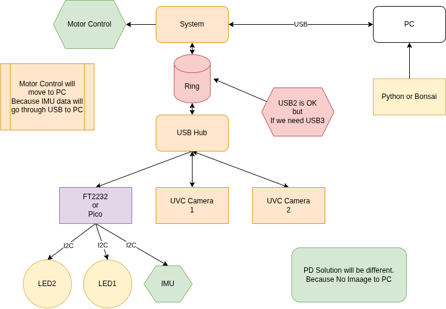

# 2026-02

## 2026-02-24 🌐 🎬 💾 📚 📑 🔬🦠

### Mental Models for Critical Thining


2026-012

---

### The Idea Factory


2026-011

沒有 Bell Lab 我大概在台東種田

---

## 2026-02-23 🌐 🎬 💾 📚 📑 🔬🦠

### How to Access ALVIUM 1800 U-050m Python480 USB 3 Camera

- Download Vimba X SDK

    [Vimba X SDK](https://www.alliedvision.com/en/support/software-downloads/vimba-x-sdk/vimba-x)

- Install TransporterLayer

    Extract the sdk and in cti folder run Install_GenTL_Path.sh use sudo

    Reboot

- Install Python Library vmbpy

    pip install vmbpy

### vmbpy sample code

Scan Camera

```py
import vmbpy

def main():
    with vmbpy.VmbSystem.get_instance() as vmb:
        cams = vmb.get_all_cameras()
        print('Cameras found: {}'.format(len(cams)))
        for cam in cams:
            print('Camera Name : {}'.format(cam.get_name()))
            print('Model Name  : {}'.format(cam.get_model()))
            print('Camera ID   : {}'.format(cam.get_id()))

if __name__ == '__main__':
    main()

```

Continus Capture

```py
import vmbpy
import cv2
import queue

frame_queue = queue.SimpleQueue()

def frame_handler(cam: vmbpy.Camera, stream: vmbpy.Stream, frame: vmbpy.Frame):
    if frame.get_status() == vmbpy.FrameStatus.Complete:
        frame_queue.put(frame.as_numpy_ndarray())
    cam.queue_frame(frame) # Re-queue for next frame

def main():
    CAMERA_ID = 'YOUR_CAMERA_ID'
    with vmbpy.VmbSystem.get_instance() as vmb:
        with vmb.get_camera_by_id(CAMERA_ID) as cam:
            cam.get_feature_by_name('AcquisitionMode').set('Continuous')
            cam.start_streaming(handler=frame_handler)
            while True:
                frame = frame_queue.get()
                cv2.imshow('Alvium Live Stream', frame)
                if cv2.waitKey(1) & 0xFF == ord('q'):
                    break
            cam.stop_streaming()
            cv2.destroyAllWindows()

if __name__ == '__main__':
    main()

```

---

### PicoCalc Update

🎬[PicoCalc Gets a BIG 2026 Update with LVGL, SSH Terminal, and more!](https://www.youtube.com/watch?v=kErRrKBkjew)

💾[PicoWare](https://github.com/jblanked/Picoware)

---

### 「成為美國的敵人或許很危險，但做美國的朋友卻是致命」（"It may be dangerous to be America's enemy, but to be America's friend is fatal"）據說是 季辛吉說的（有爭議）

---

### 確信是寬容的死敵 from Movie Convlave

🌐[Convlave](https://zh.wikipedia.org/zh-tw/%E6%95%99%E5%AE%97%E9%81%B8%E6%88%B0)

---

## 2026-02-13 🌐 🎬 💾 📚 📑 🔬🦠

### Chinese New Year Vacation from 02-14 to 02-23

### AXI-Stream

💾[AXI Stream SystemVerilog Modules for High-Performance On-Chip Communication](https://github.com/pulp-platform/axi_stream)

🌐[Creating a custom AXI-Streaming IP in Vivado](https://www.fpgadeveloper.com/2017/11/creating-a-custom-axi-streaming-ip-in-vivado.html/)

🌐[MicroZed Chronicles: AXI Stream FIFO IP Core](https://www.adiuvoengineering.com/post/microzed-chronicles-axi-stream-fifo-ip-core)

---

## 2026-02-12 🌐 🎬 💾 📚 📑 🔬🦠🧪

### Numba Python JIT Compiler

[Numba](https://numba.pydata.org/)

Numba is an open source JIT compiler that translates a subset of Python and NumPy code into fast machine code.

---

### Boxcar Integrator

[Boxcar Integrator](https://en.wikipedia.org/wiki/Boxcar_averager)

Similar to Lock In Amp

---

### Pioreactor: An automated Raspberry Pi bioreactor

🌐[Pioreactor: An automated Raspberry Pi bioreactor](https://www.raspberrypi.com/news/pioreactor-an-automated-raspberry-pi-bioreactor/)

A bioreactor is a vessel that provides an optimised environment for growing cells, microorganisms, and microbial cultures. In its simplest form, it could just be a jar, but the term ‘bioreactor’ commonly describes more complex setups in which the environment can be controlled and automated. Bioreactors are typically used in the development of pharmaceuticals, as well as in the food sciences, medical sciences, and many other chemistry- and biology-adjacent sectors. 

---

### Lightweight dataflow embedded programming in C++

💾[Ramen](https://github.com/Zubax/ramen)

Lightweight dataflow embedded programming in C++

RAMEN is a very compact, unopinionated, single-header C++20+ dependency-free library that implements message-passing/flow-based programming for hard real-time mission-critical embedded systems, as well as general-purpose applications. It is designed to be very low-overhead, efficient, and easy to use.

---

## 2026-02-11 🌐 🎬 💾 📚 📑 🔬🦠🧪

### PICO FFT

💾[Pico FFT](https://github.com/Googool/pico_fft)

---

### Yellow Tooth

[Yellow Tooth](https://www.youtube.com/watch?v=spgricyHkZw)

- 小蘇答粉 加 活性碳 刷牙

- 用椰子油素口 20 分鐘

---

### AD5934 as Lock In Amp


📚[Silicon Photomultiplier-based Low-light in vivo Fiber Photometry](../papers/2026/Silicon%20Photomultiplier-based%20Low-light%20in%20vivo%20Fiber%20Photometry.pdf)

---

### AD630 as Lock In Amp



🌐[AD630 as Lock In Amp](https://physicsopenlab.org/2019/08/20/lock-in-amplifier/)

🎬[How a Lock in amplifier works](https://www.youtube.com/watch?v=R0KN3ktpvUs)

🎬[Lock-in Amplifier Technique for Noise Rejection](https://www.youtube.com/watch?v=QLXK5yKjAZk)

🌐[AD630 as Lock In Amp](https://www.instructables.com/Lock-in-Amplifier/)

---

## 2026-02-10 🌐 🎬 💾 📚 📑 🔬🦠🧪

### ThunderScope Github Projects

💾[ThunderScope Github Projects](https://github.com/EEVengers)

---

### Avnet HDL Sample Code

💾[Avnet HDL Sample Code](https://github.com/Avnet/hdl)

---

### FPGA HDMI display controller

🎬[FPGA HDMI display controller](https://github.com/WangXuan95/FPGA-HDMI)

---

### Camera Link

🌐[FPGA纯verilog代码解码CameraLink视频，附带工程源码和技术支持](https://www.cnblogs.com/xingce/p/18203208)

🌐[Hello-FPGA Camera link Full Receiver FMC Card User Manual](https://www.cnblogs.com/xingce/p/18203208)

🌐[Python1300 use Zynq](https://adaptivesupport.amd.com/s/article/676793?language=en_US)

---

## 2026-02-09 🌐 🎬 💾 📚 📑 🔬🦠🧪

### Faust (Functional Audio Stream)


🌐[Faust (Functional Audio Stream)](https://faust.grame.fr/)

Faust (Functional Audio Stream) is a functional programming language for sound synthesis and audio processing with a strong focus on the design of synthesizers, musical instruments, audio effects, etc. created at the GRAME-CNCM Research Department.

📑[FAUST_an_Efficient_Functional_Approach_to_DSP_Prog](../papers/2026/FAUST_an_Efficient_Functional_Approach_to_DSP_Prog.pdf)

---

### How I turned my iPad into an ideal e-reader

[How I turned my iPad into an ideal e-reader](https://www.pocket-lint.com/how-i-make-my-ipad-feel-more-like-an-e-reader/)

---

### How to show webcam in TkInter Window - Python

🌐[How to show webcam in TkInter Window - Python](https://www.geeksforgeeks.org/python/how-to-show-webcam-in-tkinter-window-python/)

---

### Camera in Commutator



---

## 2026-02-06 🌐 🎬 💾 📚 📑 🔬🦠🧪

### Camera In Commutator



---

### CEBRA Consistent EmBeddings of high-dimensional Recordings using Auxiliary variables


🌐[CEBRA](https://cebra.ai/)

---

## 2026-02-05 🌐 🎬 💾 📚 📑 🔬🦠🧪

### High Level Sythesis Make Easy


2026-010

---

### Master Embedded Linux Development


2026-009

---

### C++23 Coroutines


2026-008

---

### The MicroZed Chronicles


2026-007

---

## 2026-02-04 🌐 🎬 💾 📚 📑 🔬🦠🧪

### SiPM Specification


---

### Python Precision Delay

```py
start_time_ns = time.perf_counter_ns()
time_elapsed_ns = time.perf_counter_ns() - start_time_ns
while(time_elapsed_ns < gap_us*1000):
    time_elapsed_ns = time.perf_counter_ns() - start_time_ns
```

### UVC camera exposure timing in OpenCV

```py

ExpoTime_ms = 5

fourcc = cv2.VideoWriter_fourcc('M','J','P','G')
#camera.set(cv2.CAP_PROP_AUTO_EXPOSURE, 0.25) On
camera.set(cv2.CAP_PROP_AUTO_EXPOSURE, 0.75)

camera.set(cv2.CAP_PROP_FOURCC, fourcc)
camera.set(cv2.CAP_PROP_FRAME_WIDTH, 800)
camera.set(cv2.CAP_PROP_FRAME_HEIGHT,600)
camera.set(cv2.CAP_PROP_FPS, 120) # Must after CAP_PROP_FOURCC
camera.set(cv2.CAP_PROP_EXPOSURE, ExpoTime_ms*10)

```

### OpenCV Camera Caputer and Display

```py
ret, frame = camera.read()
    
ret = camera.grab()
ret, frame = camera.retrieve()

cv2.imshow("image1", frame)

if cv2.waitKey(1) & 0xff == ord('q'):
    print("exit")
    break
```

---

## 2026-02-03 🌐 🎬 💾 📚 📑 🔬🦠🧪

### HLS Libs


🌐[HLS Libs](https://hlslibs.org/)

---

### 我是X世代

X世代是指1960年代中期至1980年代出生的人。

---

### Bonsai

📑[Bonsai Event Based Framework](../papers/2026/Bonsai_An_event-based_framework_for_processing_and.pdf)

---

### MiniScope related

📑[Miniscope Review 2019](../papers/2026/MiniScope%202019.pdf)

📑[NINScope 2019](../papers/2026/NINscope2019.pdf)

📑[Head Mounted Microcope 2023](../papers/2026/Head-Mounted%20Microscopes2023.pdf)

---

### TVS vs ESD Diode (via AI)

TVS 二極體（瞬態電壓抑制器）是一個廣義類別，而 ESD 二極體則是該類別中專門針對靜電放電保護而優化的子集。 
兩者的主要區別在於它們應對的能量等級與反應速度。

核心規格對比

ESD 二極體 (ESD Diode)

- 主要用途	保護電路免受人體或設備接觸產生的靜電傷害。

- 能量處理能力	較低。設計用於應對極短（<1ns）但高壓的脈衝。

- 電容值 (Capacitance)	極低（通常 <1pF）。適用於 USB 3.0、HDMI 等高頻信號線。

- 封裝尺寸	體積極小，適合嵌入式設備或移動裝置。

- 突波電流 (Ipp)	德州儀器 (TI) 將其定義為通常 <12A。

---

TVS 二極體 (TVS Diode)

- 主要用途	保護電路免受電源浪湧、雷擊或開關突波影響

- 能量處理能力	較高。需吸收持續時間較長（微秒至毫秒級）的大能量脈衝。

- 電容值 (Capacitance)	較高。通常用於電源輸入端，對高頻信號可能造成失真。

- 封裝尺寸	體積較大，以散發浪湧產生的熱能。

- 突波電流 (Ipp)	德州儀器將其定義為通常 >12A。

---

## 2026-02-02 🌐 🎬 💾 📚 📑 🔬🦠🧪

### PyFTDI

📑[PyFTDI ReadMe](https://eblot.github.io/pyftdi/index.html)

💾[PyFTDI](https://github.com/eblot/pyftdi)

#### USB Rules

    # /etc/udev/rules.d/11-ftdi.rules

    # FT232AM/FT232BM/FT232R
    SUBSYSTEM=="usb", ATTR{idVendor}=="0403", ATTR{idProduct}=="6001", GROUP="plugdev", MODE="0664"
    # FT2232C/FT2232D/FT2232H
    SUBSYSTEM=="usb", ATTR{idVendor}=="0403", ATTR{idProduct}=="6010", GROUP="plugdev", MODE="0664"
    # FT4232/FT4232H
    SUBSYSTEM=="usb", ATTR{idVendor}=="0403", ATTR{idProduct}=="6011", GROUP="plugdev", MODE="0664"
    # FT232H
    SUBSYSTEM=="usb", ATTR{idVendor}=="0403", ATTR{idProduct}=="6014", GROUP="plugdev", MODE="0664"
    # FT230X/FT231X/FT234X
    SUBSYSTEM=="usb", ATTR{idVendor}=="0403", ATTR{idProduct}=="6015", GROUP="plugdev", MODE="0664"
    # FT4232HA
    SUBSYSTEM=="usb", ATTR{idVendor}=="0403", ATTR{idProduct}=="6048", GROUP="plugdev", MODE="0664"

---

### Fiber Photometry in Commutator



### Mv series camera appnotes 4 rpi

📚[Mv series camera appnotes 4 rpi](https://wiki.veye.cc/index.php/Mv_series_camera_appnotes_4_rpi)

Camera Module : MV-MIPI-GMAX4002

轉接板 : adp-mv1-v2

---

### LVDS Input/Output Protection


