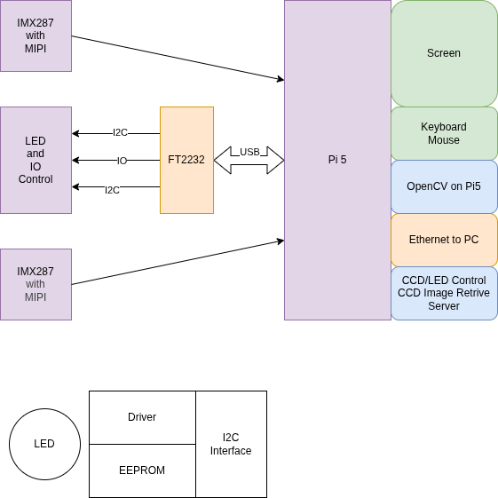
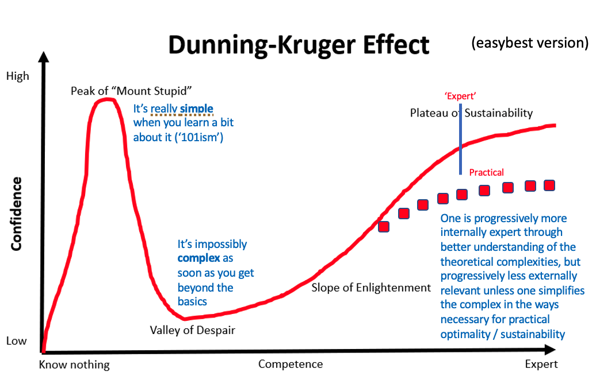
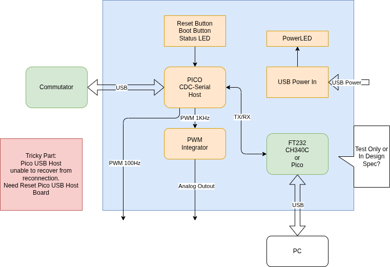

# 2026-03

## 2026-03-13 Friday 🌐 🎬 💾 📚 📑 🔬

---

## 2026-03-12 Friday 🌐 🎬 💾 📚 📑 🔬

---

## 2026-03-11 Friday 🌐 🎬 💾 📚 📑 🔬

---

## 2026-03-10 Friday 🌐 🎬 💾 📚 📑 🔬

---

## 2026-03-09 Friday 🌐 🎬 💾 📚 📑 🔬

### 當一個團隊只有一言堂 那就毁了

### human and computer are not the same memory system

### Netanyahu say, Unleash Trump, Unleash US Marine 

---

## 2026-03-06 Friday 🌐 🎬 💾 📚 📑 🔬

### Mouse Temperature

Mouse surface temperatures, often measured via infrared thermography for non-invasive monitoring, typically range between 35.4 ~ 37.9 

### Infrared thermal image tracking-based measuring and experimental system for unbiased animal behaviors

[Infrared thermal image tracking-based measuring and experimental system for unbiased animal behaviors](https://patents.google.com/patent/CN102356753A/en)

有專利

---

### Far infrared thermal sensor array (32x24 RES) MLX90640 

[MLX90640](https://www.melexis.com/en/product/MLX90640)

---

## 2026-03-05 🌐 🎬 💾 📚 📑 🔬

### BNO085

🌐[IMU Fusion Breakout - BNO085](https://learn.adafruit.com/adafruit-9-dof-orientation-imu-fusion-breakout-bno085)

The BNO085 by the motion sensing experts at Hillcrest Laboratories takes the familiar 3-axis accelerometers, gyroscopes, and magnetometers and packages then alongside an Arm Cortex M0 processor running Hillcrest's SH-2 firmware that handles the work of reading the sensors, fusing the measurements into data that you can use directly, and packaging that data and delivering it to you. If the name and description of the BNO085 sounds strikingly similar to those of the BNO055 by Bosch Sensortec, there is a good reason why: they're the same thing, but also they're not. Thanks to a unique agreement between Bosch and Hillcrest, the BNO085 uses the same hardware as the BNO055 but very different firmware running on it.

### DSP-RTL-Lib

💾[DSP-RTL-Lib](https://github.com/ahmedshahein/DSP-RTL-Lib)

---

### FastAccelStepper

💾[FastAccelStepper](https://github.com/gin66/FastAccelStepper)

💾[AccelStepper](https://www.airspayce.com/mikem/arduino/AccelStepper/index.html)

---

## 2026-03-04 🌐 🎬 💾 📚 📑 🔬

### VL53L9CX

🌐[VL53L9CX](https://www.st.com/en/imaging-and-photonics-solutions/vl53l9cx.html)

The VL53L9CX is STMicroelectronics’ dToF 3D lidar all-in-one module, offering a high spatial resolution of 2.3 K zones. It features a 71° diagonal FoV, with 1° angular resolution across a 55° x 42° FoV. It also delivers accurate ranging from below 5 cm to 9 m.

---

### VL53L7CX Time-of-Flight (ToF) 8x8 multizone ranging sensor

🌐[VL53L7CX](https://www.st.com/en/imaging-and-photonics-solutions/vl53l7cx.html)

Specially designed for applications requiring an ultrawide FoV, the VL53L7CX Time-of-Flight sensor offers a 90° diagonal FoV. Based on ST's FlightSense technology, the VL53L7CX incorporates an efficient metasurface lens (DOE) placed on the laser emitter enabling the projection of a 60° x 60° square FoV onto the scene.

Its multizone capability provides a matrix of 8x8 zones (64 zones) and can work at fast speeds (60 Hz) up to 350 cm.

💾[Arduino VL53L7CX Lib](https://github.com/stm32duino/VL53L7CX)

📚[VL53L7CX Time-of-Flight 8×8-Zone Wide FOV Distance Sensor ](https://www.pololu.com/product/3418)

💾[SparkFun_VL53L5CX_Arduino_Library](https://github.com/sparkfun/SparkFun_VL53L5CX_Arduino_Library)

💾[VL53L5CX-BNO08X-viewer](https://github.com/ferrolho/VL53L5CX-BNO08X-viewer)

With Python Viewer

---

### Infrared Array Sensor Grid-EYE

🌐[Infrared Array Sensor Grid-EYE](https://industrial.panasonic.com/tw/products/pt/grid-eye)

💾[AMG88XX Arduino Lib](https://github.com/adafruit/Adafruit_AMG88xx)

🌐[Thermopile Infrared Array Sensors](https://www.heimannsensor.com/thermopile-infrared-arrays?gad_source=1&gad_campaignid=14879550646&gbraid=0AAAAACjTh3KDSDx3Sf3y0M2AlSdcHznsq&gclid=CjwKCAiAqprNBhB6EiwAMe3yhn52-Tsw1AImetPMUSInz6TIRRYvGvKnB6aqGtAp9f0n7lpqQ90QWxoCUFIQAvD_BwE)

---

### Fiber Photometry Use Sony IMX287

---

### These biological computers actually use neurons

🎬[These biological computers actually use neurons](https://www.youtube.com/watch?v=5Sd3JlLJn9Q)

In this video we look into one of the developing areas of computing: wetware. Most specifically neuromorphic computing, a science which uses actual neurons on chips.

We talk to Cortical labs, the company that developed the pong-playing dish brain, and professor Thomas Hartung to understand what the benefits of this technology are.

---

### The war with Iran: An expert analysis

🎬[The war with Iran: An expert analysis](https://www.youtube.com/watch?v=5nJnVYpbKuM)

What is happening in Iran and what does it mean for the region? Dr Evaleila Pesaran shares her analysis.

---

### MIPI to USB3 Solution

🌐[MIPI to USB Solutions](https://tinyvision.ai/blogs/processing-at-the-edge/best-mipi-to-usb-solutions)

---

### 🐱 川普不是有耐心的人 戰事應該短期就會消失

---

### Causal Inference for The Brave and True

📚[Causal Inference for The Brave and True](https://matheusfacure.github.io/python-causality-handbook/landing-page.html#causal-inference-for-the-brave-and-true)

---

### Machine Learning & Causal Inference: A Short Course

🎬[Machine Learning & Causal Inference: A Short Course](https://www.gsb.stanford.edu/faculty-research/labs-initiatives/sil/research/methods/ai-machine-learning/short-course)

---

### Dunning-Kruger effect

🌐[鄧寧-克魯格效應](https://zh.wikipedia.org/zh-tw/%E9%84%A7%E5%AF%A7-%E5%85%8B%E9%AD%AF%E6%A0%BC%E6%95%88%E6%87%89)

---

### PICO as USB Host

---

## 2026-03-03 🌐 🎬 💾 📚 📑 🔬

### Using the ICM-20948 and the Madgwick Filter for Orientation Tracking

🌐[Using the ICM-20948 and the Madgwick Filter for Orientation Tracking](https://medium.com/@rohanmore90/how-i-got-started-with-sensor-fusion-using-the-icm-20948-and-the-madgwick-filter-for-orientation-59b738d4514d)

🎬[IMU-Angle-Estimator](https://github.com/Rohanmorey/IMU-Angle-Estimator)

🎬[ICM_20948-AHRS](https://github.com/jremington/ICM_20948-AHRS)

---

### Dasynq — the event-loop library

[Dasynq — the event-loop library](https://davmac.org/projects/dasynq/)

Dasynq is an event loop library similar to libevent, libev and libuv.

- C++11 — written in portable C++ code
- Thread safe — full support for use in a multi-threaded application
- Header-only library — does not install a shared library
- Supports file I/O, signals, process termination and timer events
- Linux, OpenBSD, FreeBSD, MacOS — and portable to others
- Apache License version 2.0

---

### Build a REAL RPI Pico Project in VSCode Now

🎬[PICO on VSCode](https://www.youtube.com/watch?v=Od3Vo0d_bVo)

---

### The Pattern On the Stone

2026-014

---

### The Delicate Art of Brute Force

2026-013

---

### The Biological Computing

[The Biological Computing](https://www.tbc.co/)

Real neurons applied to AI models

---

### Living Human Brain Cells in CL1 Biological Computer Learn How to Play DOOM

🌐[Brain Cells in CL1 Learn How to Play DOOM](https://www.techeblog.com/human-brain-cells-cl1-biological-computer-play-doom/)

Human brain cells grown in a lab have learned to play DOOM. Australia-based Cortical Labs put on this impressive display with their CL1 biological computer, which is a really cool device that cradles 200,000 living human neurons on a microchip topped with a multi-electrode array. These neurons, derived from stem cells, float in a nutrient solution and link directly to the chip’s electrodes, which send and receive electrical signals.

---

### Scientists Grew Mini Brains, Then Trained Them to Solve an Engineering Problem

🌐[Mini Brains Solve an Engineering Problem](https://www.sciencealert.com/scientists-grew-mini-brains-then-trained-them-to-solve-an-engineering-problem)

---

## 2026-03-02 🌐 🎬 💾 📚 📑 🔬

### JavaScript Run Time on MCU 

🌐[Kaluma](https://kalumajs.org/)

A tiny JavaScript runtime for RP2040 and RP2350 (Raspberry Pi Pico)

---

💾[Espruino4Pico](https://github.com/jumjum123/Espruino4Pico)

Espruino for Raspberry PICO RPI2040

---

💾[STM32JS](https://github.com/Catethysis/stm32js)

stm32js is a framework which gives you a way to write scripts for STM32 in JavaScript.

---