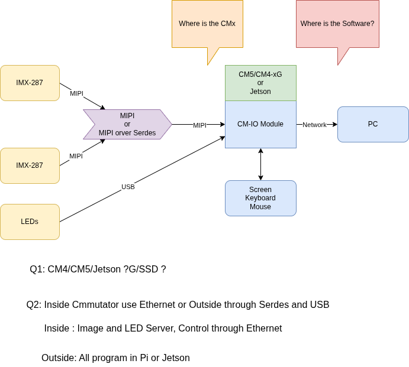

# 2026-03

## 2026-03-16 Tuesday 🌐 🎬 💾 📚 📑 🔬

### C Header File Example

```c
// 1. Include Guards (Essential to prevent multiple inclusions)
#ifndef MY_HEADER_H
#define MY_HEADER_H

// 2. Includes (Only necessary ones, like standard types)
#include <stdint.h>

// 3. Macros and Constants
#define MAX_BUFFER 1024

// 4. Data Type Definitions (Structures, Enums, Typedefs)
typedef struct {
    int id;
    char name[20];
} User;

// 5. Function Prototypes (Public interface)
void ProcessUser(User* u);
int GetStatus(void);

// 6. External Global Variables (If shared)
extern int globalConfig;

#endif // MY_HEADER_H
```

### Pi5-IMX287 Fiber Photometry



---

### Ternay Computing

🌐[Ternay Computing](https://www.ternary-computing.com/)

🌐[5000FP](https://www.ternary-computing.com/preorder/preorder_en.html)

---

## 2026-03-16 Monday 🌐 🎬 💾 📚 📑 🔬

### Angry Dr. Arthur Kachikian

[America's Final War | Dr. Arthur Kachikian](https://www.youtube.com/watch?v=ARqwzj-qIR0)

---

### 安全保障就是核武 而核武是滅絕的開始

---

### Open-CV on RPI

📚[Configuring Raspberry Pi for OpenCV](https://opencv.org/configuring-raspberry-pi-for-opencv-camera-cooling/)

sudo apt install -y v4l-utils ffmpeg python3-opencv

```python

import v4l2capture
import PIL.Image
import select

# Open the video device
video_device = "/dev/video0"
camera = v4l2capture.Video_device(video_device)

# Set resolution (width, height)
width, height = 1280, 720
size_x, size_y = camera.set_format(width, height)

# Start streaming
camera.start()

# Wait for the device to fill the buffer
select.select((camera,), (), ())

# Capture a frame
image_data = camera.read()

# Close the device
camera.close()

# Convert raw data to image using PIL
image = PIL.Image.frombytes("RGB", (size_x, size_y), image_data)
image.save("capture.jpg")
print(f"Image saved as capture.jpg, Size: {size_x}x{size_y}")

```

---

### Causal Inference


2026-016

---

### Lab-On-a-Chip Grippers Could Handle Human Cells Researchers design shape-memory cages to grab cells and organoids

[Lab-On-a-Chip Grippers Could Handle Human Cells Researchers design shape-memory cages to grab cells and organoids](https://spectrum.ieee.org/lab-on-a-chip-grippers)

Now, researchers have developed a lab-on-chip that adds a new feature to these systems: low-power grippers that can hold cells or tiny organ models called organoids in place. The CMOS-compatible lab-on-a-chip features shape-memory grippers and chemical sensors for detecting molecules such as neurotransmitters. The micro-cage array was presented in San Francisco on 18 February at the IEEE International Solid State Circuits Conference.

---

### Current Opinion on Animal Pose Estimation and Behavior Analysis Tools

[Current Opinion on Animal Pose Estimation and Behavior Analysis Tools](https://snawarhussain.com/Current-Opinion-on-Animal-Pose-Estimation-Tools-A-Review/#fb4b7336-d05d-4ded-9e34-11a5649cd141)

---

### how to setup mv-mipi-imx287m on rpi zero 2w?

📚[how to setup mv-mipi-imx287m on rpi zero 2w?](https://forum.veye.cc/topic/672/how-to-setup-mv-mipi-imx287m-on-rpi-zero-2w)

📚[Raspberry Pi 5 IMX264 + IMX287](https://forum.veye.cc/topic/660/raspberry-pi-5-imx264-imx287)

```sh

#!/bin/bash

set -ex

cd ~/
rm -rf raspberry*

wget https://github.com/veyeimaging/raspberrypi_v4l2/releases/latest/download/raspberrypi_v4l2.tgz 
tar xzf raspberrypi_v4l2.tgz

# build driver
cd ~/raspberrypi_v4l2/driver_source/cam_drv_src/rpi-6.6.y
make

# build dtbo
cd ~/raspberrypi_v4l2/driver_source/dts/rpi-6.6.y
./build_dtbo.sh

cd ~/raspberrypi_v4l2/release

# create bin dir for current kernel
mkdir -p driver_bin/$(uname -r)

cp ~/raspberrypi_v4l2/driver_source/cam_drv_src/rpi-6.6.y/*.ko driver_bin/$(uname -r)/
cp ~/raspberrypi_v4l2/driver_source/dts/rpi-6.6.y/*.dtbo driver_bin/$(uname -r)/

ls -l driver_bin/$(uname -r)/*.{ko,dtbo}

cd ~/raspberrypi_v4l2/release
chmod +x *.sh
yes no | ./uninstall_driver.sh veye_mvcam

sed -i 's/\/boot\/cmdline\.txt/\/boot\/firmware\/cmdline\.txt/g' install_driver.sh
yes | ./install_driver.sh veye_mvcam

```

---

### 朱子家訓

阿媽說：
一聲不知 百樣無事

阿公說：
還沒貧窮就習慣貧窮 就不會貧窮
還沒富裕就習慣富裕 就不會富裕

---

## 2026-03-12 Friday 🌐 🎬 💾 📚 📑 🔬

### Shrike-lite Pico + FPGA

[Shrike-lite](https://store.vicharak.in/?product=shrike&post_type=product&name=shrike&v=74cfa17bd909)

---

### SimBA (Simple Behavioral Analysis)

💾[SimBA (Simple Behavioral Analysis)](https://github.com/sgoldenlab/simba)

---

###


---

### Truth is the First Casualty in the War Time

---

## 2026-03-12 Thursday 🌐 🎬 💾 📚 📑 🔬

### Spec-Driven Development

🎬[Coding is dead. Long live the software engineer.](https://www.youtube.com/watch?v=0jaocLi1rF0)

---

🌐[OpenSpec](https://openspec.dev/)

💾[Programming as Theory Building](https://gist.github.com/onlurking/fc5c81d18cfce9ff81bc968a7f342fb1)

🎤[Programming as Theory Building](https://feelingof.com/episodes/061/)

🌐[Understanding Spec-Driven-Development: Kiro, spec-kit, and Tessl](https://martinfowler.com/articles/exploring-gen-ai/sdd-3-tools.html)

---

One workflow to fit all sizes?
Kiro and spec-kit provide one opinionated workflow each, but I’m quite sure that neither of them is suitable for the majority of real life coding problems. In particular, it’s not quite clear to me how they would cater to enough different problem sizes to be generally applicable.

When I asked Kiro to fix a small bug (it was the same one I used in the past to try Codex), it quickly became clear that the workflow was like using a sledgehammer to crack a nut. The requirements document turned this small bug into 4 “user stories” with a total of 16 acceptance criteria, including gems like “User story: As a developer, I want the transformation function to handle edge cases gracefully, so that the system remains robust when new category formats are introduced.”

I had a similar challenge when I used spec-kit, I wasn’t quite sure what size of problem to use it for. Available tutorials are usually based on creating an application from scratch, because that’s easiest for a tutorial. One of the use cases I ended up trying was a feature that would be a 3-5 point story on one of my past teams. The feature depended on a lot of code that was already there, it was supposed to build an overview modal that summarised a bunch of data from an existing dashboard. With the amount of steps spec-kit took, and the amount of markdown files it created for me to review, this again felt like overkill for the size of the problem. It was a bigger problem than the one I used with Kiro, but also a much more elaborate workflow. I never even finished the full implementation, but I think in the same time it took me to run and review the spec-kit results I could have implemented the feature with “plain” AI-assisted coding, and I would have felt much more in control.

An effective SDD tool would at the very least have to provide flexibility for a few different core workflows, for different sizes and types of changes.

---

### CH32V317 board offers 10/100Mbps Ethernet, dual USB 2.0 Type-C, DVP interface


🌐[CH32V317](https://www.cnx-software.com/2025/10/07/
sub-7-ch32v317-board-offers-10-100mbps-ethernet-dual-usb-2-0-type-c-dvp-interface/)

---

🎬[CH32H417 Examples](https://github.com/openwch/ch32h417)

---


---

## 2026-03-11 Wednesday 🌐 🎬 💾 📚 📑 🔬

### Linux Driver Workshop 2026

🎬[Linux Driver Workshop 2026](https://www.youtube.com/watch?v=2FlFl1h2n0E)

💾[Linux Driver Workshop 2025](https://github.com/Johannes4Linux/LTW25/)

💾[Linux Driver Workshop 2026](https://github.com/Johannes4Linux/clt2026)

---

## Netanyahu , Putin are War Criminals, Trump is just Jaws (also War Criminal)

[Jaws from 007](https://en.wikipedia.org/wiki/Jaws_(James_Bond))

---

## 2026-03-10 Tuesday 🌐 🎬 💾 📚 📑 🔬

### PicoCalc Arduino Startup Code

🎬[PicoCalc Arduino Startup Code](https://github.com/CptnRoughnight/PicoCalc-basecode)

---

### Dragon's Dogma 2 Game Play All

🎬[Dragon's Dogma 2](https://www.youtube.com/playlist?list=PLh3qcQJP_mqZVhn1yJ0pFUq62VMGyNdgt)

---

### The Causal Mindset Handbook


2026-015

---

### ICM-20948 Sensor Fusion

🌐[ICM-20948 Sensor Fusion](https://medium.com/@rohanmore90/how-i-got-started-with-sensor-fusion-using-the-icm-20948-and-the-madgwick-filter-for-orientation-59b738d4514d)

### Brain Emulation

🌐[Brain Emulation](https://eon.systems/)

🌐[How the Eon Team Produced a Virtual Embodied Fly](https://eon.systems/updates/embodied-brain-emulation)

---

### SqueakPose Studio

🌐[SqueakPose Studio](https://github.com/dlhagger/SqueakPoseStudio)

Desktop labeling, training, and inference toolkit for small-animal (mouse) pose estimation. Built with PyQt6 and Ultralytics YOLO to streamline the full loop: annotate frames, export YOLO-format datasets, train models, and run video inference with per-frame CSV outputs.

---

🎬[SqueakView Studio: Install, Demo, Key Features](https://www.youtube.com/watch?v=CRolGeF1rnc)

---

### SLEAP Open Source GUI for Multi-Animal Pose Tracking

🌐[SLEAP Open Source GUI for Multi-Animal Pose Tracking](https://sleap.ai/)

---

## 2026-03-09 Monday 🌐 🎬 💾 📚 📑 🔬

### 當一個團隊只有一言堂 那就毁了

---

### human and computer do not have the same memory system

---

## 💀 Netanyahu say, Unleash Trump, Unleash US Marine

---

## 2026-03-06 Friday 🌐 🎬 💾 📚 📑 🔬

### Mouse Temperature

Mouse surface temperatures, often measured via infrared thermography for non-invasive monitoring, typically range between 35.4 ~ 37.9 

### Infrared thermal image tracking-based measuring and experimental system for unbiased animal behaviors

[Infrared thermal image tracking-based measuring and experimental system for unbiased animal behaviors](https://patents.google.com/patent/CN102356753A/en)

有專利

---

### Far infrared thermal sensor array (32x24 RES) MLX90640 

[MLX90640](https://www.melexis.com/en/product/MLX90640)

---

## 2026-03-05 🌐 🎬 💾 📚 📑 🔬

### BNO085

🌐[IMU Fusion Breakout - BNO085](https://learn.adafruit.com/adafruit-9-dof-orientation-imu-fusion-breakout-bno085)

The BNO085 by the motion sensing experts at Hillcrest Laboratories takes the familiar 3-axis accelerometers, gyroscopes, and magnetometers and packages then alongside an Arm Cortex M0 processor running Hillcrest's SH-2 firmware that handles the work of reading the sensors, fusing the measurements into data that you can use directly, and packaging that data and delivering it to you. If the name and description of the BNO085 sounds strikingly similar to those of the BNO055 by Bosch Sensortec, there is a good reason why: they're the same thing, but also they're not. Thanks to a unique agreement between Bosch and Hillcrest, the BNO085 uses the same hardware as the BNO055 but very different firmware running on it.

### DSP-RTL-Lib

💾[DSP-RTL-Lib](https://github.com/ahmedshahein/DSP-RTL-Lib)

---

### FastAccelStepper

💾[FastAccelStepper](https://github.com/gin66/FastAccelStepper)

💾[AccelStepper](https://www.airspayce.com/mikem/arduino/AccelStepper/index.html)

---

## 2026-03-04 🌐 🎬 💾 📚 📑 🔬

### VL53L9CX

🌐[VL53L9CX](https://www.st.com/en/imaging-and-photonics-solutions/vl53l9cx.html)

The VL53L9CX is STMicroelectronics’ dToF 3D lidar all-in-one module, offering a high spatial resolution of 2.3 K zones. It features a 71° diagonal FoV, with 1° angular resolution across a 55° x 42° FoV. It also delivers accurate ranging from below 5 cm to 9 m.

---

### VL53L7CX Time-of-Flight (ToF) 8x8 multizone ranging sensor

🌐[VL53L7CX](https://www.st.com/en/imaging-and-photonics-solutions/vl53l7cx.html)

Specially designed for applications requiring an ultrawide FoV, the VL53L7CX Time-of-Flight sensor offers a 90° diagonal FoV. Based on ST's FlightSense technology, the VL53L7CX incorporates an efficient metasurface lens (DOE) placed on the laser emitter enabling the projection of a 60° x 60° square FoV onto the scene.

Its multizone capability provides a matrix of 8x8 zones (64 zones) and can work at fast speeds (60 Hz) up to 350 cm.

💾[Arduino VL53L7CX Lib](https://github.com/stm32duino/VL53L7CX)

📚[VL53L7CX Time-of-Flight 8×8-Zone Wide FOV Distance Sensor ](https://www.pololu.com/product/3418)

💾[SparkFun_VL53L5CX_Arduino_Library](https://github.com/sparkfun/SparkFun_VL53L5CX_Arduino_Library)

💾[VL53L5CX-BNO08X-viewer](https://github.com/ferrolho/VL53L5CX-BNO08X-viewer)

With Python Viewer

---

### Infrared Array Sensor Grid-EYE

🌐[Infrared Array Sensor Grid-EYE](https://industrial.panasonic.com/tw/products/pt/grid-eye)

💾[AMG88XX Arduino Lib](https://github.com/adafruit/Adafruit_AMG88xx)

🌐[Thermopile Infrared Array Sensors](https://www.heimannsensor.com/thermopile-infrared-arrays?gad_source=1&gad_campaignid=14879550646&gbraid=0AAAAACjTh3KDSDx3Sf3y0M2AlSdcHznsq&gclid=CjwKCAiAqprNBhB6EiwAMe3yhn52-Tsw1AImetPMUSInz6TIRRYvGvKnB6aqGtAp9f0n7lpqQ90QWxoCUFIQAvD_BwE)

---

### Fiber Photometry Use Sony IMX287


---

### These biological computers actually use neurons

🎬[These biological computers actually use neurons](https://www.youtube.com/watch?v=5Sd3JlLJn9Q)

In this video we look into one of the developing areas of computing: wetware. Most specifically neuromorphic computing, a science which uses actual neurons on chips.

We talk to Cortical labs, the company that developed the pong-playing dish brain, and professor Thomas Hartung to understand what the benefits of this technology are.

---

### The war with Iran: An expert analysis

🎬[The war with Iran: An expert analysis](https://www.youtube.com/watch?v=5nJnVYpbKuM)

What is happening in Iran and what does it mean for the region? Dr Evaleila Pesaran shares her analysis.

---

### MIPI to USB3 Solution

🌐[MIPI to USB Solutions](https://tinyvision.ai/blogs/processing-at-the-edge/best-mipi-to-usb-solutions)

---

### 🐱 川普不是有耐心的人 戰事應該短期就會消失

---

### Causal Inference for The Brave and True

📚[Causal Inference for The Brave and True](https://matheusfacure.github.io/python-causality-handbook/landing-page.html#causal-inference-for-the-brave-and-true)

---

### Machine Learning & Causal Inference: A Short Course

🎬[Machine Learning & Causal Inference: A Short Course](https://www.gsb.stanford.edu/faculty-research/labs-initiatives/sil/research/methods/ai-machine-learning/short-course)

---

### Dunning-Kruger effect


🌐[鄧寧-克魯格效應](https://zh.wikipedia.org/zh-tw/%E9%84%A7%E5%AF%A7-%E5%85%8B%E9%AD%AF%E6%A0%BC%E6%95%88%E6%87%89)

---

### PICO as USB Host


---

## 2026-03-03 🌐 🎬 💾 📚 📑 🔬

### Using the ICM-20948 and the Madgwick Filter for Orientation Tracking

🌐[Using the ICM-20948 and the Madgwick Filter for Orientation Tracking](https://medium.com/@rohanmore90/how-i-got-started-with-sensor-fusion-using-the-icm-20948-and-the-madgwick-filter-for-orientation-59b738d4514d)

🎬[IMU-Angle-Estimator](https://github.com/Rohanmorey/IMU-Angle-Estimator)

🎬[ICM_20948-AHRS](https://github.com/jremington/ICM_20948-AHRS)

---

### Dasynq — the event-loop library

[Dasynq — the event-loop library](https://davmac.org/projects/dasynq/)

Dasynq is an event loop library similar to libevent, libev and libuv.

- C++11 — written in portable C++ code
- Thread safe — full support for use in a multi-threaded application
- Header-only library — does not install a shared library
- Supports file I/O, signals, process termination and timer events
- Linux, OpenBSD, FreeBSD, MacOS — and portable to others
- Apache License version 2.0

---

### Build a REAL RPI Pico Project in VSCode Now

🎬[PICO on VSCode](https://www.youtube.com/watch?v=Od3Vo0d_bVo)

---

### The Pattern On the Stone


2026-014

---

### The Delicate Art of Brute Force


2026-013

---

### The Biological Computing

[The Biological Computing](https://www.tbc.co/)

Real neurons applied to AI models

---

### Living Human Brain Cells in CL1 Biological Computer Learn How to Play DOOM

🌐[Brain Cells in CL1 Learn How to Play DOOM](https://www.techeblog.com/human-brain-cells-cl1-biological-computer-play-doom/)

Human brain cells grown in a lab have learned to play DOOM. Australia-based Cortical Labs put on this impressive display with their CL1 biological computer, which is a really cool device that cradles 200,000 living human neurons on a microchip topped with a multi-electrode array. These neurons, derived from stem cells, float in a nutrient solution and link directly to the chip’s electrodes, which send and receive electrical signals.

---

### Scientists Grew Mini Brains, Then Trained Them to Solve an Engineering Problem

🌐[Mini Brains Solve an Engineering Problem](https://www.sciencealert.com/scientists-grew-mini-brains-then-trained-them-to-solve-an-engineering-problem)

---

## 2026-03-02 🌐 🎬 💾 📚 📑 🔬

### JavaScript Run Time on MCU 

🌐[Kaluma](https://kalumajs.org/)

A tiny JavaScript runtime for RP2040 and RP2350 (Raspberry Pi Pico)

---

💾[Espruino4Pico](https://github.com/jumjum123/Espruino4Pico)

Espruino for Raspberry PICO RPI2040

---

💾[STM32JS](https://github.com/Catethysis/stm32js)

stm32js is a framework which gives you a way to write scripts for STM32 in JavaScript.

---