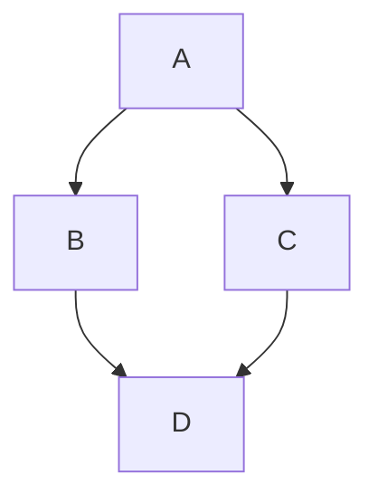
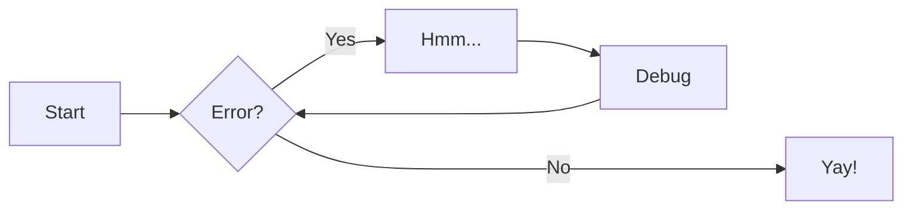
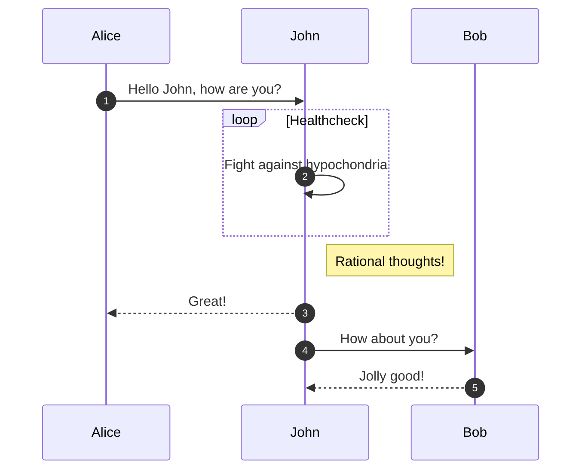

# 2026-04

## 2026-04-16 Thursday 🌐 🎬 💾 📚 📑 🔬

### Litex Ethernet Support PTP

💾[Litex M2SDR](https://github.com/enjoy-digital/litex_m2sdr/tree/main)

💾[LiteEth](https://github.com/enjoy-digital/liteeth)

LiteEth provides a small footprint and configurable Ethernet core.

LiteEth is part of LiteX libraries whose aims are to lower entry level of complex FPGA cores by providing simple, elegant and efficient implementations of components used in today's SoC such as Ethernet, SATA, PCIe, SDRAM Controller...

Using Migen to describe the HDL allows the core to be highly and easily configurable.

LiteEth can be used as LiteX library or can be integrated with your standard design flow by generating the verilog rtl that you will use as a standard core.

---

### Litex Support White Rabbit

💾[Litex White Rabbit NIC and PCIE](https://github.com/enjoy-digital/litex_wr_nic)

This project implements a LiteX-based White Rabbit NIC, combining networking and synchronization features with support for PCIe Precision Time Measurement (PTM). The design enables White Rabbit (WR) synchronization to be propagated to the host and other PTM-compatible systems while providing 1Gbps Ethernet functionality.

---

## 2026-04-15 Wednesday 🌐 🎬 💾 📚 📑 🔬

### Think Different Apple ad, 

[Think Different](https://www.youtube.com/watch?v=sqtPxo-d-Xk)

---

### HLS4ML : FPGA for ML

A package for machine learning inference in FPGAs. We create firmware implementations of machine learning algorithms using high level synthesis language (HLS). We translate traditional open-source machine learning package models into HLS that can be configured for your use-case!

hls4ml is designed for ultra-low-latency inference on FPGAs. While it has strong roots in high-energy physics applications (e.g., L1 trigger systems at the CERN Large Hadron Collider), it has also been adopted across diverse scientific and industrial domains. Example use cases include control systems for quantum computing, feedback loops in nuclear fusion, low-power environmental monitoring on satellites, and biomedical signal processing (e.g., arrhythmia classification).

💾[HLS4ML Github](https://github.com/fastmachinelearning/hls4ml)

💾[HLS4ML Tutorial](https://github.com/fastmachinelearning/hls4ml-tutorial)

🎬[HLS4ML Tutorial Video](https://www.youtube.com/watch?v=2y3GNY4tf7A)

---

### SCI-Compiler FPGA Graphic Compiler

🌐[sci-compiler](https://www.sci-compiler.com/)


---

### ULX5M-GS

🌐[ULX5M-Gatemate](https://github.com/intergalaktik/ulx5m-gs)

---

### The Art Of Computer Programming

[Working Through 001: The Art Of Computer Programming](https://www.youtube.com/watch?v=i8BLIhLNBpo&t=1s)

---

### Hog: HDL on git

📑[Hog](https://hog.readthedocs.io/en/latest/#)

Hog addresses these challenges by leveraging advanced git features and integrating with HDL IDEs: Xilinx Vivado, Xilinx ISE (PlanAhead)[1], Intel Quartus[2], Microchip Libero[3], and Lattice Diamond[3]. Hog also supports the open-source VHDL simulator GHDL. Integration with these tools aims to minimize unnecessary overhead for developers.

---

## 2026-04-14 Tuesday 🌐 🎬 💾 📚 📑 🔬

### Mermaid Use Markdown to Draw Graphics

🌐[Mermaid](https://mermaid.js.org/)

---

### Mermaid Test 1



### Mermaid Test 2



### Mermaid Test 3



---

### 【薩爾達傳說】重要地點全地圖一覽

📚[王國之淚 地圖](https://vocus.cc/article/69d73ecffd8978000158ee5f)

📚[曠野之息 地圖](https://vocus.cc/article/69cce6bdfd8978000179262f)

---

### Collection of Hyperdimensional Computing Projects

📑[Collection of Hyperdimensional Computing Projects](https://github.com/HyperdimensionalComputing/collection)

---

### Yosys on web through Web Assembly

💾[Yowasp](https://yowasp.org/)

YoWASP (Yosys WebAssembly Synthesis & PnR) is a project that aims to distribute up-to-date FOSS FPGA tools compiled to WebAssembly via language package managers like Python’s PyPI and JavaScript’s NPM.

---

### NextPNR Support Device

- Lattice iCE40 devices supported by Project IceStorm
- Lattice ECP5 devices supported by Project Trellis
- Lattice Nexus devices supported by Project Oxide
- Gowin LittleBee and Aurora V devices supported by Project Apicula
- NanoXplore NG-Ultra devices supported by Project Beyond
- Cologne Chip GateMate devices supported by Project Peppercorn
- (experimental) Cyclone V devices supported by Mistral
- (experimental) Lattice MachXO2 devices supported by Project Trellis
- (experimental) Xilinx 7-series devices supported by Project X-Ray
- (experimental) a "generic" back-end for user-defined architectures

💾[NextPNR](https://github.com/YosysHQ/nextpnr)

---

### Dr. Jane Goodall’s Final Message To The World

🎬[Dr. Jane Goodall’s Final Message To The World](https://www.youtube.com/watch?v=lfLKHY52ERc)

In the place where I am now, I look back over my life. I look back at the world I’ve left behind. What message do I want to leave? I want to make sure that you all understand that each and every one of you has a role to play. You may not know it, you may not find it, but your life matters, and you are here for a reason.

And I just hope that reason will become apparent as you live through your life. I want you to know that, whether or not you find that role that you’re supposed to play, your life does matter, and that every single day you live, you make a difference in the world. And you get to choose the difference that you make.

I want you to understand that we are part of the natural world. And even today, when the planet is dark, there still is hope. Don’t lose hope. If you lose hope, you become apathetic and do nothing. And if you want to save what is still beautiful in this world – if you want to save the planet for the future generations, your grandchildren, their grandchildren – then think about the actions you take each day.

Because, multiplied a million, a billion times, even small actions will make for great change. I want to – I just hope that you understand that this life on Planet Earth isn’t the end. I believe, and now I know, that there is life beyond death. That consciousness survives.

I can’t tell you, from where I am, secrets that are not mine to share. I can’t tell you what you will find when you leave Planet Earth. But I want you to know that your life on Planet Earth will make some difference in the kind of life you find after you die.

Above all, I want you to think about the fact that we are part – when we’re on Planet Earth – we are part of Mother Nature. We depend on Mother Nature for clean air, for water, for food, for clothing, for everything. And as we destroy one ecosystem after another, as we create worse climate change, worse loss of diversity, we have to do everything in our power to make the world a better place for the children alive today, and for those that will follow.

You have it in your power to make a difference. Don’t give up. There is a future for you. Do your best while you’re still on this beautiful Planet Earth that I look down upon from where I am now.

God bless you all.

---

### No one want to die in Iran for Trump

---

### Aegis is a fully open-source FPGA, from the silicon up

💾[Aegis](https://github.com/MidstallSoftware/aegis)

Open-source FPGA efforts have made huge strides: projects like Project IceStorm and Apicula reverse-engineer proprietary bitstream formats, OpenFPGA and FABulous generate open FPGA fabric from architecture descriptions, and Cologne Chip's GateMate ships a commercial FPGA with a fully open-source toolchain. Where these projects each tackle a piece of the puzzle, Aegis is a full-stack, end-to-end open-source FPGA: fabric generation, synthesis, place-and-route, bitstream packing, simulation, and tapeout all live in one project, designed from the ground up for open source. From HDL to GDS, nothing is behind a proprietary wall.

---

## 2026-04-13 Monday 🌐 🎬 💾 📚 📑 🔬

### WinBoat : Run Windows App on Linux

🌐[WinBoat](https://winboat.app/)

---

## 2026-04-10 Friday 🌐 🎬 💾 📚 📑 🔬

### DSP by FPGA with Scilab filter designer

💾[DSP by FPGA with Scilab filter designer](https://github.com/ghz-ws/fpga_dsp)

Cmod A7 driven ADC10065 & MAX5183. 10-bits 50 Msps Analog/Digital Processor. Input 1ch, Output 4ch. Including Delta-Sigma ADC&DAC.
Related book (Japanese) is available from [https://ghz-ws.booth.pm/items/7271269](https://ghz-ws.booth.pm/items/7271269)

---

### Romain Brette Theoretical Neuroscience

🌐[Romain Brette's Web Page and Blog](https://romainbrette.fr/)

Author of "The Brain, In Theory"

---

### Terra A1 : Drone Intercepter from Japan


---

## 2026-04-09 Thursday 🌐 🎬 💾 📚 📑 🔬

### 以色列轟黎巴嫩釀250死　搜救持續進行

🎬[以色列轟黎巴嫩釀250死　搜救持續進行](https://www.youtube.com/watch?v=pw1ayZV5Sr8)

真不知道誰才是恐怖國家

---

### Daily Review

- 今日失敗的事
- 今日感動的事
- 明日的目標

---

### PICO Set Clock

- Set Specific Speed: Use set_sys_clock_khz(khz, true) to change the system clock.

- Restore set_sys_clock_khz(125000, true) restores default speed.

- Minimum Stable Speed:  set_sys_clock_khz(10000, true) (10 MHz) is a safe low-speed option.

---

### Program Generate from Google AI about 30-45min iteration

```py
import tkinter as tk
from tkinter import ttk, messagebox, scrolledtext
import serial
import serial.tools.list_ports
import json
import threading
import numpy as np
import matplotlib.pyplot as plt
from matplotlib.backends.backend_tkagg import FigureCanvasTkAgg
import csv
import queue
from datetime import datetime

# ==========================================================
# CUSTOMIZE YOUR SETTINGS HERE
# ==========================================================
BUTTON_CONFIG = [
    {"text": "Status", "cmd": {"status": 1}},
    {"text": "Speed 100",  "cmd": {"speed": 2}},
    {"text": "Speed 150",  "cmd": {"speed": 3}},
    {"text": "Speed 200",  "cmd": {"speed": 4}},
    {"text": "Speed 250",  "cmd": {"speed": 5}},
    {"text": "TWIST1", "cmd": {"TWIST_MODE": 1}},
    {"text": "TWIST2",  "cmd": {"TWIST_MODE2": 1}},
    {"text": "PC Control", "cmd": {"CMD_MODE": 1}},
    {"text": "Disable to USB", "cmd": {"send_to_usb": 0}},
    {"text": "Enable to USB",  "cmd": {"send_to_usb": 1}},
]

DATA_GROUPS = {
    "Group 1 (Quaternion)": ["qw", "qx", "qy", "qz"],
    "Group 2 (Accel)": ["ax", "ay", "az"],
    "Group 3 (Gyro)": ["gx", "gy", "gz"]
}

ALL_CSV_KEYS = sorted(list(set([key for group in DATA_GROUPS.values() for key in group])))

# ==========================================================

class UARTApp:
    def __init__(self, root):
        self.root = root
        self.root.title("UART JSON Controller - Pro Edition")
        
        self.max_pts = 200
        self.group_names = list(DATA_GROUPS.keys())
        self.current_group_name = self.group_names[0]
        self.current_keys = DATA_GROUPS[self.current_group_name]
        
        self.init_data_buffer()
        
        self.ser = None
        self.is_running = False
        self._after_id = None
        
        self.csv_queue = queue.Queue()
        self.save_enabled = tk.BooleanVar(value=False)
        self.log_filename = ""

        self.setup_ui()
        self.update_plot_loop()

    def init_data_buffer(self):
        num_keys = len(self.current_keys)
        self.data = np.zeros((num_keys, self.max_pts), dtype=np.float64)
        self.x_axis = np.arange(self.max_pts, dtype=np.int32)

    def setup_ui(self):
        # --- Top: Connection ---
        top_frame = ttk.Frame(self.root)
        top_frame.pack(side="top", fill="x", padx=10, pady=5)
        
        ttk.Label(top_frame, text="Port:").pack(side="left")
        self.port_cb = ttk.Combobox(top_frame, width=15)
        self.refresh_ports()
        self.port_cb.pack(side="left", padx=5)
        ttk.Button(top_frame, text="Refresh", command=self.refresh_ports, width=8).pack(side="left")
        
        self.btn_conn = ttk.Button(top_frame, text="Connect", command=self.toggle_serial)
        self.btn_conn.pack(side="left", padx=10)

        self.chk_save = ttk.Checkbutton(top_frame, text="Enable Saving (CSV)", variable=self.save_enabled)
        self.chk_save.pack(side="left", padx=5)
        
        self.log_status_lbl = ttk.Label(top_frame, text="Status: Idle", foreground="gray")
        self.log_status_lbl.pack(side="left", padx=10)
        
        ttk.Button(top_frame, text="Quit Program", command=self.quit_program).pack(side="right")

        # --- Main Layout ---
        main_paned = ttk.Panedwindow(self.root, orient="horizontal")
        main_paned.pack(fill="both", expand=True, padx=10, pady=5)

        # --- Left Panel ---
        left_panel = ttk.Frame(main_paned)
        main_paned.add(left_panel, weight=3)

        btn_grid = ttk.LabelFrame(left_panel, text="Command Buttons")
        btn_grid.pack(fill="x", pady=5)
        for i, config in enumerate(BUTTON_CONFIG):
            cmd_str = json.dumps(config['cmd'])
            btn = ttk.Button(btn_grid, text=config['text'], command=lambda s=cmd_str: self.send_data(s))
            btn.grid(row=i//5, column=i%5, padx=2, pady=4, sticky="nsew")
        btn_grid.columnconfigure((0,1,2,3,4), weight=1)

        slider_frame = ttk.LabelFrame(left_panel, text="Value Selection (-1.0 to 1.0)")
        slider_frame.pack(fill="x", pady=5)
        self.val_var = tk.DoubleVar(value=0.0)
        self.slider = tk.Scale(slider_frame, from_=-1.0, to=1.0, resolution=0.05, orient="horizontal", variable=self.val_var)
        self.slider.pack(side="left", padx=10, expand=True, fill="x")
        ttk.Button(slider_frame, text="Turn Value", command=lambda: self.send_data(json.dumps({"cmd_turn":round(self.val_var.get(),2)}))).pack(side="right", padx=10)

        picker_frame = ttk.LabelFrame(left_panel, text="Display Data Group")
        picker_frame.pack(fill="x", pady=5)
        self.group_cb = ttk.Combobox(picker_frame, values=self.group_names, state="readonly")
        self.group_cb.current(0)
        self.group_cb.bind("<<ComboboxSelected>>", self.on_group_change)
        self.group_cb.pack(side="left", fill="x", expand=True, padx=10, pady=10)

        self.fig, self.ax = plt.subplots(figsize=(5, 3), dpi=100)
        self.setup_plot_lines()
        self.canvas = FigureCanvasTkAgg(self.fig, master=left_panel)
        self.canvas.get_tk_widget().pack(fill="both", expand=True, pady=5)

        # --- Right Panel: Terminal ---
        right_panel = ttk.LabelFrame(main_paned, text="Terminal Viewer")
        main_paned.add(right_panel, weight=2)
        
        # New: Clear Terminal Button
        terminal_ctrl_frame = ttk.Frame(right_panel)
        terminal_ctrl_frame.pack(fill="x", padx=5, pady=(2,0))
        ttk.Button(terminal_ctrl_frame, text="Clear Terminal", command=self.clear_terminal, width=15).pack(side="right")

        self.log_area = scrolledtext.ScrolledText(right_panel, state='disabled', font=("Consolas", 9))
        self.log_area.pack(fill="both", expand=True, padx=5, pady=5)

        send_frame = ttk.Frame(right_panel)
        send_frame.pack(fill="x", padx=5, pady=5)
        self.raw_input = ttk.Entry(send_frame)
        self.raw_input.pack(side="left", fill="x", expand=True)
        self.raw_input.bind("<Return>", lambda e: self.send_raw())
        ttk.Button(send_frame, text="Send Raw", command=self.send_raw).pack(side="right", padx=2)

    def clear_terminal(self):
        """ 清空 Terminal 監看視窗 """
        self.log_area.config(state='normal')
        self.log_area.delete('1.0', tk.END)
        self.log_area.config(state='disabled')

    def setup_plot_lines(self):
        self.ax.clear()
        self.lines = []
        for key in self.current_keys:
            line, = self.ax.plot(self.x_axis, np.zeros(self.max_pts), label=key)
            self.lines.append(line)
        self.ax.legend(loc="upper right", ncol=len(self.current_keys), fontsize='x-small')
        self.ax.set_title(f"Group: {self.current_group_name}")
        self.ax.grid(True, linestyle=':', alpha=0.6)

    def on_group_change(self, event):
        self.current_group_name = self.group_cb.get()
        self.current_keys = DATA_GROUPS[self.current_group_name]
        self.init_data_buffer()
        self.setup_plot_lines()
        self.canvas.draw()

    def refresh_ports(self):
        ports = [p.device for p in serial.tools.list_ports.comports()]
        self.port_cb['values'] = ports
        if ports: self.port_cb.current(0)

    def toggle_serial(self):
        if not self.ser or not self.ser.is_open:
            try:
                self.ser = serial.Serial(self.port_cb.get(), 115200, timeout=0.1)
                self.is_running = True
                self.btn_conn.config(text="Disconnect")
                threading.Thread(target=self.read_serial, daemon=True).start()
                if self.save_enabled.get():
                    self.start_logging()
            except Exception as e:
                messagebox.showerror("Error", str(e))
        else:
            self.is_running = False
            if self.ser: self.ser.close()
            self.btn_conn.config(text="Connect")
            self.log_status_lbl.config(text="Status: Idle", foreground="gray")

    def start_logging(self):
        self.log_filename = f"log_{datetime.now().strftime('%Y%m%d_%H%M%S')}.csv"
        self.log_status_lbl.config(text=f"Logging: {self.log_filename}", foreground="green")
        threading.Thread(target=self.csv_logging_thread, daemon=True).start()

    def send_data(self, text):
        if self.ser and self.ser.is_open:
            self.ser.write((text + "\n").encode('utf-8'))
            self.log_to_ui(f"TX -> {text}\n")

    def send_raw(self):
        raw_text = self.raw_input.get()
        if raw_text:
            self.send_data(raw_text)
            self.raw_input.delete(0, tk.END)

    def log_to_ui(self, msg):
        self.log_area.config(state='normal')
        self.log_area.insert(tk.END, msg)
        self.log_area.see(tk.END)
        self.log_area.config(state='disabled')

    def read_serial(self):
        while self.is_running:
            if self.ser and self.ser.in_waiting:
                try:
                    line = self.ser.readline().decode('utf-8').strip()
                    if not line: continue
                    self.root.after(0, self.log_to_ui, f"RX <- {line}\n")
                    payload = json.loads(line)
                    self.data = np.roll(self.data, -1, axis=1)
                    for i, key in enumerate(self.current_keys):
                        self.data[i, -1] = payload.get(key, 0.0)
                    if self.save_enabled.get():
                        if not self.log_filename:
                            self.root.after(0, self.start_logging)
                        self.csv_queue.put(payload)
                except:
                    continue

    def csv_logging_thread(self):
        try:
            with open(self.log_filename, mode='a', newline='') as f:
                writer = csv.DictWriter(f, fieldnames=["timestamp"] + ALL_CSV_KEYS)
                writer.writeheader()
                while self.is_running and self.save_enabled.get():
                    try:
                        data = self.csv_queue.get(timeout=0.5)
                        row = {"timestamp": datetime.now().strftime('%H:%M:%S.%f')[:-3]}
                        for key in ALL_CSV_KEYS: row[key] = data.get(key, "")
                        writer.writerow(row)
                        f.flush()
                    except queue.Empty:
                        continue
        finally:
            self.log_filename = ""

    def update_plot_loop(self):
        if self.is_running:
            for i in range(len(self.current_keys)):
                self.lines[i].set_ydata(self.data[i])
            d_min, d_max = np.min(self.data), np.max(self.data)
            margin = max((d_max - d_min) * 0.1, 1.0)
            self.ax.set_ylim(d_min - margin, d_max + margin)
            self.canvas.draw_idle()
        self._after_id = self.root.after(50, self.update_plot_loop)

    def quit_program(self):
        self.is_running = False
        if self._after_id: self.root.after_cancel(self._after_id)
        if self.ser and self.ser.is_open: self.ser.close()
        self.root.quit()
        self.root.destroy()

if __name__ == "__main__":
    root = tk.Tk()
    root.geometry("1300x850")
    app = UARTApp(root)
    root.protocol("WM_DELETE_WINDOW", app.quit_program)
    root.mainloop()

```

---

## 2026-04-08 Wednesday 🌐 🎬 💾 📚 📑 🔬

### A World Appears: A Journey into Consciousness. by Michael Pollan

🎬[Michael Pollan Explains Why You Can't Trust Your Own Thoughts](https://www.youtube.com/watch?v=xk_xSAPsqFE)

---

### Modern C (C23)


2026-020

---

## 2026-04-07 Tuesday 🌐 🎬 💾 📚 📑 🔬

### Science.xyz Axon Probe FPGA ?


🌐[Axon Probes](https://science.xyz/technologies/axon/)

---

## 2026-04-02 Thursday 🌐 🎬 💾 📚 📑 🔬

### Exploring M5Stack Tab5 with MicroPython + LVGL

📑[Exploring M5Stack Tab5 with MicroPython + LVGL](https://www.hackster.io/vsupacha/exploring-m5stack-tab5-with-micropython-lvgl-0e2392)

---

### Efinix FPGA with Flash and DDR


---

## 2026-04-01 Wednesday 🌐 🎬 💾 📚 📑 🔬

### MIPI DPHY

🌐[Setting i.MX8M Mini and Nano MIPI-DPHY Clock](https://community.nxp.com/t5/i-MX-Processors-Knowledge-Base/Setting-i-MX8M-Mini-and-Nano-MIPI-DPHY-Clock/ta-p/1104457)

---


Clock 16:1

---

### 長大後 交朋友怎麽那麽難


2026-019

---

### Concrete Labor -> Abstract Labor

Average Working Time

Socically Necessay Labor Time

Division of Labor

---

