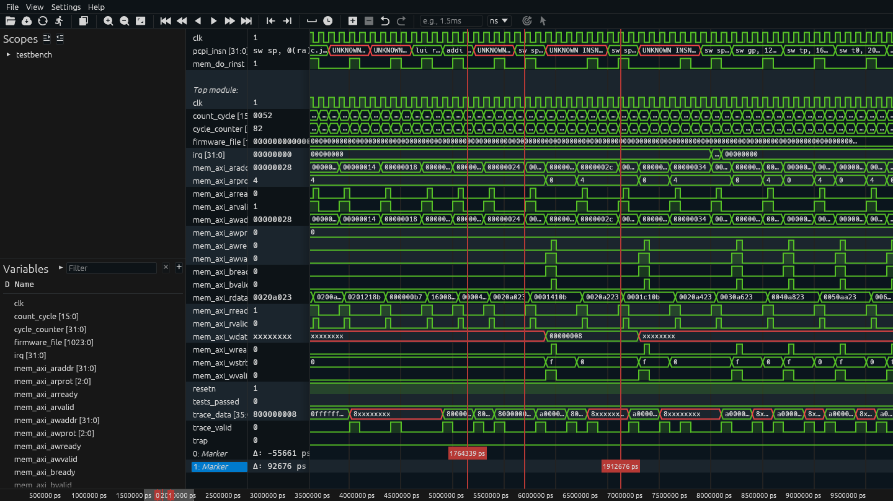

# 2026-05

## 2026-05-15 Friday 🌐 🎬 💾 📚 📑 🔬

## 2026-05-14 Thursday 🌐 🎬 💾 📚 📑 🔬

## PICO SPI in Arduino IDE is 8 bits every cs

---

### "The Israelis are panicked" about the high-tech, low-cost drones Hizballah is using

🎬["The Israelis are panicked"](https://youtube.com/shorts/Xk9zfkD34XA?si=pIw05QilWN-2uH9f)

---

## 2026-05-13 Wednesday 🌐 🎬 💾 📚 📑 🔬

### UniversalPpsAnalyzer

💾[UniversalPpsAnalyzer](https://github.com/NetTimeLogic-OpenSource/UniversalPpsAnalyzer)

The PPS Analyzer is specifically designed for Plugfests where multiple devices are synchronizing each other, and the accuracy of the individual devices shall be measured via PPS (offset from reference PPS).

🌐[PPS Analyzer](https://www.nettimelogic.com/tools-pps-analyzer.php?srsltid=AfmBOoo1jcR_skEEq4sFXczs6JoSRsfyZbjQWv7kBh57pfWKQzxk9Yhg)

---

### FPGA / ASIC 設計を加速するモデルベースデザイン (1)

📑[FPGA / ASIC 設計を加速するモデルベースデザイン (1)](https://www.acri.c.titech.ac.jp/wordpress/archives/13698)

📑[FPGA / ASIC 設計を加速するモデルベースデザイン (2)](https://www.acri.c.titech.ac.jp/wordpress/archives/13762)

---

### A Simple Approach to Neuroscience

2026-026

---

## 2026-05-12 Tuesday 🌐 🎬 💾 📚 📑 🔬

### GadgetSci MCA

[GadgetSci MCA](https://www.crowdsupply.com/andak-consulting/gadgetsci-mca)

An open source 4096-channel signal analyzer for silicon photomultiplier gamma spectroscopy

GadgetSci MCA is a compact, high-resolution multichannel signal analyzer designed for real spectroscopy applications. It pairs with a silicon photomultiplier (SiPM) detector to deliver laboratory-grade performance in a desktop setup.

### UV

####  UV Commands

    Project setup
    uv init myproject           # Create new project
    uv add requests             # Add dependency
    uv remove requests          # Remove dependency
    uv sync                     # Install from lockfile

    Running code
    uv run script.py    # Run in project environment
    uv run pytest              # Run tests

    Python management
    uv python install 3.12     # Install Python version
    uv python pin 3.12         # Set project Python

    Tool usage
    uvx black .                # Run tool temporarily
    uv tool install ruff       # Install tool globally

    Package management (pip-compatible)
    uv pip install requests  # Direct pip replacement
    uv pip install -r requirements.txt

#### UV Kickstart

- uv init project_folder_name
- uv add package_name
- uv add package_name --dev

#### after UV -> Git

- git init
- git add .
- git commit -m "Initial commit"

#### Create new repo with GitHub CLI

- gh repo create my-project --private --source=. --remote=origin --push

## 2026-05-11 Monday 🌐 🎬 💾 📚 📑 🔬

### Circuit In The Brain

2026-025

沒看完 中間lost track 變得很難閱讀下去

---

## 2026-05-08 Friday 🌐 🎬 💾 📚 📑 🔬

### OneBox = Zynq + FT601 + AD7616 + Serdes

📑[SMA1 Sync Method](https://billkarsh.github.io/SpikeGLX/Sgl_help/SyncTab_Help.html)

---

## 2026-05-07 Thursday 🌐 🎬 💾 📚 📑 🔬

### LiveHD and Pyrope another HDL

📑[LiveHD and Pyrope](https://masc-ucsc.github.io/docs/)

LiveHD is the compiler infrastructure that allows to work with Hardware Description Languages (HDLs) like Verilog, CHISEL, and Pyrope.

Pyrope is the new HDL built on top of LiveHD.

Hardware Design provides an introduction to hardware design for software designers.

---

## 2026-05-06 Wednesday 🌐 🎬 💾 📚 📑 🔬

### wellen provides a common interface to read both FST and VCD waveform files.

💾[wellen](https://github.com/ekiwi/wellen)

wellen provides a common interface to read both FST and VCD waveform files. The library is optimized for use-cases where only a subset of signals need to be accessed, like in a waveform viewer. VCD parsing uses multiple-threads.

---

### Spade is a hardware description language inspired by modern software languages.

🌐[Spade Lang](https://spade-lang.org/)

💾[Spade Github](https://github.com/spade-lang/spade)

🎬[Spade Video](https://www.youtube.com/watch?v=Exk50eKHmoI)

Spade is a hardware description language inspired by modern software languages.

---

### Surfer Waveform Viewer

💾[Surfer](https://gitlab.com/surfer-project/surfer)

### ZeroASIC

🌐[ZeroASIC](https://www.zeroasic.com/)

It’s been nearly 50 years since Mead and Conway launched the first VLSI Revolution, sparking decades of extraordinary innovation and growth. Unfortunately, over the last 15 years, chip design has become a rich man’s game requiring thousands of specialists and up to $1  billion in per project funding. We believe the industry is long overdue for a second chip design revolution!

🌐[Mead–Conway VLSI chip design revolution](https://en.wikipedia.org/wiki/Mead%E2%80%93Conway_VLSI_chip_design_revolution)

---

### PlatypusTM is a family of standardized embedded FPGA (eFPGA) IP cores.

[embedded FPGA (eFPGA) IP cores](https://www.zeroasic.com/platypus)

---

### Wildebeest open-source RTL synthesis tool

[Wildebeest](https://github.com/zeroasiccorp/wildebeest)

The Wildebeest project is an open-source RTL synthesis tool that builds on the mature Yosys platform and extends it with advanced logic synthesis algorithms for state-of-the-art quality of results (QoR).

---

### VTR

📑[Verilog To Route](https://docs.verilogtorouting.org/en/latest/#)

---

### BaseJump FPGA IP

🌐[BaseJump](https://bjump.org/)

💾[BaseJump STL](https://github.com/bespoke-silicon-group/basejump_stl/)

---

### Pico to Pico Connection over PIO

💾[PICO PIO Connect](https://github.com/derekfountain/pico-pio-connect)

---

### Verilog Name Convention

- Port     : name_in, name_out
- Signal   : s_name, s_name_n, s_name_next
- Variable : v_name, v_name_n
- Constant : c_name

---

### The Essential Book of AI

2026-024

---

### Entropy-rich data 

Entropy-rich data refers to datasets characterized by a high degree of randomness, disorder, unpredictability, or structural complexity. In information theory, such data contains a high amount of information (Shannon entropy), meaning it is less redundant and less predictable than structured data. [1, 2]

---

## 2026-05-05 Tuesday 🌐 🎬 💾 📚 📑 🔬

### Open Ephys Commutator Manual

[Open Ephys Commutator](https://open-ephys.github.io/commutator-docs/index.html)

---

### PICO SPI
[PICO SPI Master and Slave](circuitstate.com/tutorials/making-two-raspberry-pi-pico-boards-communicate-through-spi-using-c-cpp-sdk/)

---

## 2026-05-04 Monday 🌐 🎬 💾 📚 📑 🔬

### AI Chatbots: Last Week Tonight with John Oliver (HBO)

🎬[AI Chatbots: Last Week Tonight with John Oliver (HBO)](youtube.com/watch?v=Ykvf3MunGf8&sttick=0)

---

### Zuspec: Pythonic Model-Driven Hardware Development

🌐[ZUSpec](https://zuspec.github.io/)

💾[ZUSpec](https://github.com/zuspec)

Zuspec, a portmanteau of zusammen (German for “together”) and specification, is a Python-based multi-abstraction hardware modeling language and a suite of tools for working with Zuspec models.

Abstract - Designing and implementing hardware is challenging, and is getting more difficult each year as systems become more complex. Design and verification teams are looking to boost productivity as a way to keep pace, while also looking for ways to provide models of the design behavior to software teams earlier. The fragmented and esoteric nature of the languages and methodologies used for design and verification only make this more difficult. Zuspec is a unified, extensible Pythonic framework for multi-abstraction hardware modeling that simplifies the design and verification process and enables traditional and AI-driven automation.

---

### The introduction of the Iomega Clik drive

[Iomeag Clik](https://www.howtogeek.com/why-the-click-drive-disappeared-and-why-its-name-backfired/)

---

### 7 Way to Burn your Money on Hardware Prototype

If you want to burn big bucks on your hardware prototype, it's easier than you think. Just do these 7 things.

1/ Think an Arduino demo is a real prototype

It's not. It proves your idea works on a $30 dev board. It tells you nothing about real power consumption, heat, or signal performance. For that, you need a PCB with proper industrial-grade components.

2/ Assume the first PCB run will work 

It almost never does. Factory trace tolerances interact with physics in ways no simulation fully captures. This is normal and manageable as long as you budgeted for a second run.

3/ Ignore the enclosure until it's too late

Custom enclosure means a custom mold. That mold costs tens of thousands before you've made a single unit. Most clients don't see this coming because nobody quoted it upfront.

4/ Skip field testing

One device was built for two button presses a day. Users pressed it 22 times. The seal died in two months, moisture got in, devices started shorting. A small field test would have caught it, but they skipped it to save time.

5/ Take forever to decide 

Classic. 

6/ Try to validate everything in one prototype

A prototype answers specific questions, not all of them at once. When scope creeps into the prototype phase, timelines stretch, costs climb, and the feedback you get is muddied. 

7/ Forget about DFM

Design for manufacturing is a big part a lot of clients and vendors don’t take into account. You send a schematic, the factory tells you they can't make the traces that thin, or that component isn't in their inventory, or that via placement conflicts with their process. You revise, they review, you revise again. It can add weeks to a prototype run.

The whole point of a prototype is to find problems before they get expensive. And skipping corners in prototyping makes it more and more expensive.

[7 Way to Burn your Money](https://www.linkedin.com/posts/andrew-mospan_if-you-want-to-burn-big-bucks-on-your-hardware-share-7455238689992884224-P5eO/?utm_source=share&utm_medium=member_android&rcm=ACoAABwWoEkB7YUrJegV8L5VMiiW_tb4Q1EvlLo)

- xxx 1/ Think an Arduino demo is a real prototype
- xxx 2/ Assume the first PCB run will work 
- ooo 3/ Ignore the enclosure until it's too late
- xxx 4/ Skip field testing
- ooo 5/ Take forever to decide 
- xxx 6/ Try to validate everything in one prototype
- xxx 7/ Forget about DFM

---

### Wearable LiDAR Spatial Audio Navigator for Visually-Impaired Individuals

[Wearable LiDAR Spatial Audio Navigator for Visually-Impaired Individuals](https://circuitcellar.com/research-design-hub/projects/wearable-lidar-spatial-audio-navigator-for-visually-impaired-individuals/)