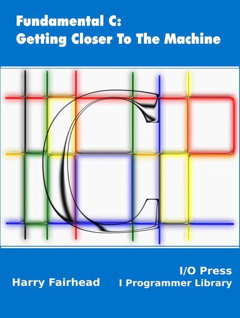
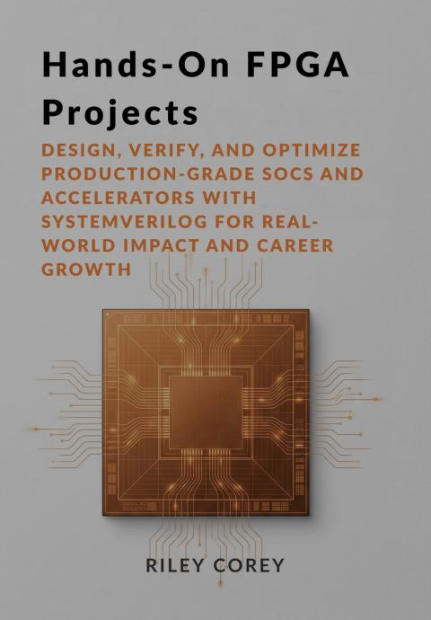
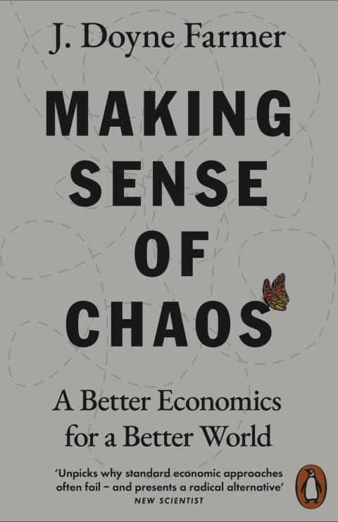
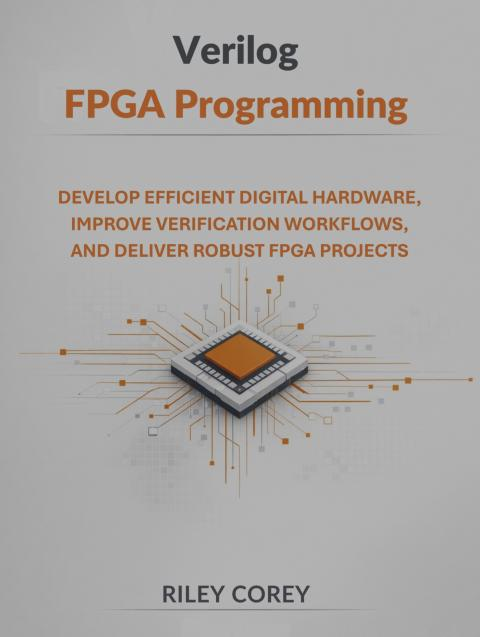
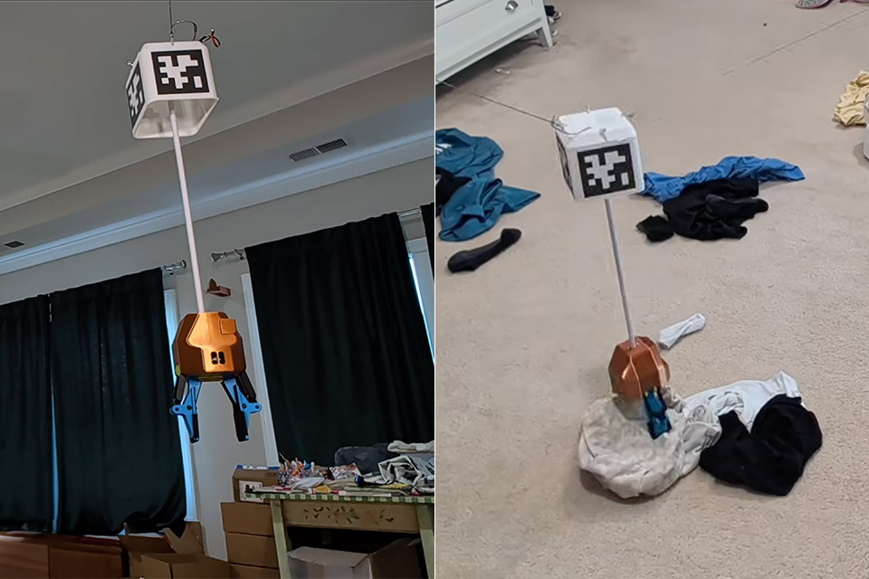

# 2026-06

## 2026-06-30 Tuesday 🌐 🎬 💾 📚 📑 🔬

### CERN Open Hardware Licence

CERN has developed the CERN Open Hardware Licence (CERN OHL) as a legal tool to promote collaboration among hardware designers and support the freedom to use, study, modify, share and distribute hardware designs, and products based on those designs. As the custodian of the CERN OHL, CERN releases new versions and variants from time to time to address new problems or concerns, but which it considers to be in the same spirit as previous versions. The current version is version 2, and you can regard the CERN OHL text linked from this page as definitive. Version 2 of the CERN OHL comes in three variants:

[CERN-OHL-S (strongly reciprocal, txt , pdf )](https://gitlab.com/ohwr/project/cernohl/-/wikis/uploads/b236492596cfc91c12def7d50bbf7da0/cern_ohl_s_v2.pdf)

[CERN-OHL-W (weakly reciprocal, txt , pdf )](https://gitlab.com/ohwr/project/cernohl/-/wikis/uploads/f773df342791cc55b35ac4f907c78602/cern_ohl_w_v2.pdf)

[CERN-OHL-P (permissive, txt , pdf )](https://gitlab.com/ohwr/project/cernohl/-/wikis/uploads/98ff9662c7ce4252ec91104118c2af8e/cern_ohl_p_v2.pdf)

Please visit the CERN OHL v2 home  to access more information about the three variants, including a rationale document explaining drafting decisions and a list of frequently asked questions.

---

### Fundamental C: Get Closer to The Machine



2026-035

---

### Hands-On FPGA Projects



2026-034

---

###  Controlling Serial and Ethernet Test Instruments with a Ri3 use PyVISA

📚[Tecktronic Instrument use PyVISA](../papers/2026/1KW-61463-0__Raspberry_Pi_3_Save_Lab_Space_%20Cost_Application_Note_090718.pdf)

---

### PyVISA: Control your instruments with Python

📚[Control your instruments with Python](https://pyvisa.readthedocs.io/en/latest/index.html#)

---

## 2026-06-29 Monday 🌐 🎬 💾 📚 📑 🔬

### Connect PM400 to Python at Ubuntu (via Gemini)

To connect a Thorlabs PM400 power meter on Ubuntu 22.04 LTS, the most reliable approach is using the Standard Commands for Programmable Instruments (SCPI) via Python's pyvisa library. Thorlabs power meters natively present themselves as USBTMC (USB Test and Measurement Class) devices on Linux systems, eliminating the need for proprietary Windows .dll drivers

- pip3 install pyvisa pyvisa-py
- sudo nano /etc/udev/rules.d/99-thorlabs.rules
                                                
SUBSYSTEMS=="usb", ATTRS{idVendor}=="1313", ATTRS{idProduct}=="8075", MODE="0666", GROUP="plugdev"

KERNEL=="usbtmc*", ATTRS{idVendor}=="1313", ATTRS{idProduct}=="8075", MODE="0666", GROUP="plugdev"

- sudo udevadm control --reload-rules
- sudo udevadm trigger

```py
import pyvisa
import time

class PM400():
    def __init__(self):
        # Initialize the Visa Resource Manager using the pure-Python backend (@py)
        self.rm = pyvisa.ResourceManager('@py') 
        # List all discovered resources
        self.resources = self.rm.list_resources()
        print("Discovered VISA Resources:", self.resources) 
        self.pm400_resource = None

        for res in self.resources:
            # Check for Thorlabs USBTMC identifier strings (Vendor ID 0x1313)
            if "0x1313" in res or "USB" in res:
                self.pm400_resource = res
                break
                
        if not self.pm400_resource:
            print("Error: Thorlabs PM400 device not found. Check physical USB connection and udev rules.")
            return

        print(f"Connecting to: {self.pm400_resource}")      

    def connect(self):
        
        try:
            # Open connection with defined termination character required by Thorlabs SCPI
            self.instrument = self.rm.open_resource(self.pm400_resource, 
                                               read_termination='\n',
                                               write_termination='\n')
            
            # Query device identification details
            idn = self.instrument.query('*IDN?')
            print(f"Connected to Device Identification: {idn.strip()}")
            
            # Configure PM400 to measure Power in Watts
            self.instrument.write('CONF:POW') 
            
            # Read the current wavelength configuration
            current_wavelength = self.instrument.query('SENS:CORR:WAV?')
            print(f"Current Wavelength Setting: {current_wavelength.strip()} nm")
            
            # Example: Set to a specific wavelength if needed (uncomment line below)
            # instrument.write('SENS:CORR:WAV 532')
                
        except KeyboardInterrupt:
            print("\nMeasurement loop stopped by user.")
        except Exception as e:
            print(f"\nAn error occurred: {e}")

    def close(self):
        pm400.instrument.close()
        print("Instrument connection securely closed.")

    def read(self):
        try:
                # Request a new measurement sample from the sensor head
                power_str = self.instrument.query('READ?')
                power_val = float(power_str)
                
                return power_val

        except Exception as e:
            print(f"\nAn error occurred: {e}")


if __name__ == "__main__":
    pm400 = PM400()
    pm400.connect()
    try:
        while True:
            power_val = pm400.read()
            # Format the output cleanly into scientific notation
            print(f"Measured Power: {power_val:.6e} W", end='\r')
            time.sleep(0.5)

    except KeyboardInterrupt:
        print("\nMeasurement loop stopped by user.")
    finally:
        pm400.close()

```

---

### HOG HDL on Git


🌐[HOG](https://hog.readthedocs.io/en/latest/)

### FWK FPGA Firmware Framework

🌐[FWK FPGA Firmware Framework](https://fpgafw.pages.desy.de/docs-pub/fwk/main/index.html)

💾[FW: Gitlab](https://gitlab.desy.de/fpgafw)

---

## 2026-06-26 Friday 🌐 🎬 💾 📚 📑 🔬

### Interface to PC

- USB 2, 3.2, 4 (Thunderbolt)
- PCIE
- Ethernet 1G/2.5G/5G/10G/25G

---

### Gatemate FPGA can purchase in bare-die


---

### 任天堂八大元老


---

### Jumpgate多功能擴充便攜底座 適用任天堂Switch2/NS1(初代/電加/OLED)

[任天堂Switch2/NS1(初代/電加/OLED)](https://savageraven.com.tw/products/jumpgate-switch2-ns2-ns1-oled)

---

## 2026-06-25 Turesday 🌐 🎬 💾 📚 📑 🔬

### 4 Transputer Board

🎬[I Found a 4 Transputer Board on eBay (and I Still Have My Old University One)](https://www.youtube.com/watch?v=lhG2r78Vi5Y)

---

### An SPI flash and iCE40UP FPGA programmer

🌐[An SPI flash and iCE40UP FPGA programmer](https://www.aslak.net/index.php/2024/04/11/an-spi-flash-and-ice40up-fpga-programmer/)

💾[SPI Flasher](https://github.com/aslak3/spi-flasher)

💾[PICO HX](https://github.com/dan-rodrigues/pico-hx)

---

## 2026-06-24 Wednesday 🌐 🎬 💾 📚 📑 🔬

### Raspberry Pi 5 VEYE-IMX287

🌐[VEYE-IMX287](https://www.veye.cc/en/product/mv-mipi-imx287m/)

🌐[Mv series camera appnotes 4 rpi](https://wiki.veye.cc/index.php?title=Mv_series_camera_appnotes_4_rpi)

🌐[Raspberry Pi 5 IMX264 + IMX287](https://forum.veye.cc/topic/660/raspberry-pi-5-imx264-imx287)

---

### Device Driver Development with Raspberry Pi

🌐[Device Driver Development with Raspberry Pi](https://hackerbikepacker.com/device-driver-development-with-rpi-setup)

🌐[Raspberry Pi Linux Kernel](https://www.raspberrypi.com/documentation/computers/linux_kernel.html)

---

## 2026-06-23 Tuesday 🌐 🎬 💾 📚 📑 🔬

### Vivado in Docker

💾[Vivado in Docker](https://github.com/filmil/vivado-docker)

---

## 2026-06-22 Monday 🌐 🎬 💾 📚 📑 🔬

### Make Sense of Chaos



2026-033

---

### Verilog FPGA Programming



2026-032

---

### Google NotebookLM 


2026-031

---

### Verilog Project Folders

- src : All .v and .sv
- include : Header .vh for global and parameters
- tb : Testbenches
- scripts : Tcl, Python and MakeFiles
- constrains : Pin Map and Timing Constrain .xdc .sdc
- doc : Diagram, Register Map
- build :

---

### Verilog Module Structure

- Port declaration
- Parameter define
- Internal Signal declaration
- Combinational Logic (always_comb)
- Sequential Logic (always_ff)
- Submodule instantiation

---

## 2026-06-18 Thuesday 🌐 🎬 💾 📚 📑 🔬

---

## 2026-06-17 Wednesday 🌐 🎬 💾 📚 📑 🔬

### High Speed Communication Overview

🎬[High Speed Communication Overview](https://www.youtube.com/playlist?list=PLXWdf7T6k6P38IYQHRfp-gYC0oOJSy_6m)

---

## 2026-06-16 Tuesday 🌐 🎬 💾 📚 📑 🔬

### Tolaria


💾[Tolaria](https://github.com/refactoringhq/tolaria)

Tolaria is a desktop app for macOS, Windows, and Linux for managing markdown knowledge bases. People use it for a variety of use cases:

- Operate second brains and personal knowledge
- Organize company docs as context for AI
- Store OpenClaw/assistants memory and procedures

---

### Loopback Testing


---

### Lean Programming Language


🌐[Lean Language](https://lean-lang.org/)

Lean is a functional programming language and theorem prover built for formalizing math and for formal verification, but is flexible enough for general coding

💾[Lean Tutorial 2024](https://github.com/ATOMSLab/LFSE2024)

---

### Building A Ceiling-Based Crane Robot To Keep A Room Clean



🌐[Building A Ceiling-Based Crane Robot To Keep A Room Clean](https://hackaday.com/2026/06/15/building-a-ceiling-based-crane-robot-to-keep-a-room-clean/)

The basic idea is that this crane can run for an hour or so and deal with the mess in its room without having to do anything yourself. The process isn’t perfect yet, of course, with the underlying diffusion transformer to implement machine vision requiring more refinement. The gripper itself struggles with objects like books, which can be a concern for parents and bookworms, and of course while the crane is operating the wires will dip down as a potential risk to anyone in the room.

---

### Turing Toward the Ligh is Hard, You need to left some/all behind.

---

### Warm with Ice


AI 好棒棒

---

## 2026-06-15 Monday 🌐 🎬 💾 📚 📑 🔬

### NVC is a VHDL compiler and simulator.

💾[NVC is a VHDL compiler and simulator.](https://github.com/nickg/nvc)

NVC is a VHDL compiler and simulator.

NVC supports almost all of VHDL-2008 with the exception of PSL, and it has been successfully used to simulate several real-world designs. Experimental support for Verilog and VHDL-2019 is under development.

NVC has a particular emphasis on simulation performance and uses LLVM to compile VHDL to native machine code.

NVC is not a synthesizer. That is, it does not output something that could be used to program an FPGA or ASIC. It implements only the simulation behaviour of the language as described by the IEEE 1076 standard.

NVC supports popular verification frameworks including OSVVM, UVVM, VUnit and cocotb. See below for installation instructions.

🎬[Open Source Simulator](https://www.youtube.com/watch?v=oHGuZe_vSqc&t=7s)

---

### A World Appear


2026-030

True, World is Create from Consciousness.

---

### Frequency Sweep From 1-500 KHz with DDS IP Core

🌐[Frequency Sweep From 1-500 KHz with DDS IP Core](https://embeddeddesign.org/frequency-sweep-from-1-500-khz-with-dds-ip-core/)

---

### 人類的需求滿足

- 食 還能怎樣
- 衣 Gortex 人造纖維
- 住 免治馬桶 
- 行 （任意門 太空電梯）
- 育 Internet
- 樂 Swtich
- 能源 （乾淨能源）

## 2026-06-10 Friday 🌐 🎬 💾 📚 📑 🔬

---

## 2026-06-10 Thursday 🌐 🎬 💾 📚 📑 🔬

### Landmark German ruling declares Google's AI Overviews are Google's own words and makes it liable for false answers

🌐[Generate AI's Responsibility](https://the-decoder.com/landmark-german-ruling-declares-googles-ai-overviews-are-googles-own-words-and-makes-it-liable-for-false-answers/?utm_source=substack&utm_medium=email)

Google's AI overviews had falsely tied two publishing companies to scams, subscription traps, and shady business practices for certain search queries. According to the court, the AI mixed up information about other, genuinely sketchy companies with the plaintiffs and drew connections that didn't appear in any of the linked sources. The publishers sent Google a cease-and-desist letter, but Google didn't respond appropriately.

🌐[德國法院判決：Google需對AI概覽錯誤資訊承擔直接法律責任](https://news.cnyes.com/news/id/6496214)

---

## 2026-06-09 Wendsday 🌐 🎬 💾 📚 📑 🔬

### "Intelligence is not what you know, it's what you do when you don't know"  Jean Piaget

---

## 2026-06-08 Monday 🌐 🎬 💾 📚 📑 🔬

### 鯨揚科技股份有限公司 SEEG

🌐[鯨揚科技股份有限公司](https://www.whaleteq.com/zh-tw)


---

### 隨機鸚鵡

🌐[〈隨機鸚鵡〉](https://www.blocktempo.com/timnit-gebru-stochastic-parrots-paper-five-ai-warnings-google-fired/)

〈隨機鸚鵡〉論文的核心主張，是大型語言模型（LLM）在結構上存在五類系統性風險：幻覺與無理解、偏見放大、環境成本、訓練資料無法稽核、以及語言中心化導致低資源語言劣化。但論文真正最深的一條論點，是這五條之所以難以被解決的根本原因。

論文明確指出：打造 LLM 的公司，其財務與競爭誘因在結構上不可能讓「安全與倫理」拖慢產品上線速度。簡單來說就是，只要市場競爭夠激烈、資本壓力夠大，任何公司都會在「快點上線」和「做得夠安全」之間傾向前者。

Gebru 被開除這件事本身，就是最直接的注腳。她提出的是一份帶引用的研究檔案；Google 的回應，是要求她拿掉員工掛名或撤稿。她拒絕，然後在休假中收到開除通知。

🌐[Timnit Gebru](https://en.wikipedia.org/wiki/Timnit_Gebru)

---

## 2026-06-05 Friday 🌐 🎬 💾 📚 📑 🔬

### LeWorldModel

💾[LeWorldModel](https://github.com/lucas-maes/le-wm)

Stable End-to-End Joint-Embedding Predictive Architecture from Pixels

📑[LeWorldModel and the Case for Stable Latent World Models](https://medium.com/@adnanmasood/leworldmodel-and-the-case-for-stable-latent-world-models-0e4c33ca0f3c)

---

### eFabLess and FPGA

🌐[eFabLess](https://chipfoundry.io/efabless)

🌐[FABulous](https://github.com/FPGA-Research/FABulous)

---

## 2026-06-04 Thuesday 🌐 🎬 💾 📚 📑 🔬

### ngspice - open source spice simulator

🌐[ngspice](https://ngspice.sourceforge.io/)

🌐[KiCad + ngSpice Examle](https://forum.kicad.info/t/simulation-examples-for-kicad8-kicad9-eeschema-ngspice/45546)

🎬[ngspice in KiCad 8 for circuit simulation](https://www.youtube.com/@holger8105)

---

### Virtual Cell A minimal virtual cell built in Python

💾[Virtual Cell Tutorial](https://github.com/MaciejPiernik/virtual-cell-tutorial)

A virtual cell is a program that answers the question: "What happens to a cell under a given perturbation?" Here, "what happens" means a change in gene expression, and a "perturbation" is a gene knockdown. The model takes an embedding of the perturbed gene, predicts how expression changes, and adds that change to the control cell state.

---

### NEURON is a simulator for models of neurons and networks of neuron.

💾[NEURON](https://github.com/neuronsimulator/nrn)

NEURON is a simulator for models of neurons and networks of neuron. See nrn.readthedocs.io for documentation, tutorials, and announcements of courses and conferences. Installers are available on GitHub Releases and the source code on GitHub. Ask questions on our Discussion Forum.

---

### M > G

---

## 2026-06-03 Wednesday 🌐 🎬 💾 📚 📑 🔬

### 理論極限：不可能的三位一體

根據經濟學原理，一個國家不可能同時實現以下三個目標：

- 資金自由流動（Capital Mobility）
- 獨立的貨幣政策（Monetary Autonomy，如自行決定低利率）
- 穩定的匯率（Exchange Rate Stability）

台灣作為高度依賴外貿的開放經濟體，無法鎖國、必須維持資金自由流動。當央行想要同時把持「低利率」以照顧本土產業，又想「調控匯率」來保護出口商時，實質上是在挑戰這個三角極限。這導致台灣的貨幣政策自主性在國際熱錢（尤其是 AI 科技大舉外銷引發的熱錢）來襲時會逐漸遭到侵蝕。

---

### 政策帶來的內部代價

房價長期飆升長期低利率環境提供市場廉價的資金成本，導致大量資金湧入房地產，成為推高全台房價、加劇年輕人購屋負擔的元兇之一。

實質購買力受損當新台幣匯率因政策考量偏低時，會提高能源、糧食及進口原材料的成本（輸入性通膨），實質上削弱了台灣民眾的購買力。

財富分配不均此模式顯著補貼了大型電子出口製造業（如半導體群聚），卻犧牲了廣大需要穩定購買力、面對輸入性通膨的內需傳統產業與一般受薪階級（實質薪資成長停滯）。殭屍企業存款化過低的借貸成本讓缺乏競爭力的邊際企業得以存活，阻礙了產業結構的自然淘汰與升級。

---

### Neuropixels Opto: combining high-resolution electrophysiology and optogenetics

📑[Neuropixels Opto: combining high-resolution electrophysiology and optogenetics](https://www.nature.com/articles/s41592-026-03076-z)


---

### Honeybees teach drones how to navigate

🌐[Honeybees teach drones how to navigate](https://www.tudelft.nl/en/2026/tu-delft/honeybees-teach-drones-how-to-navigate)

---

💾[Efficient robot navigation inspired by honeybee learning flights](https://github.com/tudelft/Bee-Nav)

---

## 2026-06-02 Tuesday 🌐 🎬 💾 📚 📑 🔬

### China has approved the world’s first invasive brain-computer chip—here’s what’s next

🌐[China first invasive brain-computer chip](https://www.technologyreview.com/2026/06/01/1138133/china-world-first-brain-chip/)

NEO beat several other BCIs to approval, including one from Neuralink, a California-based company founded by Elon Musk. Since October 2023, Neuracle has conducted 36 clinical trials using NEO, including the one on Dong. Thirty-two of them took place in the space of a few months in 2025, with the details about one of the four first in-person trials published in a preprint paper last July.

One reason for NEO’s fast approval could be that it has a “relatively less invasive” design than counterparts such as Neuralink’s N1 brain chip, says Avinash Singh, a BCI researcher at the University of Technology Sydney. NEO’s eight sensors sit on top of the brain’s protective membrane while Neuralink’s N1 chip directly penetrates the cortex, the outermost layer of the brain itself. Neuracle’s device faces fewer regulatory constraints because it presents a lower risk of hemorrhage, glial scarring, and long-term signal degradation, Singh says.

---

### Michael Levin Lab

🌐[Michael Levin Lab](https://drmichaellevin.org/)

Embodied Minds: understanding diverse intelligence in evolved, designed, and hybrid complex systems

---

### Package Size Compare

The STM32G031 microcontroller is available in several compact packages, ranging from 8 to 48 pins. Physical package dimensions include:

- WLCSP18: (1.86 2.14mm)
- SO8N (SOIC-8): (4.9 6.0 mm)
- UFQFPN20: (3.0 3.0mm) (found in the related STM32C0 series footprint)
- TSSOP20: (6.4 4.4mm)
- UFQFPN28: (4.0 4.0mm)
- LQFP32 / UFQFPN32: (7.0 7.0mm) /(5.0 5.0mm)
- UFQFPN48 / LQFP48: (7.0 7.0mm) 

## 2026-06-01 Monday 🌐 🎬 💾 📚 📑 🔬

### On-Line FPAA Workshop

🎬[Professor Jennifer Hasler's Circuit Lectures](https://www.youtube.com/@professorjenniferhaslersci8510)

---

🌐[Analog Neuromorphics: Tools and Techniques](https://hasler.ece.gatech.edu/AnalogNeuroToolsTechniques/)

Our goal is to build an analog neuromorphic hardware community fully immersed in developing the tools and infrastructure needed to develop mature analog neuromorphic systems.

---

🌐[On-Line FPAA Workshop](https://hasler.ece.gatech.edu/FPAAWorkshop/index.html)

FPAA device development has been tightly linked with education of users not involved in that original FPAA design. The ICE (Integrated Computational Electronics) Laboratory from Georgia Tech (GT) developed and evolved a number of FPAA workshops. The initial concepts for these workshops started from educational approaches at GT in analog and neurmorphic circuits, where many of thes approaches build upon the Analog VLSI and Neural Systems (CNS 182) course at Caltech. The first dedicated FPAA workshop session was held at USC in May 2008. Since 2008 this group has averaged one to two workshops a year. As of August 2019, hundreds of individuals have participated in an FPAA workshop in some form.