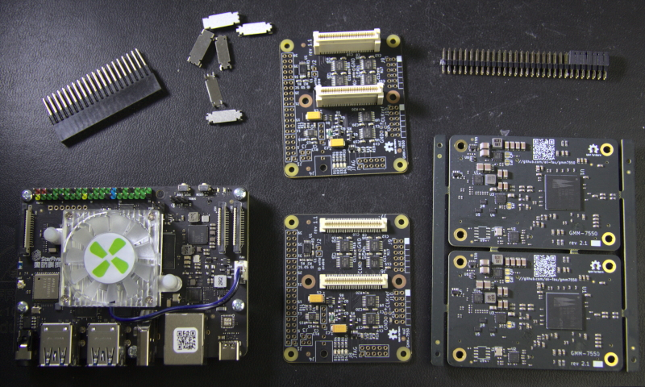

# 2026-07

## 2026-07-03 Friday 🌐 🎬 💾 📚 📑 🔬

### IMX287 and V4l2

```py
import cv2

# Adjust device index, resolution, and format based on your camera hardware
gst_str = ("v4l2src device=/dev/video0 ! "
           "video/x-raw, format=(string)GRAY8, width=(int)704, height=(int)544 ! "
           "appsink")

cap = cv2.VideoCapture(gst_str, cv2.CAP_GSTREAMER)

if not cap.isOpened():
    print("Cannot open camera")
    exit()

while True:
    ret, frame = cap.read()
    if not ret:
        print("Can't receive frame. Exiting ...")
        break

    cv2.imshow('IMX287 High Speed Stream', frame)

    # Press 'q' to stop the stream
    if cv2.waitKey(1) == ord('q'):
        break

cap.release()
cv2.destroyAllWindows()

```

---

```sh
ls -l /dev/video*

v4l2-ctl -d /dev/video0 --all

v4l2-ctl -d /dev/video0 --list-ctrls

v4l2-ctl -d /dev/video0 --set-ctrl brightness=128

v4l2-ctl -d /dev/video0 --list-formats-ext

v4l2-ctl -d /dev/video0 --set-fmt-video=width=1920,height=1080,pixelformat=MJPG


```

---

🌐[使用v4l2-ctl調整 USB camera參數](https://chtseng.wordpress.com/2022/07/18/%E4%BD%BF%E7%94%A8v4l2-ctl%E8%AA%BF%E6%95%B4-usb-camera%E5%8F%83%E6%95%B8/)

---

## 2026-07-02 Thuresday 🌐 🎬 💾 📚 📑 🔬

### 從 Raspberry Pi 5 存取遠端 Samba 共享

sudo apt install cifs-utils smbclient -y

---

## 2026-07-01 Wednesday 🌐 🎬 💾 📚 📑 🔬

### Open Harmonized FPGA Module (oHFM)

[Open Harmonized FPGA Module (oHFM)](https://sget.org/standards/ohfm/)

The Open Harmonized FPGA Module (oHFM™) is the world’s first open standard specifically designed for FPGA and SOC-FPGA modules. It addresses the common challenges of proprietary designs and vendor lock-in by providing a unified, scalable architecture for professional FPGA development.


---

### Understanding High Speed ADC Testing and Evaluation

🌐[Understanding High Speed ADC Testing and Evaluation](https://www.analog.com/en/resources/app-notes/an-835.html)

---

### GMM-7550 Gatemate FPGA Kit



🌐[GMM-7550 Gatemate FPGA Kit](https://www.gmm7550.dev/)

The GMM-7550 is a module providing a convenient way to evaluate GateMate FPGA from Cologne Chip AG and to build custom systems around it. This site contains the documentation for the GMM-7550 module, accompany boards, configuration and control software, and FPGA design examples.

🌐[GateMate-USB3-PHY](https://nlnet.nl/project/GateMate-USB3-PHY/)

---

### FOS - FPGA Operating System Demo

FOS extends the ZUCL framework with linux integration, python libs, C++ runtime management to provide support for: multi-tenancy (concurrent processes with hardware accel.), dynamic offload, GUI, network connection and flexibility.

💾[FOS - FPGA Operating System Demo](https://github.com/FPGA-Research/fos)

---

### Kyokko: a vendor-independent high-speed serialcommunication controller

Kyokko is an open-source implementation of Xilinx Aurora 64B/66B
protocol. It works on both Xilinx and Intel FPGAs, covering the most
common use cases of Aurora protocol options:

- 10Gbps+ of link speeds (depends on PHY settings)
- Duplex communication (no simplex mode)
- Fully supports NFC and UFC flow controls
- Restricted to framing mode (with TLAST) of 8n octet message size
  (no TKEEP signal)

🌐[Kyokko](https://kuma.osana-lab.org/kyokko/)

📚[Kyokko Paper](https://dl.acm.org/doi/epdf/10.1145/3468044.3468051)

💾[Kyokko Github](https://github.com/debugordie/kyokko)

---