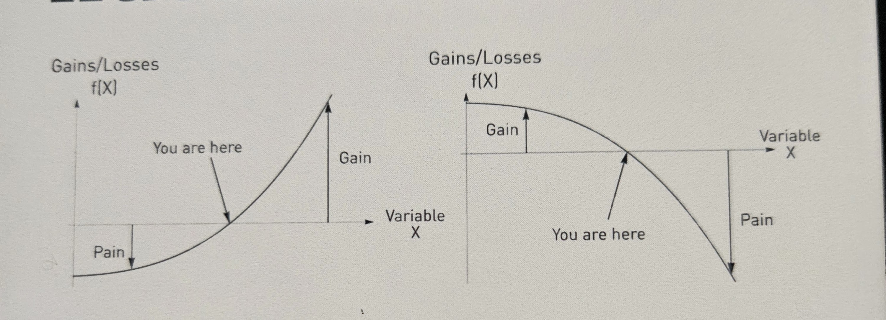
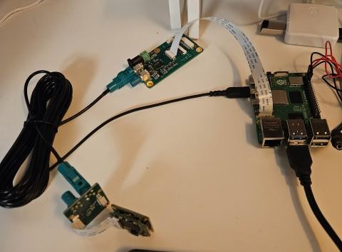
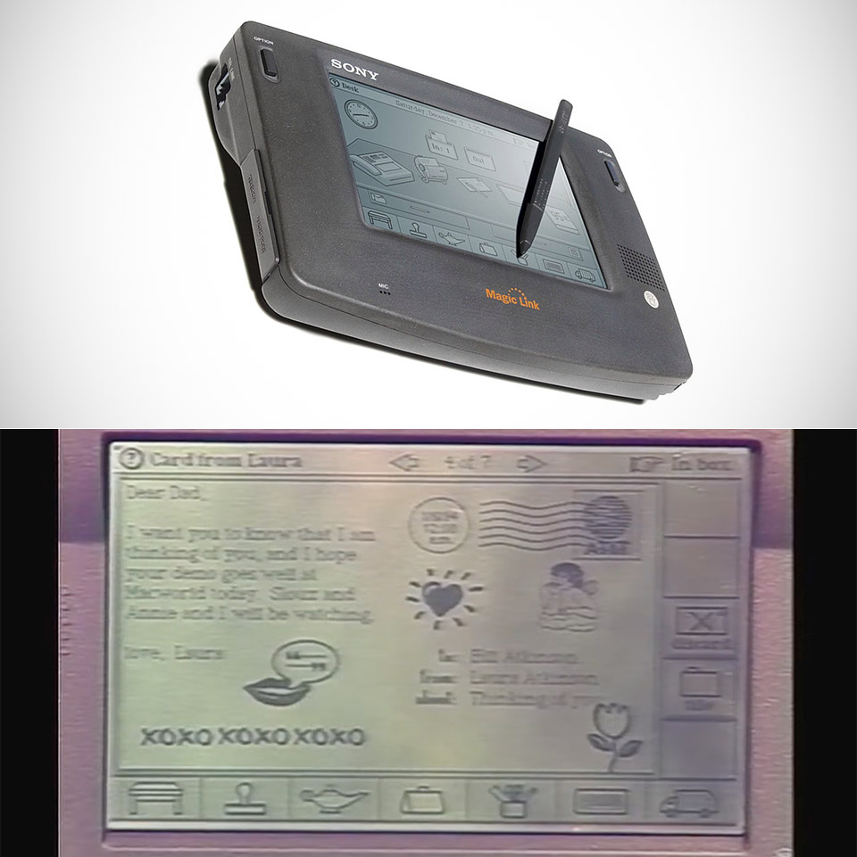
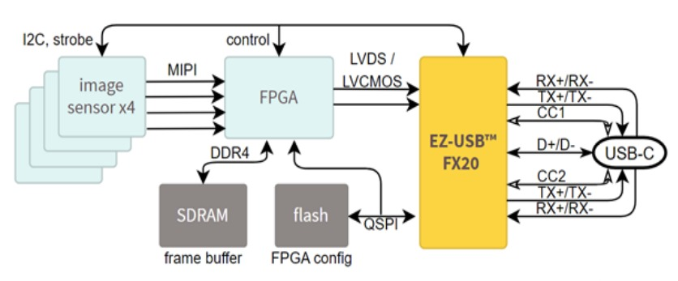
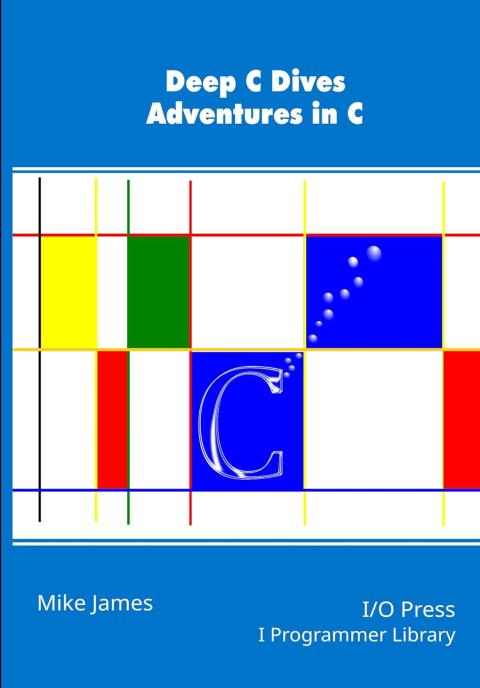

# 2026-07

## 2026-07-31 Friday  🌐 🎬 💾 📚 📑 🔬

---

## 2026-07-30 Thursdeay  🌐 🎬 💾 📚 📑 🔬

---

## 2026-07-29 Wednesday  🌐 🎬 💾 📚 📑 🔬

### Dendrites compute independently of cell body

🌐[Dendrites compute](https://www.thetransmitter.org/memory/dendrites-compute-independently-of-cell-body/)

Dendritic activity can dissociate from cell body activity, depending on an animal’s goal, the new work shows. The findings are the first in-vivo evidence of the long-standing theoretical prediction that a neuron’s dendrites play a separate role from cell bodies in neural computations. The study was published in Science earlier this month. 

---

### TI AWR2243 ADC use MIPI CSI Interface

💾[AWR2243 + AMC4030](https://github.com/Zearatul/AWRMC)

💾[AWR2243 + Xilinx FPGA](https://github.com/digitalyang/awr2243-fpga-capture)

💾[AM273x + AWR2243 cascade radar firmware](https://github.com/sjfenarg/AM273x_LVDS_CLI)

---

### Convexity vs. Concavity (Taleb's Framework)



In Nassim Nicholas Taleb’s philosophy, **convexity** means benefiting from uncertainty, disorder, and volatility (linked to *antifragility*), while **concavity** means being harmed by them (linked to *fragility*).

---

#### 📊 Core Differences

##### 📈 Convex (Antifragile / Smiles upward $\cup$)
* **Payoff Structure:** Upside gains are much larger than downside losses.
* **Response to Chaos:** Loves volatility, stressors, and shocks because the positive impact of a large positive shock outweighs the minor harm of a negative shock.
* **Real-World Example:** Buying a financial option (you risk a small fixed cost for theoretically unlimited upside) or decentralized trial-and-error.

##### 📉 Concave (Fragile / Frowns downward $\cap$)
* **Payoff Structure:** Downside losses accelerate faster than upside benefits.
* **Response to Chaos:** Hated by disorder and volatility because a severe shock causes disproportionate, compounding damage.
* **Real-World Example:** A fine porcelain cup (breaks easily from sudden chaos) or rigid, centralized "too big to fail" institutions.

---

#### 🔍 Summary of Payoff Responses

* **Convex response:** Small errors hurt little, but big successes yield massive rewards.
* **Concave response:** Small errors do mild harm, but extreme events or stress lead to total ruin.


---

## 2026-07-28 Tuesday  🌐 🎬 💾 📚 📑 🔬

### Calling Bullshit (2017)


📑[Calling Bullshit](https://callingbullshit.org/)

The world is awash in bullshit. Politicians are unconstrained by facts. Science is conducted by press release. Higher education rewards bullshit over analytic thought. Startup culture elevates bullshit to high art. Advertisers wink conspiratorially and invite us to join them in seeing through all the bullshit — and take advantage of our lowered guard to bombard us with bullshit of the second order. The majority of administrative activity, whether in private business or the public sphere, seems to be little more than a sophisticated exercise in the combinatorial reassembly of bullshit.

🎬[Calling Bullshit Class Video](https://www.youtube.com/playlist?list=PLPnZfvKID1Sje5jWxt-4CSZD7bUI4gSPS)

---

### Country are limit by Resource not Money

- Human Resource
- Natural Resource

---

### PiZZa — Raspberry Pi Zero on Zephyr RTOS 

💾[PiZZa](https://github.com/jetpax/PiZZa)

Lightning boot time, no bloat and hard real time performance, all on a quad-core 1GHz microcontroller

Boots to a shell over a USB-CDC ACM console — plug a single micro-USB cable from the Pi into your laptop and the Pi shows up as a serial device. No external power supply, no USB-serial adapter, no GPIO header soldering. BCM2710 peripherals, microSD, USB UDC, and SDIO Wi-Fi (CYW43439) are all enabled. Runs on the Raspberry Pi Zero 2 W and the original Pi Zero W.

---

### GLM : General Linear Model

---

### NeMoS (Neural ModelS)

💾[NeMoS (Neural ModelS)](https://github.com/flatironinstitute/nemos)

NeMoS (Neural ModelS) is a statistical modeling framework optimized for systems neuroscience and powered by JAX. It streamlines the process of creating and selecting models, through a collection of easy-to-use methods for feature design.

---

### Pynaviz


[Pynaviz : python neural analysis visualization](https://pynapple-org.github.io/pynaviz/)

Pynaviz provides interactive, high-performance visualizations designed to work seamlessly with Pynapple time series and video data. It allows synchronized exploration of neural signals and behavioral recordings. It is built on top of pygfx, a modern GPU-based rendering engine.

---

### Pynapple 


🌐[pynapple: python neural analysis package](https://pynapple.org/)

Pynapple is a light-weight python library for neurophysiological data analysis.

The goal is to offer a versatile set of tools to study typical data in the field, i.e. time series (spike times, behavioral events, etc.) and time intervals (trials, brain states, etc.).

It also provides users with generic functions for neuroscience such as tuning curves, cross-correlograms and filtering.

🎬[Neural Data Analysis with Pynapple - Guillaume Viejo, NeuroDataReHack 2026](https://www.youtube.com/watch?v=TxLuUwS2FeA)

---

### System Dynamics 1977

🎬[A Philosophical Look at System Dynamics](https://www.youtube.com/watch?v=XL_lOoomRTA&list=PLj_81OyXjt5eg2l95OOJrUnzoaHvhBdHA&index=9&t=211s)

    原來1977年就已經有System Dynamics
    我大概是在1990年代接觸
    在台灣因為第五項修煉 有紅一下 就沒了

🎬[Donella Meadows System Dynamics Series](https://www.youtube.com/playlist?list=PLj_81OyXjt5eg2l95OOJrUnzoaHvhBdHA)

---

### ADI FPGA Power Source


---

### Mouse In FaradayCage Model In Spice


🎬[Extracellular Electrophysiology](https://youtu.be/YE2cdXtzlF4?si=SMqSvb1mNi-20nBR)

---

### Mouse VRef and Ground


---

## 2026-07-27 Monday  🌐 🎬 💾 📚 📑 🔬

### ECP5 with DDR3

💾[Lattice_ECP5_Core_Board_With_DDR3](https://github.com/BellssGit/Lattice_ECP5_Core_Board_With_DDR3)

💾[Sony_subLVDS_receive_on_FPGA](https://github.com/BellssGit/Sony_subLVDS_receive_on_FPGA)

---

### freenet


🌐[Freenet](https://freenet.org/)

Freenet is a peer-to-peer platform for decentralized applications: communication, collaboration, and commerce without reliance on big tech. Your computer becomes part of a global network where apps are unstoppable, interoperable, and built on open protocols.

🎬[Service without Server](https://www.youtube.com/watch?v=3RBNboYUlVI)

---

## 2026-07-24 Friday  🌐 🎬 💾 📚 📑 🔬

### Open-Ephys about Noise

[Open-Ephys about Noise](https://open-ephys.github.io/acq-board-docs/Tutorials/Troubleshooting-noise.html)

The recordings with our acquisition system will contain three parts: 1) The biologically generated signal we are interested in 2) Biologically generated signals we are not interested in, for instance from other regions or other activity types. 3) Electrical signals from other sources, e.g. ‘noise’. It is good to realise that we live in an electrically noisy world.

We can use filtering to extract the frequencies that are relevant to our experiment. For instance, if we want to record spikes, we will filter out slower frequencies that are more likely to be generated by synaptic inputs. Though we can get rid of some noise through filtering, noise with large amplitude or at frequencies similar to our desired signals can be a real problem.

GND vs. REF on the Headstage
The ground (GND) and reference (REF) connectors on the headstage aren’t the same thing, though most EIBs and adapters that we’ve been using do tie them together. The reference is the signal that will be subtracted from your measurement electrodes to produce the output of the headstage. The ground connector is often used with a ground pin or screw to bring the animal to the same level as the acquisition system ground, thereby getting rid of any electric potential difference offsets that may cause the headstage amplifier to saturate. Often, GND and REF are connected, so that fluctuations in the signal detected by the ground pin are used as a reference signal. Alternatively, the two can be separate, which is typical for EEG or EMG recordings. It’s important to understand the difference and decide whether having a connected ground and reference is the correct choice for your experiment. Click here to learn more.

Extra shielding
A simple and fast solution to some otherwise unsolvable noise might be to add even a partial Faraday cage to your recording sites. This is true even with implants that already have a complete shielding - as long as part of your animal is not shielded, it can still pick up noise.

📑[why-do-we-need-a-ground-electrode](https://open-ephys.github.io/ephys-course/EEA/theoryday3.html#why-do-we-need-a-ground-electrode)

🎬[Extracellular Electrophysiology](https://youtu.be/YE2cdXtzlF4?si=SMqSvb1mNi-20nBR)

---

### BPod


🌐[Bpod Wiki](https://sanworks.github.io/Bpod_Wiki/)

💾[Bpod Gen2](https://github.com/sanworks/Bpod_Gen2)

Bpod is an open source platform for animal behavior measurement and real-time stimulus control. Bpod is actively developed and maintained by Sanworks LLC.

💾[Bpod_StateMachine_Firmware](https://github.com/sanworks/Bpod_StateMachine_Firmware)

💾[PyBpod](https://github.com/pybpod/pybpod)

---

### The DANDI Archive open neurophysiology data

🌐[The DANDI Archive](https://dandiarchive.org/)

The BRAIN Initiative archive for publishing and sharing neurophysiology data including electrophysiology, optophysiology, and behavioral time-series, and images from immunostaining experiments.

🌐[International Brain Laboratory](https://www.internationalbrainlab.com/)

---

🎬[NeuroDataReHack 2026](https://nwb.org/events/hck26-2026-janelia-ndrh/)

The DANDI Archive now has 450+ neurophysiology datasets in the Neurodata Without Borders format spanning many species, brain areas, task types, and imaging modalities. These include high-value datasets, e.g. from Allen Institute OpenScope, the MICrONS project, and the International Brain Laboratory Brain Wide Map, as well as diverse contributions from neuroscience labs around the world. In this workshop, we will teach attendees about the open neurophysiology datasets available on the DANDI Archive and train them on how to maximally utilize the archive and the NWB standard to incorporate existing data into their scientific workflows. Feedback from attendees will be used to improve the software and data standard to better enable reanalysis workflows.

---

## 2026-07-23 Thursday  🌐 🎬 💾 📚 📑 🔬

### Litex new lib

[LiteDSP](https://github.com/enjoy-digital/litedsp)

[LiteNVMe](https://github.com/enjoy-digital/litenvme)

---

### Silicon Creation Serdes IP

🌐[Silicon Creation Serdes IP](https://www.siliconcr.com/product/detail/3/serdes)

Our SerDes architecture is in production in processes ranging from 12nm to 180nm and at rates from 100Mbps to 32.75Gbps and proven in 6nm. We offer targeted PHYs including JESD204, XAUI, CPRI, SGMII, CPRI, OIF-CEI, V-by-One HS, Infiniband, PCIe1/2/3/4/5 and Serial RapidIO, and a Multiprotocol PMAs covering over 30 protocols from below 250Mbps to 32.75Gbps as well as SerDes designed for custom requirements. We partner with leading controller vendors to provide a complete solution, and can provide a complete PCIe PHY including PIPE PCS.

Several prominent Tier-1 and specialized silicon IP vendors offer silicon-proven SerDes IPs capable of driving 5 Gbps over 5–7 meters.
Because 5 Gbps is a well-matured data rate, these vendors typically provide it through Multi-Protocol PHYs or Long-Reach (LR) architectures. These configurations pack more than enough equalization budget to handle the high insertion loss of a 7-meter cable.

---

### Serdes IO

#### 1. Synopsys (DesignWare IP)

* IP Line: [Synopsys SerDes PHY IP Portfolio](https://www.synopsys.com/designware-ip/interface-ip/serdes-phy-ip.html) (Multi-Protocol / Enterprise PHYs). [1, 2] 
* Why it fits: Synopsys is the industry market leader in interface IP. Their multi-protocol SerDes blocks cover a massive range of data rates (supporting PCIe, Ethernet, SATA, etc.). [2, 3] 
* Equalization: Their long-reach architectures feature highly programmable Transmit (Tx) equalizers, continuous-time linear equalization (CTLE), and multi-tap Decision Feedback Equalization (DFE) built to handle highly lossy backplanes and long external copper cables. [2] 

#### 2. Cadence Design Systems

* IP Line: [Cadence Multi-Protocol PHY Series](https://www.cadence.com/en_US/home/tools/silicon-solutions/design-ip/interface-ip/low-speed-ethernet/low-speed-ethernet-16g-multi-protocol-phy.html) (e.g., 16G or 32G Multi-Protocol PHY). [4] 
* Why it fits: Cadence offers silicon-proven SerDes macros that natively support lower data rates like 5 Gbps under multi-protocol standards. [4] 
* Equalization: Engineered specifically for long-reach applications. They feature robust analog CTLE peaking gain and digital feedback loops to clean up long-distance signal distortion, complete with built-in diagnostic eye-diagram tools. [4, 5] 

#### 3. Alphawave Semi

* IP Line: [Alphawave ZeusCORE Multi-Standard SerDes](https://www.oiforum.com/wp-content/uploads/OIF_PLL_Demo_Alphawave_Semi_ECOC24.pdf). [6] 
* Why it fits: While Alphawave is widely known for leading-edge high-speed IPs (112G/224G), their "Extra-Long-Reach" (XLR) and Multi-Standard architectures scale down to lower data rates. [6, 7, 8] 
* Equalization: They utilize advanced Digital Signal Processing (DSP)-based equalization. This is exceptionally powerful for long copper distances, as a DSP engine can resolve inter-symbol interference over 7 meters much more aggressively than pure analog architectures. [6] 

#### 4. Rambus

* IP Line: [Rambus Multi-Protocol SerDes PHYs](https://www.rambus.com/blogs/the-rambus-56-gbps-multi-protocol-serdes-phy-a-closer-look/).
* Why it fits: Rambus offers a mature line of long-reach, power-optimized SerDes IPs targeted at enterprise and infrastructure environments.
* Equalization: Their multi-protocol PHYs are designed for long-reach copper and backplanes, featuring an analog Rx CTLE paired with both Tx Feed-Forward Equalization (FFE) and Rx DFE. [9] 

#### 5. Specialized Automotive Vendors (Valens / Inova / TI)
If your 5 Gbps over 7-meter requirement is specifically for automotive or industrial video/sensor transmission, standard protocol IPs (like PCIe/Ethernet) might be overkill. You should look at:

* Valens Semiconductor: Pioneers of HDBaseT and MIPI A-PHY, designed explicitly to drive up to 4–11+ Gbps over 15 meters of low-cost copper cables in harsh environments.
* Texas Instruments (FPD-Link) / Analog Devices (GMSL): Standard proprietary chip-level architectures that excel exactly at moving 5–6 Gbps over 10-meter coaxial or twisted-pair setups.

Would you like to focus on standard digital multi-protocol IP (like Synopsys/Cadence) for an ASIC design, or are you looking for a standardized long-distance spec like MIPI A-PHY / automotive SerDes? [2, 4] 

[1] [https://www.synopsys.com](https://www.synopsys.com/designware-ip/interface-ip/serdes-phy-ip.html)

[2] [https://www.synopsys.com](https://www.synopsys.com/zh-cn/designware-ip/interface-ip/serdes-phy-ip.html)

[3] [https://www.prnewswire.com](https://www.prnewswire.com/news-releases/synopsys-demonstrates-silicon-proof-of-designware-112g-ethernet-phy-ip-in-5nm-process-for-high-performance-computing-socs-301217336.html)

[4] [https://www.cadence.com](https://www.cadence.com/en_US/home/tools/silicon-solutions/design-ip/interface-ip/low-speed-ethernet/low-speed-ethernet-16g-multi-protocol-phy.html)

[5] [https://www.cadence.com](https://www.cadence.com/content/dam/cadence-www/global/en_US/documents/tools/silicon-solutions/protocol-ip/56gbps-longreach-serdes-tmsc-7nm-br.pdf)

[6] [https://www.oiforum.com](https://www.oiforum.com/wp-content/uploads/OIF_PLL_Demo_Alphawave_Semi_ECOC24.pdf)

[7] [https://www.mem.com.tw](https://www.mem.com.tw/%E8%A5%BF%E9%96%80%E5%AD%90%E6%94%9C%E6%89%8Balphawave-semi%E6%8E%A8%E9%80%B2%E7%9F%BDip%E6%8A%80%E8%A1%93%E5%8A%A0%E9%80%9F%E7%94%A2%E5%93%81%E4%B8%8A%E5%B8%82/)

[8] [https://cn.design-reuse.com](https://cn.design-reuse.com/news/53901/alphawave-semi-3nm-connectivity-chiplet-platforms.html)

[9] [https://www.rambus.com](https://www.rambus.com/blogs/the-rambus-56-gbps-multi-protocol-serdes-phy-a-closer-look/)

---

## 2026-07-22 Wednesday 🌐 🎬 💾 📚 📑 🔬

### Open-Ephys has Stim RHS2116

🌐[RHS2116 Headstage](https://open-ephys.github.io/onix-docs/Hardware%20Guide/Headstages/headstage-rhs2116.html)

Two RHS2116 ICs for a combined 32 bi-directional ephys channels

~1 millisecond active stimuls artifact recovery

Max stimulator current: 2.55mA @ +/-7V compliance.

Sample rate: 30193.2367 Hz

Stimulus active and stimulus trigger pins

On-board Lattice Crosslink™ FPGA for real-time data arbitration

---

### LxBB5 – Photobleaching Box

🌐[LxBB5 – Photobleaching Box](https://www.tdt.com/product/lxbb5/)

The traditional way to do this is to connect the subject fiber directly to a LED, run the LED at high power for several hours, and then switch to the next color in your setup. This shortens the life of your photometry LEDs and takes a long time. A three color photometry system takes six hours a week in added time and attention to properly photobleach. This is no longer necessary with the LxBB5.

The LxBB5 is a stand alone photobleaching device that does not require any Synapse, RZ10x / RZ5P, or iCon connections. It has a DC power supply and you can run it anywhere with a nearby outlet. The bleach box sends a powerful broad-spectrum white light at 500 mA through the FC port so you can bleach multiple colors simultaneously.

---

### ADC Comparison: Why SAR Formats Coexist with Delta-Sigma 

While Delta-Sigma ADCs offer unmatched noise performance and high resolution, they sacrifice speed, latency, and flexibility. System engineers choose between **SAR (Successive Approximation Register)** and **Delta-Sigma** based on fundamental hardware architectural trade-offs.

---

#### 1. Core Architectural Differences

| Feature | SAR ADC | Delta-Sigma ADC |
| :--- | :--- | :--- |
| **Primary Strength** | Speed, zero latency, multi-channel flexibility | Ultra-low noise, high resolution (24/32-bit) |
| **Sampling Mechanism** | "Snapshot" (Samples Nyquist bandwidth once) | Oversampling + Noise Shaping (Processes continuously) |
| **Latency / Delay** | Zero (Result available next clock cycle) | High (Requires digital filter settling time) |
| **Power Scaling** | Scales with sample rate (Draws near-zero at rest) | Constant static power (Active operational amplifiers) |

---

#### 2. Why Engineers Still Build and Choose SAR ADCs

##### ⚡ Speed and Bandwidth
* **SAR ADCs** operate at much higher speeds, typically ranging from **1 MSPS to over 100 MSPS** (Mega Samples Per Second). 
* **Delta-Sigma ADCs** are bottlenecked by their Oversampling Ratio (OSR). Because they must sample a signal hundreds of times to output a single high-resolution data point, their usable input bandwidth is generally restricted to audio or low-frequency ranges.

##### ⏱️ Zero Latency (Instantaneous Response)
* **SAR ADCs** have zero pipeline delay. The digital output matches the analog input immediately after the single conversion cycle. This is critical for **real-time closed-loop control systems** (e.g., motor control, robotics, power grid switching) where a delayed response causes system instability.
* **Delta-Sigma ADCs** suffer from group delay caused by their internal digital decimation filters (Sinc or FIR filters). The data takes multiple clock cycles to flush through the digital filter pipeline before a reliable output is available.

##### 🔀 Multi-Channel Multiplexing
* **SAR ADCs** can switch between different analog input channels (via a multiplexer) seamlessly. The very first sample taken after switching to a new channel is 100% accurate.
* **Delta-Sigma ADCs** handle multiplexing poorly. Every time the input switches to a new channel, the internal digital filter must flush out old data and re-settle. This drastically drops the effective throughput of multi-channel systems.

##### 🔋 Power Consumption Efficiency
* **SAR ADCs** utilize a capacitive DAC structure that only draws power during charge-redistribution switching. If the system stops sampling, power drops to near zero.
* **Delta-Sigma ADCs** rely on continuous-time integrators and active operational amplifiers that constantly draw bias currents regardless of the sampling frequency.

---

#### 3. Summary of Ideal Use Cases

##### Choose **SAR** when your project involves:
* High-frequency transients or RF applications (Radar, wireless comms).
* Motor control, automotive engine management, and robotics.
* Multi-channel data acquisition arrays (Medical ultrasound, sonar).

##### Choose **Delta-Sigma** when your project involves:
* High-fidelity audio recording and playback.
* Precision weigh scales and strain gauges.
* Slow industrial environmental sensors (Thermocouples, RTDs, pressure sensors).


---

## 2026-07-21 Tuesday 🌐 🎬 💾 📚 📑 🔬

### ADC artifacts of Intan

[Intan Technologies integrated circuits can produce analog-todigital conversion artifacts that affect neural signal acquisition](../papers/2026/Intan%20Technologies%20integrated%20circuits%20can%20produce%20analog-todigital%20conversion%20artifacts%20that%20affect%20neural%20signal%20acquisition.pdf)

    Main Results: We found larger ADC artifacts in recordings using the Intan RHX data
    acquisition software versions 3.0–3.2, which did not run the necessary ADC calibration command
    when the inputs to the Intan recording controller were rescanned. This has been corrected in the
    Intan RHX software version 3.3. We found that the ADC calibration routine significantly reduced,
    but did not fully eliminate, the occurrence and size of ADC artifacts as compared with recordings
    acquired when the calibration routine was not run (p < 0.0001). When the ADC calibration routine
    was run, we found that the artifacts produced by each ADC were consistent over time, enabling us
    to sort ICs by performance.

--- 

### MIPI FPC Pin Count & Specifications Reference Table

| Pin Count | Typical Pitch | Max Supported Lanes | Primary Applications (CSI / DSI) | Core Features & Extra Signals Breakdown |
| :--- | :--- | :--- | :--- | :--- |
| **15-Pin** | 1.0 mm | 2-Lane | Legacy Cameras / Displays (CSI/DSI) | Legacy standard for Raspberry Pi 1 to 4. Contains basic lines: single 3.3V power rail, 1x I2C bus, and 1-2 control IOs. |
| **22-Pin** | 0.5 mm | 4-Lane | High-Density Cameras / Displays (CSI/DSI) | Standard for Raspberry Pi 5, Pi Zero, and Jetson carrier boards. Adds 2 more data lanes and extra GND pins for crosstalk shielding. |
| **24-Pin** | 0.5 mm / 0.3 mm | 4-Lane | Industrial Cameras / IoT EVBs (CSI) | Widely used in Google Coral Dev Boards and industrial vision systems. Includes full 4-Lane MIPI with hardware trigger and flash sync pins. |
| **30-Pin** | 0.5 mm | 4-Lane | Medical & Industrial Modules (CSI/DSI) | Designed for sensors requiring multiple clean analog power rails (e.g., 2.8V AV_DD, 1.2V Core, 1.8V IO_DD) to reduce noise. |
| **31-Pin** | 0.3 mm | 4-Lane | Rockchip EVBs / Custom Modules (CSI) | High-density interface commonly seen on Rockchip platforms (e.g., Radxa ROCK series) to cram full I/O features into ultra-tight spaces. |
| **39 / 40-Pin**| 0.5 mm | 4-Lane | Small-to-Medium Touchscreens (DSI) | **The absolute industry standard for embedded displays.** Dedicates 10 pins to MIPI, while the rest integrate Touch Panel (TP) I2C and high-voltage Backlight (LED+/LED-). |
| **50 / 60-Pin**| 0.5 mm | 8-Lane (Dual-MIPI) | 2K/4K Displays / VR Headsets (DSI) | Uses Dual-Channel MIPI DSI to achieve massive bandwidth for high-resolution panels. Packs multiple backlight strings and touch interfaces. |
| **Custom B2B** | 0.35 mm | 2-Lane / 4-Lane | Smartphones / Tablets Internal Layouts | Utilizes Board-to-Board micro-connectors rather than insertion-style FPCs. Pin counts (e.g., 34, 42, 54) are entirely customized by OEMs to fit the motherboard routing. |

---

#### 🛠️ Hardware Implementation Checklist

*   **Impedance Control:** Ensure all MIPI High-Speed differential pairs (Clock and Data) are routed with a target differential impedance of **100 $\Omega$ (±10%)** across the FPC and PCB.
*   **Intra-pair Skew:** Keep the length trace matching between the Positive (P) and Negative (N) signals within **0.15 mm (approx. 5-10 mils)** to prevent phase shifts.
*   **IO Voltage Warning:** Verify control bus voltages (I2C/CCI). Legacy 15-pin setups occasionally mixed 3.3V, but modern 22-pin to 40-pin high-density systems almost exclusively use **1.8V** signaling. Connecting a 3.3V master to a 1.8V sensor will fry the module.

---

### PICO SDK V2.3.0 Update

🎬[This 'Minor' SDK Update Unlocks Hidden RAM on Your RP2350](https://www.youtube.com/watch?v=F1kM4Ts2qJ8)

- 🔧 XIP Cache → Extra SRAM — Claw back 8KB by shrinking the XIP cache. Game-changer for memory-constrained RP2350 builds.
- 💾 PS RAM goes standard — Proper malloc/free for PS RAM with graceful fallback to main heap. No more hacking board files.
- 😴 Low Power library — Sleep and Hibernate modes that actually wake up. GPIO or internal clock triggers, production-ready for RP2040 & RP2350.
- 📋 11 new boards — Including DebugPro, the Raspberry Pi 500 RP2040 keyboard, and Waveshare RP2350 Pi Zero
- 🔄 USB Reset library — Cleaner, dedicated separation from the main stack.
- 🔵 BT stack 1.8.2 — Bluetooth upgrade. New project incoming? 👀
- 🔒 Security fix — Embed TLS patched. Don't skip this one.

---

### VEYE Camera IMX287 and V-By-One 

📑[IMX287](https://wiki.veye.cc/index.php/MV-MIPI-IMX287M_Data_Sheet)

📑[V-by-One-HS KIT appnotes 4 rpi](https://wiki.veye.cc/index.php?title=V-by-One-HS_KIT_appnotes_4_rpi)

📑[Mv series camera appnotes 4 rpi](https://wiki.veye.cc/index.php?title=Mv_series_camera_appnotes_4_rpi)



Camera -> V-By-One (30Pin include 5V)

V-By-One -> Pi (15Pin for Pi 4, 22Pin for Pi 5)

---

## 2026-07-20 Monday 🌐 🎬 💾 📚 📑 🔬

### The Black Swan


2026-038

---

### Zilog Z80 turn 50 years old


🌐[The Zilog Z80](https://hackaday.com/2026/07/19/remembering-the-zilog-z80-as-it-turns-fifty-years-old/)

---

## 2026-07-17 Friday 🌐 🎬 💾 📚 📑 🔬

### Open Logic – An FPGA Standard Library

🌐[Open Logic – An FPGA Standard Library](https://vhdlwhiz.com/open-logic-fpga-standard-library/)

💾[Open Logic – An FPGA Standard Library](https://github.com/open-logic/open-logic)

---

### OP Small Signal Layout Consideration

對於運算放大器（Op-Amp）的小訊號（Small Signal）佈線，一般建議使用 10 到 15 mil (0.254 mm 至 0.381 mm) 的線寬。這能提供足夠的耐用性，避免過度受製程公差影響，同時將電阻與電感效應降至最低。 

以下是針對運算放大器佈線的具體指南與建議：

佈線寬度與間距建議

小訊號線寬： 10 ~ 15 mil（0.25 ~ 0.38 mm）

原因： 寬度大於 10 mil 有助於確保長期佈線的可靠性，防止製作過程中的過度蝕刻。音頻應用中，這有助於降低細線可能引起的高頻衰減或阻抗問題。 

間距法則 (3W Rules)： 訊號線之間的距離應至少為線寬的 3 倍。

原因： 這能有效減少相鄰走線之間的串擾（Crosstalk）和電磁干擾。

雜訊隔離： 將小訊號與電源、接地走線分開。

電源供應（Power & GND）： 運算放大器的電源線和旁路電容（Bypass Capacitor）的走線應維持較寬的線徑（建議大於 20 ~ 50 mil）以減少電感。

輸入/回授節點： 將反相與非反相輸入端以及回授電阻（Feedback Network）的走線盡量縮短，減少寄生電容與天線效應。

---

### 一台 100 美元口袋型探測器，就能偵測穿越你身體的宇宙粒子

🌐[CosmicWatch](https://technews.tw/2026/07/12/cosmicwatch-particle-muon/)

---

## 2026-07-16 Thuresday 🌐 🎬 💾 📚 📑 🔬

### FPGA USB3

📑[Design FPGA Based USB3 Stack](../papers/2026/Design%20of%20FPGA-based%20USB%203.0%20device%20protocol%20stack%20V2.1.pdf)

💾[USB Controller for GateMate FPGA](https://github.com/GMM-7550/gmm7550-usb)

---

### USB 3.1 線芯 AWG 組合

市場上最常見的標準高品質線材（如常見的 28/24 AWG 規格）配置如下：

供電線 (VBUS / GND)： 20 ~ 24 AWG（線徑較粗，負責穩定傳輸 3A 以上電流，減少壓降）。

SuperSpeed 高速數據線 (USB 3.1 5G/10G)： 26 ~ 32 AWG（通常為 28 或 30 AWG 的雙屏蔽差動對，負責高速訊號）。

傳統數據線 (D+ / D- 負責向下相容 USB 2.0)： 28 ~ 34 AWG（線徑較細）。

---

### 固定的夏令時間

    對於台灣人來說 夏令時間沒啥鳥用
    但是
    對高緯度的人來說 就是一個靈活的控制
    不懂的地方是
    這個控制本來就是因為緯度的原因
    這個變因不變下
    為何要去固定一個可以調整的參數
    
    改變真的很難忍受？

### Kernel Buffer Size

Now for what I consider the silver bullet: Kernel buffer size. As soon as I set this I got 0% packet loss at 500mbps (similar to my iperf results). Rust doesn't expose a way to set this and neither does tokio. It was only using socket2 that you can use the set_recv_buffer_size. In my case I set it to 65535 * 100.

Other things I tried:
io_uring: Added more cpu usage with no noticeable gain in performance.

Things I learned:
Setting up a thread just to read the udp socket is a good idea.
Moving the packets to another thread for processing is CPU intensive. Right now I'm using thingbuf.

You should probably do some kind of flow control on sender side. It may be best to do this by measuring how long you slept and sending the correct amount of packets rather than spinning to save CPU.

Just wanted to say thank you to everyone for their input. A lot of people here pointed to correct solution as well as changes that increased performance overall. Thank you!

---

## 2026-07-15 Wednesday 🌐 🎬 💾 📚 📑 🔬

### Eliminating OS-induced jitter on Linux-like platforms

🌐[Eliminating OS-induced jitter on Linux-like platforms](https://community.rti.com/kb/eliminating-os-induced-jitter-linux-platforms)

### General Magic was the Company Apple Spun Off That Later Built Its Future



🌐[General Magic](https://www.techeblog.com/general-magic-apple-spinoff-iphone-ipad-90s/)

---

### High Speed DAQ


🌐[liquidinstruments](https://liquidinstruments.com/products/hardware-platforms/mokudelta/)

---

### Cypress FX20 Camera Examples



💾[EZ-USB™ FX20: LVDS USB streaming application](https://github.com/Infineon/mtb-example-fx20-lvds-usb-stream)

💾[EZ-USB™ FX20: Slave FIFO 2-bit application](https://github.com/Infineon/mtb-example-fx20-slave-fifo-2bit)

💾[EZ-USB™ FX20: USB test application](https://github.com/Infineon/mtb-example-fx20-usb-testapp)

---

## 2026-07-14 Tuesday 🌐 🎬 💾 📚 📑 🔬

### Onix Paper 2025

📑[Onix 2025](../papers/2026/s41592-024-02521-1.pdf)

📑[Onix 2023](../papers/2026/2023.08.30.554672v1.full.pdf)

---

## 2026-07-13 Monday 🌐 🎬 💾 📚 📑 🔬

### Faraday Cage Connect


📑[Intan Noise Reduction PDF](../papers/2026/Intan_noise_reduction_techniques.pdf)

---

## 2026-07-09 Thursday 🌐 🎬 💾 📚 📑 🔬

### I2C-Pico-USB

💾[I2C-Pico-USB](https://github.com/dquadros/I2C-Pico-USB)

An RP2040 based adaptation of the i2c-tiny-usb.

"Attach any I2C client chip (thermo sensors, AD converter, displays, relays driver, ...) to your PC via USB ... quick, easy and cheap! Drivers for Linux, Windows and MacOS available." (from the README.md file in i2c-tiny-usb).

---

### Apple took inspiration from Sony when designing the iPhone 

Old news Just happen to talk about it.

🌐[Apple took inspiration from Sony when designing the iPhone](https://www.xperiablog.net/2012/07/27/apple-took-inspiration-from-sony-when-designing-the-iphone/)

Given this legacy, it is interesting to note that Apple took inspiration from Sony when designing the iPhone. This information has surfaced in the ongoing patent infringement battle between Samsung and Apple. Samsung’s argument is that even if they did take inspiration on some aspects of their mobile design from Apple, Apple has done the same in the past and that this practise is commonplace in the consumer electronics market.

---

### Ground

🌐[What Ground Means in Oscilloscopes](https://www.keysight.com/used/us/en/knowledge/glossary/oscilloscopes/what-is-ground-in-electronics)

#### Earth Ground

Earth ground refers to a physical connection to the earth, usually via a grounding rod driven into the soil. This type of grounding system primarily focuses on safety by providing a path for fault currents to dissipate safely into the earth.

Fault protection: earth ground acts as a route for electrical surges and fault currents, channeling them away from sensitive components and human operators.
Static discharge: Connecting to earth ground can eliminate potentially damaging static electricity that may have built up in a circuit.
Standardization: In most electrical systems, earth ground typically appears as a green wire, making it easily recognizable for proper setup and safety precautions.

#### Signal Ground

Signal ground serves as the reference point for all signal-level voltages within a circuit or device. It's crucial for obtaining accurate and meaningful measurements.

Measurement reference: Any voltage level in your circuit will be measured with respect to the signal ground. This is your working baseline.
Isolation: Unlike earth ground, signal ground may or may not be connected to earth. In some applications, isolating signal ground from earth ground is essential to avoid ground loops or other interference.
Data integrity: A stable signal ground ensures that the data you collect is free from artificial offsets that can occur due to a fluctuating reference level.

#### Chassis Ground

Chassis ground is usually connected to the metal casing or chassis of a device. This type of ground serves a dual purpose: shielding the internal electronics from external noise and often providing an additional safety measure by being connected to earth ground.

Electromagnetic shielding: A metal chassis connected to ground can act as a Faraday cage, shielding internal components from external electromagnetic interference.
Noise reduction: Chassis ground can serve as a sink for electrical noise, reducing its impact on the device's performance.
Safety precautions: While not its primary role, chassis ground often connects to earth ground to offer an additional layer of protection against electrical faults.
By understanding the intricacies of these different types of grounding systems, you equip yourself to make more informed decisions in your measurements and system setups, effectively sidestepping common pitfalls and hazards.

### Isolation Transformer: Your Buffer Zone

An isolation transformer can sever the direct electrical connection between your circuit and earth ground, effectively isolating the two. This prevents ground loops and reduces the risks associated with potential voltage differences.

Ground loop prevention: By isolating your circuit, the transformer eliminates multiple grounding paths, preventing ground loops from forming.
Surge protection: Isolation transformers can offer a degree of protection against electrical surges, reducing the risk of equipment damage.

---

## 2026-07-08 Wednesday 🌐 🎬 💾 📚 📑 🔬

### An example of setting webcam settings via v4l2-ctl in a python script.

```py
import cv2
import subprocess

### for reference, the output of v4l2-ctl -d /dev/video1 -l (helpful for min/max/defaults)
#                     brightness (int)    : min=0 max=255 step=1 default=128 value=128
#                       contrast (int)    : min=0 max=255 step=1 default=128 value=128
#                     saturation (int)    : min=0 max=255 step=1 default=128 value=128
# white_balance_temperature_auto (bool)   : default=1 value=1
#                           gain (int)    : min=0 max=255 step=1 default=0 value=0
#           power_line_frequency (menu)   : min=0 max=2 default=2 value=2
#      white_balance_temperature (int)    : min=2000 max=6500 step=1 default=4000 value=2594 flags=inactive
#                      sharpness (int)    : min=0 max=255 step=1 default=128 value=128
#         backlight_compensation (int)    : min=0 max=1 step=1 default=0 value=0
#                  exposure_auto (menu)   : min=0 max=3 default=3 value=1
#              exposure_absolute (int)    : min=3 max=2047 step=1 default=250 value=333
#         exposure_auto_priority (bool)   : default=0 value=1
#                   pan_absolute (int)    : min=-36000 max=36000 step=3600 default=0 value=0
#                  tilt_absolute (int)    : min=-36000 max=36000 step=3600 default=0 value=0
#                 focus_absolute (int)    : min=0 max=250 step=5 default=0 value=125
#                     focus_auto (bool)   : default=1 value=0
#                  zoom_absolute (int)    : min=100 max=500 step=1 default=100 value=100

### I created a dict of the settings of interest
### note that if you have any auto settings on, e.g. focus_auto=1,
### it will complain when it goes to set focus_absolute, but I didn't have
### any issues other than the warning
cam_props = {'brightness': 128, 'contrast': 128, 'saturation': 180,
             'gain': 0, 'sharpness': 128, 'exposure_auto': 1,
             'exposure_absolute': 150, 'exposure_auto_priority': 0,
             'focus_auto': 0, 'focus_absolute': 30, 'zoom_absolute': 250,
             'white_balance_temperature_auto': 0, 'white_balance_temperature': 3300}

### go through and set each property; remember to change your video device if necessary~
### on my RPi, video0 is the usb webcam, but for my laptop the built-in one is 0 and the
### external usb cam is 1
for key in cam_props:
    subprocess.call(['v4l2-ctl -d /dev/video1 -c {}={}'.format(key, str(cam_props[key]))],
                    shell=True)

### uncomment to print out/verify the above settings took
# subprocess.call(['v4l2-ctl -d /dev/video1 -l'], shell=True)
  
### showing that I *think* one should only create the opencv capture object after these are set
### also remember to change the device number if necessary
cam = cv2.VideoCapture(1)
```

💾[Gist Source](https://gist.github.com/dortmans/7b27b76ad911ca4d9ebefe6c8b7e6f64)

---

## 2026-07-07 Tuesdeay 🌐 🎬 💾 📚 📑 🔬

### Configurable Logic Block (CLB)

🌐[PIC CLB](https://www.microchip.com/en-us/products/microcontrollers/8-bit-mcus/peripherals/system-flexibility/clb)


🌐[How To CLB](https://developerhelp.microchip.com/xwiki/bin/view/products/mcu-mpu/8-bit-mcu-tips-tricks/configurable-logic-block/)

---

### 感慨美國改變，「微處理器之父」法金搬回義大利

🌐[感慨美國改變，「微處理器之父」法金搬回義大利](https://technews.tw/2026/07/03/federico-faggin-microprocessor-father-leaves-us-returns-italy-changes/)

奠定現代電腦科技基礎的「微處理器之父」佛德里克·法金（Federico Faggin，首圖左），在旅居美國長達 57 年之後返回祖國義大利居住。他向義媒表示「我的美國已不復存在」，並呼籲大家不要相信技術官僚，「他們滿腦子想的都是權力和金錢。」

法金今年高齡84歲，他是世上首個商用微處理器的發明者。微軟創辦人比爾‧蓋茲（Bill Gates）曾形容，若沒有法金，美國矽谷（Silicon Valley）就只是個山谷；法金2010年獲時任美國總統歐巴馬頒發國家科學獎章（National Medal of Science）。

法金近期離開美國搬回義大利老家維成薩（Vicenza），他2日接受義大利晚郵報（Corriere della Sera）專訪表示，「我記憶中的美國已不復存在，它日益向商業和科技傾斜，尤其是在矽谷，人們對網路與對資訊大量濫用。」

「我的世界是硬體主導，而不是用軟體欺騙別人的世界，這多少有點令人失望。」法金描述，當年他在美國加州比在義大利更自在，但他不喜歡近年美國的發展，「特別是我一點也不喜歡這種輕視戰爭的態度」。

被問到是否仍鼓勵義大利年輕人出國，法金認為，出國增加見識總是好的，但義大利並非全無機會，他自己也投資一些義大利科技公司，例如一家位在帕多瓦（Padova）的P49，專門開發「以人為本」的人工智慧。

法金表達對人工智慧遭濫用的擔憂，他提到，在美國人工智慧幾乎不受任何監管，「問題在於，最想不受限制使用人工智慧的恰恰是政府，是那些本應該負責監管的人。即使是歐洲法規也為歐盟國防領域開了例外。」

法金表示，他自2008年以來一直在研究自由意志和意識的問題，尤其是在人工智慧背景下，人工智慧正在主導矽谷的商業。「義大利也是個充滿哲學文化和思想的地方，比我在美國所見豐富得多。我們經歷過文藝復興，如果美義攜手合作而不是彼此過度競爭，我們就能迎來新的文藝復興。」

（作者：黃雅詩；首圖來源：達志影像）

---

### Scalable Network Stack supporting TCP/IP, RoCEv2, UDP/IP at 10-100Gbit/s

💾[Scalable Network Stack](https://github.com/fpgasystems/fpga-network-stack)

    Prerequisites
    Xilinx Vivado 2022.2
    cmake 3.0 or higher
    Supported boards (out of the box)

    Xilinx VC709
    Xilinx VCU118
    Alpha Data ADM-PCIE-7V3

🌐[Pay IP from DGWay](https://dgway.com/TOE-IP_X_E.html)

TCP Offloading Engine IP core (TOE200G/100G/40G/25G/10G/1G-IP) is the epochal solution implemented without CPU. Generally, TCP processing is so complicated that expensive high-end CPU is required. TOE-IP core series built by pure hardwired logic can take place of such extra CPU for TCP protocol management. This IP product includes reference design for AMD FPGA. It helps you to reduce development time.
DesignGateway provide free demo file for AMD FPGA boards. You can evaluate TOE-IP on real board before purchasing.

🌐[Wireguard FPGA](https://github.com/chili-chips-ba/wireguard-fpga)

Virtual Private Networks (VPNs) are the central and indispensable component of Internet security. They comprise a set of technologies that connect geographically dispersed, heterogeneous networks through encrypted tunnels, creating the impression of a homogenous private network on the public shared physical medium.

---

## 2026-07-06 Monday 🌐 🎬 💾 📚 📑 🔬

### Fooled by Randomness


2026-037

---

### Deep C Dives Adventures in C



2026-036

---

## 2026-07-03 Friday 🌐 🎬 💾 📚 📑 🔬

### IMX287 and V4l2

```py
import cv2

# Adjust device index, resolution, and format based on your camera hardware
gst_str = ("v4l2src device=/dev/video0 ! "
           "video/x-raw, format=(string)GRAY8, width=(int)704, height=(int)544 ! "
           "appsink")

cap = cv2.VideoCapture(gst_str, cv2.CAP_GSTREAMER)

if not cap.isOpened():
    print("Cannot open camera")
    exit()

while True:
    ret, frame = cap.read()
    if not ret:
        print("Can't receive frame. Exiting ...")
        break

    cv2.imshow('IMX287 High Speed Stream', frame)

    # Press 'q' to stop the stream
    if cv2.waitKey(1) == ord('q'):
        break

cap.release()
cv2.destroyAllWindows()

```

---

```sh
ls -l /dev/video*

v4l2-ctl -d /dev/video0 --all

v4l2-ctl -d /dev/video0 --list-ctrls

v4l2-ctl -d /dev/video0 --set-ctrl brightness=128

v4l2-ctl -d /dev/video0 --list-formats-ext

v4l2-ctl -d /dev/video0 --set-fmt-video=width=1920,height=1080,pixelformat=MJPG


```

---

🌐[使用v4l2-ctl調整 USB camera參數](https://chtseng.wordpress.com/2022/07/18/%E4%BD%BF%E7%94%A8v4l2-ctl%E8%AA%BF%E6%95%B4-usb-camera%E5%8F%83%E6%95%B8/)

---

## 2026-07-02 Thuresday 🌐 🎬 💾 📚 📑 🔬

### 從 Raspberry Pi 5 存取遠端 Samba 共享

sudo apt install cifs-utils smbclient -y

---

## 2026-07-01 Wednesday 🌐 🎬 💾 📚 📑 🔬

### Open Harmonized FPGA Module (oHFM)

[Open Harmonized FPGA Module (oHFM)](https://sget.org/standards/ohfm/)

The Open Harmonized FPGA Module (oHFM™) is the world’s first open standard specifically designed for FPGA and SOC-FPGA modules. It addresses the common challenges of proprietary designs and vendor lock-in by providing a unified, scalable architecture for professional FPGA development.


---

### Understanding High Speed ADC Testing and Evaluation

🌐[Understanding High Speed ADC Testing and Evaluation](https://www.analog.com/en/resources/app-notes/an-835.html)

---

### GMM-7550 Gatemate FPGA Kit


🌐[GMM-7550 Gatemate FPGA Kit](https://www.gmm7550.dev/)

The GMM-7550 is a module providing a convenient way to evaluate GateMate FPGA from Cologne Chip AG and to build custom systems around it. This site contains the documentation for the GMM-7550 module, accompany boards, configuration and control software, and FPGA design examples.

🌐[GateMate-USB3-PHY](https://nlnet.nl/project/GateMate-USB3-PHY/)

---

### FOS - FPGA Operating System Demo

FOS extends the ZUCL framework with linux integration, python libs, C++ runtime management to provide support for: multi-tenancy (concurrent processes with hardware accel.), dynamic offload, GUI, network connection and flexibility.

💾[FOS - FPGA Operating System Demo](https://github.com/FPGA-Research/fos)

---

### Kyokko: a vendor-independent high-speed serialcommunication controller aka Serdes

Kyokko is an open-source implementation of Xilinx Aurora 64B/66B
protocol. It works on both Xilinx and Intel FPGAs, covering the most
common use cases of Aurora protocol options:

- 10Gbps+ of link speeds (depends on PHY settings)
- Duplex communication (no simplex mode)
- Fully supports NFC and UFC flow controls
- Restricted to framing mode (with TLAST) of 8n octet message size
  (no TKEEP signal)

🌐[Kyokko](https://kuma.osana-lab.org/kyokko/)

📚[Kyokko Paper](https://dl.acm.org/doi/epdf/10.1145/3468044.3468051)

💾[Kyokko Github](https://github.com/debugordie/kyokko)

---