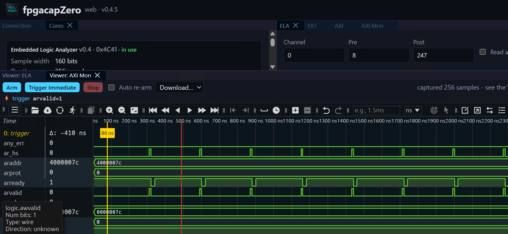

# 2026-09

## 2026-09-18 Friday  🌐 🎬 💾 📚 📑 🔬

---

## 2026-09-17 Thursday  🌐 🎬 💾 📚 📑 🔬

---

## 2026-09-16 Wednesday  🌐 🎬 💾 📚 📑 🔬

---

## 2026-09-15 Tuesday  🌐 🎬 💾 📚 📑 🔬

---

## 2026-09-14 Monday  🌐 🎬 💾 📚 📑 🔬

### LiteUSB, LiteLIB and CH569 Tool

💾[LiteUSB](https://github.com/hansfbaier/liteusb)

LiteUSB is a small footprint and configurable USB device gateware library, originally developed as a port of LUNA from Amaranth HDL to Migen/LiteX. It provides a complete USB 2.0 device stack for FPGA designs.

LiteUSB is part of the LiteX ecosystem. Using Migen to describe the HDL allows the core to be highly configurable. It can be used as a LiteX library or integrated into standard design flows by generating Verilog RTL.

---

💾[LiteLIB](https://github.com/hansfbaier/litelib)

LiteLib provides a collection of small, reusable hardware building blocks for Migen-based FPGA designs. These cores fill gaps not covered by LiteX's built-in core library.

Originally ported from the Amaranth-based amlib utility library, all cores are pure Migen with no LiteX dependency — they can be used standalone in any Migen project or integrated into a LiteX SoC.

---

💾[CH569 Tool](https://github.com/hansfbaier/ch569tool)

An open sourced python command line flash tool for flashing WinChipHead CH56x series RISC-V USB micro controllerwith bootloader version(BTV) v2.70. (You can check the version by using the official CH55x Tool.)

---

### 墨西哥女高中生打造低頻聲波裝置，8 秒就能滅火

🌐[墨西哥女高中生打造低頻聲波裝置，8 秒就能滅火](https://technews.tw/2026/09/10/vortex-tech/)

如果可以縮小 就太棒了 無須化學物質 不會過期

---

### The paradox at the heart of AI and science

🎬[The paradox at the heart of AI and science](https://www.youtube.com/watch?v=svl_1upFpQo)

Terence Tao has spent decades solving problems which he likens to great adventures where one might take a wrong turn or see a cliff that can't yet be reached. Now, Tao watches as AI takes the journey for us, creating greater possibility in math and science. But, that possibility costs us something. 

---

### The Humble Programmer by Edsger W. Dijkstra ACM Turing Lecture 1972	

As a result of a long sequence of coincidences I entered the programming profession officially on the first spring morning of 1952 and as far as I have been able to trace, I was the first Dutchman to do so in my country. In retrospect the most amazing thing was the slowness with which, at least in my part of the world, the programming profession emerged, a slowness which is now hard to believe. But I am grateful for two vivid recollections from that period that establish that slowness beyond any doubt.

After having programmed for some three years, I had a discussion with A. van Wijngaarden, who was then my boss at the Mathematical Centre in Amsterdam, a discussion for which I shall remain grateful to him as long as I live. The point was that I was supposed to study theoretical physics at the University of Leiden simultaneously, and as I found the two activities harder and harder to combine, I had to make up my mind, either to stop programming and become a real, respectable theoretical physicist, or to carry my study of physics to a formal completion only, with a minimum of effort, and to become....., yes what? A programmer? But was that a respectable profession? For after all, what was programming? Where was the sound body of knowledge that could support it as an intellectually respectable discipline? I remember quite vividly how I envied my hardware colleagues, who, when asked about their professional competence, could at least point out that they knew everything about vacuum tubes, amplifiers and the rest, whereas I felt that, when faced with that question, I would stand empty-handed. Full of misgivings I knocked on van Wijngaarden’s office door, asking him whether I could “speak to him for a moment”; when I left his office a number of hours later, I was another person. For after having listened to my problems patiently, he agreed that up till that moment there was not much of a programming discipline, but then he went on to explain quietly that automatic computers were here to stay, that we were just at the beginning and could not I be one of the persons called to make programming a respectable discipline in the years to come? This was a turning point in my life and I completed my study of physics formally as quickly as I could. One moral of the above story is, of course, that we must be very careful when we give advice to younger people; sometimes they follow it!

Another two years later, in 1957, I married and Dutch marriage rites require you to state your profession and I stated that I was a programmer. But the municipal authorities of the town of Amsterdam did not accept it on the grounds that there was no such profession. And, believe it or not, but under the heading “profession” my marriage act shows the ridiculous entry “theoretical physicist”!

So much for the slowness with which I saw the programming profession emerge in my own country. Since then I have seen more of the world, and it is my general impression that in other countries, apart from a possible shift of dates, the growth pattern has been very much the same.

Let me try to capture the situation in those old days in a little bit more detail, in the hope of getting a better understanding of the situation today. While we pursue our analysis, we shall see how many common misunderstandings about the true nature of the programming task can be traced back to that now distant past.

The first automatic electronic computers were all unique, single-copy machines and they were all to be found in an environment with the exciting flavour of an experimental laboratory. Once the vision of the automatic computer was there, its realisation was a tremendous challenge to the electronic technology then available, and one thing is certain: we cannot deny the courage of the groups that decided to try and build such a fantastic piece of equipment. For fantastic pieces of equipment they were: in retrospect one can only wonder that those first machines worked at all, at least sometimes. The overwhelming problem was to get and keep the machine in working order. The preoccupation with the physical aspects of automatic computing is still reflected in the names of the older scientific societies in the field, such as the Association for Computing Machinery or the British Computer Society, names in which explicit reference is made to the physical equipment.

What about the poor programmer? Well, to tell the honest truth: he was hardly noticed. For one thing, the first machines were so bulky that you could hardly move them and besides that, they required such extensive maintenance that it was quite natural that the place where people tried to use the machine was the same laboratory where the machine had been developed. Secondly, his somewhat invisible work was without any glamour: you could show the machine to visitors and that was several orders of magnitude more spectacular than some sheets of coding. But most important of all, the programmer himself had a very modest view of his own work: his work derived all its significance from the existence of that wonderful machine. Because that was a unique machine, he knew only too well that his programs had only local significance and also, because it was patently obvious that this machine would have a limited lifetime, he knew that very little of his work would have a lasting value. Finally, there is yet another circumstance that had a profound influence on the programmer’s attitude to his work: on the one hand, besides being unreliable, his machine was usually too slow and its memory was usually too small, i.e. he was faced with a pinching shoe, while on the other hand its usually somewhat queer order code would cater for the most unexpected constructions. And in those days many a clever programmer derived an immense intellectual satisfaction from the cunning tricks by means of which he contrived to squeeze the impossible into the constraints of his equipment.

Two opinions about programming date from those days. I mention them now, I shall return to them later. The one opinion was that a really competent programmer should be puzzle-minded and very fond of clever tricks; the other opinion was that programming was nothing more than optimizing the efficiency of the computational process, in one direction or the other.

The latter opinion was the result of the frequent circumstance that, indeed, the available equipment was a painfully pinching shoe, and in those days one often encountered the naive expectation that, once more powerful machines were available, programming would no longer be a problem, for then the struggle to push the machine to its limits would no longer be necessary and that was all what programming was about, wasn’t it? But in the next decades something completely different happened: more powerful machines became available, not just an order of magnitude more powerful, even several orders of magnitude more powerful. But instead of finding ourselves in the state of eternal bliss of all programming problems solved, we found ourselves up to our necks in the software crisis! How come?

There is a minor cause: in one or two respects modern machinery is basically more difficult to handle than the old machinery. Firstly, we have got the I/O interrupts, occurring at unpredictable and irreproducible moments; compared with the old sequential machine that pretended to be a fully deterministic automaton, this has been a dramatic change and many a systems programmer’s grey hair bears witness to the fact that we should not talk lightly about the logical problems created by that feature. Secondly, we have got machines equipped with multi-level stores, presenting us problems of management strategy that, in spite of the extensive literature on the subject, still remain rather elusive. So much for the added complication due to structural changes of the actual machines.

But I called this a minor cause; the major cause is... that the machines have become several orders of magnitude more powerful! To put it quite bluntly: as long as there were no machines, programming was no problem at all; when we had a few weak computers, programming became a mild problem, and now we have gigantic computers, programming had become an equally gigantic problem. In this sense the electronic industry has not solved a single problem, it has only created them, it has created the problem of using its products. To put it in another way: as the power of available machines grew by a factor of more than a thousand, society’s ambition to apply these machines grew in proportion, and it was the poor programmer who found his job in this exploded field of tension between ends and means. The increased power of the hardware, together with the perhaps even more dramatic increase in its reliability, made solutions feasible that the programmer had not dared to dream about a few years before. And now, a few years later, he had to dream about them and, even worse, he had to transform such dreams into reality! Is it a wonder that we found ourselves in a software crisis? No, certainly not, and as you may guess, it was even predicted well in advance; but the trouble with minor prophets, of course, is that it is only five years later that you really know that they had been right.

Then, in the mid-sixties, something terrible happened: the computers of the so-called third generation made their appearance. The official literature tells us that their price/performance ratio has been one of the major design objectives. But if you take as “performance” the duty cycle of the machine’s various components, little will prevent you from ending up with a design in which the major part of your performance goal is reached by internal housekeeping activities of doubtful necessity. And if your definition of price is the price to be paid for the hardware, little will prevent you from ending up with a design that is terribly hard to program for: for instance the order code might be such as to enforce, either upon the programmer or upon the system, early binding decisions presenting conflicts that really cannot be resolved. And to a large extent these unpleasant possibilities seem to have become reality.

When these machines were announced and their functional specifications became known, quite a few among us must have become quite miserable; at least I was. It was only reasonable to expect that such machines would flood the computing community, and it was therefore all the more important that their design should be as sound as possible. But the design embodied such serious flaws that I felt that with a single stroke the progress of computing science had been retarded by at least ten years: it was then that I had the blackest week in the whole of my professional life. Perhaps the most saddening thing now is that, even after all those years of frustrating experience, still so many people honestly believe that some law of nature tells us that machines have to be that way. They silence their doubts by observing how many of these machines have been sold, and derive from that observation the false sense of security that, after all, the design cannot have been that bad. But upon closer inspection, that line of defense has the same convincing strength as the argument that cigarette smoking must be healthy because so many people do it.

It is in this connection that I regret that it is not customary for scientific journals in the computing area to publish reviews of newly announced computers in much the same way as we review scientific publications: to review machines would be at least as important. And here I have a confession to make: in the early sixties I wrote such a review with the intention of submitting it to the CACM, but in spite of the fact that the few colleagues to whom the text was sent for their advice, urged me all to do so, I did not dare to do it, fearing that the difficulties either for myself or for the editorial board would prove to be too great. This suppression was an act of cowardice on my side for which I blame myself more and more. The difficulties I foresaw were a consequence of the absence of generally accepted criteria, and although I was convinced of the validity of the criteria I had chosen to apply, I feared that my review would be refused or discarded as “a matter of personal taste”. I still think that such reviews would be extremely useful and I am longing to see them appear, for their accepted appearance would be a sure sign of maturity of the computing community.

The reason that I have paid the above attention to the hardware scene is because I have the feeling that one of the most important aspects of any computing tool is its influence on the thinking habits of those that try to use it, and because I have reasons to believe that that influence is many times stronger than is commonly assumed. Let us now switch our attention to the software scene.

Here the diversity has been so large that I must confine myself to a few stepping stones. I am painfully aware of the arbitrariness of my choice and I beg you not to draw any conclusions with regard to my appreciation of the many efforts that will remain unmentioned.

In the beginning there was the EDSAC in Cambridge, England, and I think it quite impressive that right from the start the notion of a subroutine library played a central role in the design of that machine and of the way in which it should be used. It is now nearly 25 years later and the computing scene has changed dramatically, but the notion of basic software is still with us, and the notion of the closed subroutine is still one of the key concepts in programming. We should recognise the closed subroutines as one of the greatest software inventions; it has survived three generations of computers and it will survive a few more, because it caters for the implementation of one of our basic patterns of abstraction. Regrettably enough, its importance has been underestimated in the design of the third generation computers, in which the great number of explicitly named registers of the arithmetic unit implies a large overhead on the subroutine mechanism. But even that did not kill the concept of the subroutine, and we can only pray that the mutation won’t prove to be hereditary.

The second major development on the software scene that I would like to mention is the birth of FORTRAN. At that time this was a project of great temerity and the people responsible for it deserve our great admiration. It would be absolutely unfair to blame them for shortcomings that only became apparent after a decade or so of extensive usage: groups with a successful look-ahead of ten years are quite rare! In retrospect we must rate FORTRAN as a successful coding technique, but with very few effective aids to conception, aids which are now so urgently needed that time has come to consider it out of date. The sooner we can forget that FORTRAN has ever existed, the better, for as a vehicle of thought it is no longer adequate: it wastes our brainpower, is too risky and therefore too expensive to use. FORTRAN’s tragic fate has been its wide acceptance, mentally chaining thousands and thousands of programmers to our past mistakes. I pray daily that more of my fellow-programmers may find the means of freeing themselves from the curse of compatibility.

The third project I would not like to leave unmentioned is LISP, a fascinating enterprise of a completely different nature. With a few very basic principles at its foundation, it has shown a remarkable stability. Besides that, LISP has been the carrier for a considerable number of in a sense our most sophisticated computer applications. LISP has jokingly been described as “the most intelligent way to misuse a computer”. I think that description a great compliment because it transmits the full flavour of liberation: it has assisted a number of our most gifted fellow humans in thinking previously impossible thoughts.

The fourth project to be mentioned is ALGOL 60. While up to the present day FORTRAN programmers still tend to understand their programming language in terms of the specific implementation they are working with —hence the prevalence of octal and hexadecimal dumps—, while the definition of LISP is still a curious mixture of what the language means and how the mechanism works, the famous Report on the Algorithmic Language ALGOL 60 is the fruit of a genuine effort to carry abstraction a vital step further and to define a programming language in an implementation-independent way. One could argue that in this respect its authors have been so successful that they have created serious doubts as to whether it could be implemented at all! The report gloriously demonstrated the power of the formal method BNF, now fairly known as Backus-Naur-Form, and the power of carefully phrased English, at least when used by someone as brilliant as Peter Naur. I think that it is fair to say that only very few documents as short as this have had an equally profound influence on the computing community. The ease with which in later years the names ALGOL and ALGOL-like have been used, as an unprotected trade mark, to lend some of its glory to a number of sometimes hardly related younger projects, is a somewhat shocking compliment to its standing. The strength of BNF as a defining device is responsible for what I regard as one of the weaknesses of the language: an over-elaborate and not too systematic syntax could now be crammed into the confines of very few pages. With a device as powerful as BNF, the Report on the Algorithmic Language ALGOL 60 should have been much shorter. Besides that I am getting very doubtful about ALGOL 60’s parameter mechanism: it allows the programmer so much combinatorial freedom, that its confident use requires a strong discipline from the programmer. Besides expensive to implement it seems dangerous to use.

Finally, although the subject is not a pleasant one, I must mention PL/1, a programming language for which the defining documentation is of a frightening size and complexity. Using PL/1 must be like flying a plane with 7000 buttons, switches and handles to manipulate in the cockpit. I absolutely fail to see how we can keep our growing programs firmly within our intellectual grip when by its sheer baroqueness the programming language —our basic tool, mind you!— already escapes our intellectual control. And if I have to describe the influence PL/1 can have on its users, the closest metaphor that comes to my mind is that of a drug. I remember from a symposium on higher level programming language a lecture given in defense of PL/1 by a man who described himself as one of its devoted users. But within a one-hour lecture in praise of PL/1. he managed to ask for the addition of about fifty new “features”, little supposing that the main source of his problems could very well be that it contained already far too many “features”. The speaker displayed all the depressing symptoms of addiction, reduced as he was to the state of mental stagnation in which he could only ask for more, more, more... When FORTRAN has been called an infantile disorder, full PL/1, with its growth characteristics of a dangerous tumor, could turn out to be a fatal disease.

So much for the past. But there is no point in making mistakes unless thereafter we are able to learn from them. As a matter of fact, I think that we have learned so much, that within a few years programming can be an activity vastly different from what it has been up till now, so different that we had better prepare ourselves for the shock. Let me sketch for you one of the possible futures. At first sight, this vision of programming in perhaps already the near future may strike you as utterly fantastic. Let me therefore also add the considerations that might lead one to the conclusion that this vision could be a very real possibility.

The vision is that, well before the seventies have run to completion, we shall be able to design and implement the kind of systems that are now straining our programming ability, at the expense of only a few percent in man-years of what they cost us now, and that besides that, these systems will be virtually free of bugs. These two improvements go hand in hand. In the latter respect software seems to be different from many other products, where as a rule a higher quality implies a higher price. Those who want really reliable software will discover that they must find means of avoiding the majority of bugs to start with, and as a result the programming process will become cheaper. If you want more effective programmers, you will discover that they should not waste their time debugging, they should not introduce the bugs to start with. In other words: both goals point to the same change.

Such a drastic change in such a short period of time would be a revolution, and to all persons that base their expectations for the future on smooth extrapolation of the recent past —appealing to some unwritten laws of social and cultural inertia— the chance that this drastic change will take place must seem negligible. But we all know that sometimes revolutions do take place! And what are the chances for this one?

There seem to be three major conditions that must be fulfilled. The world at large must recognize the need for the change; secondly the economic need for it must be sufficiently strong; and, thirdly, the change must be technically feasible. Let me discuss these three conditions in the above order.

With respect to the recognition of the need for greater reliability of software, I expect no disagreement anymore. Only a few years ago this was different: to talk about a software crisis was blasphemy. The turning point was the Conference on Software Engineering in Garmisch, October 1968, a conference that created a sensation as there occurred the first open admission of the software crisis. And by now it is generally recognized that the design of any large sophisticated system is going to be a very difficult job, and whenever one meets people responsible for such undertakings, one finds them very much concerned about the reliability issue, and rightly so. In short, our first condition seems to be satisfied.

Now for the economic need. Nowadays one often encounters the opinion that in the sixties programming has been an overpaid profession, and that in the coming years programmer salaries may be expected to go down. Usually this opinion is expressed in connection with the recession, but it could be a symptom of something different and quite healthy, viz. that perhaps the programmers of the past decade have not done so good a job as they should have done. Society is getting dissatisfied with the performance of programmers and of their products. But there is another factor of much greater weight. In the present situation it is quite usual that for a specific system, the price to be paid for the development of the software is of the same order of magnitude as the price of the hardware needed, and society more or less accepts that. But hardware manufacturers tell us that in the next decade hardware prices can be expected to drop with a factor of ten. If software development were to continue to be the same clumsy and expensive process as it is now, things would get completely out of balance. You cannot expect society to accept this, and therefore we must learn to program an order of magnitude more effectively. To put it in another way: as long as machines were the largest item on the budget, the programming profession could get away with its clumsy techniques, but that umbrella will fold rapidly. In short, also our second condition seems to be satisfied.

And now the third condition: is it technically feasible? I think it might and I shall give you six arguments in support of that opinion.

A study of program structure had revealed that programs —even alternative programs for the same task and with the same mathematical content— can differ tremendously in their intellectual manageability. A number of rules have been discovered, violation of which will either seriously impair or totally destroy the intellectual manageability of the program. These rules are of two kinds. Those of the first kind are easily imposed mechanically, viz. by a suitably chosen programming language. Examples are the exclusion of goto-statements and of procedures with more than one output parameter. For those of the second kind I at least —but that may be due to lack of competence on my side— see no way of imposing them mechanically, as it seems to need some sort of automatic theorem prover for which I have no existence proof. Therefore, for the time being and perhaps forever, the rules of the second kind present themselves as elements of discipline required from the programmer. Some of the rules I have in mind are so clear that they can be taught and that there never needs to be an argument as to whether a given program violates them or not. Examples are the requirements that no loop should be written down without providing a proof for termination nor without stating the relation whose invariance will not be destroyed by the execution of the repeatable statement.

I now suggest that we confine ourselves to the design and implementation of intellectually manageable programs. If someone fears that this restriction is so severe that we cannot live with it, I can reassure him: the class of intellectually manageable programs is still sufficiently rich to contain many very realistic programs for any problem capable of algorithmic solution. We must not forget that it is not our business to make programs, it is our business to design classes of computations that will display a desired behaviour. The suggestion of confining ourselves to intellectually manageable programs is the basis for the first two of my announced six arguments.

Argument one is that, as the programmer only needs to consider intellectually manageable programs, the alternatives he is choosing between are much, much easier to cope with.

Argument two is that, as soon as we have decided to restrict ourselves to the subset of the intellectually manageable programs, we have achieved, once and for all, a drastic reduction of the solution space to be considered. And this argument is distinct from argument one.

Argument three is based on the constructive approach to the problem of program correctness. Today a usual technique is to make a program and then to test it. But: program testing can be a very effective way to show the presence of bugs, but is hopelessly inadequate for showing their absence. The only effective way to raise the confidence level of a program significantly is to give a convincing proof of its correctness. But one should not first make the program and then prove its correctness, because then the requirement of providing the proof would only increase the poor programmer’s burden. On the contrary: the programmer should let correctness proof and program grow hand in hand. Argument three is essentially based on the following observation. If one first asks oneself what the structure of a convincing proof would be and, having found this, then constructs a program satisfying this proof’s requirements, then these correctness concerns turn out to be a very effective heuristic guidance. By definition this approach is only applicable when we restrict ourselves to intellectually manageable programs, but it provides us with effective means for finding a satisfactory one among these.

Argument four has to do with the way in which the amount of intellectual effort needed to design a program depends on the program length. It has been suggested that there is some kind of law of nature telling us that the amount of intellectual effort needed grows with the square of program length. But, thank goodness, no one has been able to prove this law. And this is because it need not be true. We all know that the only mental tool by means of which a very finite piece of reasoning can cover a myriad cases is called “abstraction”; as a result the effective exploitation of his powers of abstraction must be regarded as one of the most vital activities of a competent programmer. In this connection it might be worth-while to point out that the purpose of abstracting is not to be vague, but to create a new semantic level in which one can be absolutely precise. Of course I have tried to find a fundamental cause that would prevent our abstraction mechanisms from being sufficiently effective. But no matter how hard I tried, I did not find such a cause. As a result I tend to the assumption —up till now not disproved by experience— that by suitable application of our powers of abstraction, the intellectual effort needed to conceive or to understand a program need not grow more than proportional to program length. But a by-product of these investigations may be of much greater practical significance, and is, in fact, the basis of my fourth argument. The by-product was the identification of a number of patterns of abstraction that play a vital role in the whole process of composing programs. Enough is now known about these patterns of abstraction that you could devote a lecture to about each of them. What the familiarity and conscious knowledge of these patterns of abstraction imply dawned upon me when I realized that, had they been common knowledge fifteen years ago, the step from BNF to syntax-directed compilers, for instance, could have taken a few minutes instead of a few years. Therefore I present our recent knowledge of vital abstraction patterns as the fourth argument.

Now for the fifth argument. It has to do with the influence of the tool we are trying to use upon our own thinking habits. I observe a cultural tradition, which in all probability has its roots in the Renaissance, to ignore this influence, to regard the human mind as the supreme and autonomous master of its artefacts. But if I start to analyse the thinking habits of myself and of my fellow human beings, I come, whether I like it or not, to a completely different conclusion, viz. that the tools we are trying to use and the language or notation we are using to express or record our thoughts, are the major factors determining what we can think or express at all! The analysis of the influence that programming languages have on the thinking habits of its users, and the recognition that, by now, brainpower is by far our scarcest resource, they together give us a new collection of yardsticks for comparing the relative merits of various programming languages. The competent programmer is fully aware of the strictly limited size of his own skull; therefore he approaches the programming task in full humility, and among other things he avoids clever tricks like the plague. In the case of a well-known conversational programming language I have been told from various sides that as soon as a programming community is equipped with a terminal for it, a specific phenomenon occurs that even has a well-established name: it is called “the one-liners”. It takes one of two different forms: one programmer places a one-line program on the desk of another and either he proudly tells what it does and adds the question “Can you code this in less symbols?” —as if this were of any conceptual relevance!— or he just asks “Guess what it does!”. From this observation we must conclude that this language as a tool is an open invitation for clever tricks; and while exactly this may be the explanation for some of its appeal, viz. to those who like to show how clever they are, I am sorry, but I must regard this as one of the most damning things that can be said about a programming language. Another lesson we should have learned from the recent past is that the development of “richer” or “more powerful” programming languages was a mistake in the sense that these baroque monstrosities, these conglomerations of idiosyncrasies, are really unmanageable, both mechanically and mentally. I see a great future for very systematic and very modest programming languages. When I say “modest”, I mean that, for instance, not only ALGOL 60’s “for clause”, but even FORTRAN’s “DO loop” may find themselves thrown out as being too baroque. I have run a little programming experiment with really experienced volunteers, but something quite unintended and quite unexpected turned up. None of my volunteers found the obvious and most elegant solution. Upon closer analysis this turned out to have a common source: their notion of repetition was so tightly connected to the idea of an associated controlled variable to be stepped up, that they were mentally blocked from seeing the obvious. Their solutions were less efficient, needlessly hard to understand, and it took them a very long time to find them. It was a revealing, but also shocking experience for me. Finally, in one respect one hopes that tomorrow’s programming languages will differ greatly from what we are used to now: to a much greater extent than hitherto they should invite us to reflect in the structure of what we write down all abstractions needed to cope conceptually with the complexity of what we are designing. So much for the greater adequacy of our future tools, which was the basis of the fifth argument.

As an aside I would like to insert a warning to those who identify the difficulty of the programming task with the struggle against the inadequacies of our current tools, because they might conclude that, once our tools will be much more adequate, programming will no longer be a problem. Programming will remain very difficult, because once we have freed ourselves from the circumstantial cumbersomeness, we will find ourselves free to tackle the problems that are now well beyond our programming capacity.

You can quarrel with my sixth argument, for it is not so easy to collect experimental evidence for its support, a fact that will not prevent me from believing in its validity. Up till now I have not mentioned the word “hierarchy”, but I think that it is fair to say that this is a key concept for all systems embodying a nicely factored solution. I could even go one step further and make an article of faith out of it, viz. that the only problems we can really solve in a satisfactory manner are those that finally admit a nicely factored solution. At first sight this view of human limitations may strike you as a rather depressing view of our predicament, but I don’t feel it that way, on the contrary! The best way to learn to live with our limitations is to know them. By the time that we are sufficiently modest to try factored solutions only, because the other efforts escape our intellectual grip, we shall do our utmost best to avoid all those interfaces impairing our ability to factor the system in a helpful way. And I cannot but expect that this will repeatedly lead to the discovery that an initially untractable problem can be factored after all. Anyone who has seen how the majority of the troubles of the compiling phase called “code generation” can be tracked down to funny properties of the order code, will know a simple example of the kind of things I have in mind. The wider applicability of nicely factored solutions is my sixth and last argument for the technical feasibility of the revolution that might take place in the current decade.

In principle I leave it to you to decide for yourself how much weight you are going to give to my considerations, knowing only too well that I can force no one else to share my beliefs. As each serious revolution, it will provoke violent opposition and one can ask oneself where to expect the conservative forces trying to counteract such a development. I don’t expect them primarily in big business, not even in the computer business; I expect them rather in the educational institutions that provide today’s training and in those conservative groups of computer users that think their old programs so important that they don’t think it worth-while to rewrite and improve them. In this connection it is sad to observe that on many a university campus the choice of the central computing facility has too often been determined by the demands of a few established but expensive applications with a disregard of the question how many thousands of “small users” that are willing to write their own programs were going to suffer from this choice. Too often, for instance, high-energy physics seems to have blackmailed the scientific community with the price of its remaining experimental equipment. The easiest answer, of course, is a flat denial of the technical feasibility, but I am afraid that you need pretty strong arguments for that. No reassurance, alas, can be obtained from the remark that the intellectual ceiling of today’s average programmer will prevent the revolution from taking place: with others programming so much more effectively, he is liable to be edged out of the picture anyway.

There may also be political impediments. Even if we know how to educate tomorrow’s professional programmer, it is not certain that the society we are living in will allow us to do so. The first effect of teaching a methodology —rather than disseminating knowledge— is that of enhancing the capacities of the already capable, thus magnifying the difference in intelligence. In a society in which the educational system is used as an instrument for the establishment of a homogenized culture, in which the cream is prevented from rising to the top, the education of competent programmers could be politically impalatable.

Let me conclude. Automatic computers have now been with us for a quarter of a century. They have had a great impact on our society in their capacity of tools, but in that capacity their influence will be but a ripple on the surface of our culture, compared with the much more profound influence they will have in their capacity of intellectual challenge without precedent in the cultural history of mankind. Hierarchical systems seem to have the property that something considered as an undivided entity on one level, is considered as a composite object on the next lower level of greater detail; as a result the natural grain of space or time that is applicable at each level decreases by an order of magnitude when we shift our attention from one level to the next lower one. We understand walls in terms of bricks, bricks in terms of crystals, crystals in terms of molecules etc. As a result the number of levels that can be distinguished meaningfully in a hierarchical system is kind of proportional to the logarithm of the ratio between the largest and the smallest grain, and therefore, unless this ratio is very large, we cannot expect many levels. In computer programming our basic building block has an associated time grain of less than a microsecond, but our program may take hours of computation time. I do not know of any other technology covering a ratio of 1010 or more: the computer, by virtue of its fantastic speed, seems to be the first to provide us with an environment where highly hierarchical artefacts are both possible and necessary. This challenge, viz. the confrontation with the programming task, is so unique that this novel experience can teach us a lot about ourselves. It should deepen our understanding of the processes of design and creation, it should give us better control over the task of organizing our thoughts. If it did not do so, to my taste we should not deserve the computer at all!

It has already taught us a few lessons, and the one I have chosen to stress in this talk is the following. We shall do a much better programming job, provided that we approach the task with a full appreciation of its tremendous difficulty, provided that we stick to modest and elegant programming languages, provided that we respect the intrinsic limitations of the human mind and approach the task as Very Humble Programmers.


transcribed by
revised 05-Feb-2013

---

## 2026-09-11 Friday  🌐 🎬 💾 📚 📑 🔬

### Open-source FPGA debug cores, ILA, ChipScope, Reveal



💾[fpgacapZero (fcapz)](https://github.com/lcapossio/fpgacapZero/)

Open-source FPGA debug cores — in native Verilog and VHDL — that you drop into any design to see and control what's happening inside your FPGA over JTAG: no extra board pins, no soft CPU, no vendor lock-in.

Think of it as an open, vendor-neutral alternative to ChipScope / SignalTap / Reveal that works the same way across AMD/Xilinx, Intel/Altera, Lattice, Gowin, and Microchip parts (with Efinix support pending), plus a Python / CLI / GUI host stack on top.

---

## 2026-09-10 Thursday  🌐 🎬 💾 📚 📑 🔬

### 正念老化


2026-049

---

### 布魯克林有棵樹


2026-048

---

## 2026-09-09 Wednesday  🌐 🎬 💾 📚 📑 🔬

### Open Source SPI MIPI Bridge with FPGA: Driving IPOD Nano 6 MIPI LCD Using FPGA

🌐[Open Source SPI MIPI Bridge with FPGA: Driving IPOD Nano 6 MIPI LCD Using FPGA](https://www.circuitvalley.com/2020/01/spi-mipi-bridge-fpga-verilog-hdl-ipod-nano-nano-lcd-iphone-mipi-lcd.html)

💾[MIPI Bridge with FPGA](https://github.com/circuitvalley/mipi_dsi_bridge_fpga)

🎬[MIPI Bridge with FPGA](https://www.youtube.com/watch?v=Ob968oMQPxM)

---

### Linux CPU Isolation & Low-Latency Processing Guide

**CPU isolation** involves dedicating specific processor cores exclusively to time-critical workloads while shielding them from operating system noise, scheduler preemption, timer ticks, and hardware interrupts.

---

#### 1. Purpose of CPU Isolation

In standard Linux configurations, the kernel constantly balances tasks, handles hardware interrupts, and executes timer ticks across all available cores. For hard real-time or high-throughput workloads, this introduces variable **kernel noise** or **jitter**. Key benefits of isolation include:

* **Sub-Microsecond Determinism**: Eliminates involuntary preemption and context switches for latency-critical applications such as trading systems, robotics, and industrial control loops.
* **Cache Locality**: Ensures code and data structures remain resident in L1, L2, and L3 processor caches, eliminating memory bus fetch delays.
* **High-Speed Packet Processing**: Prevents ring buffer overflows and packet drops in frameworks like **DPDK** or **VPP** that rely on tight polling loops.

---

#### 2. Kernel Boot Parameters

The foundation of CPU isolation is configured via kernel command-line arguments in GRUB:

* **`isolcpus`**: Removes designated CPUs from the kernel scheduler's load-balancing domain so general tasks are never automatically scheduled on them.
* **`nohz_full`**: Enables **adaptive-tickless mode**, stopping the periodic kernel timer tick on isolated cores as long as only a single userspace task is running.
* **`rcu_nocbs`**: Offloads Read-Copy Update (**RCU**) callbacks away from isolated CPUs onto non-isolated housekeeping cores.
* **`irqaffinity`**: Restricts default hardware interrupt (IRQ) handling to specified housekeeping cores.
* **`intel_pstate=disable` / `nosmt`**: Disables dynamic power scaling and Hyper-Threading to prevent hardware preemption and frequency fluctuations.

##### Example GRUB Configuration
To isolate **CPUs 2 and 3** while reserving **CPUs 0 and 1** for housekeeping:
```bash
GRUB_CMDLINE_LINUX_DEFAULT="quiet splash isolcpus=domain,2,3 nohz_full=2,3 rcu_nocbs=2,3 irqaffinity=0,1 intel_pstate=disable"
```

---

#### 3. Interrupt Handling & Steering (IRQ Affinity)

Hardware interrupts must be routed away from isolated cores to prevent latency spikes:

##### Disabling `irqbalance` on Isolated Cores
To prevent the `irqbalance` daemon from assigning interrupts to isolated cores, edit `/etc/default/irqbalance` or `/etc/sysconfig/irqbalance`:
```bash
# Exclude CPUs 2 and 3 using a CPU list or bitmask
IRQBALANCE_BANNED_CPULIST="2,3"
# Or using hexadecimal bitmask (e.g., bits 2 and 3 = 0x0C)
IRQBALANCE_BANNED_CPUS=0000000c
```

##### Manual IRQ Steering
Check active interrupts via `/proc/interrupts` and write hexadecimal CPU masks directly to `/proc/irq/<IRQ_NUM>/smp_affinity`:
```bash
# Direct IRQ 142 to run exclusively on CPU 0 (hex mask 0x1)
echo 1 > /proc/irq/142/smp_affinity
```

---

#### 4. Workload Isolation via `systemd` Slices (cgroups v2)

Modern Linux distributions recommend using `systemd` to manage cgroup resource partitioning rather than calling deprecated legacy utilities.

##### Step 1: Restrict System and User Workloads to Housekeeping Cores
Restrict OS processes, system daemons, and user sessions to housekeeping CPUs (e.g., **CPUs 0–10**):
```bash
sudo systemctl set-property --runtime init.scope AllowedCPUs=0-10
sudo systemctl set-property --runtime system.slice AllowedCPUs=0-10
sudo systemctl set-property --runtime user.slice AllowedCPUs=0-10
```

##### Step 2: Create a Dedicated Real-Time Slice
Create a slice allocated exclusively to isolated CPU 11:
```bash
sudo systemctl set-property --runtime custom-workload.slice AllowedCPUs=11
```

##### Step 3: Run the Real-Time Application
Launch the application inside a transient scope bound to the isolated slice:
```bash
systemd-run --scope -p Slice=custom-workload.slice /usr/local/bin/my_rt_app
```

---

#### 5. Application Binding & Low-Latency Design

##### Programmatic Core Pinning
In C/C++, use **`sched_setaffinity(2)`** or **`pthread_setaffinity_np(3)`** to bind execution threads directly to isolated cores:

```c
#define _GNU_SOURCE
#include <sched.h>
#include <stdio.h>

int main() {
    cpu_set_t cpuset;
    CPU_ZERO(&cpuset);
    CPU_SET(11, &cpuset); // Target isolated CPU core 11

    if (sched_setaffinity(0, sizeof(cpu_set_t), &cpuset) == -1) {
        perror("sched_setaffinity failed");
        return 1;
    }
    // Application core loop executes here on CPU 11...
    return 0;
}
```

##### Command-Line Pinning via `taskset`
Run executables with a specific CPU mask or list using **`taskset(1)`**:
```bash
# Launch a process pinned strictly to CPU 3
taskset -c 3 /usr/local/bin/my_app

# Pin an existing PID to CPU 0
taskset -p 0x1 <PID>
```

##### Low-Latency Software Guidelines ("Bare Metal Mode")
* **Poll-Mode Loops**: Use tight polling loops instead of yielding or sleeping to avoid triggering scheduler preemption.
* **Lock Physical Memory**: Call `mlockall(MCL_CURRENT | MCL_FUTURE)` at program launch to prevent swapping and page faults.
* **Avoid System Calls in Fast Paths**: System calls (`syscalls`) switch execution into the kernel, introducing synchronous noise, memory barriers, and RCU tracking penalties.
* **Offload Logging**: Write logging data to a lock-free ring buffer in userspace and let a separate helper thread on a housekeeping core perform console or file I/O.

---

### 美軍攻擊油輪的方式 不會造成波撕灣的生態問題嘛？ 還是美國人要搞爛中東一切

---

## 2026-09-08 Tuesday  🌐 🎬 💾 📚 📑 🔬

### PyUSB

💾[PyUSB](https://github.com/pyusb/pyusb)

PyUSB provides for easy access to the host machine's Universal Serial Bus (USB) system for Python 3.

---

### CH32H417 USB3.0

🌐[体验CH32H417 超快的 USB 3.0 外设](https://www.eet-china.com/mp/a483091.html)

---

### Map of Oblivion

🌐[Map of Oblivion](https://gmtreks.com/oblivion/map/province-of-cyrodiil)


---

### MicroMAP (32 channels at a 2 kHz sampling frequency.)

💾[MicroMAP](https://github.com/nnc-ufmg/micromap)

MicroMAP: Low cost, high performance package for electrophysiological recording

📚[MicroMAP Paper](https://www.sciencedirect.com/science/article/pii/S016502702600021X)

- Objective: To develop an accessible, low-cost, and open-source system for multi-channel electrophysiological recordings across multiple brain regions, facilitating the investigation of neural dynamics and information flow in long-range integration. 

- Approach: We designed a digital signal acquisition system that integrates two programmable analog-to-digital converter chipsets – Intan RHD and Texas Instruments ADS – with an Arduino-based microcontroller. In addition, we introduce a custom-designed headstage and a methodology for spatially distributed electrode placement using a perforated printed circuit board, which interfaces directly with the system to enable local field potential recordings from multiple brain regions. The system successfully recorded biopotentials without significant sample loss and performed comparably to gold-standard systems, enabling recordings across 32 channels at a 2 kHz sampling frequency. We verified signal integrity and stability under both experimental and simulated conditions, confirming the platform’s suitability for electrophysiology. 

- Main results: We present a comprehensive, low-cost bioengineering solution for distributed electrophysiological recordings, enabling detailed investigation of brain dynamics through synchronized neural activity across regions.

- Significance: This open-source platform enables neuroscience laboratories to investigate large-scale neural interactions with high temporal precision, expanding access to systems neuroscience tools essential for understanding interregional brain connectivity.

---

## 2026-09-07 Monday  🌐 🎬 💾 📚 📑 🔬

### Dimensionality—neuroscience’s red herring?

🌐[Dimensionality—neuroscience’s red herring?](https://www.thetransmitter.org/neural-dynamics/dimensionality-neurosciences-red-herring/)

Placing too much emphasis on a specific interpretation of dimensionality, or treating it as an end-all quantification of some aspect of neural computation, may hinder progress in understanding the brain.

---

### Data Center Terrorist 

    我曾經做過一個回到未來的夢 (2010年做的夢) 
    裡面有關 21世紀發生的 Data Center Terrorist 事件
    造成Google Amazon 這些公司的衰微
    看到現在因為 LLM NTP (Next Token Predictor) <-- 我才不會稱那些叫AI
    大規模的建設資料中心 而遭到人民出來抗爭
    忽然覺得 Data Center Terrorist 好像不是那麽的 不可思議

---

## 2026-09-04 Friday  🌐 🎬 💾 📚 📑 🔬

### CH32 RISC-V User Group

📑[CH32 RISC-V User Group](https://github.com/ch32-riscv-ug)

---

### Meta harness makes 10 times better Kimi K3 chip

🌐[Meta harness makes 10 times better Kimi K3 chip](https://www.luoluo.ai/blog/kimi-k3)

---

### CH32H417 Examples on Github

💾[Rovari SDK](https://github.com/ArmstrongSubero/Rovari-SDK)

WCH ships an EVT (a vendor HAL) for every chip. It works, and the heavy stacks in it are the only implementations that exist for USB, Ethernet, and the other complex peripherals. It is also inconsistent between peripherals, thinly documented in English, and unpleasant to read.

The Rovari SDK is a clean layer on top of the EVT, not a replacement for it. You get a coherent API across chips, and the vendor stacks stay reachable underneath whenever you need them. The idea is not to support every chip, but the idea behind the project is that the ones it does support should be easy to use. It's intended for people new to the RISC-V ecosystem who are accustomed to something like an Arduino or Raspberry Pi Pico but want a bit more power to explore while having a comfortable layer to fall back on. Currently the targets are WCH RISC-V chips and Baochip-1x RISC-V targets.

Rovari is really simple to use and provides an abstract layer that's easy to peel back if you need to.

---

💾[16通道200MHz逻辑分析仪](https://github.com/Calvariaa/CH32H417_Logic_Analyzer_Mini)

💾[OpenSourceLogic-CH32H417](https://github.com/Doukeyi-X/OpenSourceLogic-CH32H417)

💾[CH32H417Q_DevBrd](https://github.com/TriEverthing/CH32H417Q_DevBrd)


---

### FTDI 245 FIFO Tutorial with Visual Studio and a Lattice MachXO2 FPGA

[FTDI 245 FIFO Tutorial with Visual Studio and a Lattice MachXO2 FPGA](https://www.youtube.com/watch?v=z1FYU4kR7qw&t=1019s)

This guide explains how to use the FTDI D2XX driver and library to transfer data via the "FTDI Synchronous 245 FIFO" protocol. I used a PC running Visual Studio 2019 to communicate with a Lattice MachXO2 FPGA. 1GB of data was transferred at a speed of approximately 355Mbps.

I start by showing how to find all of the relevant documentation for the FTDI UM232H development board and the D2XX API. I show example Verilog code for the Lattice MachXO2 FPGA and explain how it works. Then I show how to configure a Visual Studio 2019 project and write the demo software. Finally, I benchmarked the transfer speed, with a result of 355Mbps.

Source code and links to all of the documentation are available on my web site:

[http://www.farrellf.com/projects/software/2020-04-18_FTDI_Sync_245_FIFO_Tutorial__D2XX_with_Visual_Studio_2019/](http://www.farrellf.com/projects/software/2020-04-18_FTDI_Sync_245_FIFO_Tutorial__D2XX_with_Visual_Studio_2019/)

---

### 老人存款 最後死的 全部拿去 一年1萬日幣

---

### 人類發明文字來記錄思考

因為大腦的限制
人類發明文字來記錄思考
因此在這個外循環中
讓記錄的思考越來越清晰與正確
所以人類會花時間推敲

---

## 2026-09-03 Thursday  🌐 🎬 💾 📚 📑 🔬

### NASA e-Books

📚[NASA e-Books](https://www.nasa.gov/ebooks/)

Read and download free NASA e-Books on the agency’s history, aeronautics research, science missions, and the International Space Station.

---

### FPGA use SX3 Fifo Example

💾[FPGA use SX3 Fifo Example](https://github.com/Infineon/sx3_data_slavefifo_example)

---

### Adiuvo Forgix LiteX Test

💾[Adiuvo Forgix LiteX Test](https://github.com/enjoy-digital/aduivo_forgix_test)

This repository documents one practical test flow for the LiteX-Boards adiuvo_forgix target: build the RP2350 SPIBone design, load the FPGA from MicroPython, then exercise LiteX CSRs over SPIBone.

---

## 2026-09-02 Wednesday  🌐 🎬 💾 📚 📑 🔬

### CH569-serdes reverse-engineering

💾[CH569-serdes reverse-engineering](https://github.com/hydrausb3/wch-ch569-serdes)

[hydrausb3](https://github.com/hydrausb3)

---

### How to Configure CPU Isolation for Real-Time Tasks on Ubuntu

[How to Configure CPU Isolation for Real-Time Tasks on Ubuntu](https://oneuptime.com/blog/post/2026-03-02-how-to-configure-cpu-isolation-for-real-time-tasks-on-ubuntu/view)

```sh

sudo tee /usr/local/bin/setup-rt-isolation.sh > /dev/null <<'SCRIPT'
#!/bin/bash
# Set up CPU isolation for real-time tasks
set -e

ISOLATED_CPUS="2,3"
OS_CPUS="0,1"

# Move IRQs off isolated CPUs
for irq_dir in /proc/irq/*/; do
    if [ -w "${irq_dir}smp_affinity_list" ]; then
        echo "$OS_CPUS" > "${irq_dir}smp_affinity_list" 2>/dev/null || true
    fi
done

# Set RCU kthread affinity
for rcu_thread in $(pgrep -f rcu); do
    taskset -cp "$OS_CPUS" "$rcu_thread" 2>/dev/null || true
done

# Move kworker threads off isolated CPUs
for kworker in $(pgrep kworker); do
    taskset -cp "$OS_CPUS" "$kworker" 2>/dev/null || true
done

echo "RT isolation setup complete. Isolated CPUs: $ISOLATED_CPUS"
SCRIPT

sudo chmod +x /usr/local/bin/setup-rt-isolation.sh

# Create a systemd service to run it at boot
sudo tee /etc/systemd/system/rt-isolation.service > /dev/null <<'EOF'
[Unit]
Description=Real-Time CPU Isolation Setup
After=multi-user.target

[Service]
Type=oneshot
ExecStart=/usr/local/bin/setup-rt-isolation.sh
RemainAfterExit=yes

[Install]
WantedBy=multi-user.target
EOF

sudo systemctl daemon-reload
sudo systemctl enable rt-isolation

```
## 2026-09-01 Tuesday  🌐 🎬 💾 📚 📑 🔬

### Gpio5 For The Pi 5, P500 and CM5

💾[GPIO5](https://github.com/IOPress/Gpio5)

The Gpio5 library provides functions to let you work with the GPIO, PWM, I2C and SPI interfaces provided by the RP1 in the Raspberry Pi 5, P500 and CM5.

---

### Raspberry Pi 5 GPIO & libgpiod Reference Guide

#### Core Summary
**libgpiod** does not support **Direct Memory Access (DMA)** on the **Raspberry Pi 5**. This architecture shift is driven by hardware layout changes introduced in the Pi 5's design.

---

#### Technical Comparison: Older Pi Models vs. Raspberry Pi 5

| Feature | Older Pi Models (Pi 3, Pi 4) | Raspberry Pi 5 |
| :--- | :--- | :--- |
| **GPIO Controller** | Integrated directly into the main Broadcom SoC. | Separated onto the external **RP1 Southbridge** chip. |
| **Bus Interface** | Memory-mapped directly to the system bus. | Connected to the main SoC over a **PCIe x1 lane**. |
| **High-Speed Control** | Direct register manipulation & DMA hacks (`pigpio`). | Strict **kernel-space driver control** over PCIe. |
| **Interface Library** | `/dev/mem` bypasses or kernel drivers. | Standard **libgpiod** (`/dev/gpiochip*`) interface. |

---

#### Why libgpiod + DMA Fails on Pi 5

* **Kernel Abstraction:** `libgpiod` interacts via safe, standard character device system calls. It never interacts with physical hardware addresses directly.
* **The RP1 Barrier:** Physical addresses for GPIO registers no longer reside in the main processor's memory map. They exist on the peripheral side of the PCIe bus.
* **Legacy Library Breakage:** Popular DMA-reliant libraries (like `pigpio` or `rpi_ws281x` using direct `/dev/mem` access) are fundamentally incompatible with the Pi 5's architecture.

---

#### High-Speed & Hardware Alternatives

If your project requires high-speed streaming or precision timing that traditionally relied on DMA, use these dedicated hardware subsystems instead:

* **Hardware PWM:** Use the native Linux `/sys/class/pwm/` sysfs interface or kernel drivers to offload precision signal generation to the RP1 hardware timers.
* **SPI / I2C Subsystems:** Offload serial data streaming to hardware-backed kernel interfaces (`/dev/spidev*` and `/dev/i2c-*`), which handle timing inside the kernel.
* **RP1 PIO (Programmable I/O):** Utilize the RP1 chip's built-in PIO blocks (similar to the RP2040/Raspberry Pi Pico) for custom high-speed digital state machines.

---

### Direct Pi 5 RP1 IO Processor Control Sample

💾[rpi5-rp1-gpio](https://github.com/praktronics/rpi5-rp1-gpio)

💾[rpi5-rp1-spi](https://github.com/praktronics/rpi5-rp1-spi)

---

### CPU Isolation and Task Affinity for Multicore Optimization on Pi

📚[CPU Isolation and Task Affinity for Multicore Optimization](https://ohyaan.github.io/tips/cpu_isolation_and_task_affinity_for_multicore_optimization/)

---

### Data Plane Development Kit (DPDK)

Data Plane Development Kit (DPDK): For extreme, latency-sensitive workloads like high-bandwidth network processing, applications can utilize DPDK
. DPDK bypasses the kernel's networking stack to provide direct userspace access to network hardware
. DPDK applications are programmed around a poll-mode model where worker cores run in a tight, uninterrupted loop to continuously drain queue rings
.

---

### CH32H417 and CH569 as USB3 Interface

DSCope M454 use CH569 as USB3 Interface


Other USB3 Interface Chip

- FT60x
- Cypress FX3, SX3
- Cypress FX5, FX10, FX20

---