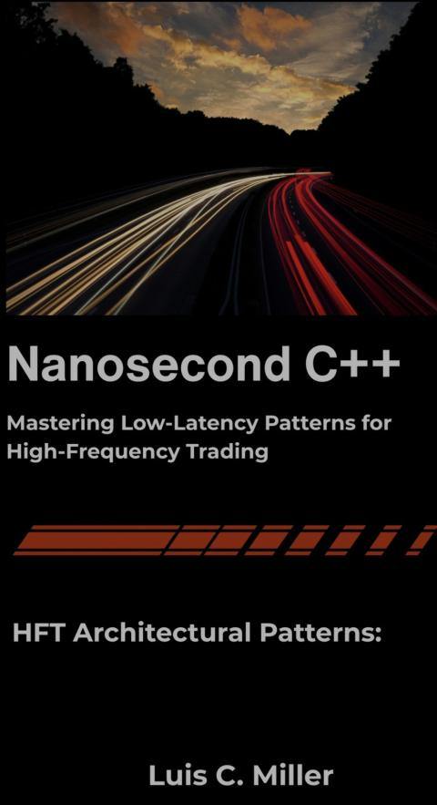

# Books

## 2026

### Nanoseconds C++

2026-006

---

### FPGA for Developers

2026-006

---

### Synaptic Self

2026-005

---

### The Little Book of Stoicism

2026-004

---

### Creative Thinking Field Guide

2026-003

---

### Kluge

2026-002

---

### Primal Intelligence

2026-001

---

## History

[Books 2025](./books-2025.md)
