# Books

## 2025

### Verilog flash back

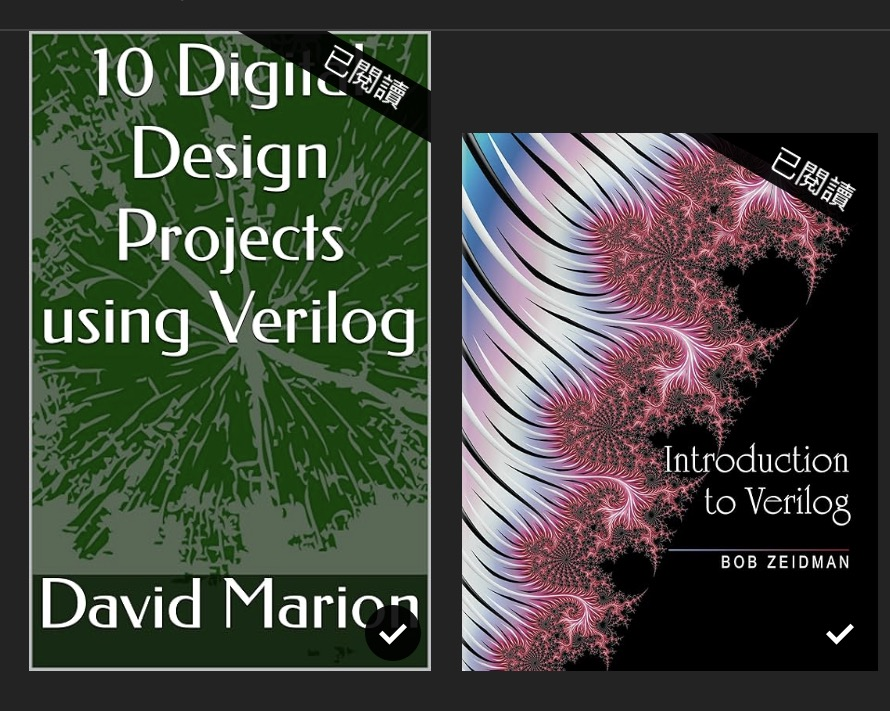

2025-148

---

### 時之輪14 光明回憶 下

    最後兩本讀的比較詳細 一本約7-8小時
    其他的 一本約4-5小時
    因此共約 150小時
    感覺跟玩第一輪 薩爾達曠野之息 差不多
    剛剛開始時 完全不知道這是個什麽世界
    等到最後 沈浸在裡面了 已經要結束了
    不過 總是可以再讀一次 這次就能夠慢慢讀了

2025-147

---

### 時之輪14 光明回憶 上

2025-146

---

### 時之輪13 闇夜之塔 下

2025-145

---

### 時之輪13 闇夜之塔 上

2025-144

---

### 時之輪12 末日風暴 下

2025-143

---

### 時之輪12 末日風暴 上

2025-142

---

### 時之輪11 迷夢之刃 下

2025-141

---

### 時之輪11 迷夢之刃 上

2025-140

---

### 時之輪10 光影歧路 下

2025-139

---

### 時之輪10 光影歧路 上

2025-138

---

### 時之輪9 寒冬之心 下

2025-139

---

### 時之輪9 寒冬之心 上

2025-138

---

### 時之輪8 匕之道 下

2025-137

---

### 時之輪8 匕之道 上

2025-136

---

### 時之輪7 劍之王冠 下

2025-135

---

### 時之輪7 劍之王冠 上

2025-134

---

### 時之輪6 混沌之王 下

2025-133

---

### 時之輪6 混沌之王 中

2025-132

---

### 時之輪6 混沌之王 上

2025-131

---

### 時之輪5 天空之火 下

2025-130

---

### 時之輪5 天空之火 中

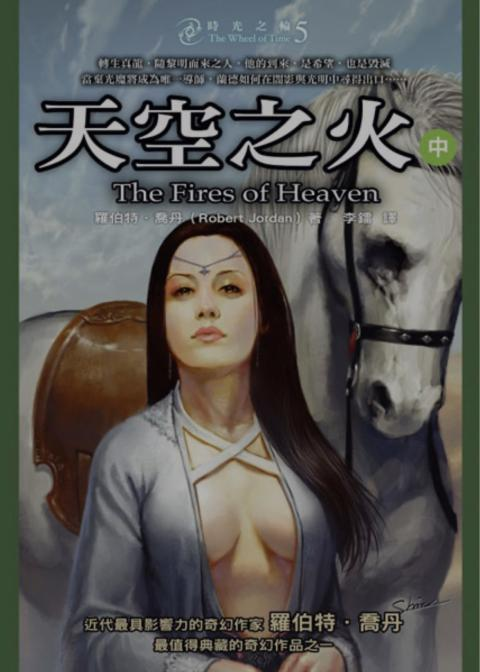

2025-129

---

### 時之輪5 天空之火 上

2025-128

---

### Miding My Mitochondria

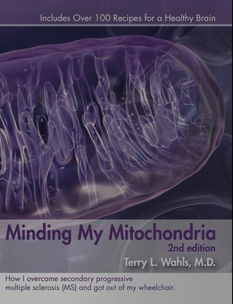

2025-127

---

### 時之輪4 闇影漸起 下

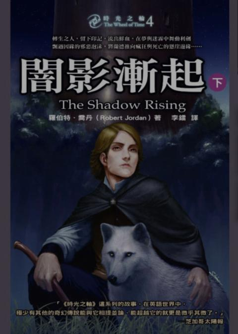

2025-126

---

### 時之輪4 闇影漸起 中

2025-125

---

### 時之輪4 闇影漸起 上

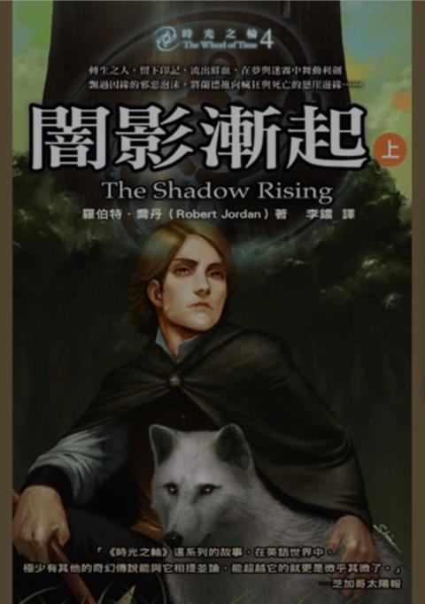

2025-124

---

### Slow Productivity

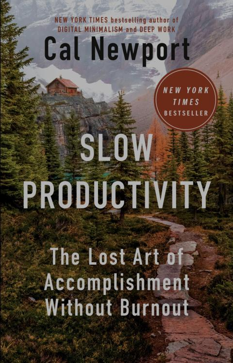

2025-123

---

### 時之輪3 真龍轉生 下

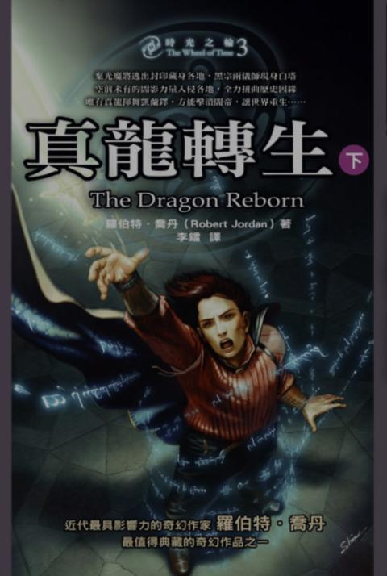

2025-122

終於知道為何Amazon WOT 會被砍了 因為真的是亂搞

---

### 時之輪3 真龍轉生 上

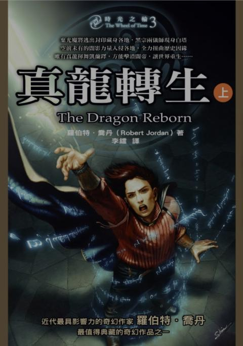

2025-121

---

### 時之輪2 大狩獵 下

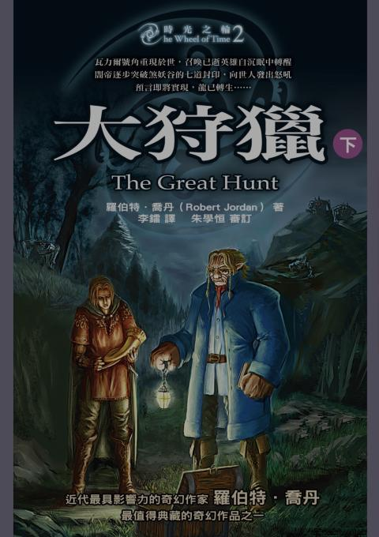

2025-120

---

### Digital Minimalism

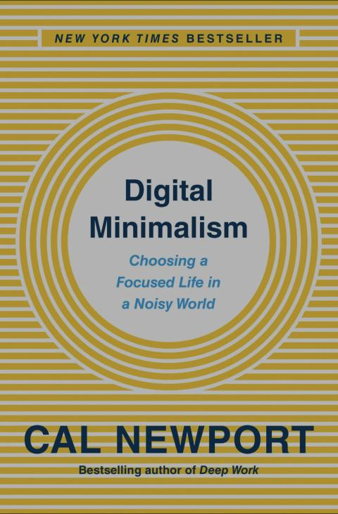

2025-119

---

### 時之輪2 大狩獵 上

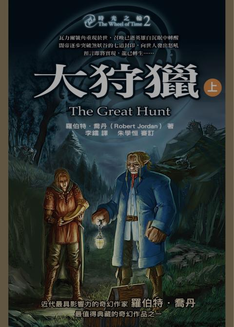

2025-118

---

### 時之輪1 世界之眼 下

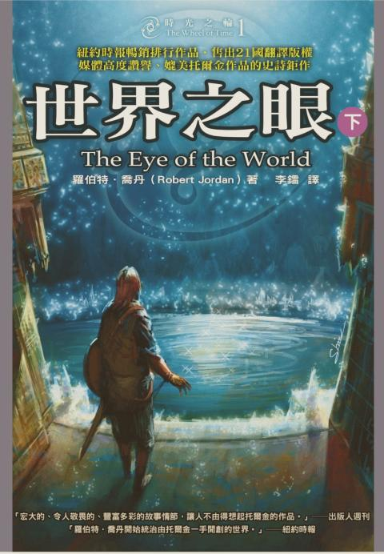

2025-117

---

### Memristor:From Material to Device

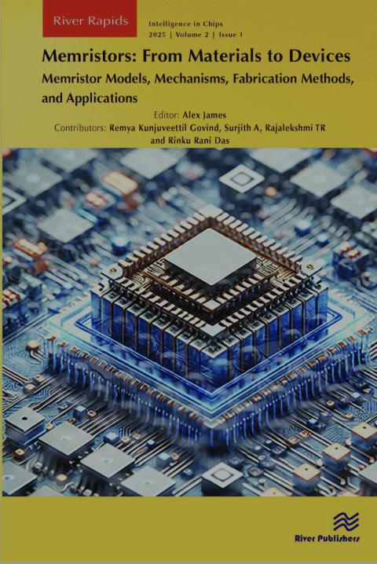

2025-116

---

### 時之輪1 世界之眼 上

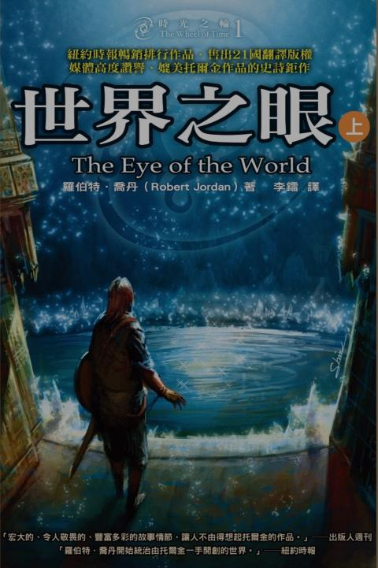

2025-115

    看完三季 Amazon 的 Wheel of Time 之後
    才知道原來沒有第四季
    為了想知道結果 只能回去看小說
    啊知小說居然有14集31本
    一本一本來
---
    ★全系列共14部，31冊
    時光之輪1：世界之眼（上）
    時光之輪1：世界之眼（下）
    時光之輪2：大狩獵（上）
    時光之輪2：大狩獵（下）
    時光之輪3：真龍轉生（上）
    時光之輪3：真龍轉生（下）
    時光之輪4：闇影漸起（上）
    時光之輪4：闇影漸起（中）
    時光之輪4：闇影漸起（下）
    時光之輪5：天空之火（上）
    時光之輪5：天空之火（中）
    時光之輪5：天空之火（下）
    時光之輪6：混沌之王（上）
    時光之輪6：混沌之王（中）
    時光之輪6：混沌之王（下）
    時光之輪7：劍之王冠（上）
    時光之輪7：劍之王冠（下）
    時光之輪8：匕之道（上）
    時光之輪8：匕之道（下）
    時光之輪9：寒冬之心（上）
    時光之輪9：寒冬之心（下）
    時光之輪10：光影歧路（上）
    時光之輪10：光影歧路（下）
    時光之輪11：迷夢之刃（上）
    時光之輪11：迷夢之刃（下）
    時光之輪12：末日風暴（上）
    時光之輪12：末日風暴（下）
    時光之輪13：闇夜之塔（上）
    時光之輪13：闇夜之塔（下）
    時光之輪14最終部：光明回憶（上）
    時光之輪14最終部：光明回憶（下）

---

### Computer that change the world

2025-114

It is memory that drive the computer architecture.

---

### Bogatin's practical guide to best measurement practices for digital oscilloscopes

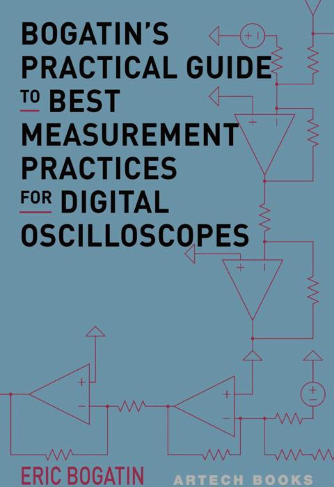

2025-113

---

### 我在荷蘭做都更說客

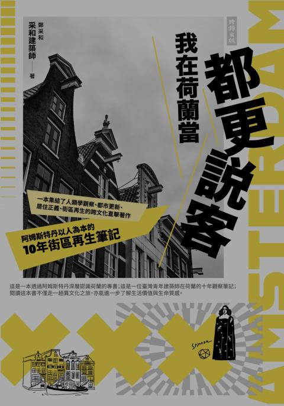

2025-112

---

### 心理磨擦力

2025-111

---

### 人間值得

2025-110

---

### The Catalyst

2025-109

---

### 螞蟻螞蟻

2025-108

---

### This is for Everyone (The unifinished story of the WWW)

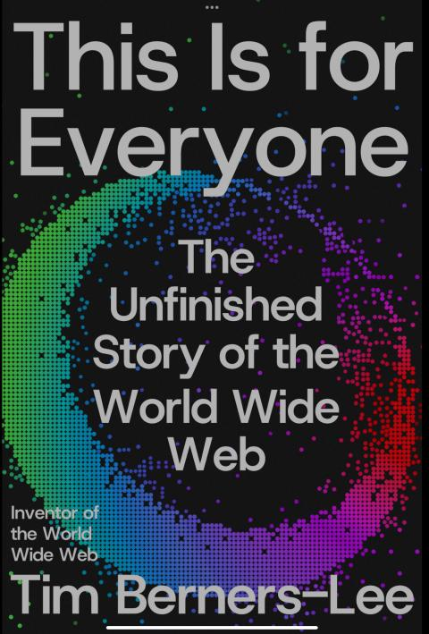

2025-107

---

### Caregiver's Guide to Dementia

2025-106

---

### 製造診斷的時代

2025-105

---

### On the Nature of Time & What is ChatGPT Doing

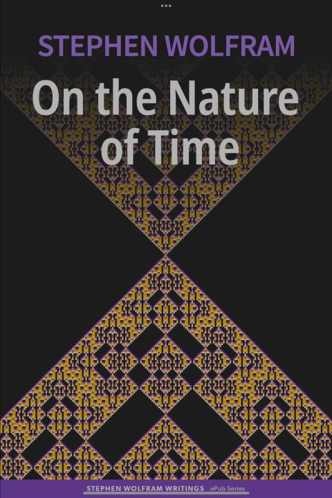

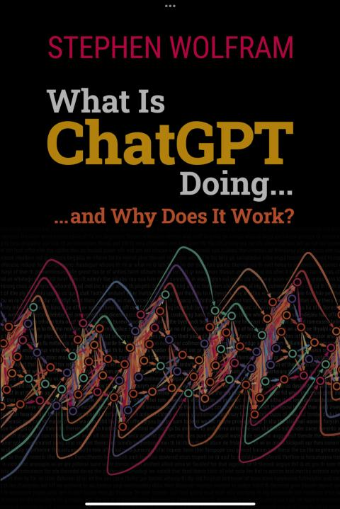

2025-104

---

### Writing to Learn

2025-103

---

### 自私的藝術

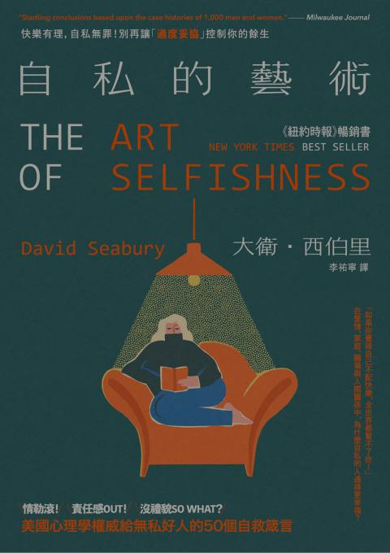

2025-102

---

### Entangled Life

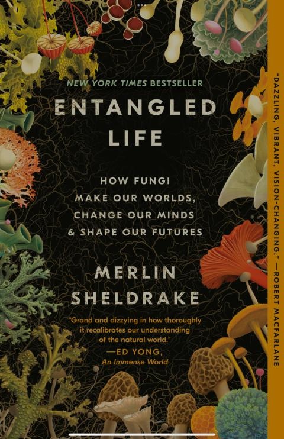

2025-101

Fungus is my favorite life form

---

### Other Minds

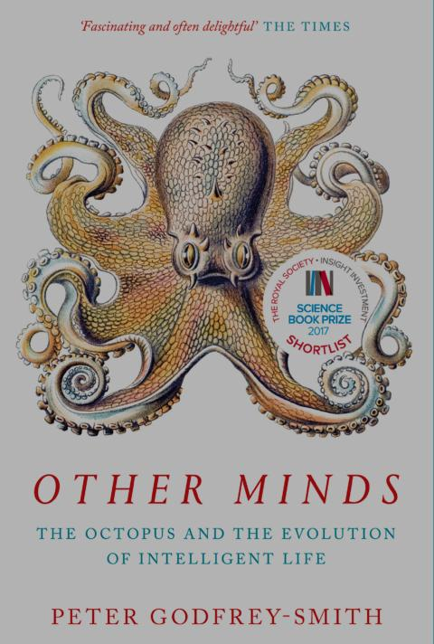

2025-100

最讓人驚訝的是 原來章魚 這些頭足類的只能活兩年左右

---

### 老派東京

2025-99

---

### The Cortex and The Critical Point

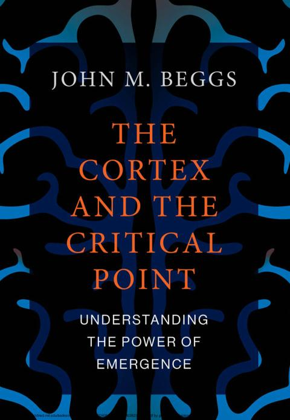

2025-98

    搞上動態系統 除非有數學式 不然一切都很空
    只認真看了前三章 就看不下去了 還好是下載的 哈哈哈
    跟之前的 Networks of the Brain 有點像

[by Dr. Dante R. Chialv Everything you wish to know about critical brain dynamics but are afraid to ask](https://www.youtube.com/watch?v=XFuI9BEeJlI&list=WL&index=13)

專家還是比較會 (Dr. Dante R. Chiaial)

---

### Your Brain is a Time Machine

2025-97

前半跟大腦相關 後半就無聊了

---

### 不馴的異端 A Book Forged in Hell

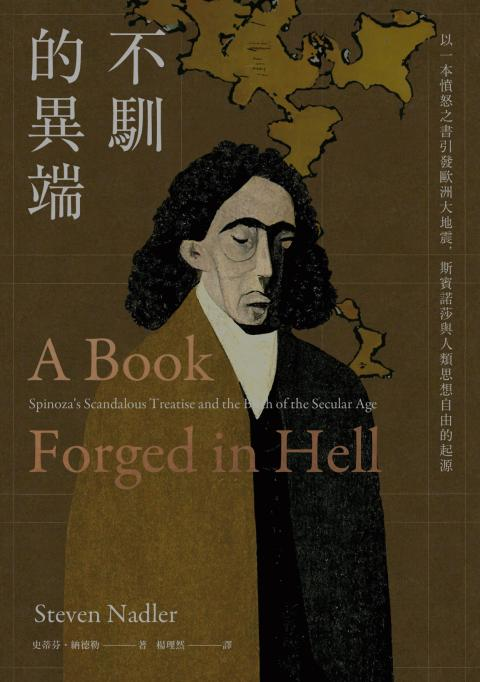

2025-96

史賓諾薩是我最喜歡的哲學家

---

### A Brief history of Intelligence

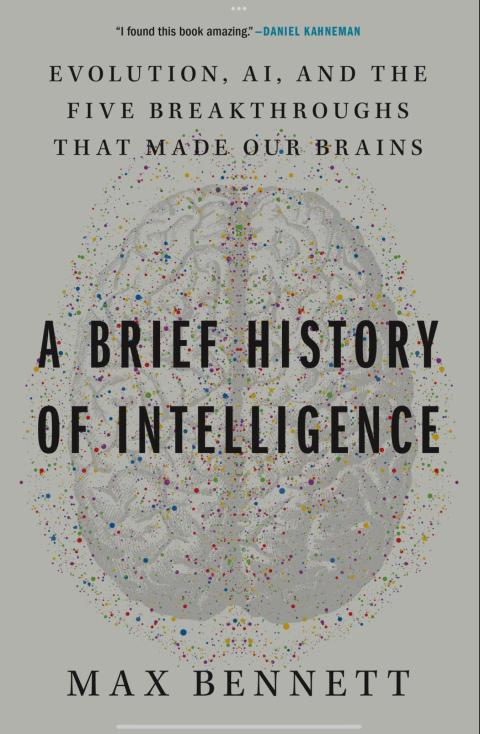

2025-95

Cool book. 5 Star

---

### Dark and Magic Places

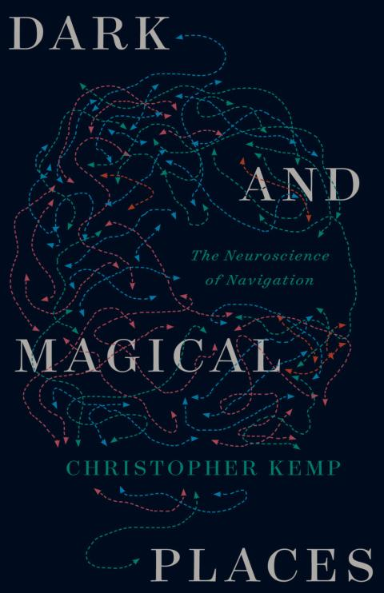

2025-94

---

### 死亡不是問題 衰老才是

2025-93

非常幽默的散文

---

### Networks of the Brain

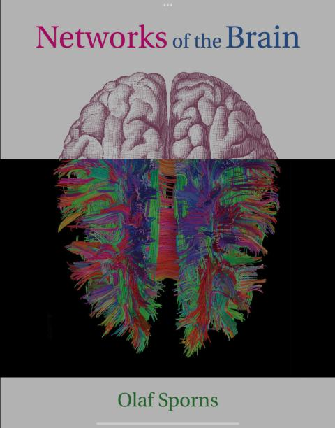

2025-92

認真看了兩個星期 好像知道什麽 又好像什麽都不知道

---

### 找不到病因 搞定迷走神經就對了

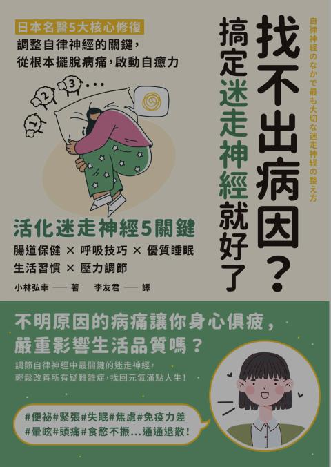

2025-91

---

### 非虛構寫作指南

2025-90

---

### The Strange New Mind

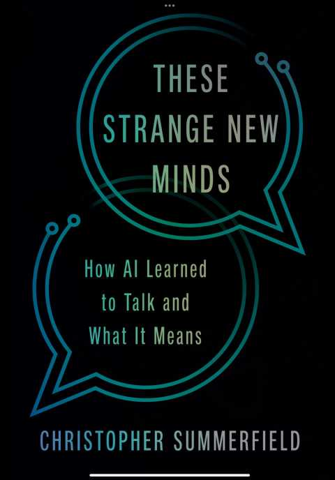

2025-89
