# Books

## 2026

### A Simple Approach to Neuroscience

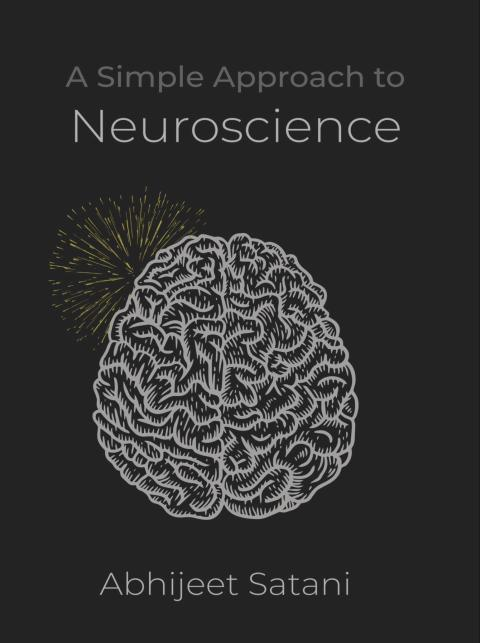

2026-026

---

### Circuit In The Brain

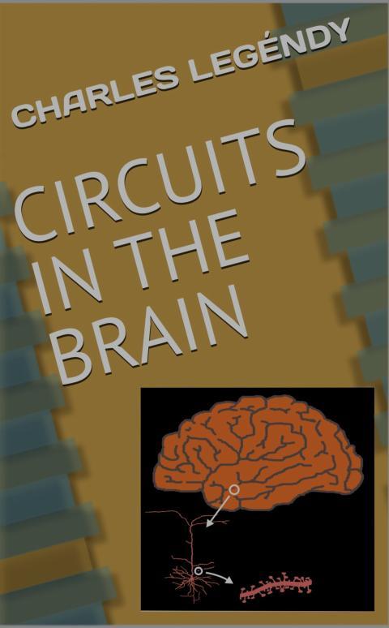

2026-025

沒看完 中間lost track 變得很難閱讀下去

---

### The Essential Book of AI

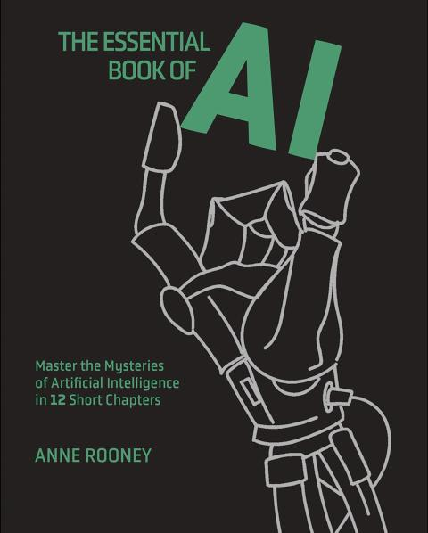

2026-024

---

### The Developer's Guide to AI

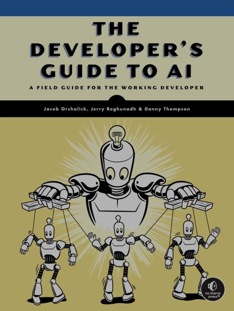

2026-023

---

### The Brain, In Theory

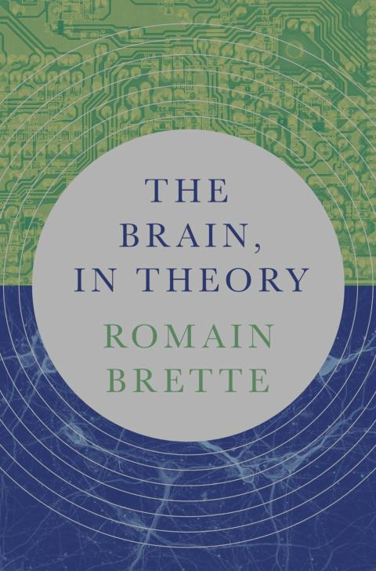

2026-022

---

### Introduction C++

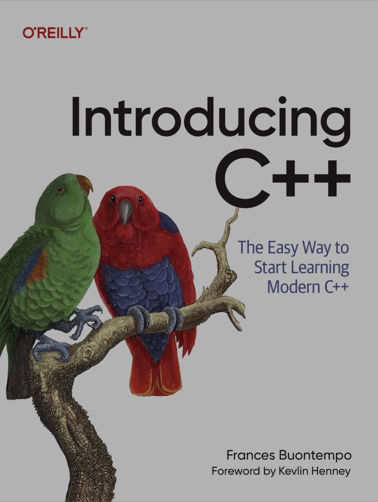

2026-021

---

### Modern C (C23)

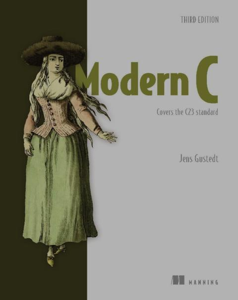

2026-020

---

### 長大後 交朋友怎麽那麽難

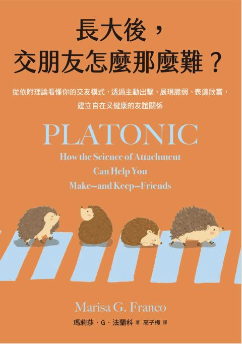

2026-019

---

### Defensive C++ Arduino Programming

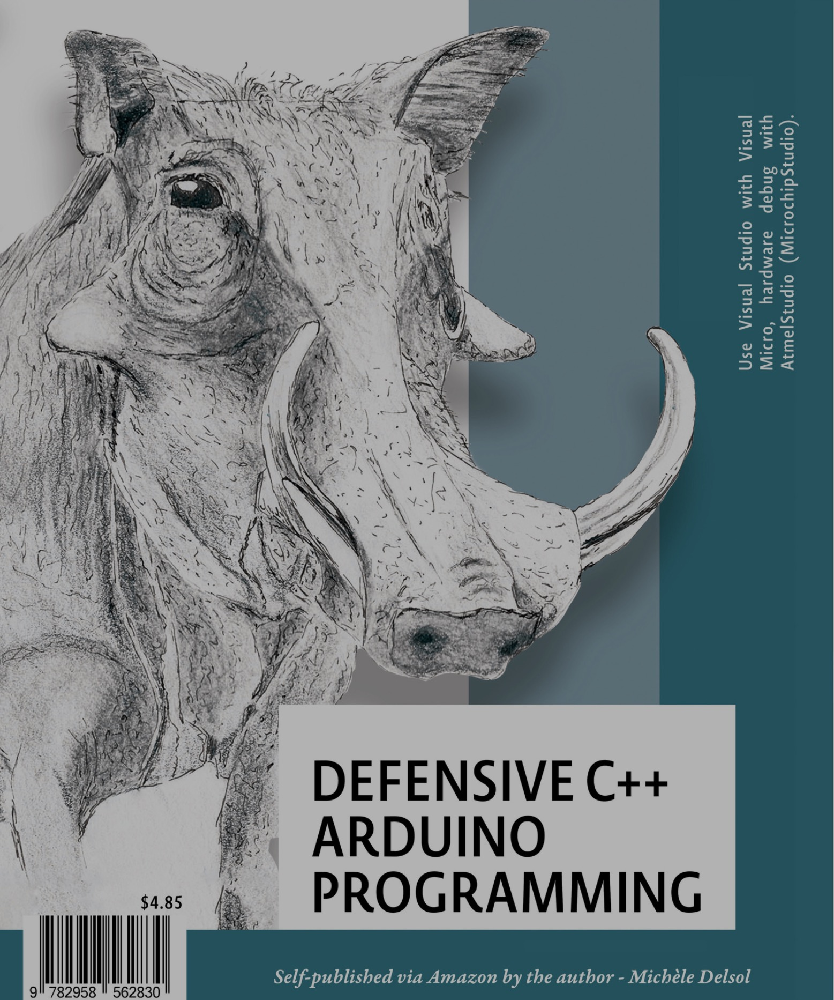

2026-018

I like reading stroy about C language.

---

### Pragmatic C++ Arduino Programming

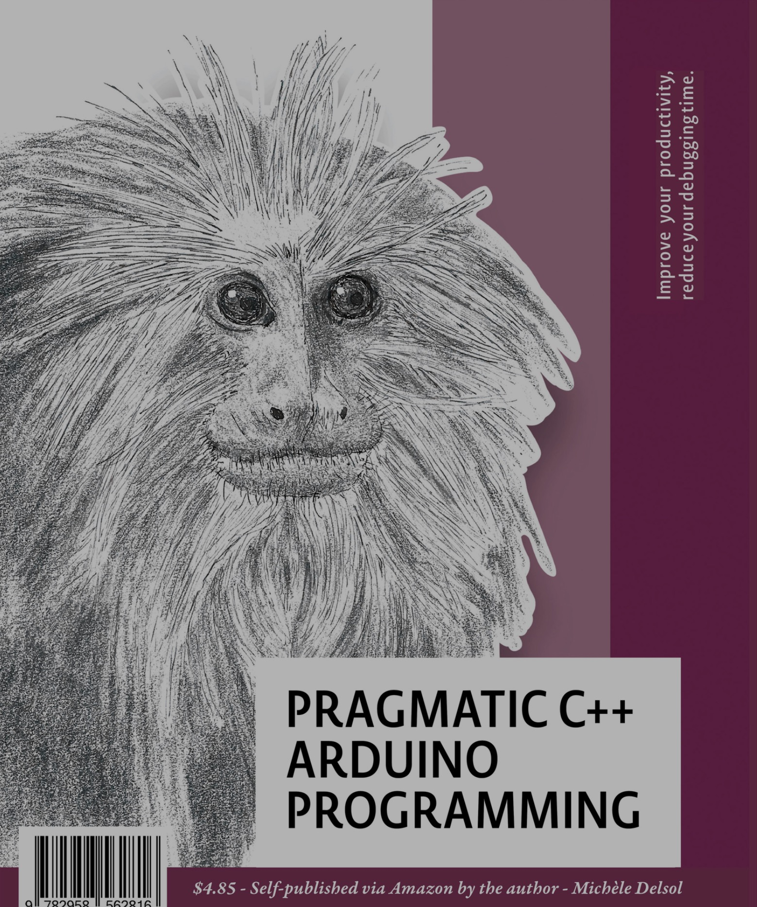

2026-017

---

### Causal Inference

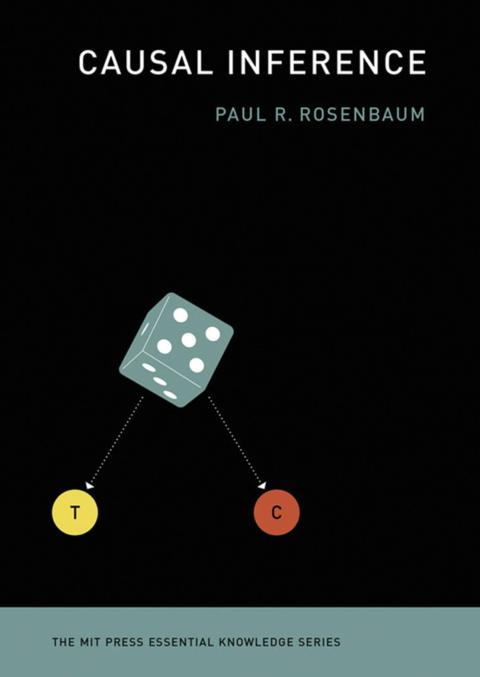

2026-016

---

### The Causal Mindset Handbook

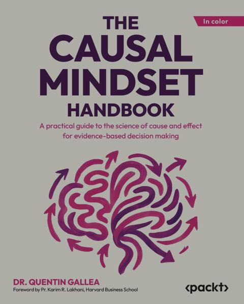

2026-015

---

### The Pattern On the Stone

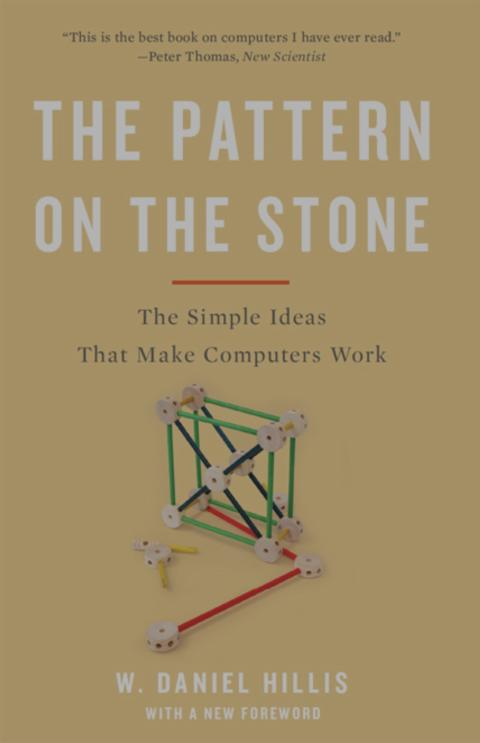

2026-014

---

### The Delicate Art of Brute Force

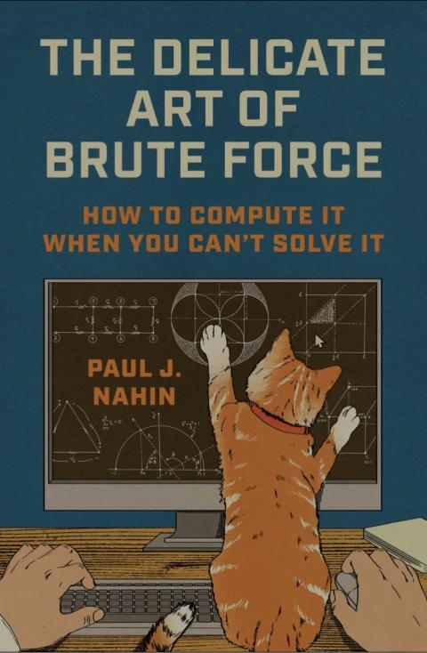

2026-013

---

### Mental Models for Critical Thining

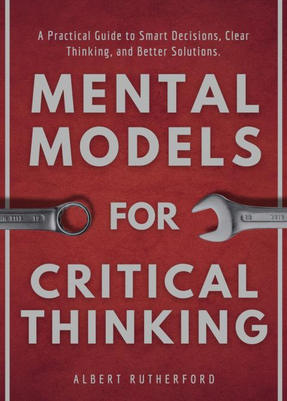

2026-012

---

### The Idea Factory

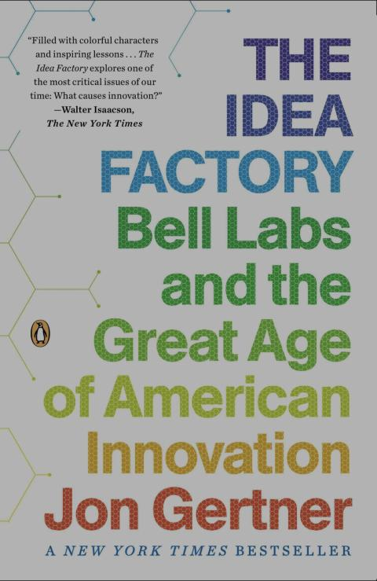

2026-011

沒有 Bell Lab 我大概在台東種田

---

### High Level Sythesis Make Easy

2026-010

---

### Master Embedded Linux Development

2026-009

---

### C++23 Coroutines

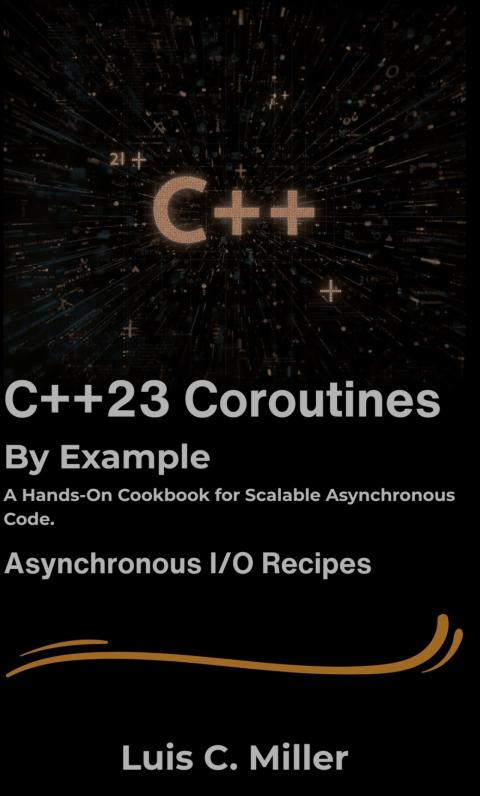

2026-008

---

### The MicroZed Chronicles

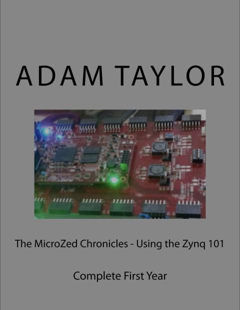

2026-007

---

### FPGA for Developers

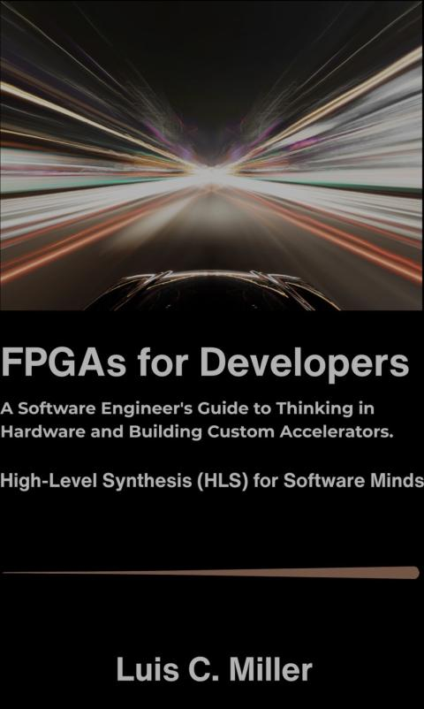

2026-006

---

### Synaptic Self

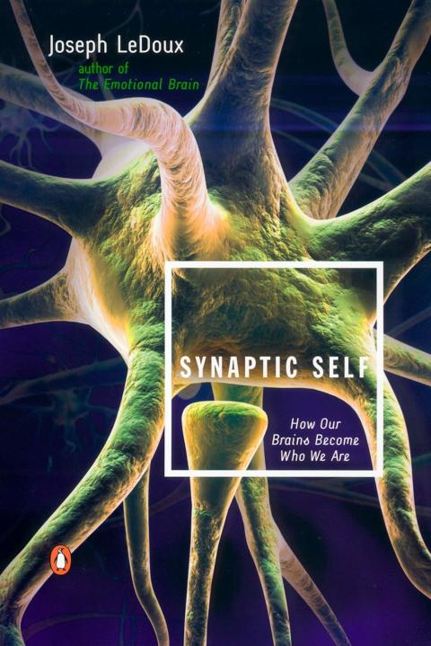

2026-005

---

### The Little Book of Stoicism

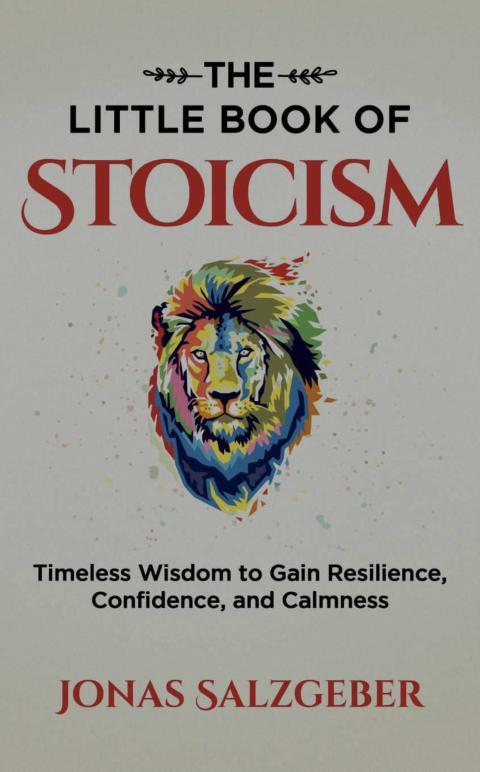

2026-004

---

### Creative Thinking Field Guide

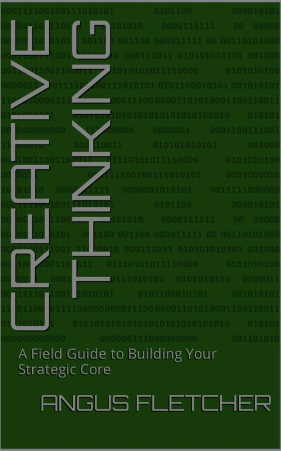

2026-003

---

### Kluge

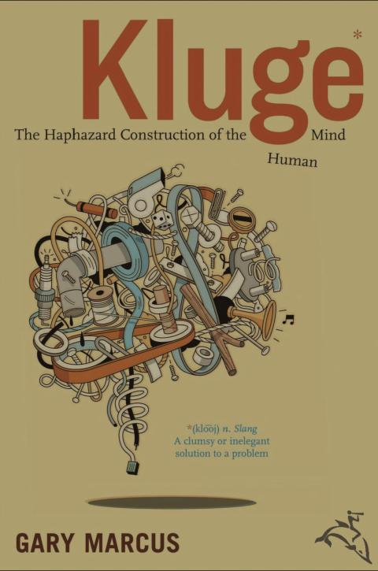

2026-002

---

### Primal Intelligence

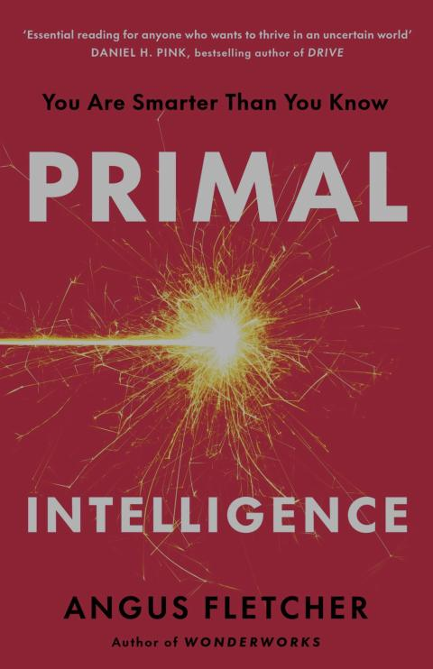

2026-001

---

## History

[Books 2025](./books-2025.md)
