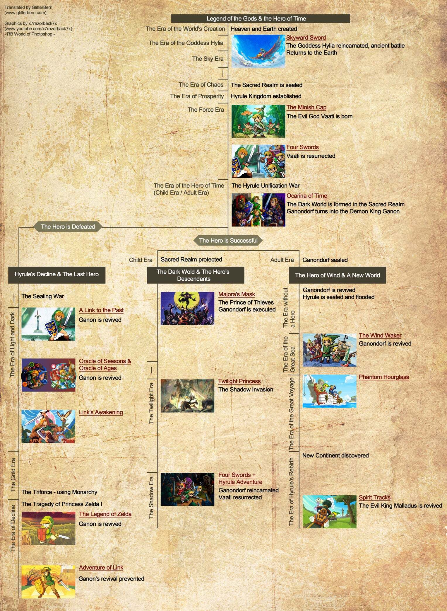

# Game Notes

## Obvilion

### 偷竊前要儲存

### Switch 2 Button 

Traditional Controller Layout

When using the system in handheld mode or with an NS2 Pro Controller, the standard button functions map as follows: [1, 2]

- ZR / Right Trigger: Attack
- ZL / Left Trigger: Block
- R Button: Cast Spell
- L Button: Ready / Sheathe Weapon
- A Button: Activate / Interact / Grab (Hold)
- B Button: Character Journal / Main Menu
- X Button: Jump
- Y Button: Quick-key Modal Menu
- Left Stick Click (L3): Sneak / Crouch
- Right Stick Click (R3): Toggle First/Third-Person Camera View
- Minus (-): Wait
- Plus (+): Pause Menu
- D-Pad: Direct Quick-key Selection (cardinal and diagonal slots)

---

### 治療吸血鬼症

    在《上古卷軸4：湮沒》（Oblivion）中治療吸血鬼症，最快的方法是前往 DLC 區域「深淵裂谷」（Deepscorn Hollow）使用淨化噴泉，或是解長篇的官方支線任務。 [1, 2]
    方法一：快速治療（利用 DLC 深淵裂谷）
    前往地圖南方的 Deepscorn Hollow（深淵裂谷，水下有入口）。
    在房間角落採集淨化血鹽（Purifying Blood Salt）。
    對著房間內的重生噴泉使用，即可瞬間治癒吸血鬼症，免去繁瑣任務。 [1]
    方法二：正規解藥任務（Cure Vampirism）
    如果你已經完全變成吸血鬼（過完三天且睡過覺），染病狀態已無法用一般治癒疾病藥水消除，必須尋求女巫協助： [1, 2]
    觸發任務：跟帝都奧術大學的 Raminus Polus 或黑暗兄弟會的 Vicente Valtieri 交談，打聽解藥下落。 [1]
    尋找女巫：前往斯金格拉德（Skingrad）城堡找管事問伯爵，接著去找女巫 Melisande。 [1]
    準備材料：
    5個空的特大靈魂石（Empty Grand Soul Gems）
    6大蒜、5夜茄、3血草
    1個強效吸血鬼灰燼（Powerful Vampire Dust）
    用女巫給的匕首刺中亞龙人（Argonian）取得血液。 [1, 2]
    完成解藥：將材料交給女巫製作解藥，喝下後即可恢復正常。 [1, 2]
    小提示：在剛感染到「紫羅蘭血吸血鬼病」（Porphyric Hemophilia）的 3天潛伏期內，直接吃「治癒疾病藥水」或去神殿祈禱，就能直接阻止發作，不用變吸血

---

### Oblivion Gate 沒有必須要解

### Amazing Things You Want To Get Early In Elder Scrolls Oblivion Remastered

🎬[Amazing Things You Want To Get Early](https://www.youtube.com/watch?v=QngigWUPXiE)

- Chillrend
- Fin Gleam 水下呼吸
- Umbra

---

### Insanely Powerful RAREST ITEMS in Oblivion Remastered

🎬[Insanely Powerful RAREST ITEMS in Oblivion Remastered](https://www.youtube.com/watch?v=oYWetzZyDyg)

---

## Skyrime

## 薩爾達傳說

### Official Timeline

---

## 王國之淚

## 曠野之息
