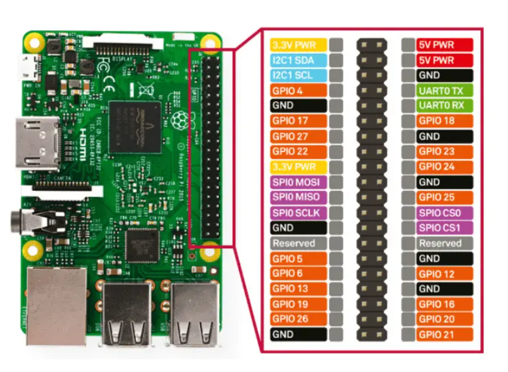
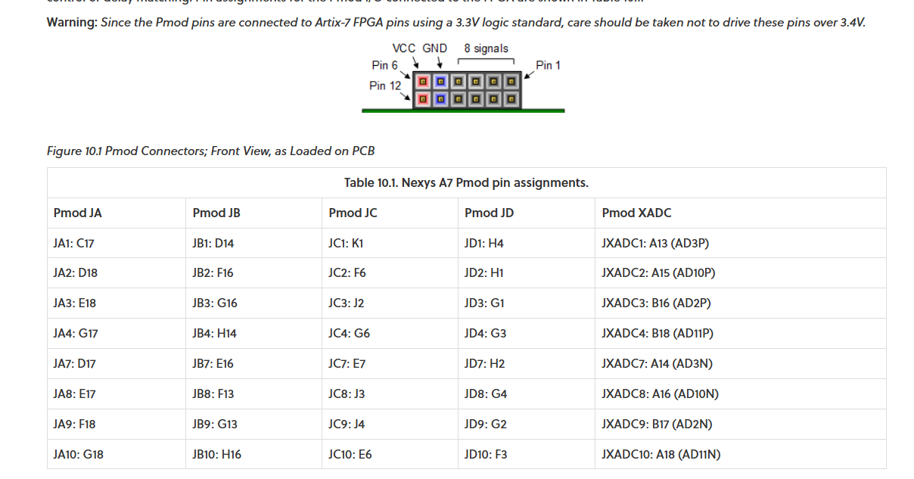

# PINS

## STM32 JLink

    1.VDD_Target
    2.SW_CLK
    3.GND
    4.SW_DIO
    5.NRST
    6.SW_O

## FT2232

### FT245 Fifo

| Pin Name  |   Functions   |  I/O  |
|-----------|:-------------:|------:|
| AD0 ~ AD7 |      D0 ~ D7  | IO    |
| AC0 | RXF#     |   output  |
| AC1 | TXE#     |   output  |
| AC2 | RD#      |   input   |
| AC3 | WR#      |   input   |
| AC4 | SIWR#    |   input   |
| AC5 | ClockOut |   output  |
| AC6 | OE#      |   input   |

### PyFTID Doc

[PyFTDI Doc](https://eblot.github.io/pyftdi/index.html)

### SPI and Other Pins

{: style="height:600px"}

### FT2232 Code

[Python FTDI for SPI](https://www.alexallmont.com/spi-refresher/).

``` py
from pyftdi.ftdi import Ftdi
Ftdi.show_devices()
from pyftdi.spi import SpiController

spi.configure('ftdi://ftdi:2232h:1:7b/1')
slave = spi.get_port(cs=1, freq=10E6, mode=2)
write_buf = b'\x01\x02\x03'
read_buf = slave.exchange(write_buf, duplex=True)
```

## Raspberry Pi

### Pi 4 IO



## FPGA

### Nexy A7 PMod



### Efinix T20 

