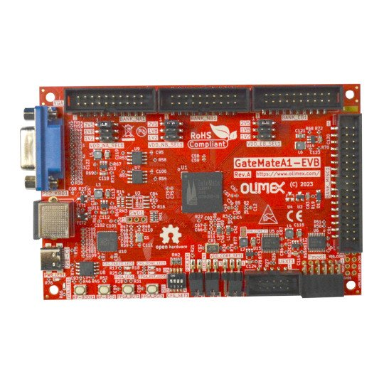

# Gatemate A1 EVB Tutorial

## Board Specification

[Olimex GatemateA1-EVB Product](https://www.olimex.com/Products/FPGA/GateMate/GateMateA1-EVB/open-source-hardware)

[Olimex GatemateA1-EVB Github Pages](https://github.com/OLIMEX/GateMateA1-EVB)

- CCGM1A1 FPGA with 20480 logic cells
- PSRAM 64Mbit
- RP2040 processor for programing and debugging
- 2MB configuration Flash for RP2040
- 4 buttons
- USB-C for power supply and programming
- PS2 connector
- VGA connector
- 4 Banks with signals with selectable levels 1.2V 1.8V 2.5V
- PMOD with level shifters
- UEXT with level shifters
- Power LED
- User LED
- 4 sections configuration slide switch
- Dimensions: 120 x 80 mm

## Tool Installation

## Hello World
