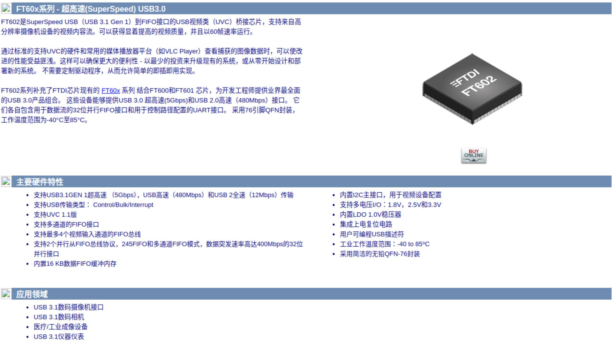

# Schematics

## FPGA

### FPGA Daisy Chain JTAG

{: style="height:300px"}

## FTDI

### USB2 FT2232

[ftdi-asynchronous-fifo-usb-communication-with-fpga](https://rohitksingh.in/posts/ftdi-asynchronous-fifo-usb-communication-with-fpga/)

[FT245 FIFO Design](https://github.com/esynr3z/proto245)

### USB3 FT60X Schematics

{: style="height:600px"}

{: style="height:300px"}

## Lattice

### ICEStick 1K

ICEStick 1K IO and Platform Define for Litex [icestick1Kio.md](subtitles/icestick1Kio.md)

### CrossLink-NX USB3

USB3 Support CrossLinkU-NX

[Lattice CrossLink-NX](https://www.latticesemi.com/Products/FPGAandCPLD/CrossLink-NX)

[tinyCLUNX33 Kit](https://tinyclunx33.tinyvision.ai/)

### PICO + ICE40

[pico-ice RP2040 plus Lattice iCE40UP5K FPGA](https://www.tindie.com/products/tinyvision_ai/pico-ice-rp2040-plus-lattice-ice40up5k-fpga/)

[https://github.com/tinyvision-ai-inc/pico-ice-sdk/](https://github.com/tinyvision-ai-inc/pico-ice-sdk/)

### PICO Wave Gen

[PICO Wave Gen](https://github.com/wasspaul/sig_gen)

## Open Ephys

### ONIX Schematics

Open Ephys FMC-Host [fmc-host_schematic.pdf](schematics/fmc-host_schematic.pdf)

Open Ephys Breakout Board [breakout_schematic.pdf](schematics/breakout_schematic.pdf)

## Sparkfun

### MicroMod

Sprkfun [MicroMod_ATP_Carrier_Board_Schematic.pdf](schematics/MicroMod_ATP_Carrier_Board_Schematic.pdf)
