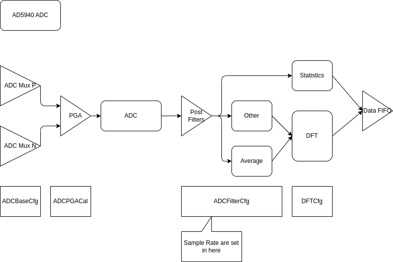
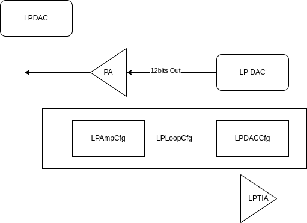
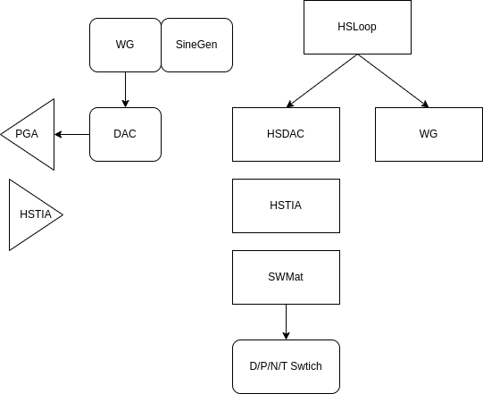
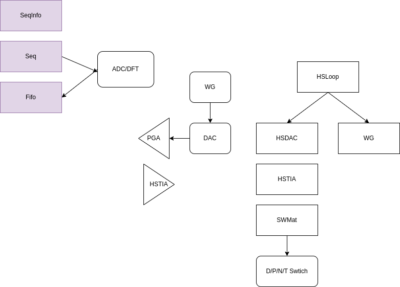

# AD5940

## Github for AD5940

[AD5940Lib](https://github.com/analogdevicesinc/ad5940lib)

[AD5940 Examples](https://github.com/analogdevicesinc/ad5940-examples)

[electrochemical measurements with the Analog Devices AD5940 or AD5941 integrated potentiostat controlled by an Adafruit Feather M0 Wifi (MCU)](https://github.com/IMTEK-FreiStat/FreiStat-IoT)

[AD5940-with-3-electrode](https://github.com/Phong0217/AD5940-with-3-electrode)

[EIS-Project](https://github.com/MX-Liu/EIS-Project)

## Data Sheet and Application Notes of AD5940

[AD5940-5941.pdf](./pdf/AD5940-5941.pdf)

[AN1557 Implementing the AD5940 and AD8233 in a Full Bioelectric System](./pdf/an-1557.pdf)

[AD1563 Optimizing the AD5940 for Electrochemical Measurements](./pdf/an-1563-ad594x.pdf)

[DESIGN, IMPLEMENTATION AND TEST OF A LOW-COST ELECTRICAL IMPEDANCE SPECTROSCOPY SYSTEM BASED ON AN AD5940](./pdf/TFG_Dolors_Farre.pdf)

[A Multi-Sensory Hardware Platform for Capturing andAnalyzing Physiological Emotional Signals](./pdf/sensors-22-05775.pdf)

## AD5940Lib Data Structure

[AD5940_Struct.md](./AD5940_Struct.md)

## AD5940Lib Sequencer

[AD5940_Seq.md](./AD5940_Seq.md)

### Basic Cfg

    AFERefCfg : ADC/DAC/TIA reference and buffer

---

    ADCBaseCfg : ADC Basic settings include MUX and PGA.
    ADCFilterCfg : ADC filter settings.
    DFTCfg : DFT
    ADCDigComp : ADC digital comparator
    StatCfg : Statistic function

---

    SWMatrixCfg : Switch matrix configure
    HSTIACfg : HSTIA Configure
    HSDACCfg : HSDAC Configure
    LPDACCfg : LPDAC Configure 
    LPAmpCfg : Low power amplifiers(PA and TIA)

---

    WGTrapzCfg : Trapezoid Generator parameters
    WGSinCfg : Sin wave generator parameters

---

    AGPIOCfg : GPIO Configure
    FIFOCfg : FIFO Configure

---

    SEQCfg : Sequencer Configure
    SEQInfo : Sequence info structure
    SeqGpioTrig : ???

---

    WUPTCfg : Wakeup Timer Configure
    CLKCfg : Clock configure

---

    HSDACCal : HSDAC calibration structure.
    LPDACCal : LPDAC calibration structure.
    LPDACPara : LPDAC parameters: LPDAC code to voltage transfer function.(Math)

---

    LFOSCMeasure : LFOSC frequency measure structure
    ADCPGACal : ADC PGA calibration type
    LPTIAOffsetCal : LPTIA Offset calibration type
    ClksCalInfo : Structure for calculating how much system clocks needed for specified number of data
    SoftSweepCfg : Software controlled Sweep Function

---

    fImpPol : Impedance result in Polar coordinate
    fImpCar : Impedance result in Cartesian coordinate
    iImpCar : Impedance result in Cartesian coordinate
    FreqParams : FreqParams_Type - Structure to store optimum filter settings

### Complex Cfg

#### WGCfg : Waveform generator configuration

    WGTrapzCfg
    WGSinCfg

#### HSLoopCfg : High speed loop configuration

    SWMatrixCfg
    HSDACCfg
    WGCfg
    HSTIACfg

#### LPLoopCfg : Low power loop Configure

    LPDACCfg
    LPAmpCfg

#### DSPCfg : DSP Configure

    ADCBaseCfg
    ADCFilterCfg
    ADCDigComp
    DFTCfg
    StatCfg

#### HSRTIACal : HSTIA internal RTIA calibration structure

    HSTIACfg
    DFTCfg

#### LPRTIACal : LPTIA internal RTIA calibration structure

    DFTCfg

## AD5940 Software to Block Diagram

### ADC

### LSLoop

### LPDAC

### HSLoop

### WaveGen Sin

### WaveGen Arbitary

## Sequencer

### Basic 

    6K SRAM
    4 Seperate Sequence

### Sequencer Command

    Write : Move Data to Register (0x0000 to 0x21FC)
            Address is 7 bits + 
    Wait Command : Wait in sync with Sequencer
    Timeout Command : Timeout independet to Sequencer

## Notes

### VBias0 output

{: style="height:300px"}

Document from Page 30 : Low Power DAC
Register : LPDACDAT0

[AD5940_LpLoop](https://github.com/analogdevicesinc/ad5940-examples/blob/ae917b69b4f71214c7f19ae3eef563b9c547d48f/examples/AD5940_LPLoop/AD5940_LpLoop.c)

