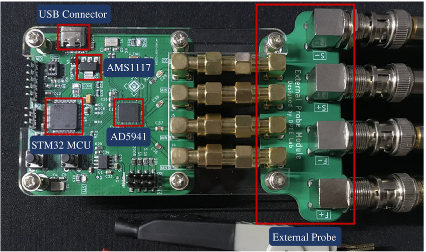
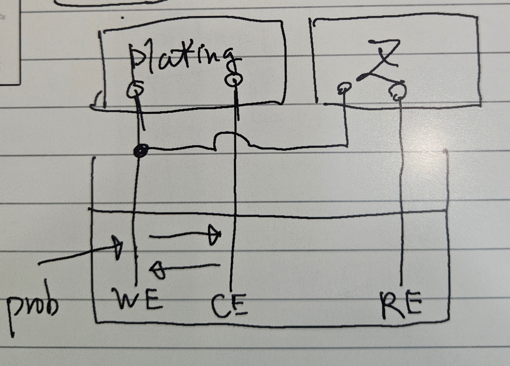
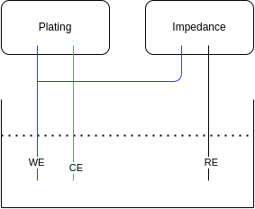
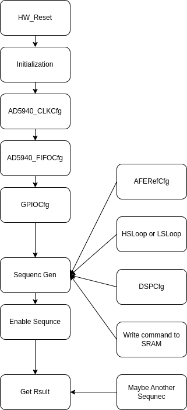

# AD5940

## Github for AD5940

[AD5940Lib](https://github.com/analogdevicesinc/ad5940lib)

[AD5940 Examples](https://github.com/analogdevicesinc/ad5940-examples)

[AD594x User Guide](https://wiki.analog.com/resources/eval/user-guides/ad5940)

[AD5933 User Guide](https://wiki.analog.com/resources/pmods/ad5933)

[electrochemical measurements with the Analog Devices AD5940 or AD5941 integrated potentiostat controlled by an Adafruit Feather M0 Wifi (MCU)](https://github.com/IMTEK-FreiStat/FreiStat-IoT)

[AD5940-with-3-electrode](https://github.com/Phong0217/AD5940-with-3-electrode)

[EIS-Project](https://github.com/MX-Liu/EIS-Project)

[Impedance-Analyzer](https://github.com/FalloutBoy379/Impedance-Analyzer)

[LCR Meter](https://github.com/jankae/LCR)

## Data Sheet and Application Notes of AD5940

[AD5940-5941.pdf](./AD5940/AD5940-5941.pdf)

[AN1557 Implementing the AD5940 and AD8233 in a Full Bioelectric System](./AD5940/an-1557.pdf)

[AD1563 Optimizing the AD5940 for Electrochemical Measurements](./AD5940/an-1563-ad594x.pdf)

## AD5940 Related Papers

[DESIGN, IMPLEMENTATION AND TEST OF A LOW-COST ELECTRICAL IMPEDANCE SPECTROSCOPY SYSTEM BASED ON AN AD5940](./AD5940/TFG_Dolors_Farre.pdf)

[A Multi-Sensory Hardware Platform for Capturing andAnalyzing Physiological Emotional Signals](./AD5940/sensors-22-05775.pdf)

[Wearable devices for glucose monitoring](./AD5940/1-s2.0-S1110016824000231-main.pdf)

[Highly Integrated Multichannel CMOS Sensor Systems for Micro-Physiological High-Content Screening Applications](./AD5940/1574623.pdf)

[A Portable Electrochemical Measurement Platform for Wearable-Flexible Sweat Sensors](./AD5940/1570910796_final_submitted_article.pdf)

[Analog Front-End Enables Electrical Impedance Spectroscopy System On-Chip for Biomedical Applications](./AD5940/Analog_Front-End_Enables_Electrical_Impedance_Spec.pdf)

[A Wireless, Reconfigurable, Multichannel Potentiostat for Wearable Electrochemical Biosensing Applications](./AD5940/qt5zd915kj.pdf)

[Design and Implementation of a Cost-Effective, Portable Impedance Analyzer Device with AD5941](https://onlinelibrary.wiley.com/doi/full/10.1002/tee.24134)

## Plating

[Tetroplater](https://github.com/MatsumotoJ/Tetroplater)

[Kontex Plating Doc](./AD5940/Probe%20Tool%20Spec.pdf)

[RHD_electroplating_board](https://intantech.com/RHD_electroplating_board.html)

from following paper

[Ultraflexible PEDOT:PSS/IrOx-Modified Electrodes](./AD5940/micromachines-15-00447.pdf)

## 電化學

[走進電化學 | 電化學研究的秘密武器—三電極體系](https://www.iesttech.com/big5/NewsDetail/4909075.html)

## Impedance

### Bio-Impedance 2/4 Wire BIA

### Electrochemical Impedance Spectroscopy 2/3/4 Wire EIS

### Automatic Balance Bridge Impedance

### AD5933 Block Diagram

### Nano Z 

### Tetroplater (Open Source)

### AIA STM32 + AD5941

### impedance-measurement-and-analysis

[impedance-measurement-and-analysis](https://www.analog.com/cn/solutions/instrumentation-and-measurement/electronic-test-and-measurement/impedance-measurement-and-analysis.html)

### electrical bioimpedance spectroscopy EBIS

### Impedance measurements have been performed on pure resistive loads as well as on a 2R1C series circuit

{: style="height:150px"}

## Plating and Z-Measurement

<!--- 

--->

## Electrochemical Impedance Spectroscopy─A Tutorial

[Electrochemical Impedance Spectroscopy─A Tutorial](https://pubs.acs.org/doi/10.1021/acsmeasuresciau.2c00070)

[Electrochemical Impedance Spectroscopy (EIS): Principles, Construction, and Biosensing Applications](https://www.mdpi.com/1424-8220/21/19/6578)

## AD5940Lib Data Structure

[AD5940_Struct.md](./AD5940/AD5940_Struct.md)

## AD5940Lib Sequencer

[AD5940_Seq.md](./AD5940/AD5940_Seq.md)

### Sequencer Basic

    6K SRAM
    4 Seperate Sequence

### Sequencer Command

    Write : Move Data to Register (0x0000 to 0x21FC)
            Address is 7 bits + 
    Wait Command : Wait in sync with Sequencer
    Timeout Command : Timeout independet to Sequencer

## AD5940 All Functions

[AD5940_Fn.md](./AD5940/AD5940_Fn.md)

## AD5940 Basic Flow

## Configurations

### Basic Cfg

    AFERefCfg : ADC/DAC/TIA reference and buffer

---

    ADCBaseCfg : ADC Basic settings include MUX and PGA.
    ADCFilterCfg : ADC filter settings.
    DFTCfg : DFT
    ADCDigComp : ADC digital comparator
    StatCfg : Statistic function

---

    SWMatrixCfg : Switch matrix configure
    HSTIACfg : HSTIA Configure
    HSDACCfg : HSDAC Configure
    LPDACCfg : LPDAC Configure 
    LPAmpCfg : Low power amplifiers(PA and TIA)

---

    WGTrapzCfg : Trapezoid Generator parameters
    WGSinCfg : Sin wave generator parameters

---

    AGPIOCfg : GPIO Configure
    FIFOCfg : FIFO Configure

---

    SEQCfg : Sequencer Configure
    SEQInfo : Sequence info structure
    SeqGpioTrig : ???

---

    WUPTCfg : Wakeup Timer Configure
    CLKCfg : Clock configure

---

    HSDACCal : HSDAC calibration structure.
    LPDACCal : LPDAC calibration structure.
    LPDACPara : LPDAC parameters: LPDAC code to voltage transfer function.(Math)

---

    LFOSCMeasure : LFOSC frequency measure structure
    ADCPGACal : ADC PGA calibration type
    LPTIAOffsetCal : LPTIA Offset calibration type
    ClksCalInfo : Structure for calculating how much system clocks needed for specified number of data
    SoftSweepCfg : Software controlled Sweep Function

---

    fImpPol : Impedance result in Polar coordinate
    fImpCar : Impedance result in Cartesian coordinate
    iImpCar : Impedance result in Cartesian coordinate
    FreqParams : FreqParams_Type - Structure to store optimum filter settings

### Complex Cfg

#### WGCfg : Waveform generator configuration

    WGTrapzCfg
    WGSinCfg

#### HSLoopCfg : High speed loop configuration

    SWMatrixCfg
    HSDACCfg
    WGCfg
    HSTIACfg

#### LPLoopCfg : Low power loop Configure

    LPDACCfg
    LPAmpCfg

#### DSPCfg : DSP Configure

    ADCBaseCfg
    ADCFilterCfg
    ADCDigComp
    DFTCfg
    StatCfg

#### HSRTIACal : HSTIA internal RTIA calibration structure

    HSTIACfg
    DFTCfg

#### LPRTIACal : LPTIA internal RTIA calibration structure

    DFTCfg

## AD5940 Software to Block Diagram

### ADC

### LSLoop

### LPDAC

### HSLoop

### WaveGen Sin

### WaveGen Arbitary

## Notes

### VBias0 output

{: style="height:300px"}

Document from Page 30 : Low Power DAC
Register : LPDACDAT0

[AD5940_LpLoop](https://github.com/analogdevicesinc/ad5940-examples/blob/ae917b69b4f71214c7f19ae3eef563b9c547d48f/examples/AD5940_LPLoop/AD5940_LpLoop.c)

## 2025-03-27 Report

Graph 1

綜合研究AD5940,AD5933與nano-z, Tetroplater在電鍍上面的阻抗測量方式
1.阻抗測量方式
AD5940 EIS 2/3/4 Wire, BIS 2/3 Wire, Impedance
AD5933 2-wire Automatic Balance Bridge Impedance
nano-Z 分壓法 ~~ Automatic Balance Bridge Impedance
Tetroplater Automatic Balance Bridge Impedance

2.主要問題
nano-z, Tetroplater阻抗測量時的電壓是4mv
通過1MOhm 電阻 因此進入待測物的電流是4pA

這個在AD5940會造成測量的問題 需要250MOhm的電阻（大問題）
在AD5933需要外部電路處理 ?（可能可以處理）

3.次要問題
nano-z形式的設計需要大量的analog mux
因此即便是換成AD5940大小不會改變太多？
Intan RHD analog switch 在 IC 內部

而且nano-z, Tetroplater是+-5V
AD5940/AD5933 是單電源 需要外部電路處理

4.