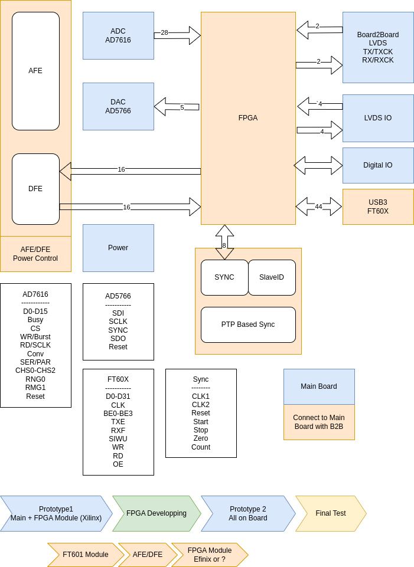
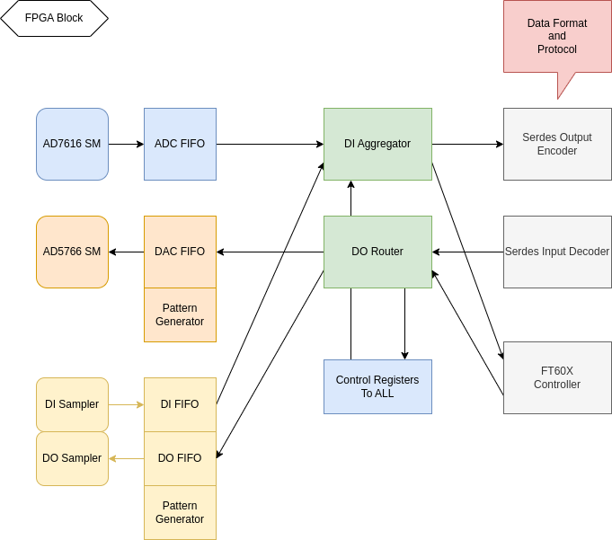
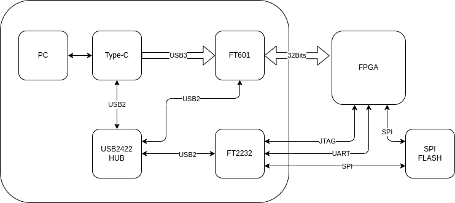
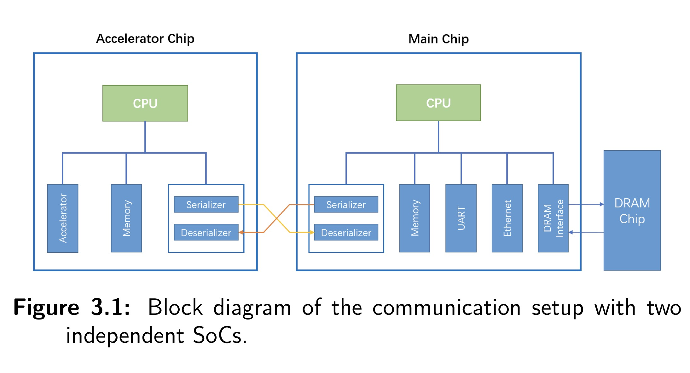
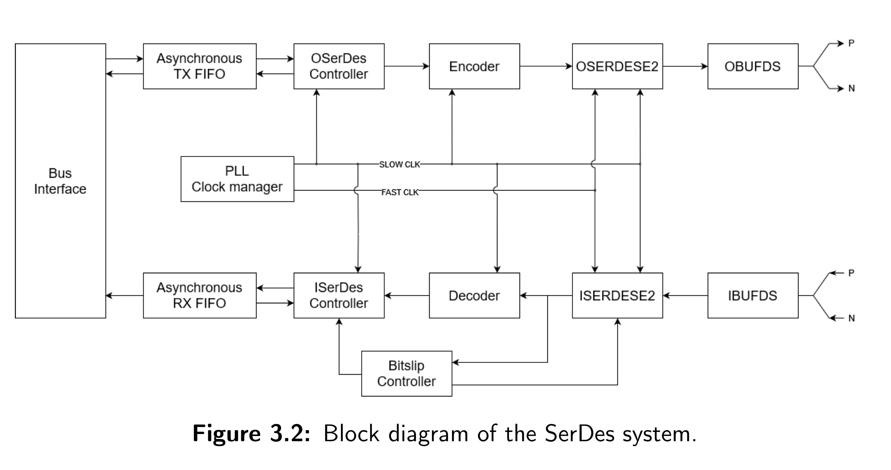
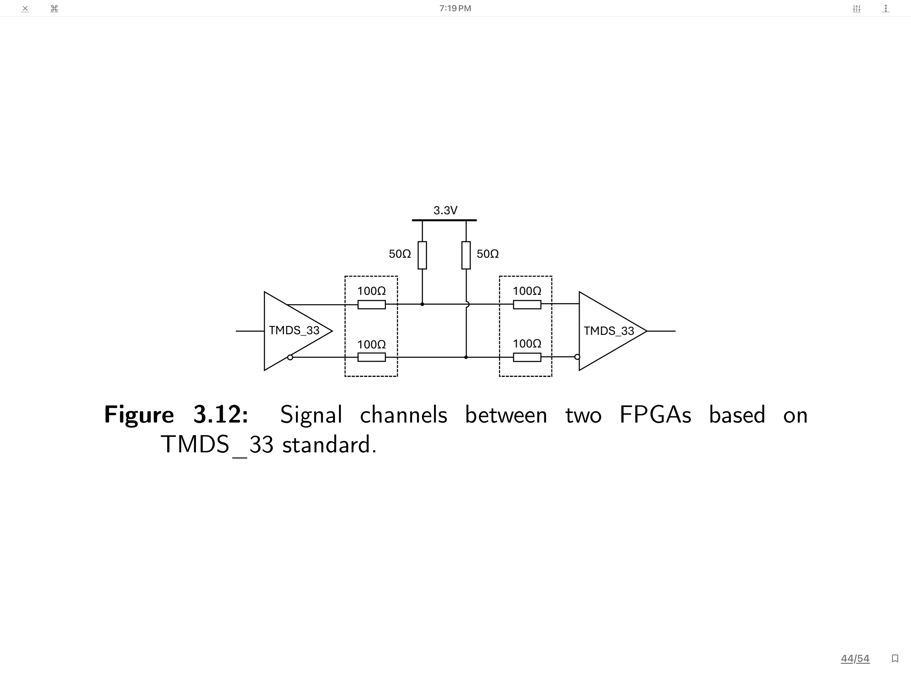

# Expander 2

## System Block

## FPGA Internal

## FT601 and USB Downlaoder

## AD7616 ADC

## AD5766 DAC

## FT60X

## Efinix FPGA with RAM

| FPGA        | Power        | EEPROM       |
|:------------|:-------------|:-------------|
| Intel Max10 | 3.3V         | Embedded     |
| efinix T20  | 1.2V Core   3.3V IO  | Embedded     |
| efinix Ti60 | 0.95V Core   1.8V AUX   3.3V IO  | Embedded RAM and EEPROM   |

## ONIX Breakout Board

## Resource Sharing between SoCs through a Dedicated SerDes-channel

[Resource Sharing between SoCs through a Dedicated SerDes-channel](./Expander2/Master_Thesis_Casper_Kesheng_final.pdf)

[Lund University LUP Student Papers](https://lup.lub.lu.se/student-papers/search/publication/9164576)

