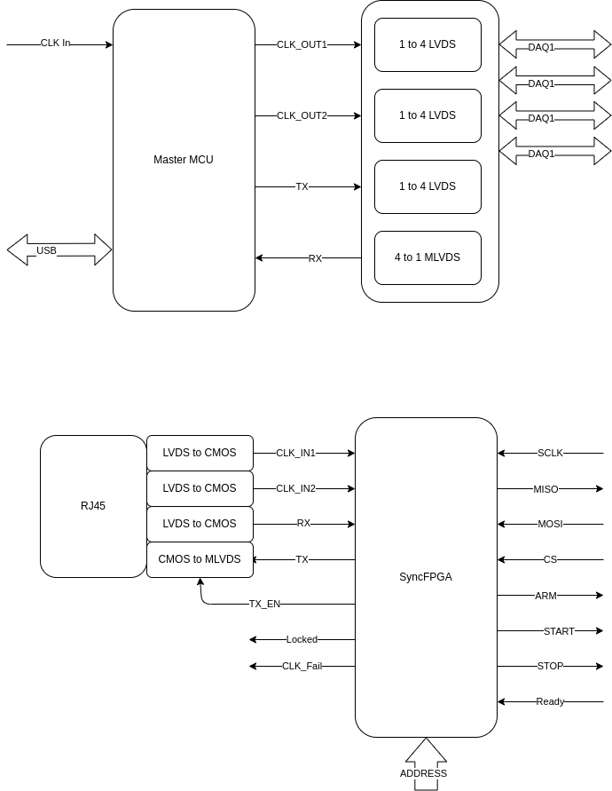

# Sync Expander  and Sync Hub Specification

## Block 1

## Sync Hub Specification

### MCU + FPGA or Not

    USB Power and Data
    CK_IN for External Clock Source.
    (if none use Internal clock source)
    CLK_OUT1 : User Define Clock Source 1
    CLK_OUT2 : User Define Clock Source 2
    TX : Send Data to Sync Expander
    RX : Receive Data from Sync Expander

### LVDS Bus

    1.Output LVDS , 1 to 4 (DS91M124)
    2.Inout LVDS  , 4 to 1 (SN65MLVD203B for TX/RX)

## Sync Expander

    CLK_IN1: Time Base Clock 1
    CLK_IN2: Time Base Clock 2
    RX : Date from Hub
    TX : Data to Hub
    TX_EN : Enable Send Data
    Address : Sync Expnader's ID
    Locked: Lock to CLK_IN1 or CLK_IN2
    CLK_Fail: No CLK Input
    ARM : Output to DAQ
    Start : Output to DAQ
    Stop : Output to DAQ
    Ready : DAQ to Sync Expander

