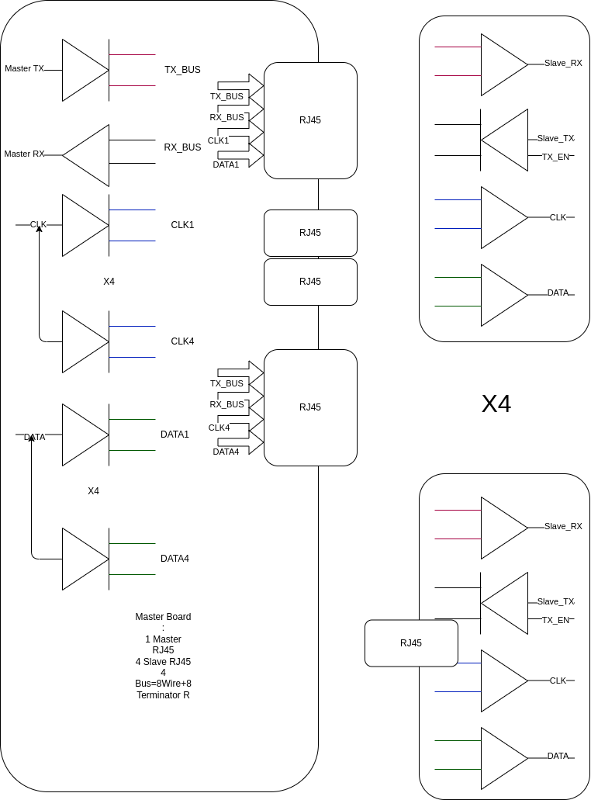

# Sync Expander  and Sync Hub Specification

## Block 1

## Design Consideration

### Reference

[time-and-synchronization-v24.pdf](./SyncExpander/time-and-synchronization-v24.pdf)

### DAQ Distance Consideration

    If DAQ Distance between each other > 100M , Time Base Sync is better (PTP)
    Otherwise, Signal Base Sync is OK.

### Disconnect Possibility

    If Signal between DAQ will lost, DPLL will be needed.
    Otherwise, use the Signal as Clock is OK.

### TimeStamp Bits Number

    1KHz   Clock : 32Bits = 2^32/1000/86400 = 49.7 Days  1000us
    10KHz  Clock : 32Bits = 2^32/10000/86400 = 4.97 Days  100us
    50KHz  Clock : 32Bits = 2^32/50000/86400 = 0.99 Days   20us
    100KHz Clock : 32Bits = 2^32/100K/86400  = 0.49 Days   10us

## Sync Hub Specification

### MCU Or FPGA

    USB Power and Data
    CK_IN for External Clock Source.
    (if none use Internal clock source)
---
    Signal Based Sync:
    CLK_OUT1 : User Define Clock Source 1
    CLK_OUT2 : User Define Clock Source 2

    Time Based Sync:
    CLK : Data Clock
    Data : Time Data 
---
    TX : Send Data to Sync Expander
    RX : Receive Data from Sync Expander

### LVDS Bus

    1.Output LVDS , 1 to 4 (DS91M124)
    2.Inout LVDS  , 4 to 1 (SN65MLVD203B for TX/RX)

## Sync Expander

    Signal Based Sync:
    CLK_IN1: Time Base Clock 1
    CLK_IN2: Time Base Clock 2
---
    Time Based Sync:
    CLK : Data Clock
    Data : Time Data
---
    RX : Date from Hub
    TX : Data to Hub
    TX_EN : Enable Send Data
    Address : Sync Expnader's ID
    Locked: Lock to CLK_IN1 or CLK_IN2 (For DPLL)
    CLK_Fail: No CLK Input
    ARM : Output to DAQ
    Start : Output to DAQ
    Stop : Output to DAQ
    Ready : DAQ to Sync Expander

## Bus Test Board

## Test Board

### Master

    MCU Send SPI CLOCK/DATA
    MCU Send TX
    MCU Receive RX from Loop Back on Slave Board

### Slave

    MCU Received SPI Clock/Data
    MCU RX Date from Master
    MCU TX Send Data from MCU RX Data
    MCU TX Enable ?
