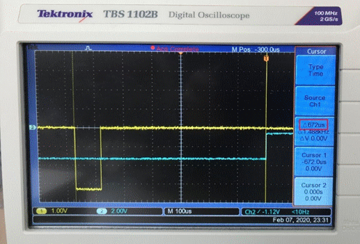
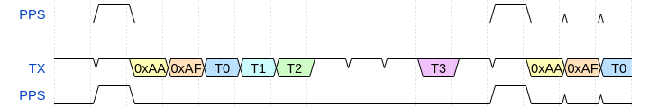
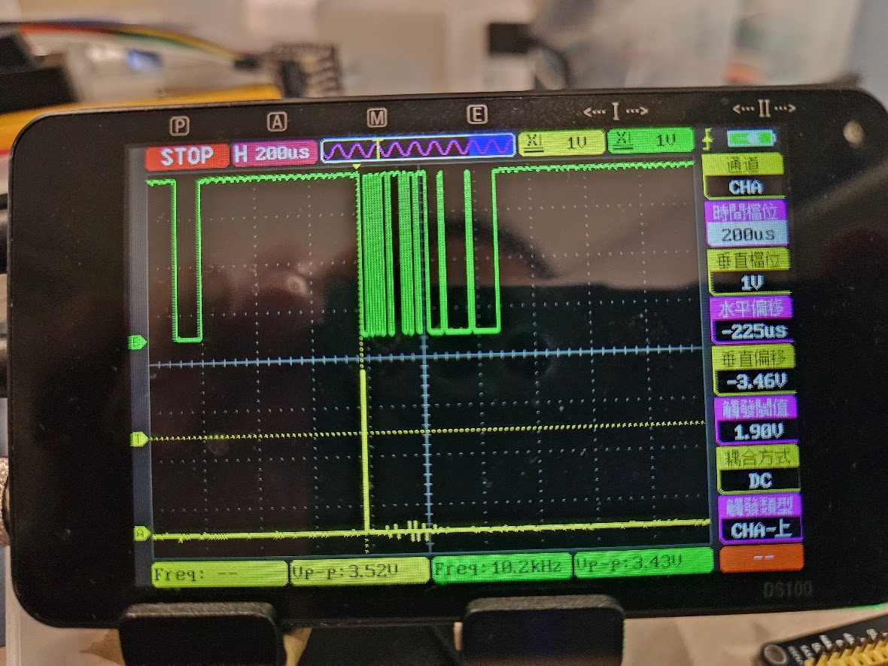
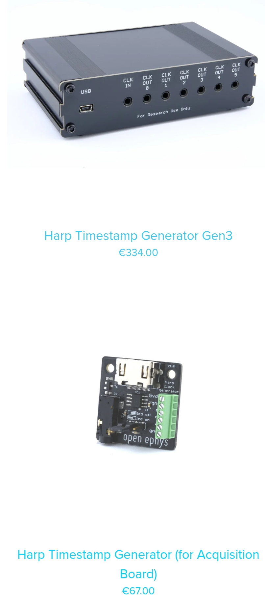

# What is Harp

## Harp Synchronization Clock Protocol

### Introduction

The `Harp Synchronization Clock` is a dedicated bus that disseminates the current time to/across Harp devices. It is a serial communication protocol that relays the time information. The last byte in each message can be used as a trigger, and allows a `Device`` to align itself with the current `Harp` time.

### Serial configuration

* The Baud rate used is 100kbps;
* The last byte starts *exactly* 672 us before the elapse of the current second (e.g.:)

    

* The packet is composed of 6 bytes (`header[2]` and `timestamp_s[4]`):
  - `header[2] = {0xAA, 0xAF)`
  - `timestamp_s` is of type U32, little-endian, and contains the current second.


### Example code

Example of a microcontroller C code:

```C

ISR(TCD0_OVF_vect, ISR_NAKED)
    {
        if ((*timestamp_byte0 == 0xAA) && (*timestamp_byte1 == 0xAF)) reti();
        if ((*timestamp_byte1 == 0xAA) && (*timestamp_byte2 == 0xAF)) reti();
        if ((*timestamp_byte2 == 0xAA) && (*timestamp_byte3 == 0xAF)) reti();

        switch (timestamp_tx_counter)
        {
            case 1:
                USARTD1_DATA = 0xAA;
                break;
            case 2:
                USARTD1_DATA = 0xAF;
                break;
            case 4:
                USARTD1_DATA = *timestamp_byte0;
                break;
            case 6:
                USARTD1_DATA = *timestamp_byte1;
                break;
            case 7:
                USARTD1_DATA = *timestamp_byte2;
                break;
            case 1998:
                USARTD1_DATA = *timestamp_byte3;
                break;
        }
    }
```

### Timing



### Timing use PICO Emulation



### Physical Connection Schematics 


### Harp Device need for Test



[Harp from OE](https://open-ephys.org/harp)

<!-- ### Example Verilog from Breakout Box

```verilog
module harp_counter # (
    parameter CLK_RATE_HZ = 1000000,
    parameter LAST_WORD_US = 672,
    parameter COUNTER_WIDTH = $clog2(CLK_RATE_HZ)
) (
    input reset,
    input clk,
    input run,
    output reg [7:0] uart_data,
    output reg uart_start,
    output uart_blank,
    input uart_end,
    output LED
);

localparam  CYCLES_PER_US = CLK_RATE_HZ / 1000000;
localparam  LAST_WORD_START_US = (1000000 - LAST_WORD_US);
localparam  LAST_WORD_CYCLE = LAST_WORD_START_US*CYCLES_PER_US - 1;
localparam  LAST_CYCLE = CLK_RATE_HZ - 1;
localparam  FIRST_CYCLE = 10;

reg [31:0] timestamp;
assign LED = timestamp[0];

wire [7:0] timestamp_b0;
assign timestamp_b0 = timestamp[7:0];
wire [7:0] timestamp_b1;
assign timestamp_b1 = timestamp[15:8];
wire [7:0] timestamp_b2;
assign timestamp_b2 = timestamp[23:16];
wire [7:0] timestamp_b3;
assign timestamp_b3 = timestamp[31:24];
wire [7:0] start_b0;
assign start_b0 = 8'hAA;
wire [7:0] start_b1;
assign start_b1 = 8'hAF;

reg start_matches;
always @(timestamp_b0, timestamp_b1, timestamp_b2, timestamp_b3)
begin
start_matches <= 1'b0;
if ({timestamp_b0, timestamp_b1} == {start_b0, start_b1}) start_matches <= 1'b1;
if ({timestamp_b1, timestamp_b2} == {start_b0, start_b1}) start_matches <= 1'b1;
if ({timestamp_b2, timestamp_b3} == {start_b0, start_b1}) start_matches <= 1'b1;
end
assign uart_blank = start_matches;

reg [COUNTER_WIDTH - 1 : 0] counter;
reg [2:0] state;
reg [2:0] word;

localparam s_idle = 3'd0,
          s_wait1 = 3'd1,
          s_send = 3'd2,
          s_wait_send = 3'd3,
          s_wait_last = 3'd4,
          s_send_last = 3'd5,
          s_wait_end = 3'd6,
          s_inc_timestamp = 3'd7;

always @(*)
begin
case (word)
    3'd0: uart_data <= start_b0;
    3'd1: uart_data <= start_b1;
    3'd2: uart_data <= timestamp_b0;
    3'd3: uart_data <= timestamp_b1;
    3'd4: uart_data <= timestamp_b2;
    3'd5: uart_data <= timestamp_b3;
    default: uart_data <= 'b0;
endcase
end

always @(state)
begin
if (state == s_send || state == s_send_last) uart_start <= 1'b1;
else uart_start <= 1'b0;
end

always @(posedge clk or posedge reset)
begin
if (reset) begin
    state <= s_idle;
    word <= 'b0;
    counter <= 'b0;
    timestamp <= 'b0;
end else begin
    counter <= counter + 1'b1;
    case (state)
        s_idle: begin
            counter <= 'b0;
            timestamp <= 'b0;
            if (run) state <= s_inc_timestamp;
        end
        s_inc_timestamp: begin
            timestamp <= timestamp + 1'b1;
            state <= s_wait1;
        end
        s_wait1: begin
            word <= 'b0;
            if (counter == FIRST_CYCLE) begin
                state <= s_send;
            end
        end
        s_send: begin
            word <= word + 1'b1;
            state <= s_wait_send;
        end
        s_wait_send: begin
            if (uart_end) begin
                if (word == 3'd5)
                    state <= s_wait_last;
                else
                    state <= s_send;
            end
        end
        s_wait_last: begin
            if (counter == LAST_WORD_CYCLE) begin
                state <= s_send_last;
            end
        end
        s_send_last: begin
            state <= s_wait_end;
        end
        s_wait_end: begin
            if (counter == LAST_CYCLE) begin
                counter <= 'b0;
                state <= s_inc_timestamp;
            end
        end
    endcase

    if (run == 'b0) begin
        state <= s_idle;
    end
end
end

endmodule
``` -->

