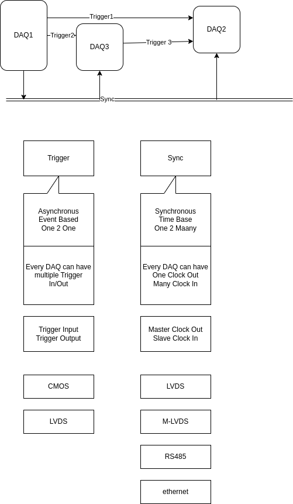
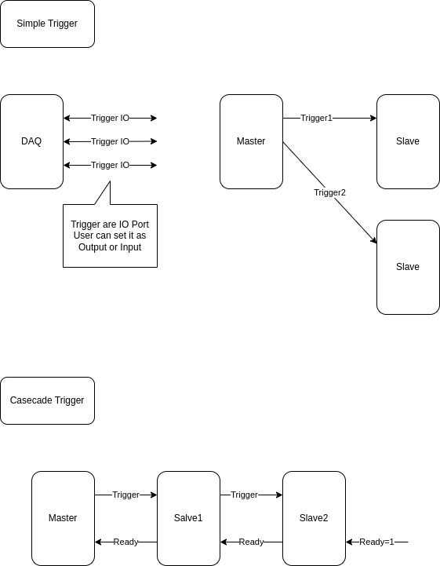
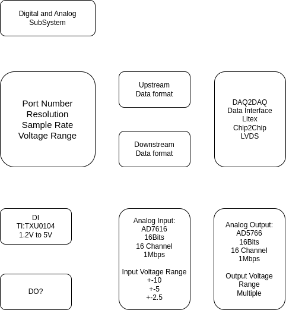

# System B

## SYZYGY Interface

SYZYGY Interface [syzygyfpga.io](https://syzygyfpga.io/)

## Block Diagrams

Wireless.dio

DAQ2DAQ.dio

SyncDistribution.dio

Trigger.dio

Open Ephys Trigger & Sync Exampls

NeuroLynx Trigger & Sync Exampls

Digital_Analog Subsystem

