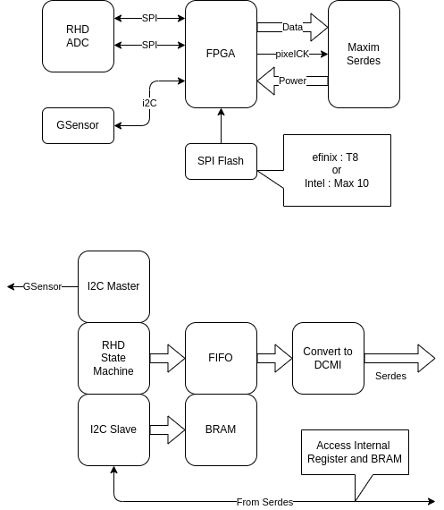

# System C

## Serdes HeadStage

| FPGA        | Power        | EEPROM       |
|:------------|:-------------|:-------------|
| Intel Max10 | 3.3V         | Embedded     |
| efinix T8   | 1.1V Core    3.3V IO | External   |

## Pin Requirements

| Block       | Pin Number   | Description       |
|:------------|:-------------|:------------------|
| RHD         | 7 CMOS   14 LVDS | CK   MOSI   MISO x 4   CS |
| I2C Master  | 2            | SCL   SDA |
| I2C Slave   | 2            | SCL   SDA |
| DMCI        | 17           | Data x 16   PixelCK |
