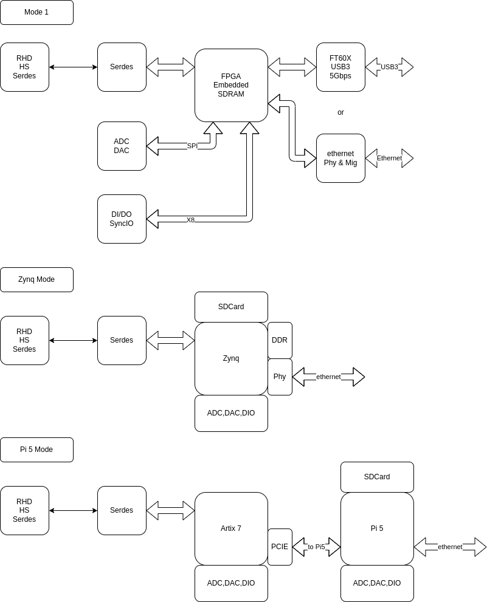

# System D

## Mini DAQ

### Block Diagram

### FPGA with RAM

| FPGA            | Power        | RAM          |
|:----------------|:-------------|:-------------|
| efinix Ti60F100 | 1.1V Core    3.3V IO | 256Mb HyperRAM / 64Mb EEPROM   |
| GoWin           | 1.2V Core    3.3V IO | 64Mb~128Mb SDRAM / 32Mb EEPROM |

### Zynq Mode

    Zynq Mode:
    1.Stand alone System
    2.Store daq data in SDCard 
    3.Stream daq data from ethenet
    4.Easy to run in parallel
    5.Support KB/Mouse and LCD Screen

### Pi 5 Mode

    Pi 5 Mode:
    Same as Zynq, except use Pi 5
    Develop Linux App is more easy on Pi